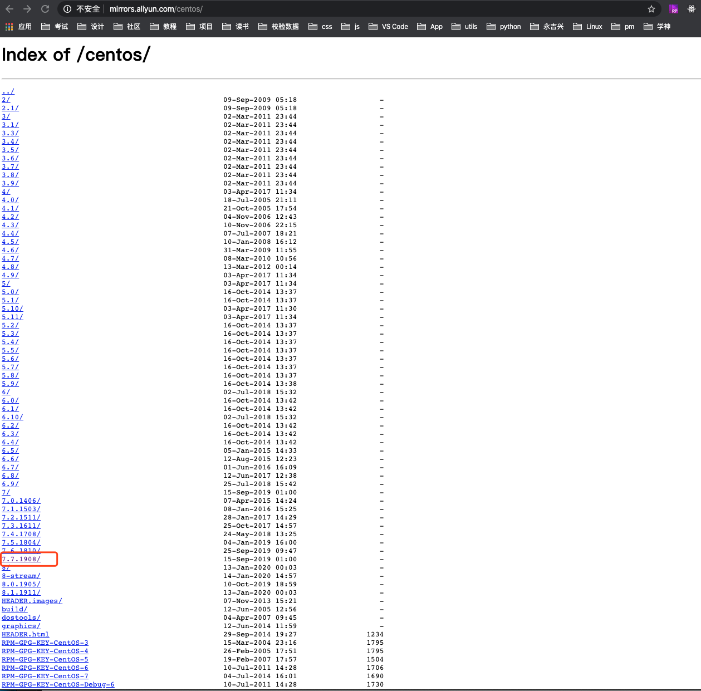

# CentOS7 软件包的管理与安装

---

## 目录

* [使用rpm命令--安装--查看--卸载--rpm软件包](#rpm)
* [yum管理软件包](#yum)
* [实战tar源码包管理-srpm源码包安装方法](#srpm)

## 内容

### <a href="#rpm" id="rpm">使用rpm命令--安装--查看--卸载--rpm软件包</a>

#### 1 软件包管理

* rpm 二进制包------》已经使用 GCC 编译后的
* tar 源码包-----》需要编译

RPM 概述：RPM 是 RPM Package Manager（RPM 软件包管理器）的缩写，这一文件格式名称虽然打上了RedHat 的标志，但是其原始设计理念是开放式的，现在包括 OpenLinux、SUSE 以及 Turbo Linux 等 Linux 的分发版本都有采用，可以算是公认的行业标准了。

#### 1.1 rpm软件包管理

rpm获取方式：

1. CentOS系统镜像光盘
2. 网站rpmfind.net
3. 比如安装 mysql、nginx 软件，我们可以去它的官方网站下载：http://www.mysql.com

rpm 包格式的说明

```
[root@spring ~]# ls /mnt/Packages/zsh-5.0.2-33.el7.x86_64.rpm
/mnt/Packages/zsh-5.0.2-33.el7.x86_64.rpm

zsh       -5.         0.            2-    28.                                el7                 . x86_64.rpm 
软件名  主版本号  次版本号  修订  release(第几次发布版本)   操作系统版本   软件包是 64 位包
```

* 修订指是的第几次修改 bug。 
* 发布指的是：第几次发布。
*  发布时，可能只是对软件安装的默认参数做了修改，而没有其它改动。

#### 1.2 安装 rpm 软件

* RPM 工具使用分为安装、查询、验证、更新、删除等操作
* 命令格式：rpm [参数] 软件包
* 参数：
	+ -i 是 install 的意思， 安装软件包
	+ -v 显示附加信息，提供更多详细信息
	+ -V 校验，对已经安装的软件进行校验
	+ -h --hash 安装时输出####标记
* <font color="#ff0000">互动：rpm 使用时，什么情况下使用软件包全名，什么时候使用软件包名？</font>
* 全名：在安装和更新升级时候使用
* 包名：对已经安装过的软件包进行操作时，比如查找已经安装的某个包，卸载包等 ，使用包名。它默认是去目录`/var/lib/rpm` 下面进行搜索。 当一个 rpm 包安装到系统上之后,安装信息通常会保存在本地的 `/var/lib/rpm/`目录下。

#### 1.2.1 从本地安装

```
[root@spring ~]# rpm -ivh /mnt/Packages/zsh-5.0.2-33.el7.x86_64.rpm
Preparing...                          ################################# [100%]
Updating / installing...
   1:zsh-5.0.2-33.el7                 ################################# [100%]
[root@spring ~]# cat /etc/shells
/bin/sh
/bin/bash
/usr/bin/sh
/usr/bin/bash
/bin/zsh # 新增
```

```
# 如果mnt下没有包，需要挂载
[root@spring ~]# mount /dev/cdrom /mnt
```

#### 1.2.2 从网上下载直接安装 centos epel 扩展源

```
[root@spring ~]# rpm -ivh http://dl.fedoraproject.org/pub/epel/epel-release-latest-7.noarch.rpm
Retrieving http://dl.fedoraproject.org/pub/epel/epel-release-latest-7.noarch.rpm
warning: /var/tmp/rpm-tmp.UsXqpR: Header V3 RSA/SHA256 Signature, key ID 352c64e5: NOKEY
Preparing...                          ################################# [100%]
Updating / installing...
   1:epel-release-7-12                ################################# [100%]
```

#### 1.3 rpm 查询功能

用法：rpm -q（query） 常与下面参数组合使用

* -a（all） 查询所有已安装的软件包
* -f（file）系统文件名（查询系统文件所属哪个软件包），反向查询
* -i 显示已经安装的 rpm 软件包信息，后面直接跟包名
* -l（list） 查询软件包中文件安装的位置
* -p 查询未安装软件包的相关信息，后面要跟软件的命名
* -R 查询软件包的依赖性

```
[root@spring ~]# rpm -qpi /mnt/Packages/php-mysql-5.4.16-46.el7.x86_64.rpm
Name        : php-mysql
Version     : 5.4.16
Release     : 46.el7
Architecture: x86_64
Install Date: (not installed)
Group       : Development/Languages
Size        : 237539
License     : PHP
Signature   : RSA/SHA256, Mon 12 Nov 2018 10:44:15 PM CST, Key ID 24c6a8a7f4a80eb5
Source RPM  : php-5.4.16-46.el7.src.rpm
Build Date  : Wed 31 Oct 2018 03:38:46 AM CST
Build Host  : x86-01.bsys.centos.org
Relocations : (not relocatable)
Packager    : CentOS BuildSystem <http://bugs.centos.org>
Vendor      : CentOS
URL         : http://www.php.net/
Summary     : A module for PHP applications that use MySQL databases
Description :
The php-mysql package contains a dynamic shared object that will add
MySQL database support to PHP. MySQL is an object-relational database
management system. PHP is an HTML-embeddable scripting language. If
you need MySQL support for PHP applications, you will need to install
this package and the php package.
```

```
[root@spring ~]# rpm -qi zsh
Name        : zsh
Version     : 5.0.2
Release     : 33.el7
Architecture: x86_64
Install Date: Tue 28 Jan 2020 12:18:22 AM CST
Group       : System Environment/Shells
Size        : 5856382
License     : MIT
Signature   : RSA/SHA256, Fri 23 Aug 2019 05:45:54 AM CST, Key ID 24c6a8a7f4a80eb5
Source RPM  : zsh-5.0.2-33.el7.src.rpm
Build Date  : Fri 23 Aug 2019 01:13:36 AM CST
Build Host  : x86-01.bsys.centos.org
Relocations : (not relocatable)
Packager    : CentOS BuildSystem <http://bugs.centos.org>
Vendor      : CentOS
URL         : http://zsh.sourceforge.net/
Summary     : Powerful interactive shell
Description :
The zsh shell is a command interpreter usable as an interactive login
shell and as a shell script command processor.  Zsh resembles the ksh
shell (the Korn shell), but includes many enhancements.  Zsh supports
command line editing, built-in spelling correction, programmable
command completion, shell functions (with autoloading), a history
mechanism, and more.
[root@spring ~]# rpm -qi epel
package epel is not installed

[root@spring ~]# rpm -qf /usr/bin/find # 查询文件或命令属于哪个安装包 
findutils-4.5.11-6.el7.x86_64

# 针对没有安装的 RPM 包，要加参数： -p
[root@spring ~]# rpm -qpi /mnt/Packages/php-mysql-5.4.16-46.el7.x86_64.rpm
Name        : php-mysql
Version     : 5.4.16
Release     : 46.el7
Architecture: x86_64
Install Date: (not installed)
Group       : Development/Languages
Size        : 237539
License     : PHP
Signature   : RSA/SHA256, Mon 12 Nov 2018 10:44:15 PM CST, Key ID 24c6a8a7f4a80eb5
Source RPM  : php-5.4.16-46.el7.src.rpm
Build Date  : Wed 31 Oct 2018 03:38:46 AM CST
Build Host  : x86-01.bsys.centos.org
Relocations : (not relocatable)
Packager    : CentOS BuildSystem <http://bugs.centos.org>
Vendor      : CentOS
URL         : http://www.php.net/
Summary     : A module for PHP applications that use MySQL databases  # php 使用 mysql 数据库
Description :
The php-mysql package contains a dynamic shared object that will add
MySQL database support to PHP. MySQL is an object-relational database
management system. PHP is an HTML-embeddable scripting language. If
you need MySQL support for PHP applications, you will need to install
this package and the php package.
[root@spring ~]# rpm -qa vim
[root@spring ~]# rpm -qa | grep vim
vim-filesystem-7.4.629-6.el7.x86_64
vim-enhanced-7.4.629-6.el7.x86_64
vim-minimal-7.4.629-6.el7.x86_64
vim-common-7.4.629-6.el7.x86_64
[root@spring ~]# rpm -qf | /usr/bin
-bash: /usr/bin: Is a directory
rpm: no arguments given for query
[root@spring ~]# rpm -qf /usr/bin/find
findutils-4.5.11-6.el7.x86_64
# 查询已经安装的 rpm 包的详细信息或作用 rpm -qi rpm 包名
[root@spring ~]# rpm -qi lrzsz
package lrzsz is not installed
[root@spring ~]#
[root@spring ~]#
[root@spring ~]# rpm -qpl /mnt/Packages/zip-3.0-11.el7.x86_64.rpm  # 查看 rpm 安装后，将生成哪些文件
/usr/bin/zip
/usr/bin/zipcloak
/usr/bin/zipnote
/usr/bin/zipsplit
/usr/share/doc/zip-3.0
/usr/share/doc/zip-3.0/CHANGES
/usr/share/doc/zip-3.0/LICENSE
/usr/share/doc/zip-3.0/README
/usr/share/doc/zip-3.0/README.CR
/usr/share/doc/zip-3.0/TODO
/usr/share/doc/zip-3.0/WHATSNEW
/usr/share/doc/zip-3.0/WHERE
/usr/share/doc/zip-3.0/algorith.txt
/usr/share/man/man1/zip.1.gz
/usr/share/man/man1/zipcloak.1.gz
/usr/share/man/man1/zipnote.1.gz
/usr/share/man/man1/zipsplit.1.gz
```

#### 1.4 查看软件包内容是否被修改

rpm -V 包名

rpm -Vf 文件路径

```
[root@spring ~]# which find
/bin/find
[root@spring ~]# rpm -qf /usr/bin/find
findutils-4.5.11-6.el7.x86_64
[root@spring ~]# rpm -Vf /usr/bin/find # 检查具体文件
[root@spring ~]# vim /usr/bin/find
[root@spring ~]# echo aaa >> /usr/bin/find
[root@spring ~]# rpm -Vf /usr/bin/find
S.5....T. /usr/bin/find
[root@spring ~]# rpm -V findutils # 检查包
S.5....T. /usr/bin/find
```

注：如果出现的全是点，表示测试通过

出现下面的字符代表某测试的失败:

* 5 — MD5 校验和是否改变，你也看成文件内容是否改变
* S — 文件长度，大小是否改变
* L — 符号链接，文件路径是否改变
* T — 文件修改日期是否改变
* D — 设备
* U — 用户，文件的属主
* G — 用户组
* M — 模式 (包含许可和文件类型)
* ? — 不可读文件

再后面的 c 文件名,它表示的是文件类型

* c 配置文件
* d 普通文件
* <font color="#ff0000">g 不该出现的文件，意思就是这个文件不该被这个包所包含</font>
* l 授权文件（license file）
* r 描述文件

互动： 查看系统中所有的 rpm 包及安装的文件有没有被黑客修改

```
[root@spring ~]# rpm -Va > rpm_check.txt
```

```
[root@spring ~]# ls /var/lib/rpm
Basenames     __db.001  __db.003  Group       Name          Packages     Requirename  Sigmd5
Conflictname  __db.002  Dirnames  Installtid  Obsoletename  Providename  Sha1header   Triggername
```

> 注： 检验时参考了 /var/lib/rpm 目录下的 rpm 数据库信息

#### 1.5 rpm 包卸载和升级

**卸载**

用法：rpm -e（erase） 包名

参数： --nodeps 忽略依赖，建议在卸载时不要用 rpm 去卸载有依赖关系的包，应该用 yum

```
[root@spring ~]#
[root@spring ~]# rpm -qa zsh
zsh-5.0.2-33.el7.x86_64
[root@spring ~]# rpm -e zsh
[root@spring ~]# rpm -qa zsh
[root@spring ~]# rpm -e --nodeps lrzsz
```

**升级**

```
error: package lrzsz is not installed
[root@spring ~]# rpm -Uvh /mnt/Packages/lrzsz-0.12.20-36.el7.x86_64.rpm
Preparing...                          ################################# [100%]
Updating / installing...
   1:lrzsz-0.12.20-36.el7             ################################# [100%]
```

#### 1.6 解决 rpm 依赖关系

```
[root@spring ~]# rpm -ivh /mnt/Packages/mariadb-server-5.5.64-1.el7.x86_64.rpm
error: Failed dependencies:
	libaio.so.1()(64bit) is needed by mariadb-server-1:5.5.64-1.el7.x86_64
	libaio.so.1(LIBAIO_0.1)(64bit) is needed by mariadb-server-1:5.5.64-1.el7.x86_64
	libaio.so.1(LIBAIO_0.4)(64bit) is needed by mariadb-server-1:5.5.64-1.el7.x86_64
	mariadb(x86-64) = 1:5.5.64-1.el7 is needed by mariadb-server-1:5.5.64-1.el7.x86_64
	perl(DBI) is needed by mariadb-server-1:5.5.64-1.el7.x86_64
	perl(Data::Dumper) is needed by mariadb-server-1:5.5.64-1.el7.x86_64
	perl-DBD-MySQL is needed by mariadb-server-1:5.5.64-1.el7.x86_64
	perl-DBI is needed by mariadb-server-1:5.5.64-1.el7.x86_64
```

```
[root@spring ~]# rpm -ivh /mnt/Packages/mariadb-5.5.64-1.el7.x86_64.rpm
Preparing...                          ################################# [100%]
Updating / installing...
   1:mariadb-1:5.5.64-1.el7           ################################# [100%]
```

### <a href="#yum" id="yum">yum管理软件包</a>

yum（全称为 Yellow dog Updater, Modified）是一个前端软件包管理器。基于 RPM 包管理，能够从指定的服务器自动下载 RPM 包并且安装，可以自动处理依赖性关系，并且一次安装所有依赖的软体包，无须繁琐地一次次下载、安装。yum 提供了查找、安装、删除某一个、一组甚至全部软件包的命令，而且命令简洁而又好记

YUM：解决依赖关系问题，自动下载软件包，它是基于 C/S 架构  
C=client            S=ftp\http\file

#### 2.1 配置 yum 源

#### 2.1.1 配置本地 yum 源

先确定虚拟机光驱中有加载系统镜像

```
[root@spring ~]# mount /dev/cdrom /mnt/
mount: /dev/sr0 is write-protected, mounting read-only
mount: /dev/sr0 is already mounted or /mnt busy
       /dev/sr0 is already mounted on /mnt
[root@spring ~]# ls /mnt/
```

```
[root@spring ~]# vim /etc/yum.repos.d/CentOS7.repo.backup

[centos7]
name=CentOS7
baseurl=file:///mnt
enable=1
gpgcheck=0
gpgkey=file:///etc/pki/rpm-gpg/RPM-GPG-KEY-CentOS-7
```

> [centos7] #yum 源名称，在本服务器上唯一的，用来区分不同的 yum 源  
> name= CentOS7 #对 yum 源描述信息  
> baseurl=file:///mnt #yum 源的路径,提供方式包括 FTP(ftp://...)、HTTP(http://...)、本地(file:///...光盘挂载目录所在的位置）  
> enabled=1 # 为 1，表示启用 yum 源；0 为禁用  
> gpgcheck=0 # 为 1，使用公钥检验 rpm 包的正确性；0 为不校验
> gpgkey=file:///etc/pki/rpm-gpg/RPM-GPG-KEY-CentOS-7 # 指定进行 rpm 校验的公钥文件地址

#### 2.1.2 网络 yum 源

Centos 7 置网络 yum 源

```
# wget 下载文件 ，-O 把下载的文件存到另一个文件中
[root@spring ~]# wget -O /etc/yum.repos.d/CentOS-Base.repo http://mirrors.aliyun.com/repo/Centos-7.repo
```
```
[root@spring ~]# cat /etc/centos-release
CentOS Linux release 7.7.1908 (Core)
```

<font color="#ff0000">排错： 如果下 Centos-7.repo 载后，不用能</font>

解决：打开阿里云链接：http://mirrors.aliyun.com/centos/ 找到 centos7 最新版本号，如：



然后执行：sed 进行全文替换

```
[root@spring ~]# sed -i 's/$releasever/7.7.1908/g' /etc/yum.repos.d/CentOS-Base.repo
[root@spring ~]# yum clean all
Loaded plugins: fastestmirror
Cleaning repos: base c7-media epel extras updates
Cleaning up list of fastest mirrors
Other repos take up 19 M of disk space (use --verbose for details)
[root@spring ~]# yum list
```

#### 2.2 yum 使用

```
[root@spring ~]# yum install -y httpd           # 安装软件包， -y 直接安装
[root@spring ~]# yum -y update                  # 升级软件包，改变软件设置和系统设置,系统版本内核都升级。不加任何包，表示整个系统进行升级
[root@spring ~]# yum -y upgrade                # 升级软件包，不改变软件设置和系统设置，系统版本升级，内核不改变
[root@spring ~]# yum info httpd                  # 查询 rpm 包作用
[root@spring ~]# yum provides /usr/bin/find # 查看命令是哪个软件包安装的
[root@spring ~]# yum -y remove 包名          # 卸载包
[root@spring ~]# yum search keyword          # 按关键字搜索软件包
```

yum 报错，注意的几个小问题：

1. 确定光盘是否链接，光盘是否挂载
2. 配置文件中格式是否正确，字母，符号有没有少写,挂载点和配置文件中设置的是否一致
3. 网络源需要联网，操作和 RPM 类似，只是会自动安装依赖项

#### 2.3 yum 安装开发工具软件包组

yum grouplist # 查看有哪些软件包组

语法：yum groupinstall GROUPNAME

yum grouplist #显示英文，如果想变成中文，则执行以一下命令

```
[root@spring ~]# echo $LANG
en_US.UTF-8
[root@spring ~]# LANG=zh_CN.UTF-8
```

```
[root@spring ~]# yum remove gcc -y                              # 卸载开发工具软件组中的 gcc 包
[root@spring ~]# yum groupinstall 'Development tools' -y  # 安装开发工具软件包组，安装这组软件包时，把 gcc 再安装上了
```

### <a href="#srpm" id="srpm">实战tar源码包管理-srpm源码包安装方法</a>

#### 3.1 源码安装 nginx

1. 编译环境如 gcc 和 gcc-c++编译器，make
2. 准备软件 ：nginx-1.12.2.tar.gz

```
[root@spring ~]# wget http://nginx.org/download/nginx-1.9.9.tar.gz
```

部署 Nginx

```
[root@spring ~]# yum -y install gcc gcc-c++ make zlib-devel pcre pcre-devel openssl-devel
```

pcre: 支持正则表达式，地址重写 rewrite

源码编译 3 把斧：./configure ， make ，make install

```
[root@spring ~]# tar xvf nginx-1.9.9.tar.gz
[root@spring ~]# cd nginx-1.9.9
[root@spring nginx-1.9.9]# ./configure --prefix=usr/local/nginx
[root@spring nginx-1.9.9]# make -j 4
[root@spring nginx-1.9.9]# make install
```

```
# 源码编译解决 command not found
[root@spring nginx]# nginx -v
-bash: nginx: command not found

[root@spring ~]# vim /etc/profile
# 在命令模式下按GG至末尾，加上一行 
PATH=$PATH:/usr/local/nginx/sbin 

# 重新加载环境
[root@spring ~]# source /etc/profile
```

**说明：**

```
[root@spring nginx-1.9.9]# ./configure
# a. 指定安装路径，例如 --prefix=/usr/local/nginx
# b. 启用或禁用某项功能, 例如 --enable-ssl, --disable-filter --with-http_ssl_module
# c. 和其它软件关联，例如--with-pcre
# d. 检查安装环境，例如是否有编译器 gcc，是否满足软件的依赖需求
# 最终生成：Makefile
[root@spring nginx-1.9.9]# make -j 4 # 按 Makefile 文件编译，可以使用-j 4 指定 4 核心 CPU 编译，提升速度
[root@spring nginx-1.9.9]# make install # 按 Makefile 定义的文件路径安装
[root@spring nginx-1.9.9]# make clean # 清除上次的 make 命令所产生的 object 和 Makefile 文件。使用场景：当需要重新执行configure 时，需要执行 make clean
```

#### 3.2 删除源码包

make uninstall  
有时删除不干净，所以建议大家安装时，在 configure 步骤添加一个： --prefix 参数。这样删除或备份时，  
直接对删除--prefix 指定的安装目录操作就可以了。