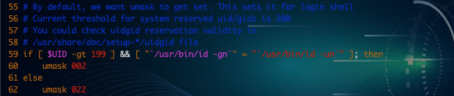

# CentOS7-文件权限管理

---

## 目录

* [文件的基本权限：rwx（UGO）](#basicAuthority)
* [文件的特殊权限：suid sgid sticky 和文件扩展权限 ACL](#specialAuthority)
* [实战：创建一个让root都无法删除的文件](#actualCombat)

## 内容

### <a href="#basicAuthority" id="basicAuthority">文件的基本权限：rwx（UGO）</a>

#### 1.1 权限的作用

**通过对文件设定权限可以达到以下三种访问限制权限：**

1. 只允许用户自己访问
2. 允许一个预先指定的用户组中的用户访问
3. 允许系统中的任何用户访问 

#### 1.2 查看权限

```
[root@spring ~]#
[root@spring ~]# ll /etc/passwd
-rw-r--r-- 1 root root 1058 Jan 27 18:54 /etc/passwd
```

文件权限基本解释：

-rw-r--r-- 1 root root 1058 Jan 27 18:54 /etc/passwd

| -           | rwx               | r-x              | r-x               | user1   | use1 | time   | FILENAME |
|:-------|:-----------|:----------|:-----------|:------|:----|:----------|:----|
| 文件类型 | 拥有者的权限 | 所属组的权限 | 其他人的权限 | 拥有者 | 属组 | 最后修改时间 | 对象 |

**其中：**

文件类型可以为p、d、l、s、c、b 和 -

* `p` 表示命名管道文件
* `d` 表示目录文件
* `l` 表示符号连接文件
* `-` 表示普通文件
* `s` 表示 `socket` 套接口文件，比如我们启用mysql时，会产生一个mysql.sock文件
* `c` 表示字符设备文件，例如：虚拟控制台或tty0
* `b` 表示块设备文件 例如：sda，cdrom

```
[root@spring ~]# ll /dev/sda /dev/cdrom /etc/passwd /dev/tty0
lrwxrwxrwx 1 root root    3 Jan 27 21:31 /dev/cdrom -> sr0
brw-rw---- 1 root disk 8, 0 Jan 27 21:31 /dev/sda
crw--w---- 1 root tty  4, 0 Jan 27 21:31 /dev/tty0
-rw-r--r-- 1 root root 1058 Jan 27 18:54 /etc/passwd
```

#### 1.3 权限说明

**对于文件来说：**

* `r`：读
* `w`：写
* `x`：执行

**对于目录来说：**

* `r`：读（看到目录里面有什么） ls
* `w`：在目录里面建文件，删除，移动 `touck`、 `mkdir`、 `rm`、 `mv`、 `cp`
* `x`：进入`cd`

#### 1.4 文件拥有者

UGO：所有者--用户组--其他用户

* 所有者：就是创建文件的用户，这个用户拥有对它所创建的文件的一切权限，所有者可以允许其所在的用户组可以访问所有者的文件。
* 用户组：用户组是具有相同特征用户的逻辑集合，有时候我们需要让多个用户具有相同的权限，比如查看、修改某一个文件的权限，一种方法是分别对多个用户进行文件访问授权，如果有10个用户的话，就需要授权10次，显然这种方法不太合理；另一种方法是建立一个组，让这个组具有查看、修改此文件的权限，然后将所有需要访问此文件的用户放入这个组中，那么所有用户就具有了和组一样的权限。这就是用户组。
* 其他用户：系统内的其他所有者用户就是other用户类。

#### 1.5.1 常见几种文件权限组成

* `- rwx --- ---`：文件所有者对文件具有读取、写入和执行的权限。
* `- rwx r-- r--`： 文件所有者具有读、写与执行的权限，用户组里用户及其他用户则具有读取的权限
* `- rw- rw- r-x`：文件所有者与同组用户对文件具有读写的权限，而其他用户仅具有读取和执行的权限。
* `drwx--x—x`： 目录所有者具有读写与进入目录的权限,其他用户近能进入该目录，却无法读取任何数据。
* `drwx------`： 除了目录所有者具有完整的权限之外，其他用户对该目录完全没有任何权限。

```
[root@spring ~]# ll /home
total 0
drwxr-xr-x 2 root   root   62 Jan 27 18:58 hye
drwx------ 2 market market 62 Jan 27 18:54 market
drwx------ 2 oracle oracle 62 Jan 27 10:29 oracle
drwx------ 2 spring spring 62 Jan 27 10:23 spring
drwx------ 2 test   test   62 Jan 27 18:50 test
```

#### 1.5.2 更改文件的属主和属组

**改变文件的所属关系用到命令：**

* chown：可以用来改变文件（或目录）的属主
* chgrp：可以用来改变文件（或目录）的默认属组

如果你要对目录进行操作，加参数 -R

语法：

* chown user:group filename 比如：chown hr:san a.txt 把文件的属主和属组改为 hr,san
* chown user filename 比如：chown san a.txt 把文件的属主改为 san 用户
* chown :group filename 比如： chown :miao a.txt 把文件的属组改为 miao 这个组
* chgrp hr filename 比如： chgrp hr f.txt

```
[root@spring ~]# chown spring a.html
[root@spring ~]# ll
total 16
-rw-r--r--  1 spring root    0 Jan 27 22:18 a.html
-rw-------. 1 root   root 1457 Jan 13 21:02 anaconda-ks.cfg
-rw-r--r--  1 root   root    0 Jan 27 22:18 b.html
-rw-r--r--  1 root   root    0 Jan 27 22:18 c.html
-rw-r--r--. 1 root   root  501 Jan 13 21:27 fstab01
-rw-r--r--. 1 root   root  501 Jan 13 21:27 fstab02
-rw-r--r--  1 root   root  274 Jan 26 12:08 index.html
[root@spring ~]# chown spring:spring b.html
[root@spring ~]# ll
total 16
-rw-r--r--  1 spring root      0 Jan 27 22:18 a.html
-rw-------. 1 root   root   1457 Jan 13 21:02 anaconda-ks.cfg
-rw-r--r--  1 spring spring    0 Jan 27 22:18 b.html
-rw-r--r--  1 root   root      0 Jan 27 22:18 c.html
-rw-r--r--. 1 root   root    501 Jan 13 21:27 fstab01
-rw-r--r--. 1 root   root    501 Jan 13 21:27 fstab02
-rw-r--r--  1 root   root    274 Jan 26 12:08 index.html
[root@spring ~]# chown :root a.html
[root@spring ~]# ll
total 16
-rw-r--r--  1 spring root      0 Jan 27 22:18 a.html
-rw-------. 1 root   root   1457 Jan 13 21:02 anaconda-ks.cfg
-rw-r--r--  1 spring spring    0 Jan 27 22:18 b.html
-rw-r--r--  1 root   root      0 Jan 27 22:18 c.html
-rw-r--r--. 1 root   root    501 Jan 13 21:27 fstab01
-rw-r--r--. 1 root   root    501 Jan 13 21:27 fstab02
-rw-r--r--  1 root   root    274 Jan 26 12:08 index.html
```

#### 1.6 修改权限

使用字符设置：

* 修改权限用的命令：`chmod`
* 作用：修改文件，目录的权限
* 语法：`chmod` [对谁操作] [操作符] [赋于什么权限] 文件名
* 对谁操作：
* `u`----> 用户 user，表示文件或目录的所有者
* `g`----> 用户组 group，表示文件或目录所属的用户组
* `o`----> 其它用户 others
* `a`----> 所有用户 all

```
操作符:
+ #添加权限 ； - # 减少权限 ； = #直接给定一个权限
```

权限：`r`、 `w`、 `x`

| | | |
|:----|:---|:------|
| u-w | user | 拥有者 |
| g+x | group | 组 |
| o=r | other  | 其他人 |
| a+x | all | 所有人 |

```
[root@spring ~]# chmod u-w 1.txt
[root@spring ~]# ll 1.txt
-r--r--r-- 1 root root 0 Jan 27 22:32 1.txt

[root@spring ~]# chmod g+x 1.txt
[root@spring ~]# ll 1.txt
-r--r-xr-- 1 root root 0 Jan 27 22:32 1.txt

# 给 shell 脚本加一个可执行权限
[root@spring ~]# chmod a+x 1.txt 
[root@spring ~]# ll 1.txt
-r-xr-xr-x 1 root root 0 Jan 27 22:32 1.txt

[root@spring ~]# chmod a=rwx 1.txt
[root@spring ~]# ll 1.txt
-rwxrwxrwx 1 root root 0 Jan 27 22:32 1.txt
```

#### 1.6.2 使用八进制（0-7）数字表示权限法

| 权限 | 二进制值 | 八进制值 | 描述 |
|:----:|:-------:|:-------:|:-----|
| --- | 000 | 0 | 没有任何权限 |
| --x | 001 | 1 | 只有执行权限 |
| -w- | 010 | 2 | 只有写入权限 |
| -wx | 011 | 3 | 有写入和执行权限 |
| r-- | 100 | 4 | 只有读取权限 |
| r-x | 101 | 5 | 有读取和执行权限 |
| rw- | 110 | 6 | 有读取和写入权限 |
| rwx | 111 | 7 | 有全部权限 |


#### 1.7 权限对文件和目录的影响

有三种权限可以应用：读取、写入与执行，这些权限对访问文件和目录的影响如下：

| 权限 | 对文件的影响 | 对目录的影响 |
|:---:|:-----------|:-----------|
| r(读取) | 可以读取文件的内容 | 可以列出目录的内容（文件名） |
| w(写入) | 可以更改文件的内容 | 可以创建或删除目录中的任意文件 |
| x(执行) | 可以作为命令执行文件 | 可以访问目录的内容（取决于目录中文件的权限） |

#### 1.8 补码

为什么我们创建的文件的权限默认是 644 呢？

我们创建文件的默认权限是怎么来的？

umask 命令允许你设定文件创建时的缺省模式，对应每一类用户(文件属主、同组用户、其他用户)存在一个相
应的 umask 值中的数字  
文件默认权限＝666 ，目录默认权限＝777  
我们一般在/etc/profile、$ [HOME]/.bash_profile 或$[HOME]/.profile 中设置 umask 值。  
永久生效，编辑用户的配置文件 vim .bash_profile  

```
[root@spring ~]# vim /etc/profile
```



> 注： UID 大于 199 且用户的组名和用户名一样，那么 umask 值为 002，否则为 022.  
> 注： -gt 在 shell 中表示大于； id -g 显示用户组 ID ，id -gn 显示组名。

```
[root@spring ~]# umask 044
[root@spring ~]# touch ss.txt
[root@spring ~]# ll ss.txt
-rw--w--w- 1 root root 0 Jan 27 22:54 ss.txt
```

权限的算法：一般情况是：目录默认权限-umask 值  
666-022=644   
777-022=755  
这是一个好的记忆方法，但不严谨。  
互动：umask 掩码为 033 创建普通文件后，权限是什么？  
互动：umask 掩码为 033 创建普通文件后，权限是什么？ 666-033=633 ( rw- -wx -wx) ?  

**权限科学的计算方法步骤： **

1. 将默认权限（目录 777，文件 666）和 umask 值都转换为 2 进制
2. 对 umask 取反
3. 将默认权限和 umask 取反后的值做与运算 
4. 将得到的二进制值再转换 8 进制，即为权限，

```
例 1： umask 为 022   

6 6 6 umask 0 2 2  
110 110 110       000 010 010  # 转成二进制  
                      111 101 101    # umask 取反的值  
110 110 110 与                     # 第二步，默认权限和 umask 取反后的值做与运算  
111 101 101                         # umask 取反的值  
110 100 100  
6 4 4                               # 转成 8 进制  

例 2： umask 为 033 结果为： 644  

6 6 6 umask 0 3 3  
110 110 110   000 011 011     # 转成二进制  
   			111 100 100     # umask 取反的值  
110 110 110 与                    # 默认权限和 umask 取反后的值做与运算  
111 100 100                       # umask 取反的值  
110 100 100  
6 4 4                              # 转成 8 进制  
```

### <a href="#specialAuthority" id="specialAuthority">文件的特殊权限：suid sgid sticky 和文件扩展权限 ACL</a>

其实文件与目录设置不止这些，还有所谓的特殊权限。由于特殊权限会拥有一些“特权”.特殊权限：

#### 2.1 文件的特殊权限：`suid`、 `sgid`、 `sticky`

1. SUID（set uid 设置用户 ID）：限定：只能设置在二进制可执行程序上面。对目录设置无效
	* 功能：程序运行时的权限从执行者变更成程序所有者的权限
2. SGID：限定：既可以给二进制可执行程序设置，也可以对目录设置
	* 功能：在设置了 SGID 权限的目录下建立文件时，新创建的文件的所属组会，继承上级目录的所属组
3. Stickybit：粘滞位权限是针对目录的，对文件无效，也叫防删除位
	* 这 3 个特殊权限对应的数值为

| SUID        | SGID        | Stickybit     |
|:--------:|:--------:|:---------:|
| u+s或u=4 | g+s 或 g=2 | o+t 或哦=1 |

SGID:

* 限定：既可以给二进制可执行程序设置，也可以给目录设置。
* 功能：在设置了 SGID 权限的目录下建立文件时，新创建的文件的所属组会继承上级目录的权限。

```
[root@spring ~]# mkdir test
[root@spring ~]# ll -d test
drwxrwxr-x 2 root root 6 Jan 27 23:23 test
[root@spring ~]# chmod g+s test
[root@spring ~]# !ll
ll -d test
drwxrwsr-x 2 root root 6 Jan 27 23:23 test
[root@spring ~]# chown :bin test/
[root@spring ~]# touch test/a.txt
[root@spring ~]# ll !$
ll test/a.txt
-rw-rw-r-- 1 root bin 0 Jan 27 23:23 test/a.txt
```

Stickybit

* 限定：只作用于目录
* 功能：目录下创建的文件只有 root、文件创建者、目录所有者才能删除。

#### 2.1 文件扩展权限 ACL

扩展 ACL ：access control list

```
[root@spring ~]# touch /tmp/a.txt
[root@spring ~]# getfacl /tmp/a.txt
getfacl: Removing leading '/' from absolute path names
# file: tmp/a.txt
# owner: root
# group: root
user::rw-
group::rw-
other::r--
```

```
[root@spring ~]# setfacl -m u:spring:rwx /tmp/a.txt  # u ： 设置某个用户拥有的权限
[root@spring ~]# ll /tmp/a.txt
-rw-rwxr--+ 1 root root 0 Jan 27 23:32 /tmp/a.txt
```

```
[root@spring ~]# su - spring
Last login: Mon Jan 27 23:15:57 CST 2020 on pts/0
[spring@spring ~]$ vim /tmp/a.txt
[spring@spring ~]$ ll /tmp/a.txt
-rw-rwxr--+ 1 root root 12 Jan 27 23:34 /tmp/a.txt
[spring@spring ~]$ cat /tmp/a.txt
hello world
```

### <a href="#actualCombat" id="actualCombat">实战：创建一个让root都无法删除的文件</a>

```
[root@spring ~]# touch hack.sh aa.sh
[root@spring ~]# ll aa.sh hack.sh
-rw-r--r-- 1 root root 0 Jan 27 23:54 aa.sh
-rw-r--r-- 1 root root 0 Jan 27 23:54 hack.sh
```

```
[root@spring ~]# chattr +i hack.sh
[root@spring ~]# lsattr hack.sh
----i----------- hack.sh
```

```
[root@spring ~]# rm -rf hack.sh
rm: cannot remove ‘hack.sh’: Operation not permitted
```

```
[root@spring ~]# chattr -i hack.sh
[root@spring ~]# lsattr hack.sh
---------------- hack.sh
```

```
```
[root@spring ~]# rm -rf hack.sh
```

命令：`chattr` 

参数： a 只能追加内容 ； i 不能被修改

* +a: 只能追加内容 如： echo aaa >> hack.sh
* +i：即 Immutable，系统不允许对这个文件进行任何的修改。如果目录具有这个属性，那么任何的进程只能修改目录之下的文件，不允许建立和删除文件。
* -i ：移除 i 参数。 -a :移除 a 参数

> 注：immutable [ɪ ˈ mju:təbl] 不可改变的 ； Append [ə ˈ pend] 追加