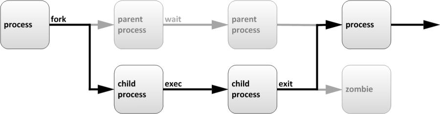

# CentOS7-系统进程管理

---

## 目录

* [进程概述和ps查看进程工具](#ps)
* [uptime查看系统负载-top动态管理进程](#uptime)
* [前后台进程切换-nice进程优先级-实战screen后台执行命令](#screen)

## 内容

### <a href="#ps" id="ps">进程概述和ps查看进程工具</a>

#### 1.1 什么是进程？

进程是已启动的可执行程序的运行实例，进程有以下组成部分：

* 已分配内存的地址空间
* 安全属性，包括所有权凭据和特权
* 程序代码的一个或多个执行线程
* 进程状态

程序：二进制文件，静态 `/bin/date`, `/usr/sbin/sshd`

进程：是程序运行的过程，动态，有生命周期及运行状态

下图所示的是进程的生命周期：



描述如下：

父进程复制自己的地址空间（fork [fɔ:k] 分叉）创建一个新的（子）进程结构。每个新进程分配一个唯一的进程ID（PID），满足跟踪安全性之需。PID和父进程ID（PPID）是子进程环境的元素，任何进程都可以创建子进程，所有进程都是第一个系统进程的后代。

CentOS5或6 PID为1的进程是：init

CentOS7 PID为1的进程是：systemd

僵尸进程：一个进程使用fork创建子进程，如果子进程退出，而父进程并没有调用wait或waitpid获取子进程的状态信息，那么子进程的进程描述符仍然保存在系统中。这种进程称之为僵尸进程。

<font color="#f00">父进程退出了，子进程没有退出，那么这些子进程就没有父进程来管理了，就变成僵尸进程了。</font>

#### 1.2 进程的属性

* 进程ID（PID）：是唯一的数值，用来区分进程
* 父进程的ID是（PPID）
* 启动进程的用户ID（UID）和所归属的组（GID）
* 进程状态：状态分为运行R、休眠S、僵尸Z
* 进程执行的优先级
* 进程所连接的终端名
* 进程资源占用：比如占用资源大小（内存、CPU占用量）

#### 1.3 使用`ps`查看进程

**1、 ps查看进程工具，常用参数：**

* a：显示跟当前终端关联的所有进程
* u：基于用户格式显示（U：显示用户ID所有的进程）
* x：显示所有进程，不以终端机来区分

```
[root@spring ~]# ps -aux | more
USER       PID %CPU %MEM    VSZ   RSS TTY      STAT START   TIME COMMAND
root         1  0.0  0.1 125332  3756 ?        Ss   02:08   0:00 /usr/lib/systemd/systemd --switched-root --system
--deserialize 22
root         2  0.0  0.0      0     0 ?        S    02:08   0:00 [kthreadd]
root         4  0.0  0.0      0     0 ?        S<   02:08   0:00 [kworker/0:0H]
root         6  0.0  0.0      0     0 ?        S    02:08   0:00 [ksoftirqd/0]
root         7  0.0  0.0      0     0 ?        S    02:08   0:00 [migration/0]
root         8  0.0  0.0      0     0 ?        S    02:08   0:00 [rcu_bh]
root         9  0.0  0.0      0     0 ?        R    02:08   0:00 [rcu_sched]
root        10  0.0  0.0      0     0 ?        S<   02:08   0:00 [lru-add-drain]
root        11  0.0  0.0      0     0 ?        S    02:08   0:00 [watchdog/0]
root        13  0.0  0.0      0     0 ?        S    02:08   0:00 [kdevtmpfs]
root        14  0.0  0.0      0     0 ?        S<   02:08   0:00 [netns]
root        15  0.0  0.0      0     0 ?        S    02:08   0:00 [khungtaskd]
root        16  0.0  0.0      0     0 ?        S<   02:08   0:00 [writeback]
root        17  0.0  0.0      0     0 ?        S<   02:08   0:00 [kintegrityd]
root        18  0.0  0.0      0     0 ?        S<   02:08   0:00 [bioset]
root        19  0.0  0.0      0     0 ?        S<   02:08   0:00 [bioset]
root        20  0.0  0.0      0     0 ?        S<   02:08   0:00 [bioset]
root        21  0.0  0.0      0     0 ?        S<   02:08   0:00 [kblockd]
root        22  0.0  0.0      0     0 ?        S<   02:08   0:00 [md]
root        23  0.0  0.0      0     0 ?        S<   02:08   0:00 [edac-poller]
root        24  0.0  0.0      0     0 ?        S<   02:08   0:00 [watchdogd]
root        30  0.0  0.0      0     0 ?        S    02:08   0:00 [kswapd0]
root        31  0.0  0.0      0     0 ?        SN   02:08   0:00 [ksmd]
```

> 注：最后一列[XXXX]使用方括号扩起来的进程是内核态的进程。没有扩起来的是用户态进程

参数含义：

* `USER`：启动这些进程的用户
* `PID`：进程的ID
* `%CPU`：进程占用CPU的百分比
* `%MEM`：占用内存的百分比
* `VSZ`：进程占用的虚拟内存的大小（单位：KB）
* `RSS`：进程占用的物理内存的大小（单位：KB）
* `TTY`：同下
* `STAT`：该程序目前的状态，Linux进程有5种基本状态：
	+ `R`：该程序目前正在运作，或者是可被运作
	+ `S`：该程序目前正在睡眠当中（可说是idle状态啦！），但可被某些讯号（signal）唤醒
	+ `T`：该程序目前正在侦测或者是停止了
	+ `Z`：该程序应该已经终止，但是其父程序却无法正常的终止它，造成zombie（僵尸）程序的状态
	+ `D`：不可终端状态
	+ 5个基本状态后，还可以加一些字母：
		- `<`：表示进程运行在高优先级上
		- `N`：表示进程运行在低优先级上
		- `L`：表示进程有页面锁定在内存中
		- `s`：表示进程是控制进程
		- `l`：表示进程是多线程的
		- `+`：表示当前进程运行在前台
* `START`：该process被触发启动的时间
* `TIME`：该process实际使用CPU运作的时间
* `COMMAND`：该程序的实际指令

```
# 终端1
[root@spring ~]# vim a.txt

# 终端2
[root@spring ~]# ps -aux | grep a.txt # 查看状态 S 表示睡眠状态， + 表示前台
root     13570  0.1  0.2 149428  5248 pts/1    S+   06:17   0:00 vim a.txt
root     13572  0.0  0.0 112712   972 pts/0    S+   06:18   0:00 grep --color=auto a.txt

# 终端1
control + z 
[1]+  Stopped                 vim a.txt

# 终端2
[root@spring ~]# ps -aux | grep a.txt # 查看状态 T 表示停止状态
root     13570  0.0  0.2 149428  5248 pts/1    T    06:17   0:00 vim a.txt
root     13574  0.0  0.0   8984   208 pts/0    R+   06:18   0:00 grep --color=auto a.txt
```

> 注：  
> 1.  `ctrl + c` 是发送SIGINT信号，终止一个进程  
> 2. `ctrl + z` 是发送SIGSTOP信号，挂起一个进程。将作业放置到后台（暂停）  
> 3. `ctrl + d` 不发送信号，而是表示一个特殊的二进制值，表示EOF。代表输入完成或者注销

```
# 进程1
[root@spring ~]# tar -zcvf usr-tar.gz /usr/
# 进程2
[root@spring ~]# ps -aux | grep tar
root     13655  2.5  0.0 123416  1356 pts/1    S+   06:33   0:00 tar -zcvf usr-tar.gz /usr/
root     13658  0.0  0.0 112712   956 pts/0    S+   06:33   0:00 grep --color=auto tar
[root@spring ~]# ps -aux | grep tar
root     13655  1.6  0.0 123564  1372 pts/1    S+   06:33   0:00 tar -zcvf usr-tar.gz /usr/
root     13660  0.0  0.0 112712   960 pts/0    R+   06:33   0:00 grep --color=auto tar
```

2、`ps` 常用的参数： `ps -ef`

* `-e` 显示所有进程
* `-f` 显示完整格式输出

```
[root@spring ~]#
[root@spring ~]# ps -ef | head
UID        PID  PPID  C STIME TTY          TIME CMD
root         1     0  0 02:08 ?        00:00:00 /usr/lib/systemd/systemd --switched-root --system --deserialize 22
root         2     0  0 02:08 ?        00:00:00 [kthreadd]
root         4     2  0 02:08 ?        00:00:00 [kworker/0:0H]
root         6     2  0 02:08 ?        00:00:01 [ksoftirqd/0]
root         7     2  0 02:08 ?        00:00:00 [migration/0]
root         8     2  0 02:08 ?        00:00:00 [rcu_bh]
root         9     2  0 02:08 ?        00:00:01 [rcu_sched]
root        10     2  0 02:08 ?        00:00:00 [lru-add-drain]
root        11     2  0 02:08 ?        00:00:00 [watchdog/0]
```

说明：

* `UID`：启动这些进程的用户
* `PID`：进程的ID
* `PPID`：父进程的进程号
* `C`：进程生命周期中的CPU利用率
* `STIME`：进程启动时的系统时间
* `TTY`：表明进程在哪个终端设备上运行。如果显示？表示与终端无关，这种进程一般是内核态进程。另外tty1-tty6是本机上面的登入者程序，若为pts/0等，则表示运行在虚拟终端上的进程
* `TIME`：运行进程一共累计占用的CPU时间
* `CMD`：启动的程序名称


### <a href="#uptime" id="uptime">uptime查看系统负载-top动态管理进程</a>

#### 1 uptime 查看 CPU 负载工具

```
[root@spring ~]# uptime
 06:54:10 up 10 min,  2 users,  load average: 0.00, 0.01, 0.02
```
 
弹出消息含意如下：

| 06:54:10 | 当前时间 |
|:--|:--|
| up 10 min | 系统运行时间 ，说明此服务器连续运行 10分钟了 |
| 2 user | 当前登录用户数 |
| 2 users,  load average: 0.00, 0.01, 0.02 | 系统负载，即任务队列的平均长度。 三个数值分别为 1分钟、5 分钟、15 分钟前到现在的平均值。 |

> 如果服务器的 CPU 为 1 核心，则 load average 中的数字 >=3 负载过高，如果服务器的 CPU 为 4 核心，则 load average 中的数字 >=12 负载过高。

```
[root@spring ~]# top
top - 16:39:25 up 27 min,  2 users,  load average: 0.00, 0.01, 0.02
Tasks:  87 total,   1 running,  86 sleeping,   0 stopped,   0 zombie
%Cpu(s):  0.0 us,  0.0 sy,  0.0 ni,100.0 id,  0.0 wa,  0.0 hi,  0.0 si,  0.0 st
KiB Mem :  2047000 total,  1660880 free,   100776 used,   285344 buff/cache
KiB Swap:  2097148 total,  2097148 free,        0 used.  1798108 avail Mem

  PID USER      PR  NI    VIRT    RES    SHR S %CPU %MEM     TIME+ COMMAND
    1 root      20   0  125332   3864   2604 S  0.0  0.2   0:00.75 systemd
    2 root      20   0       0      0      0 S  0.0  0.0   0:00.00 kthreadd
    4 root       0 -20       0      0      0 S  0.0  0.0   0:00.00 kworker/0:0H
    6 root      20   0       0      0      0 S  0.0  0.0   0:00.07 ksoftirqd/0
    7 root      rt   0       0      0      0 S  0.0  0.0   0:00.00 migration/0
    8 root      20   0       0      0      0 S  0.0  0.0   0:00.00 rcu_bh
    9 root      20   0       0      0      0 S  0.0  0.0   0:00.28 rcu_sched
   10 root       0 -20       0      0      0 S  0.0  0.0   0:00.00 lru-add-drain
   11 root      rt   0       0      0      0 S  0.0  0.0   0:00.01 watchdog/0
   13 root      20   0       0      0      0 S  0.0  0.0   0:00.00 kdevtmpfs
   14 root       0 -20       0      0      0 S  0.0  0.0   0:00.00 netns
   15 root      20   0       0      0      0 S  0.0  0.0   0:00.00 khungtaskd
   16 root       0 -20       0      0      0 S  0.0  0.0   0:00.00 writeback
   17 root       0 -20       0      0      0 S  0.0  0.0   0:00.00 kintegrityd
   18 root       0 -20       0      0      0 S  0.0  0.0   0:00.00 bioset
   19 root       0 -20       0      0      0 S  0.0  0.0   0:00.00 bioset
   20 root       0 -20       0      0      0 S  0.0  0.0   0:00.00 bioset
   21 root       0 -20       0      0      0 S  0.0  0.0   0:00.00 kblockd
   22 root       0 -20       0      0      0 S  0.0  0.0   0:00.00 md
```

| 值                     | 描述        |
|:-------------|:--------|
| Tasks:  87 total | 进程总数 |
| 2 running          | 正在进行的进程数量 |
| 86 sleeping       | 睡眠的进程数 |
| 0 stopped         | 停止的进程数 |
| 0 zombie          | 僵尸进程数 |
| %Cpu(s):  0.3 us | 系统用户进程使用 CPU 百分比 |
| 0.3 sy              | 内核中的进程占用 CPU 百分比 |
| 0.0 ni              | 用户进程空间内改变过优先级的进程占用 CPU 百分比 |
| 99.3 id            | 空闲 CPU 百分比 |
| 0.0 wa            | cpu 等待 I/0 完成的时间总量。<br>测试：<br>终端 1：执行：top<br>终端 2：dd if=/dev/zero of=/a.txt count=10 bs=100M<br>终端 3：dd if=/dev/zero of=/a.txt count=10 bs=100M |
| 0.0 hi             | **硬中断消耗时间**<br>硬中断，占的 CPU 百分比。1. 硬中断是由硬件产生的，比如，像磁盘，网卡，键盘，时钟等。每个设备或设备集都有它自己的 IRQ（中断请求）。基于 IRQ，CPU 可以将相应的请求分发到对应的硬件驱动上（注：硬件驱动通常是内核中的一个子程序，而不是一个独立的进程）。# hi -> Hardware IRQ: The amount of time the CPU has been servicing hardware interrupts. |
| 0.3 si             | **软中断消耗时间**<br>软中断，占的 CPU 百分比。1. 通常，软中断是一些对 I/O 的请求。这些请求会调用内核中可以调度 I/O 发生的程序。对于某些设备，I/O 请求需要被立即处理，而磁盘 I/O 请求通常可以排队并且可以稍后处理。根据 I/O 模型的不同，进程或许会被挂起直到 I/O 完成，此时内核调度器就会选择另一个进程去运行。I/O 可以在进程之间产生并且调度过程通常和磁盘 I/O 的方式是相同。# si -> Software Interrupts.: The amount of time the CPU has been servicingsoftware interrupts. |
| 0.0 st           | st：虚拟机偷取物理的时间。比如：物理机已经运行了 KVM，XEN 虚拟机。KVM 虚拟机占用物理机的 cpu 时间 |

```
KiB Mem :  2047000 total,  1660880 free,   100776 used,   285344 buff/cache
KiB Swap:  2097148 total,  2097148 free,        0 used.  1798108 avail Mem
```

| 值                     | 描述        |
|:-------------|:--------|
| Mem :  2047000 total | 物理内存总量 |
| 1661092 free     | 空闲内存总量 |
| 100532 used     | 使用的物理内存总量 |
| 285376 buff/cache | 用作内核缓存的内存量。<br>和 free -k 一个意思 |
| Swap:  2097148 total | 交换区总量 |
| 2097148 free     |  空闲交换区总量 |
| 0 used              | 空闲交换区总量 |
| 1797444 avail Mem | 总的可利用内存是多少 |

**进程信息**

| 列名           | 含义 |
|:---------|:----|
| PID            | 进程 id |
| USER         | 进程所有者的用户名 |
| PR             | 优先级（由内核动态调整），用户不能 |
| NI              | 进程优先级。 nice 值。负值表示高优先级，正值表示低优先级，用户可以自己调整 |
| VIRT           | 虚拟内存，是进程正在使用的所有内存（ps 中标为 VSZ）<br><br>VIRT：virtual memory usage 虚拟内存<br>1、进程“需要的”虚拟内存大小，包括进程使用的库、代码、数据等<br>2、假如进程申请 100m 的内存，但实际只使用了 10m，那么它会增长100m，而不是实际的使用量 |
| RES（resident memory usage） | 是进程所使用的物理内存。实际实用内存（ps 中标为 RSS）<br>RES：resident memory usage 常驻内存<br>1、进程当前使用的内存大小，但不包括 swap out<br>2、包含其他进程的共享<br>3、如果申请 100m 的内存，实际使用 10m，它只增长 10m，与 VIRT 相 反<br>4、关于库占用内存的情况，它只统计加载的库文件所占内存大小 |
| SHR            | 共享内存大小，单位 kb<br>SHR：shared memory 共享内存<br>1、除 M 了自身进程的共享内存，也包括其他进程的共享内存<br>2、虽然进程只使用了几个共享库的函数，但它包含了整个共享库的大小<br>3、计算某个进程所占的物理内存大小公式：RES – SHR<br>4、swap out 后，它将会降下来 |
| S                | 进程状态。<br>D=不可中断的睡眠状态<br>R=运行中或可运行<br>S=睡眠中<br>T=已跟踪/已停止<br>Z=僵停 |
| %CPU         | 上次更新到现在的 CPU 时间占用百分比 |
| %MEM        | 进程使用的物理内存百分比 |
|  TIME+        | 进程使用的 CPU 时间总计，单位 1/100 秒 |
| COMMAND  | 命令名/命令行 |

top 快捷键：

* 默认 3s 刷新一次，按 s 修改刷新时间
* 按空格 ：立即刷新。
* q 退出
* P：按 CPU 排序
* M：按内存排序
* T 按时间排序
* p: 进程 IP，查看某个进程状态
* 数字键 1：显示每个内核的 CPU 使用率
* u/U：指定显示的用户
* h:帮助

lsof 命令

```
[root@spring ~]# yum install lsof
```

lsof 命令用于查看你进程开打的文件，打开文件的进程，进程打开的端口(TCP、UDP)

* -i<条件>：列出符合条件的进程。（4、6、协议、:端口、 @ip ） 
* -p<进程号>：列出指定进程号所打开的文件；

```
[root@spring ~]# ps -axu | grep a.txt
root      1309  0.0  0.2 149464  5292 pts/0    S+   21:54   0:00 vim a.txt
root      1321  0.0  0.0 112712   968 pts/1    R+   21:57   0:00 grep --color=auto a.txt
[root@spring ~]# lsof -p 1309 # 一般用于查看木马进程，在读哪些文件
COMMAND  PID USER   FD   TYPE DEVICE  SIZE/OFF     NODE NAME
vim     1309 root  cwd    DIR    8,3       285 33574977 /root
vim     1309 root  rtd    DIR    8,3       277       64 /
vim     1309 root  txt    REG    8,3   2337192 51049209 /usr/bin/vim
vim     1309 root  mem    REG    8,3     61624    34865 /usr/lib64/libnss_files-2.17.so
vim     1309 root  mem    REG    8,3 106075056 50337857 /usr/lib/locale/locale-archive
vim     1309 root  mem    REG    8,3     11392      807 /usr/lib64/libfreebl3.so
vim     1309 root  mem    REG    8,3     14496    38913 /usr/lib64/libutil-2.17.so
vim     1309 root  mem    REG    8,3     40664    34851 /usr/lib64/libcrypt-2.17.so
vim     1309 root  mem    REG    8,3    115848    34857 /usr/lib64/libnsl-2.17.so
vim     1309 root  mem    REG    8,3    105824    34875 /usr/lib64/libresolv-2.17.so
vim     1309 root  mem    REG    8,3     19896    61597 /usr/lib64/libattr.so.1.1.0
vim     1309 root  mem    REG    8,3    402384    38964 /usr/lib64/libpcre.so.1.2.0
vim     1309 root  mem    REG    8,3   2156160    34847 /usr/lib64/libc-2.17.so
vim     1309 root  mem    REG    8,3    142232    34873 /usr/lib64/libpthread-2.17.so
vim     1309 root  mem    REG    8,3   1647344 33590785 /usr/lib64/perl5/CORE/libperl.so
vim     1309 root  mem    REG    8,3     19288    34853 /usr/lib64/libdl-2.17.so
vim     1309 root  mem    REG    8,3     27752     1196 /usr/lib64/libgpm.so.2.1.0
vim     1309 root  mem    REG    8,3     37056    61599 /usr/lib64/libacl.so.1.1.0
vim     1309 root  mem    REG    8,3    174576    38962 /usr/lib64/libtinfo.so.5.9
vim     1309 root  mem    REG    8,3    155784    61536 /usr/lib64/libselinux.so.1
vim     1309 root  mem    REG    8,3   1137024    34855 /usr/lib64/libm-2.17.so
vim     1309 root  mem    REG    8,3    163400    34840 /usr/lib64/ld-2.17.so
vim     1309 root    0u   CHR  136,0       0t0        3 /dev/pts/0
vim     1309 root    1u   CHR  136,0       0t0        3 /dev/pts/0
vim     1309 root    2u   CHR  136,0       0t0        3 /dev/pts/0
vim     1309 root    3u   REG    8,3     12288 33662550 /root/.a.txt.swp
```

```
[root@spring ~]# lsof -i : 21 # 用于查看端口，或查看黑客开启的后门端口是哪个进程在使用
lsof: unacceptable port specification in: -i :
lsof 4.87
 latest revision: ftp://lsof.itap.purdue.edu/pub/tools/unix/lsof/
 latest FAQ: ftp://lsof.itap.purdue.edu/pub/tools/unix/lsof/FAQ
 latest man page: ftp://lsof.itap.purdue.edu/pub/tools/unix/lsof/lsof_man
 usage: [-?abhKlnNoOPRtUvVX] [+|-c c] [+|-d s] [+D D] [+|-f[gG]] [+|-e s]
 [-F [f]] [-g [s]] [-i [i]] [+|-L [l]] [+m [m]] [+|-M] [-o [o]] [-p s]
[+|-r [t]] [-s [p:s]] [-S [t]] [-T [t]] [-u s] [+|-w] [-x [fl]] [--] [names]
Use the ``-h'' option to get more help information.
```

pstree 工具使用  
pstree：（display a tree of processes）以树状图显示进程，只显示进程的名字，且相同进程合并显示。  
格式：pstree 或 pstree -p  
以树状图显示进程，还显示进程 PID。  

```
[root@spring ~]# yum install psmisc -y

[root@spring ~]# pstree -p
systemd(1)─┬─NetworkManager(595)─┬─{NetworkManager}(613)
           │                     └─{NetworkManager}(616)
           ├─auditd(568)───{auditd}(569)
           ├─crond(602)
           ├─dbus-daemon(591)
           ├─login(606)───bash(1052)
           ├─master(1030)─┬─pickup(1280)
           │              └─qmgr(1043)
           ├─polkitd(596)─┬─{polkitd}(607)
           │              ├─{polkitd}(608)
           │              ├─{polkitd}(609)
           │              ├─{polkitd}(610)
           │              ├─{polkitd}(611)
           │              └─{polkitd}(612)
           ├─rsyslogd(818)─┬─{rsyslogd}(1048)
           │               └─{rsyslogd}(1050)
           ├─sshd(817)─┬─sshd(1071)───bash(1073)───vim(1309)
           │           └─sshd(1290)───bash(1292)───pstree(1345)
           ├─systemd-journal(399)
           ├─systemd-logind(597)
           ├─systemd-udevd(419)
           └─tuned(816)─┬─{tuned}(1040)
                        ├─{tuned}(1041)
                        ├─{tuned}(1045)
                        └─{tuned}(1046)
```

### <a href="#screen" id="screen">前后台进程切换-nice进程优先级-实战screen后台执行命令</a>

#### 1 Linux 后台进程与前台进程的区别

* 前台进程:是在终端中运行的命令，那么该终端就为进程的控制终端，一旦这个终端关闭，这这个进程也随着消失
* 后台进程: 也叫守护进程（Daemon），是运行在后台的一种特殊进程，不受终端控制，它不需要终端的交互；
* Linux 的大多数服务器就是用守护进程实现的。比如，Web 服务器 httpd 等。

#### 2 进程的前台与后台运行

跟系统任务相关的几个命令（了解）：

| 命令 | 描述 |
|:----|:----|
| &     | 用在一个命令的最后，可以把这个命令放到后台执行. |
| ctrl + z | 将一个正在前台执行的命令放到后台，并且暂停. |
| jobs | 查看当前有多少在后台运行的进程.它是一个作业控制命令 |
| fg（foreground process）| 将后台中的命令调至前台继续运行, 如果后台中有多个命令，可以用 fg %jobnumber 将选中的命令调出，%jobnumber 是通过 jobs 命令查到的后台正在执行的命令的序号(不是 pid) |
| bg(background process) | 将一个在后台暂停的命令，变成继续执行; 如果后台中有多个命令，可以用bg %jobnumber 将选中的命令调出，%jobnumber 是通过 jobs 命令查到的后台正在执行的命令的序号(不是 pid) |

```
# 终端1
[root@spring ~]# vim a.txt # 打开后，然后执行 ctrl+z

ctrl+z
[1]+  Stopped                 vim a.txt

[root@spring ~]# jobs # 查看当前有多少在后台运行的进程
[1]+  Stopped                 vim a.txt

[root@spring ~]# fg 1 # 将后台挂起的进程恢复到前台运行
```

```
# 终端2
[root@spring ~]# ps -aux | grep vim
root      1347  0.0  0.2 149520  5424 pts/0    T    22:11   0:00 vim a.txt
root      1349  0.0  0.0 112712   960 pts/1    S+   22:13   0:00 grep --color=auto vim
```

#### 3 kill 关闭进程

关闭进程 3 个命令：kill killall pkill 

kill 关闭进程：kill 进程号 关闭单个进程

killall 和 pkill 命令用于杀死指定名字的进程

通过信号的方式来控制进程的

kill -l =====> 列出所有支持的信号（了解） 用最多的是： 9 信号

```
[root@spring ~]# kill -l
 1) SIGHUP	 2) SIGINT	 3) SIGQUIT	 4) SIGILL	 5) SIGTRAP
 6) SIGABRT	 7) SIGBUS	 8) SIGFPE	 9) SIGKILL	10) SIGUSR1
11) SIGSEGV	12) SIGUSR2	13) SIGPIPE	14) SIGALRM	15) SIGTERM
16) SIGSTKFLT	17) SIGCHLD	18) SIGCONT	19) SIGSTOP	20) SIGTSTP
21) SIGTTIN	22) SIGTTOU	23) SIGURG	24) SIGXCPU	25) SIGXFSZ
26) SIGVTALRM	27) SIGPROF	28) SIGWINCH	29) SIGIO	30) SIGPWR
31) SIGSYS	34) SIGRTMIN	35) SIGRTMIN+1	36) SIGRTMIN+2	37) SIGRTMIN+3
38) SIGRTMIN+4	39) SIGRTMIN+5	40) SIGRTMIN+6	41) SIGRTMIN+7	42) SIGRTMIN+8
43) SIGRTMIN+9	44) SIGRTMIN+10	45) SIGRTMIN+11	46) SIGRTMIN+12	47) SIGRTMIN+13
48) SIGRTMIN+14	49) SIGRTMIN+15	50) SIGRTMAX-14	51) SIGRTMAX-13	52) SIGRTMAX-12
53) SIGRTMAX-11	54) SIGRTMAX-10	55) SIGRTMAX-9	56) SIGRTMAX-8	57) SIGRTMAX-7
58) SIGRTMAX-6	59) SIGRTMAX-5	60) SIGRTMAX-4	61) SIGRTMAX-3	62) SIGRTMAX-2
63) SIGRTMAX-1	64) SIGRTMAX
```

信号编号 信号名

* 1）      SIGHUP 重新加载配置
* 2）     SIGINT 键盘中断 crtl+c
* 3)       SIGQUIT 退出
* 9        SIGKILL 强制终止
* 15）    SIGTERM 终止（正常结束），缺省信号
* 18）    SIGCONT 继续
* 19）    SIGSTOP 停止
* 20）   SIGTSTP 暂停 crtl+z

````
[root@spring ~]# kill -9 1112
[root@spring ~]# ps -aux | grep vim
root      1121  0.0  0.0 112712   960 pts/0    S+   22:28   0:00 grep --color=auto vim
[1]+  Killed                  nice -n 5 vim a.txt
[root@spring ~]# killall sshd
Connection to 192.168.2.220 closed by remote host.
Connection to 192.168.2.220 closed.
maozhenongdeMBP:~ root# pkill sshd
```

#### 3.4 进程的优先级管理

优先级取值范围为（-20,19），越小优先级越高, 默认优先级是 0

* 命令 1：nice 指定程序的运行优先级
* 格式：nice n command

* 命令 2：renice 改变程序的运行优先级
* 格式：renice -n pid

```
[root@spring ~]# nice -n 5 vim a.txt
ctrl+z
[1]+  Stopped(SIGTSTP)        nice -n 5 vim a.txt

[root@spring ~]# ps -aux | grep vim
root      1112  0.3  0.2 149520  5372 pts/0    TN   22:26   0:00 vim a.txt
root      1114  0.0  0.0 112712   960 pts/0    S+   22:26   0:00 grep --color=auto vim

[root@spring ~]# top -p 1112
top - 22:26:57 up 2 min,  3 users,  load average: 0.05, 0.09, 0.05
Tasks:   1 total,   0 running,   0 sleeping,   1 stopped,   0 zombie
%Cpu(s):  0.0 us,  0.3 sy,  0.0 ni, 99.7 id,  0.0 wa,  0.0 hi,  0.0 si,  0.0 st
KiB Mem :  2047000 total,  1859532 free,    99680 used,    87788 buff/cache
KiB Swap:  2097148 total,  2097148 free,        0 used.  1823548 avail Mem

  PID USER      PR  NI    VIRT    RES    SHR S %CPU %MEM     TIME+ COMMAND
 1112 root      25   5  149520   5372   2616 T  0.0  0.3   0:00.08 vim

[root@spring ~]# renice -10 1112
1112 (process ID) old priority 5, new priority -10
[root@spring ~]# top -p 1112
top - 22:27:53 up 3 min,  3 users,  load average: 0.02, 0.07, 0.05
Tasks:   1 total,   0 running,   0 sleeping,   1 stopped,   0 zombie
%Cpu(s):  0.0 us,  0.3 sy,  0.0 ni, 99.7 id,  0.0 wa,  0.0 hi,  0.0 si,  0.0 st
KiB Mem :  2047000 total,  1859528 free,    99668 used,    87804 buff/cache
KiB Swap:  2097148 total,  2097148 free,        0 used.  1823552 avail Mem

  PID USER      PR  NI    VIRT    RES    SHR S %CPU %MEM     TIME+ COMMAND
 1112 root      10 -10  149520   5372   2616 T  0.0  0.3   0:00.08 vim
```

```
[root@spring ~]# yum -y install screen
```

常用 screen 参数

* screen -S test -> 新建一个叫 test 的会话
* screen -ls -> 列出当前所有的会话
* screen -r test -> 回到 test 会话