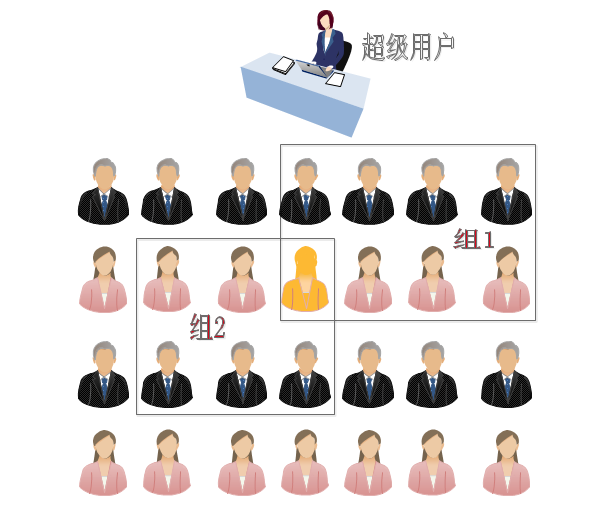
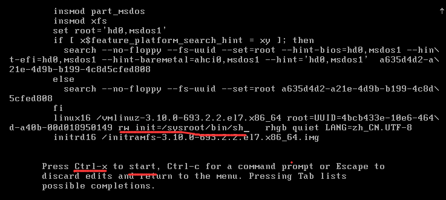
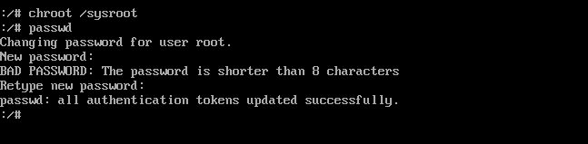

# CentOS7用户管理

---

## 目录

* [用户和组的相关配置文件](#settingFile)
* [管理用户和组](#useAndGroup)
* [实战：进入CentOS7紧急模式恢复root密码](#password)

## 内容

### <a href="#settingFile" id="settingFile">用户和组的相关配置文件</a>

用户一般来说是指使用计算机的人，计算机对针使用其的每一个人给了一个特定的名称，用户就可以使用这些名称来登录使用计算机，除了人之外，一些系统服务也需要含有部分特权的用户账户运行；因此出于安全考虑，用户管理应运而生，它加以明确限制各个用户账户的权限，root 在计算机中用拥有至高特权，所以一般只作管理用，非特权用户可以通过 SU 或 SUDO 程序来临时获得特权

GNU/Linux 通过用户和用户组实现访问控制----包括对文件访问、设备使用的控

个人可以拥有很多账户，只不是彼此名称不同，比如 root 名称已经占用就不能再用了，此外，任意用户可能从属某个用户组，此用户可以加入某些已经存在的组来获得该组的特权

GNU/Linux 系统中的每一个文件都有属一个用户（属主）和一个用户组（属组）。另外，还有三种类型的访问权限：读（read）、写（write）、运行（execute）。我们可以针对文件的属主、属组、而设置相应的访问权限。再次，我们可以通过 ls | stat 命令查询文件属主、属组和权限

```
[root@spring opt]# ll | head -2
total 148
-rw-r--r-- 1 root root 27944 Jan 26 14:29 dump_grub2
```

```
[root@spring ~]# stat anaconda-ks.cfg
  File: ‘anaconda-ks.cfg’
  Size: 1457      	Blocks: 8          IO Block: 4096   regular file
Device: 803h/2051d	Inode: 33574979    Links: 1
Access: (0600/-rw-------)  Uid: (    0/    root)   Gid: (    0/    root)
Access: 2020-01-13 21:02:59.337000000 +0800
Modify: 2020-01-13 21:02:59.337000000 +0800
Change: 2020-01-13 21:02:59.337000000 +0800
 Birth: -
```

### <a href="#useAndGroup" id="useAndGroup">管理用户和组</a>

#### 用户账号

Linux 用户三种角色

* 超级用户： root 拥有对系统的最高的管理权限 ID=0
* 普通用户：系统用户 UID:1-999(centos7 版本) 1-499(centos6 版本)本地用户 UID:1000+ 500+ UID:即每个用户的身份标示,类似于每个人的身份证号码.
* 虚拟用户：伪用户 一般不会用来登录系统的，它主要是用于维持某个服务的正常运行.如：ftp，apache

下图是用户和组的关系：

一对一：一个用户可以存在一个组中； 一对多：一个用户可以存在多个组中

多对一：多个用户可以存在一个组中； 多对多：多个用户可以存在多个组中



**配置文件**

| 名称 | 账号信息 | 说明 |
|:--|:--|:--|
| 用户配置文件 | `/etc/passwd` |  记录了每个用户的一些基本属性，并且对所有用户可读，每一行记录对应一个用户，每行记录通过冒号进行分隔 |
| 用户组文件 | `/etc/group` | 用户组的所有信息存放地儿，并且组名不能重复 |
| 用户对应的密码信息 | `/etc/shadow` | 因为 passwd 文件对所有用户是可读的，为安全起见把密码从passwd 中分离出来放入这个单独的文件，该文件只有 root 用户拥有读权限，从而保证密码安全性 |

#### 用户管理

用户命令

命令：`useradd`

```
useradd -d -u “UID” -g "初始组" -G "附加组" -s "登陆的 shell” 用户
```

* -d： -d 用户主目录路径， 可以指定用户家目录
* -M: 不创建用户的主目录
* -g：设置用户初始组的名称或数字 ID；该组必须是存在的；如果没有设置该选项，useradd 会根据/etc/login.defs 文件中的 USERGROUPS_ENAB 环境变量进行设置。默认 `USERGROUPS_ENAB` yes 会用和用户名相同的名字创建群组，GID 等于 UID.
* -G：用户要加入的附加组列表；使用逗号分隔多个组，不要添加空格；如果不设置，用户仅仅加入初始组。(一个用户只允许有一个主组，可以有多个附属组) 
* -s：用户默认登录 shell 的路径；启动过程结束后，默认启动的登录 shell 在此处设定；请确保使用的 shell已经安装，默认是 Bash。有时候需要禁止某些用户执行登录动作，例如用来执行系统服务的用户。将 shell设置成 /sbin/nologin 就可以禁止用户登录。

```
[root@spring ~]# useradd spring
[root@spring ~]# tail -1 /etc/passwd
spring:x:1000:1000::/home/spring:/bin/bash
[root@spring ~]# tail -1 /etc/group
spring:x:1000:
```

* spring：用户名
* x：密码占位符
* 1000：用户的 UID，它都是用数字来表示的
* 1000：用户所属组的 GID，它都是用数字来表示的
* 用户描述信息：对用户的功能或其它来进行一个简要的描述
* /home/spring：用户主目录（shell 提示符中“~”代表的那个）
* /bin/bash：用户登录系统后使用的 shell

```
# 指定用户 UID : -u 用户 ID
[root@spring ~]# useradd -u 1100 oracle
[root@spring ~]# id oracle
uid=1100(oracle) gid=1100(oracle) groups=1100(oracle)
```

```
# 指定用户主目录
[root@spring ~]#
[root@spring ~]# useradd -d /opt/hye001 hye001
[root@spring ~]# tail -1 /etc/passwd
hye001:x:1103:1103::/opt/hye001:/bin/bash
```

```
# 指定用户的主组
[root@spring ~]# useradd -g hye hye002
```

```
#  指定用户的附属组
[root@spring ~]# useradd -G hye,root,hye001,spring hye007
[root@spring ~]# id hye007
uid=1105(hye007) gid=1105(hye007) groups=1105(hye007),0(root),1000(spring),1101(hye),1103(hye001)
```

```
# 创建用户的另外一个命令
[root@spring ~]# adduser hye004
[root@spring ~]# id hye004
uid=1106(hye004) gid=1106(hye004) groups=1106(hye004)
[root@spring ~]# which adduser
/usr/sbin/adduser
[root@spring ~]# ll /usr/sbin/adduser
lrwxrwxrwx. 1 root root 7 Jan  6 21:36 /usr/sbin/adduser -> useradd
```

删除用户

usage: userdel [options] LOGIN

选项：-r 删除的时候，会同时删除用户的家目录和/var/mail 下的目录

```
#  删除用户
[root@spring ~]# userdel -r hye
```

```
# 密码文件
[root@spring ~]# head -5 /etc/shadow
root:$6$VCqxGSxAzHWWD4iL$px8MtwA3/JIXQcn7rjoXHJbmm2NeLDpBxdRZleRRCZNlkinq1MDWGHpW0gfy0S/ZmwWBzojTg.PZ3ZCozomTj0::0:99999:7:::
bin:*:17834:0:99999:7:::
daemon:*:17834:0:99999:7:::
adm:*:17834:0:99999:7:::
lp:*:17834:0:99999:7:::
```

**格式如下**

| keyword | 说明 |
|:----|:---------|
| name | 登录名称，这个必须是系统中的有效账户名 |
| password | 已加密密码，分为三个部分，第一部分是表示使用哪种哈希算法；第二部分是用于加密哈希的 salt;第三部分是已加密的哈希<br>哈希算法：$1 表示 MD5 ; $6 表示 SHA-512 ; $5 SHA-256<br>查看帮助说明：<br>man 5 passwd<br>man 5 shadow<br>man 5 group<br>man 3 crypt<br> |
| lastchange | 最近一次更改密码的日期，以距离 1970/1/1 的天数表示 |
| min-age | 不能更改密码的最少天数，最近更改过后几天才可以更改；如果为 0 表示“最短期限要求” |
| maxage | 密码过期时间，必须更改密码前的最多天数 |
| warning | 密码即将到期的警告期，以天数表示，0 表示“不提供警告” |
| inactive | 宽限天数，密码到期后 |
| expire | 账号过期时间，以距离 1970/1/1 的天数计算 (千年虫) |
| blank | 预留字段 |

```
# 设置密码
[root@spring ~]# passwd spring
Changing password for user spring.
New password:
Retype new password:
passwd: all authentication tokens updated successfully.
```

```
# 不交互设置密码
[root@spring ~]# echo Hye@1213 | passwd --stdin hye
Changing password for user hye.
passwd: all authentication tokens updated successfully.
```

> 互动： 两个用户的密码一样？ 那么 shadow 中加密的 hash 值一样吗？  
> 答： 不一样。 因为 salt 不一样

```
[root@spring ~]# egrep -v "^$|^#" /etc/login.defs
MAIL_DIR	/var/spool/mail
PASS_MAX_DAYS	99999
PASS_MIN_DAYS	0
PASS_MIN_LEN	5
PASS_WARN_AGE	7
UID_MIN                  1000
UID_MAX                 60000
SYS_UID_MIN               201
SYS_UID_MAX               999
GID_MIN                  1000
GID_MAX                 60000
SYS_GID_MIN               201
SYS_GID_MAX               999
CREATE_HOME	yes
UMASK           077
USERGROUPS_ENAB yes
ENCRYPT_METHOD SHA512
```

```
[root@spring ~]# cat /etc/default/useradd
# useradd defaults file
GROUP=100 #表示可以创建普通组 。 users 组 ID 为 100 。如果没有这一条，或者你把 users 这个组删除了，当你再创建用户时，将提示：useradd: group '100' does not exist
HOME=/home # 哪个目录作为用户主目录存放目录。如果你不想让用户家目录在/home 下，可以修改这个地方。
INACTIVE=-1 # 是否启用帐号过期。passwd 文件中第７栏。即：密码过期后是否会失效的设定值 。
EXPIRE= # 帐号终止日期 shadow 中第 8 栏。账号失效的日期 就是 shadow 内的第八字段，你可以直接设定账号在哪个日期后就直接失效，而不理会密码的问题。 通常不会设定此项目，但如果是付费的会员制系统，或许这个字段可以设定！
SHELL=/bin/bash # 默认 shell 使用哪个
SKEL=/etc/skel # 模板目录
CREATE_MAIL_SPOOL=yes # 是否创建邮箱文件
```

命令：`chage`

* -m：密码可更改的最小天数。为 0 时代表任何时候都可以更改密码
* -M：密码保持有效的最大天数
* -W：用户密码到期前，提前收到警告信息的天数
* -E：帐号到期的日期。过了这天，此帐号将不可用
* -d：上一次更改的日期，为 0 表示强制在下次登录时更新密码

**查看用户相关命令**

* id  用户和组的信息 
* whoami # 查看当前有效用户名
* who      # 显示目前登入系统的用户信息。
* w         # w 命令用于显示已经登陆系统的用户列表
* users    # 用于显示当前登录系统的所有用户的用户列表

**修改用户信息**

* -u   UID
* -d   宿主目录
* -g   起始组         # 只能有一个
* -G   附加组        # 可以有多个
* -s   登录 shell
* -L   锁定

```
[root@spring ~]# usermod -u1200 hye
[root@spring ~]# id hye
uid=1200(hye) gid=1101(hye) groups=1101(hye)
```

```
[root@spring ~]# usermod -s sbin/nologin test
[root@spring ~]# grep test /etc/passwd
test:x:1201:1201::/home/test:sbin/nologin
```

```
[root@spring ~]# rm -rf /home/hye
[root@spring ~]# su - hye
su: warning: cannot change directory to /home/hye: No such file or directory
-bash-4.2$ exit
logout
[root@spring ~]# cp /etc/skel/.bash* /home/hye
cp: target ‘/home/hye’ is not a directory
[root@spring ~]# cp /etc/skel/.bash* /home/hye/
cp: target ‘/home/hye/’ is not a directory
[root@spring ~]# mkdir /home/hye
[root@spring ~]# cp /etc/skel/.bash* /home/hye/
[root@spring ~]# chown hye:hye /home/hye/.bash*
[root@spring ~]# su - hye
Last login: Mon Jan 27 18:57:41 CST 2020 on pts/0
[hye@spring ~]$ exit
logout
```

### <a href="#password" id="password">实战：进入CentOS7紧急模式恢复root密码</a>

首先重启，按↑↓键，进入如下界面，选择第一项，按下 e 键进行编辑


在此界面找到 ro 这一项，改为 rw init=/sysroot/bin/sh



改完之后，按下 Ctrl+X 进入紧急模式  
原理：启动一个 shell 环境，系统并没有真正的启动


emergency [iˈmɜ:dʒənsi] 紧急  
换根，修改密码  
chroot 命令用来在指定的根目录下运行指令  
。chroot，即 change root directory （更改 root 目录）。在 linux 系统中，系统默认的目录结构都是以/，即是以根 (root) 开始的。而在使用 chroot 之后，系统的目录结构将以指定的位置作为/位置

在经过 chroot 命令之后，系统读取到的目录和文件将不在是旧系统根下的而是新根下（即被指定的新的位置）
的目录结构和文件，




注：如果系统的 selinux 开启着，则需要执行命令： touch /.autorelabel  
以更新系统信息,否则重启之后密码修改不会生效  
先退出当前根，reboot 重启系统


