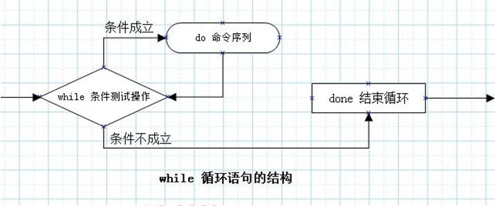

# 第二十一章：结构化命令case-for-while

---

## 目录

* [case-流程控制语句](#case)
* [循环语句](#loopStatement)
* [while 循环语句和循环嵌套](#while)
* [实战-3 个 shell 脚本实战](#actual)

## 内容

### <a href="#case" id="case">case-流程控制语句</a>

#### 1.1 流程控制语句：case

控制语句：用来实现对程序流程的选择、循环、转向和返回等进行控制。case是开关语句的一个组成部分；态势根据变量的不同进行取值比较，然后针对不同的取值分别执行不同的命令操作。
```
case value in 
mode1)
	command1
	command2
	……
	commandN
	;;
mode2)
	command1
	command2
	……
	commandN
	;;
esac
```

case 语句执行流程控制：


说明：

1. 首先使用“值”与模式1进行比较，若相同则执行模式1后的命令序列，直到遇到双分号“;;”后跳转到esac，表示分支结束。
2. 若与模式1不相匹配，则继续与模式2进行比较，若取值相同则执行模式2后的命令序列，直到遇到双分号“;;”后跳转到esac，表示分支结束。
3. 依次类推，若找不到所有匹配的模式，则执行默认模式"*)"后的命令序列，直到遇见esac后结束分支。

注意事项：

1. 值后面必须为为单词 `in`，每个“变量或表达式”的值必须以右括号结束。取值可以为变量或常量。匹配发现取值符合某一模式后，其间所有命令都开始执行至`;;`
2. 匹配中的值剋是多个值，通过 “|”来分割。

例 1：编写一个操作文件的脚本

```
[root@spring ~]# vim case-1.sh
****************
Input a chosse:1
BACKUP...
[root@spring ~]# 2
-bash: 2: command not found
[root@spring ~]# sh case-1.sh
#########################################################################
#!/bin/bash
cat <<EOF
****************
** 1. backup **
** 2. copy **
** 3. quit **
****************
EOF

read -p "Input a chosse:" OP
case $OP in
1|backup)
        echo "BACKUP..."
        ;;
2|copy)
        echo "COPY..."
        ;;
3|quit)
        echo "QUIT..."
        ;;
*)
        echo "Error"
esac

[root@spring ~]# sh !$
sh case-1.sh
****************
** 1. backup **
** 2. copy **
** 3. quit **
****************
Input a chosse:1
BACKUP...
[root@spring ~]# 2
-bash: 2: command not found
[root@spring ~]# sh case-1.sh
****************
** 1. backup **
** 2. copy **
** 3. quit **
****************
Input a chosse:2
COPY...
[root@spring ~]# sh case-1.sh
****************
** 1. backup **
** 2. copy **
** 3. quit **
****************
Input a chosse:3
QUIT...
[root@spring ~]# sh case-1.sh
****************
** 1. backup **
** 2. copy **
** 3. quit **
****************
Input a chosse:backupp
Error
```

例 2：编写一个启动 apache 服务脚本

```
[root@spring ~]# yum -y install httpd
[root@spring ~]# vim start-apache.sh
#!/bin/bash
case $1 in
start)
        /usr/bin/systemctl/ $1 httpd
        /usr/bin/ps aux | grep hpptd
        echo "hpptd start"
        ;;
stop)
        /usr/bin/systemctl $1 hpptd
        /usr/bin/ps aux | grep httpd
        echo "hpptd stop"
        ;;
restart)
        echo "httpd stop"
        /usr/bin/ps aux | grep httpd
        /usr/bin/systemctl $1 httpd
        echo "httpd restart..."
        /usr/bin/ps aux | grep httpd
        ;;
status)
        /usr/bin/systemctl $1 hpptd
        ;;
*)
        echo "please input start|stop|restart|status"
esac

[root@spring ~]# sh !$
sh start-apache.sh
please input start|stop|restart|status
[root@spring ~]# sh start-apache.sh start
start-apache.sh: line 4: /usr/bin/systemctl/: Not a directory
root      1143  0.0  0.0 112712   940 pts/0    R+   00:17   0:00 grep hpptd
hpptd start
[root@spring ~]# sh start-apache.sh stop
Failed to stop hpptd.service: Unit hpptd.service not loaded.
root      1152  0.0  0.0 112712   940 pts/0    S+   00:17   0:00 grep httpd
hpptd stop
[root@spring ~]# sh start-apache.sh restart
httpd stop
Job for httpd.service failed because the control process exited with error code. See "systemctl status httpd.service" and "journalctl -xe" for details.
httpd restart...
root      1168  0.0  0.0 112712   940 pts/0    R+   00:17   0:00 grep httpd
[root@spring ~]# sh start-apache.sh status
Unit hpptd.service could not be found.
[root@spring ~]# vim start-apache.sh
[root@spring ~]# sh !$
sh start-apache.sh
please input start|stop|restart|status
[root@spring ~]# sh start-apache.sh status
● httpd.service - The Apache HTTP Server
   Loaded: loaded (/usr/lib/systemd/system/httpd.service; disabled; vendor preset: disabled)
   Active: failed (Result: exit-code) since Thu 2020-02-13 00:17:54 CST; 1min 46s ago
     Docs: man:httpd(8)
           man:apachectl(8)
  Process: 1163 ExecStop=/bin/kill -WINCH ${MAINPID} (code=exited, status=1/FAILURE)
  Process: 1162 ExecStart=/usr/sbin/httpd $OPTIONS -DFOREGROUND (code=exited, status=1/FAILURE)
 Main PID: 1162 (code=exited, status=1/FAILURE)

Feb 13 00:17:54 spring.CentOS7 httpd[1162]: (98)Address already in use: AH00...0
Feb 13 00:17:54 spring.CentOS7 httpd[1162]: (98)Address already in use: AH00...0
Feb 13 00:17:54 spring.CentOS7 httpd[1162]: no listening sockets available, ...n
Feb 13 00:17:54 spring.CentOS7 httpd[1162]: AH00015: Unable to open logs
Feb 13 00:17:54 spring.CentOS7 systemd[1]: httpd.service: main process exite...E
Feb 13 00:17:54 spring.CentOS7 kill[1163]: kill: cannot find process ""
Feb 13 00:17:54 spring.CentOS7 systemd[1]: httpd.service: control process ex...1
Feb 13 00:17:54 spring.CentOS7 systemd[1]: Failed to start The Apache HTTP S....
Feb 13 00:17:54 spring.CentOS7 systemd[1]: Unit httpd.service entered failed....
Feb 13 00:17:54 spring.CentOS7 systemd[1]: httpd.service failed.
Hint: Some lines were ellipsized, use -l to show in full.
```

### <a href="#loopStatement" id="loopStatement">循环语句</a>

```
for var in list
do
	commands
done

# or

for var in list; do
	commands
done	

# or
for (( assignment; condition; next )); do
	commands
done	
```


1、可以直接读取 in 后面的值，默认以空格做分隔

```
[root@spring ~]# vim for-1.sh
#!/bin/bash
for var in a1 b1 c1 d1
do
        echo "The text is $var"
done

[root@spring ~]# sh !$
sh for-1.sh
The text is a1
The text is b1
The text is c1
The text is d1
```

```
[root@spring ~]# vim for-2.sh
#!/bin/bash
for var in a1 b2 "c1 d1" e2 "hello world"
do
        echo "The text is $var"
done

[root@spring ~]# sh !$
sh for-2.sh
The text is a1
The text is b2
The text is c1 d1
The text is e2
The text is hello world
```

2、 列表中的复杂值，可以使用 引号或转义字符”\”来加以约束

```
[root@spring ~]# vim for-3.sh
#!/bin/bash
for var in a1 b\'1 "c1 d1" e2 "hello world" I\'s ass2
do
        echo "The text is $var"
done

[root@spring ~]# sh !$
sh for-3.sh
The text is a1
The text is b'1
The text is c1 d1
The text is e2
The text is hello world
The text is I's
The text is ass2
```

3、从变量中取值

```
[root@spring ~]# vim for-4.sh
#!/bin/bash
CLASSMATES="贺永娥 侯冯喜 白成利 白彦"
for var in $CLASSMATES
do
        echo "My high school classmates is: $var"
done

[root@spring ~]# sh !$
sh for-4.sh
My high school classmates is: 贺永娥
My high school classmates is: 侯冯喜
My high school classmates is: 白成利
My high school classmates is: 白彦
```

4、从命令中取值

```
[root@spring ~]# vim for-5.sh
#!/bin/bash
for i in `cat /etc/hosts`
do
        echo "$i"
done

[root@spring ~]# sh !$
sh for-5.sh
127.0.0.1
localhost
localhost.localdomain
localhost4
localhost4.localdomain4
::1
localhost
localhost.localdomain
localhost6
localhost6.localdomain6
```

5、自定义shell分隔符

默认情况下，base shell 会以空格、制表符、换行符作为分隔符。通过`IFS`来定义分隔符

指定单个字符做分隔符：

* IFS=： #以：冒号做分隔符
* 可以指定多个
* 如 IFS='\n':;" #这个赋值会将反斜杠n、冒号、分号和双引号作为字段分隔符。
* 注：$'\n'与'\n'时的区别
* IFS='\n' #将字符\和字符 n 作为 IFS 的换行符。
* IFS=$'\n' #正真的使用换行符做为字段分隔符。

```
[root@spring ~]# vim for-6.sh
#!/bin/bash
IFS=$'\n'
for i in `cat /etc/hosts`
do
        echo "$i"
done

[root@spring ~]# sh !$
sh for-6.sh
127.0.0.1   localhost localhost.localdomain localhost4 localhost4.localdomain4
::1         localhost localhost.localdomain localhost6 localhost6.localdomain6
```

```
[root@spring ~]# vim for-7.sh
#!/bin/bash
IFS=:
for i in `cat /etc/hosts`
do
        echo "$i"
done

[root@spring ~]# sh for-7.sh
127.0.0.1   localhost localhost.localdomain localhost4 localhost4.localdomain4


1         localhost localhost.localdomain localhost6 localhost6.localdomain6
```

6、C 语言风格的 for

例 1：单个变量。 输出 1 到 10 之间的数字

```
[root@spring ~]# vim for-8.sh
#!/bin/bash
for (( i=1; i<10; i++ ))
do
        echo "number is: $i"
done

[root@spring ~]# vim for-8.sh
[root@spring ~]# sh !$
sh for-8.sh
number is: 1
number is: 2
number is: 3
number is: 4
number is: 5
number is: 6
number is: 7
number is: 8
number is: 9
```

例 2：多个变量。 同时输出 1-9 的升序和降序

```
[root@spring ~]# vim for-9.sh
#!/bin/bash
for (( i=1,j=9; i<10; i++,j-- ))
do
        echo number is $i --- $j
done

[root@spring ~]# sh !$
sh for-9.sh
number is 1 --- 9
number is 2 --- 8
number is 3 --- 7
number is 4 --- 6
number is 5 --- 5
number is 6 --- 4
number is 7 --- 3
number is 8 --- 2
number is 9 --- 1
```

### <a href="#while" id="while">while 循环语句和循环嵌套</a>

3.1 while-do-done

重复测试指令的条件，只要条件成立就反复执行对应的命令操作，直到命令不成立或为假；

```
while condition
do
	command
done
```



例 1：降序输出 10 到 1 的数字

```
[root@spring ~]# vim while-1.sh
#!/bin/bash
var=10
while [ $var -gt 0 ]
do
        echo $var
        var=$[ $var-1 ]
done

[root@spring ~]# sh !$
sh while-1.sh
10
9
8
7
6
5
4
3
2
1
```

例 2：输出如下图两数相乘的效果

```
[root@spring ~]# vim while-2.sh
#!/bin/bash
NUMBER=1
while [ $NUMBER -lt 10 ]
do
        SUM=$(( $NUMBER * $NUMBER ))
        echo "$NUMBER * $NUMBER = $SUM"
        (( NUMBER++ ))
done

[root@spring ~]# sh !$
sh while-2.sh
1 * 1 = 1
2 * 2 = 4
3 * 3 = 9
4 * 4 = 16
5 * 5 = 25
6 * 6 = 36
7 * 7 = 49
8 * 8 = 64
9 * 9 = 81
```

#### 3.2 嵌套循环

例 1：批量添加 a.txt 文件 5 个用户

编写脚本的思路

1. 明确脚本的功能
2. 编写脚本时会使用到那些命令 ？ useradd passwd for 
3. 把变化的数据使用变量表示
4. 选择适合的流程控制 （选择 、 循环 、分支）

```
[root@spring ~]# vim a.txt
mk
cd
ls
find
ln

[root@spring ~]# vim for-adduser.sh
#!/bin/bash
for name in `cat /root/a.txt`
do
        id $name &> /dev/null
        if [ $? -ne 0 ]; then
                useradd $name
                echo "123456" | passwd --stdin $name &> /dev/null
                echo "user $name created"
        else
                echo "user $name is exist"
        fi
done

[root@spring ~]# sh for-adduser.sh
user mk created
user cd created
user ls created
user find created
user ln created
```

例 2 ：打印九九乘法表

```
[root@spring ~]# vim for-multiplication-table.sh
#!/bin/bash
for i in `seq 9`
do
        for j in `seq $i`
        do
                echo -n "$i*$j=`echo $(( $i*$j ))` "
        done
        echo " "
done

[root@spring ~]# sh !$
sh for-multiplication-table.sh
1*1= 1
2*1= 2 2*2= 4
3*1= 3 3*2= 6 3*3= 9
4*1= 4 4*2= 8 4*3= 12 4*4= 16
5*1= 5 5*2= 10 5*3= 15 5*4= 20 5*5= 25
6*1= 6 6*2= 12 6*3= 18 6*4= 24 6*5= 30 6*6= 36
7*1= 7 7*2= 14 7*3= 21 7*4= 28 7*5= 35 7*6= 42 7*7= 49
8*1= 8 8*2= 16 8*3= 24 8*4= 32 8*5= 40 8*6= 48 8*7= 56 8*8= 64
9*1= 9 9*2= 18 9*3= 27 9*4= 36 9*5= 45 9*6= 54 9*7= 63 9*8= 72 9*9= 81
```

例 3：监控服务自动启动并记录

```
[root@spring ~]# yum install -y nmap

[root@spring ~]# vim for-listening-server.sh
#!/bin/bash
while true
do
        port=$(nmap -sT 192.168.201.135 | grep tcp | grep http | awk '{print $2}')
        if [ "$port"=="open" ]; then
                echo "$(date) httpd is ok!" >> /tmp/autostart-acc.log
        else
                /usr/bin/systemctl start httpd &> /dev/null
                echo "$(date) restart httpd!!" >> /tmp/autostart-acc.log
        fi
sleep 5
done
```

### <a href="#actual" id="actual">实战-3 个 shell 脚本实战</a>

#### 4.1 实战-将/opt 目录下所有的日志文件全自动打包

```
[root@spring ~]# vim log-back.sh
#!/bin/bash
SRC_DIR=/var/log
DES_DIR=/opt/backup/`date +%Y%m%d`
if [ ! -d $DES_DIR ]; then
        mkdir -p $DES_DIR
fi
for i in `find $SRC_DIR -name "*.log"`
do
        tar czf $i.tgz $i
done

mv /var/log/*.tgz $DES_DIR
ls -lh $DES_DIR
echo "The scripts exec end, Files tar successfully!"

[root@spring ~]# sh !$
sh log-back.sh
tar: Removing leading `/' from member names
tar: Removing leading `/' from member names
tar: Removing leading `/' from member names
tar: Removing leading `/' from member names
tar: Removing leading `/' from member names
tar: Removing leading `/' from member names
tar: Removing leading `/' from member names
tar: Removing leading `/' from member names
tar: Removing leading `/' from member names
tar: Removing leading `/' from member names
tar: Removing leading `/' from member names
tar: Removing leading `/' from member names
tar: Removing leading `/' from member names
tar: Removing leading `/' from member names
tar: Removing leading `/' from member names
tar: Removing leading `/' from member names
total 8.0K
-rw-r--r-- 1 root root 2.1K Feb 13 02:09 boot.log.tgz
-rw-r--r-- 1 root root 1.6K Feb 13 02:09 yum.log.tgz
The scripts exec end, Files tar successfully!
```

#### 4.2 实战-找出 192.168.1.1-10 网段中，服务器已经关机的 IP 地址

```
[root@spring ~]# vim ping.sh
#!/bin/bash
i=1
for (( i=1; i<10; i++ ))
do
        ping -c 3 192.168.1.$i &> /dev/null
        if [ $? -ne 0 ]; then
                echo "192.168.1.$i is shutdown"
        fi
done

[root@spring ~]# sh !$
sh ping.sh
192.168.1.1 is shutdown
192.168.1.4 is shutdown
192.168.1.5 is shutdown
192.168.1.6 is shutdown
192.168.1.7 is shutdown
192.168.1.8 is shutdown
192.168.1.9 is shutdown
```

#### 4.3 批量创建帐号并生成随机密码

```
[root@spring ~]# vim adduser.sh
#!/bin/bash
for i in hey_{0..10}
do
        useradd $i
        pass=`date + %s|md5sum|cut -c 1-8`
        sleep 1
        echo "$i:$pass" >> "/tmp/passwd.log"
        if [ $? -eq 0 ]; then
                echo "Create user is successfully!!!"
        else
                echo "Create user is failed!!!"
        fi
done

[root@spring ~]# sh !$
sh adduser.sh
date: extra operand ‘%s’
Try 'date --help' for more information.
Create user is successfully!!!
date: extra operand ‘%s’
Try 'date --help' for more information.
Create user is successfully!!!
date: extra operand ‘%s’
games:x:12:100:games:/usr/games:/sbin/nologin
Try 'date --help' for more information.
Create user is successfully!!!
date: extra operand ‘%s’
Try 'date --help' for more information.
Create user is successfully!!!
date: extra operand ‘%s’
Try 'date --help' for more information.
Create user is successfully!!!
date: extra operand ‘%s’
Try 'date --help' for more information.
Create user is successfully!!!
date: extra operand ‘%s’
Try 'date --help' for more information.
Create user is successfully!!!
date: extra operand ‘%s’
Try 'date --help' for more information.
Create user is successfully!!!
date: extra operand ‘%s’
Try 'date --help' for more information.
Create user is successfully!!!
date: extra operand ‘%s’
Try 'date --help' for more information.
Create user is successfully!!!
date: extra operand ‘%s’
Try 'date --help' for more information.
Create user is successfully!!!
[root@spring ~]# cat /tmp/passwd.log
hey_0:d41d8cd9
hey_1:d41d8cd9
hey_2:d41d8cd9
hey_3:d41d8cd9
hey_4:d41d8cd9
hey_5:d41d8cd9
hey_6:d41d8cd9
hey_7:d41d8cd9
hey_8:d41d8cd9
hey_9:d41d8cd9
hey_10:d41d8cd9
```
