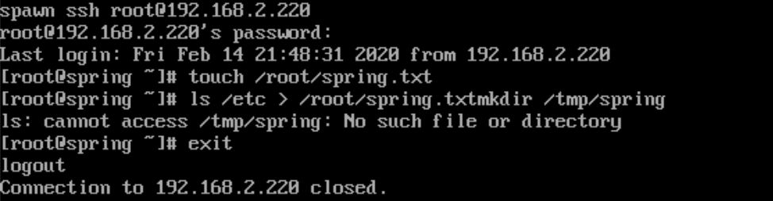
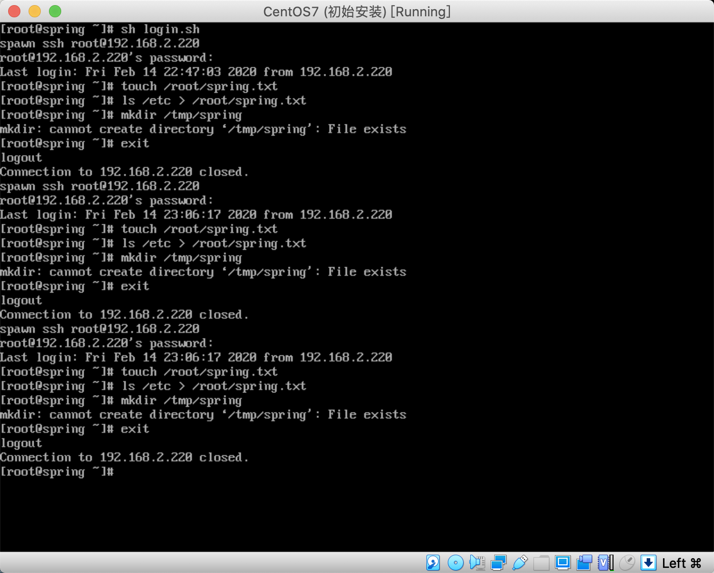

# 第二十三章：expect-正则表达式-sed-cut的使用

---

## 目录

* [expect 实现无交互登录](#expect)
* [正则表达式](#regexp)
* [sed 流编辑器](#sed)
* [cut 命令](#cut)
* [实战-bash 脚本语法检查和查看详细的执行过程](#actualBash)

## 内容

### <a href="#expect" id="expect">expect 实现无交互登录</a>

expect ([ɪkˈspekt] 期待 )是从它发展出来的。如果你想要写一个能够自动处理输入输出的脚本（如向用户提问并且验证密码）又不想面对 C 或者 Perl，那么 expect 是你的最好的选择。它可以用来做一些 linux 下无法做到交互的一些命令操作

```
# install expect
[root@spring ~]# yum install -y expect
```

使用 expect 创建脚本的方法

<font color="#f00">1）定义脚本执行的 shell</font>

```
#!/usr/bin/expect
```

这里定义的是 expect 可执行文件的链接路径（或真实路径），功能类似于 bash 等 shell 功能

<font color="#f00">2）Set timeout 30</font>

设置超时时间，单位是秒，如果设为 timeout -1 意为永不超时

<font color="#f00">3）spawn</font>

`spawn` 是进入 `expect` 环境后才能执行的内部命令，如果没有装 `expect` 或者直接在默认的 `SHELL` 下执行是找不到 `spawn` 命令的。不能直接在默认的 `shell` 环境中进行执行主要功能，它主要的功能是给 `ssh` 运行进程加个壳，用来传递交互指令。

<font color="#f00">4）expect</font>

这里的 `expect` 同样是 `expect` 的内部命令  
主要功能：判断输出结果是否包含某项字符串，没有则立即返回，否则就等待一段时间后返回，等待时间通过timeout 进行设置

<font color="#f00">5）send</font>

执行交互动作，将交互要执行的动作进行输入给交互指令  
命令字符串结尾要加上<font color="#f00">"\r"</font>，如果出现异常等待的状态可以进行核查

<font color="#f00">6）exp_continue</font>

继续执行接下来的交互操作

<font color="#f00">7）interact</font>

执行完后保持交互状态，把控制权交给控制台；如果不加这一项，交互完成会自动退出

<font color="#f00">8）\$argv</font>

expect 脚本可以接受从 bash 传递过来的参数，可以使用 [lindex \$argv n]获得，n 从 0 开始，分别表示第一个，第二个，第三个……参数

例 1：免密码通过 SSH 登录服务器（了解） 这里不是用密钥  
<font color="#f00">注：运行脚本时，要把#号后面的注释删除，不然无法运行</font>

```
[root@spring ~]# vim ssh.exp
#!/usr/bin/expect
set ipaddr "192.168.2.220"
set name "root"
set passwd "Maomao@1213"
set timeout 30
spawn ssh $name@$ipaddr
expect {
        "yes/no" { send "yes\r"; exp_continue }
        "password" { send "$passwd\r" }
}

expect "#"
send "touch /root/spring.txt\r"
send "ls /etc > /root/spring.txt\r"
send "mkdir /tmp/spring\r"
send "exit\r"
expect eof

[root@spring ~]# expect ssh.exp
```



例 2：对服务器批量管理<font color="#f00">（了解一下）</font>

```
[root@spring ~]# vim ip_pass.txt
192.168.2.220 123456
192.168.2.220 123456
192.168.2.220 123456

[root@spring ~]# vim ssh-2.exp
#!/usr/bin/expect

set ipaddr [ lindex $argv 0 ]
set passwd [ lindex $argv 1 ]
set timeout 30 # 设置超时时间，单位是秒；expect 超时等待的时间。默认 timeout 为 10s
spawn ssh root@$ipaddr # spawn 是进入 expect 环境后才可以执行的 expect 内部命令，如果没有装 expect 或者直接在 shell 下执行是找不到 spawn 命令的。这个就好比 cd 是 shell 的内建命令，离开 shell，就无法执行 cd 一样。 它主要的功能是给 ssh 运行进程加个壳，用来传递交互指令。
expect {
        "yes/no" { send "yes\r"; exp_continue }
        "password" { send "$passwd\r" } # 执行交互动作，与手工输入密码的动作等效。
}

expect "#" # 判断上次输出结果里是否包含“password:”的字符串，如果有则立即返回，向下执行；否则就一直等待，直到超时时间到
send "touch /root/spring.txt\r"
send "ls /etc > /root/spring.txt\r"
send "mkdir /tmp/spring\r"
send "exit\r"
expect eof

[root@spring ~]# vim login.sh
#!/bin/bash
echo
for ip in `awk '{print $1}' /root/ip_pass.txt`
do
        pass=`grep $ip /root/ip_pass.txt | awk '{ print $2 }'`
        expect /root/ssh.exp $ip $pass
done
```



### <a href="#regexp" id="regexp">正则表达式</a>


正则表达式，又称规则表达式。（英语：Regular Expression [ˈ reɡjulə] 规则的 [ iksˈ preʃən] 表达 ），在代码中常简写为 regex、regexp 或 RE），计算机科学的一个概念。正则表达式通常被用来检索、替换那些符合某个模式(规则)的文本。

正则表达式不只有一种，而且LINUX中不同的程序可能会使用不同的正则表达式，如：

工具：grep、sed、awk

Linux中常用的有两种正则表达式引擎

* 基础正则表达式：BRE
* 扩展正则表达式：ERE

#### 2.1 Shell 正则表达式的组成

| 特别字符 | 描述 |
|:-------:|:----|
| \$          | 匹配输入字符串的结尾位置。要匹配 \$ 字符本身，请使用 \\\$ |
| ( )          |  标记一个子表达式的开始和结束位置。要匹配这些字符，请使用 \( 和 \) | 
| *           | 匹配前面的子表达式零次或多次。要匹配 | * 字符，请使用 \*  |
| +           | 匹配前面的子表达式一次或多次。要匹配 + 字符，请使用 \+  |
| .            | 匹配除换行符 \n 之外的任何<font color="#f00">单字符</font>。要匹配 . ，请使用 \\. |
| [            | 标记一个中括号表达式的开始。要匹配 [，请使用 \\[  |
| ?           | 匹配前面的子表达式零次或一次，或指明一个非贪婪限定符。要匹配 ? 字符，请使用 \\?  |
| \           | 将下一个字符标记为或特殊字符、或原义字符、或向后引用、或八进制转义符。例如，'n' 匹配字符 'n'。 '\n' 匹配换行符。序列 '\\' 匹配 "\"，而 '\\(' 则匹配 "(" |
| ^           | 匹配输入字符串的开始位置，除非在方括号表达式中使用，此时它表示不接受该字符集合。要匹配 ^ 字符本身，请使用 \\^  |
| {           | 标记限定符表达式的开始。要匹配 {，请使用 \\{  |
| \|          | 指明两项之间的一个选择。要匹配 \|，请使用 \\\| 如： Y \| y |

| 定位符 |                                     |
|:-----:|:--------------------|
| ^        | 匹配输入字符串开始的位置 |
| $        | 匹配输入字符串结尾的位置 |

| 非打印字符 |                     |
|:--------:|:------------|
| \n            | 匹配一个换行符 |
| \r            | 匹配一个回车符 |
| \t            | 匹配一个制表符 |

```
[root@spring ~]# grep -v "^$\|^#" /etc/ssh/sshd_config # 使用基础正则表达式
HostKey /etc/ssh/ssh_host_rsa_key
HostKey /etc/ssh/ssh_host_ecdsa_key
HostKey /etc/ssh/ssh_host_ed25519_key
SyslogFacility AUTHPRIV
AuthorizedKeysFile	.ssh/authorized_keys
PasswordAuthentication yes
ChallengeResponseAuthentication no
GSSAPIAuthentication yes
GSSAPICleanupCredentials no
UsePAM yes
X11Forwarding yes
AcceptEnv LANG LC_CTYPE LC_NUMERIC LC_TIME LC_COLLATE LC_MONETARY LC_MESSAGES
AcceptEnv LC_PAPER LC_NAME LC_ADDRESS LC_TELEPHONE LC_MEASUREMENT
AcceptEnv LC_IDENTIFICATION LC_ALL LANGUAGE
AcceptEnv XMODIFIERS
Subsystem	sftp	/usr/libexec/openssh/sftp-server

[root@spring ~]# grep -E -v "^$|^#" /etc/ssh/sshd_config # 扩展正则表达式
HostKey /etc/ssh/ssh_host_rsa_key
HostKey /etc/ssh/ssh_host_ecdsa_key
HostKey /etc/ssh/ssh_host_ed25519_key
SyslogFacility AUTHPRIV
AuthorizedKeysFile	.ssh/authorized_keys
PasswordAuthentication yes
ChallengeResponseAuthentication no
GSSAPIAuthentication yes
GSSAPICleanupCredentials no
UsePAM yes
X11Forwarding yes
AcceptEnv LANG LC_CTYPE LC_NUMERIC LC_TIME LC_COLLATE LC_MONETARY LC_MESSAGES
AcceptEnv LC_PAPER LC_NAME LC_ADDRESS LC_TELEPHONE LC_MEASUREMENT
AcceptEnv LC_IDENTIFICATION LC_ALL LANGUAGE
AcceptEnv XMODIFIERS
Subsystem	sftp	/usr/libexec/openssh/sftp-server

[root@spring ~]# egrep -v "^$|^#" /etc/ssh/sshd_config # 扩展正则表达式
HostKey /etc/ssh/ssh_host_rsa_key
HostKey /etc/ssh/ssh_host_ecdsa_key
HostKey /etc/ssh/ssh_host_ed25519_key
SyslogFacility AUTHPRIV
AuthorizedKeysFile	.ssh/authorized_keys
PasswordAuthentication yes
ChallengeResponseAuthentication no
GSSAPIAuthentication yes
GSSAPICleanupCredentials no
UsePAM yes
X11Forwarding yes
AcceptEnv LANG LC_CTYPE LC_NUMERIC LC_TIME LC_COLLATE LC_MONETARY LC_MESSAGES
AcceptEnv LC_PAPER LC_NAME LC_ADDRESS LC_TELEPHONE LC_MEASUREMENT
AcceptEnv LC_IDENTIFICATION LC_ALL LANGUAGE
AcceptEnv XMODIFIERS
Subsystem	sftp	/usr/libexec/openssh/sftp-server
```

例 2：点字符

```
[root@spring ~]# grep .ot a.txt
spring:x:0:0:spring:/root:/bin/bash

[root@spring ~]# grep .ot /etc/passwd
root:x:0:0:root:/root:/bin/bash
operator:x:11:0:operator:/root:/sbin/nologin
```

### <a href="#sed" id="sed">sed 流编辑器</a>

#### 3.1 sed strem editor 流编辑器

sed 编辑器是一行一行的处理文件内容的。正在处理的内容存放在模式空间(缓冲区)内，处理完成后按照选项的规定进行输出或文件的修改。

接着处理下一行，这样不断重复，直到文件末尾。文件内容并没有改变，除非你使用重定向存储输出。Sed 主要用来自动编辑一个或多个文件；简化对文件的反复操作；

sed 也是支持正则表达式的，如果要使用扩展正则加参数-r

sed 的执行过程：

1. 一次读取一行数据
2. 根据我们提供的规则来匹配相关的数据，比如查找 root。 
3. 按照命令修改数据流中的数据，比如替换
4. 将结果进行输出
5. 重复上面四步

#### 3.2 如何使用

```
# 语法格式：
sed [options] ‘[commands]’ filename
```

例 1：

```
[root@spring ~]# echo "This is apple" >> a.txt
[root@spring ~]# sed 's/apple/dog/' a.txt
root:x:0:0:root:/root:/bin/bash
bin:x:1:1:bin:/bin:/sbin/nologin
daemon:x:2:2:daemon:/sbin:/sbin/nologin
adm:x:3:4:adm:/var/adm:/sbin/nologin
lp:x:4:7:lp:/var/spool/lpd:/sbin/nologin
sync:x:5:0:sync:/sbin:/bin/sync
shutdown:x:6:0:shutdown:/sbin:/sbin/shutdown
halt:x:7:0:halt:/sbin:/sbin/halt
mail:x:8:12:mail:/var/spool/mail:/sbin/nologin
operator:x:11:0:operator:/root:/sbin/nologin
games:x:12:100:games:/usr/games:/sbin/nologin
ftp:x:14:50:FTP User:/var/ftp:/sbin/nologin
nobody:x:99:99:Nobody:/:/sbin/nologin
systemd-network:x:192:192:systemd Network Management:/:/sbin/nologin
dbus:x:81:81:System message bus:/:/sbin/nologin
polkitd:x:999:998:User for polkitd:/:/sbin/nologin
sshd:x:74:74:Privilege-separated SSH:/var/empty/sshd:/sbin/nologin
postfix:x:89:89::/var/spool/postfix:/sbin/nologin
nginx:x:998:996:nginx user:/var/cache/nginx:/sbin/nologin
apache:x:48:48:Apache:/usr/share/httpd:/sbin/nologin
spring1:x:1000:1000::/home/spring1:/bin/bash
spring2:x:1001:1001::/home/spring2:/bin/bash
spring3:x:1002:1002::/home/spring3:/bin/bash
mysql:x:27:27:MariaDB Server:/var/lib/mysql:/sbin/nologin
This is dog

[root@spring ~]# cat a.txt # 发现并没有修改文件
root:x:0:0:root:/root:/bin/bash
bin:x:1:1:bin:/bin:/sbin/nologin
daemon:x:2:2:daemon:/sbin:/sbin/nologin
adm:x:3:4:adm:/var/adm:/sbin/nologin
lp:x:4:7:lp:/var/spool/lpd:/sbin/nologin
sync:x:5:0:sync:/sbin:/bin/sync
shutdown:x:6:0:shutdown:/sbin:/sbin/shutdown
halt:x:7:0:halt:/sbin:/sbin/halt
mail:x:8:12:mail:/var/spool/mail:/sbin/nologin
operator:x:11:0:operator:/root:/sbin/nologin
games:x:12:100:games:/usr/games:/sbin/nologin
ftp:x:14:50:FTP User:/var/ftp:/sbin/nologin
nobody:x:99:99:Nobody:/:/sbin/nologin
systemd-network:x:192:192:systemd Network Management:/:/sbin/nologin
dbus:x:81:81:System message bus:/:/sbin/nologin
polkitd:x:999:998:User for polkitd:/:/sbin/nologin
sshd:x:74:74:Privilege-separated SSH:/var/empty/sshd:/sbin/nologin
postfix:x:89:89::/var/spool/postfix:/sbin/nologin
nginx:x:998:996:nginx user:/var/cache/nginx:/sbin/nologin
apache:x:48:48:Apache:/usr/share/httpd:/sbin/nologin
spring1:x:1000:1000::/home/spring1:/bin/bash
spring2:x:1001:1001::/home/spring2:/bin/bash
spring3:x:1002:1002::/home/spring3:/bin/bash
mysql:x:27:27:MariaDB Server:/var/lib/mysql:/sbin/nologin
This is apple
```

#### 3.3 sed 选项 | 参数

options:

* <font color="#f00">`-a` 在当前行下面插入文件</font>
* <font color="#f00">`-n` 读取下一个输入行，用下一个命令处理新的行而不是用第一个命令</font>
* `-e` 执行多个 sed 指令
* `-f` 运行脚本
* <font color="#f00">`-i` 编辑文件内容 ***</font>
* `-i.bak` 编辑的同时创造.bak 的备份
* `-r` 使用扩展的正则表达式

命令：

* <font color="#f00">`i` 在当前行上面插入文件</font>
* <font color="#f00">`c` 把选定的行改为新的指定的文本</font>
* <font color="#f00">`p` 打印 ***</font>
* <font color="#f00">`d` 删除 ***</font>
* `r/R` 读取文件/一行
* <font color="#f00">`w` 另存</font>
* <font color="#f00">`s` 查找</font>
* `y` 替换
* `h` 拷贝模板块的内容到内存中的缓冲区。
* `H` 追加模板块的内容到内存中的缓冲区。
* `g` 获得内存缓冲区的内容，并替代当前模板块中的文本。
* `G` 获得内存缓冲区的内容，并追加到当前模板块文本的后面
* `D` 删除\n 之前的内容
* `P` 打印\n 之前的内容

替换标记：

* `数字`：表明新文本将替换第几处模式匹配的地方
* `g`：表示新文本将会替换所有匹配的文本
* `\1`：子串匹配标记，前面搜索可以用元字符集\(..\),
* `&`：保留搜索到的字符用来替换其它字符

<font color="#f00">sed 匹配字符集</font>

* <font color="#f00">`^` 匹配行开始，如：/^sed/匹配所有以 sed 开头的行。</font>
* <font color="#f00">`$` 匹配行结束，如：/sed$/匹配所有以 sed 结尾的行。</font>
* <font color="#f00">`.` 匹配一个非换行符的任意字符，如：/s.d/匹配 s 后接一个任意字符，最后是 d。</font>
* <font color="#f00">`*` 匹配 0 个或多个字符，如：/*sed/匹配所有模板是一个或多个空格后紧跟 sed 的行。</font>

例 1：s 只替换第一个匹配到的字符，将 a.txt 中的 root 用户替换成 spring

```
[root@spring ~]# sed 's/root/spring/' a.txt
spring:x:0:0:root:/root:/bin/bash # 发现只替换了第一个匹配的 root，后面的没有替换
bin:x:1:1:bin:/bin:/sbin/nologin
daemon:x:2:2:daemon:/sbin:/sbin/nologin
adm:x:3:4:adm:/var/adm:/sbin/nologin
lp:x:4:7:lp:/var/spool/lpd:/sbin/nologin
sync:x:5:0:sync:/sbin:/bin/sync
shutdown:x:6:0:shutdown:/sbin:/sbin/shutdown
halt:x:7:0:halt:/sbin:/sbin/halt
mail:x:8:12:mail:/var/spool/mail:/sbin/nologin
operator:x:11:0:operator:/spring:/sbin/nologin
games:x:12:100:games:/usr/games:/sbin/nologin
ftp:x:14:50:FTP User:/var/ftp:/sbin/nologin
nobody:x:99:99:Nobody:/:/sbin/nologin
systemd-network:x:192:192:systemd Network Management:/:/sbin/nologin
dbus:x:81:81:System message bus:/:/sbin/nologin
polkitd:x:999:998:User for polkitd:/:/sbin/nologin
sshd:x:74:74:Privilege-separated SSH:/var/empty/sshd:/sbin/nologin
postfix:x:89:89::/var/spool/postfix:/sbin/nologin
nginx:x:998:996:nginx user:/var/cache/nginx:/sbin/nologin
apache:x:48:48:Apache:/usr/share/httpd:/sbin/nologin
spring1:x:1000:1000::/home/spring1:/bin/bash
spring2:x:1001:1001::/home/spring2:/bin/bash
spring3:x:1002:1002::/home/spring3:/bin/bash
mysql:x:27:27:MariaDB Server:/var/lib/mysql:/sbin/nologin
This is apple
```

例 2：全面替换标记 g

```
[root@spring ~]# sed 's/root/spring/g' a.txt  | more
spring:x:0:0:spring:/spring:/bin/bash # 全部替换了
bin:x:1:1:bin:/bin:/sbin/nologin
daemon:x:2:2:daemon:/sbin:/sbin/nologin
adm:x:3:4:adm:/var/adm:/sbin/nologin
lp:x:4:7:lp:/var/spool/lpd:/sbin/nologin
sync:x:5:0:sync:/sbin:/bin/sync
shutdown:x:6:0:shutdown:/sbin:/sbin/shutdown
halt:x:7:0:halt:/sbin:/sbin/halt
mail:x:8:12:mail:/var/spool/mail:/sbin/nologin
operator:x:11:0:operator:/spring:/sbin/nologin
games:x:12:100:games:/usr/games:/sbin/nologin
ftp:x:14:50:FTP User:/var/ftp:/sbin/nologin
nobody:x:99:99:Nobody:/:/sbin/nologin
systemd-network:x:192:192:systemd Network Management:/:/sbin/nologin
dbus:x:81:81:System message bus:/:/sbin/nologin
polkitd:x:999:998:User for polkitd:/:/sbin/nologin
sshd:x:74:74:Privilege-separated SSH:/var/empty/sshd:/sbin/nologin
postfix:x:89:89::/var/spool/postfix:/sbin/nologin
nginx:x:998:996:nginx user:/var/cache/nginx:/sbin/nologin
apache:x:48:48:Apache:/usr/share/httpd:/sbin/nologin
spring1:x:1000:1000::/home/spring1:/bin/bash
spring2:x:1001:1001::/home/spring2:/bin/bash
spring3:x:1002:1002::/home/spring3:/bin/bash
mysql:x:27:27:MariaDB Server:/var/lib/mysql:/sbin/nologin
This is apple
```

#### <font color="#f00">例 2： 将 sed 中默认的/ 定界符改成#号</font>

```
[root@spring ~]# sed 's#/bin/bash#/sbin/nologin#' a.txt | more
root:x:0:0:root:/root:/sbin/nologin
bin:x:1:1:bin:/bin:/sbin/nologin
daemon:x:2:2:daemon:/sbin:/sbin/nologin
adm:x:3:4:adm:/var/adm:/sbin/nologin
lp:x:4:7:lp:/var/spool/lpd:/sbin/nologin
sync:x:5:0:sync:/sbin:/bin/sync
shutdown:x:6:0:shutdown:/sbin:/sbin/shutdown
halt:x:7:0:halt:/sbin:/sbin/halt
mail:x:8:12:mail:/var/spool/mail:/sbin/nologin
operator:x:11:0:operator:/root:/sbin/nologin
games:x:12:100:games:/usr/games:/sbin/nologin
ftp:x:14:50:FTP User:/var/ftp:/sbin/nologin
nobody:x:99:99:Nobody:/:/sbin/nologin
systemd-network:x:192:192:systemd Network Management:/:/sbin/nologin
dbus:x:81:81:System message bus:/:/sbin/nologin
polkitd:x:999:998:User for polkitd:/:/sbin/nologin
sshd:x:74:74:Privilege-separated SSH:/var/empty/sshd:/sbin/nologin
postfix:x:89:89::/var/spool/postfix:/sbin/nologin
nginx:x:998:996:nginx user:/var/cache/nginx:/sbin/nologin
apache:x:48:48:Apache:/usr/share/httpd:/sbin/nologin
spring1:x:1000:1000::/home/spring1:/sbin/nologin
spring2:x:1001:1001::/home/spring2:/sbin/nologin
spring3:x:1002:1002::/home/spring3:/sbin/nologin
mysql:x:27:27:MariaDB Server:/var/lib/mysql:/sbin/nologin
This is apple
```

以/来做定界符：

```
[root@spring ~]# sed 's/\/bin\/bash/\/sbin\/nologin/' a.txt
root:x:0:0:root:/root:/sbin/nologin
bin:x:1:1:bin:/bin:/sbin/nologin
daemon:x:2:2:daemon:/sbin:/sbin/nologin
adm:x:3:4:adm:/var/adm:/sbin/nologin
lp:x:4:7:lp:/var/spool/lpd:/sbin/nologin
sync:x:5:0:sync:/sbin:/bin/sync
shutdown:x:6:0:shutdown:/sbin:/sbin/shutdown
halt:x:7:0:halt:/sbin:/sbin/halt
mail:x:8:12:mail:/var/spool/mail:/sbin/nologin
operator:x:11:0:operator:/root:/sbin/nologin
games:x:12:100:games:/usr/games:/sbin/nologin
ftp:x:14:50:FTP User:/var/ftp:/sbin/nologin
nobody:x:99:99:Nobody:/:/sbin/nologin
systemd-network:x:192:192:systemd Network Management:/:/sbin/nologin
dbus:x:81:81:System message bus:/:/sbin/nologin
polkitd:x:999:998:User for polkitd:/:/sbin/nologin
sshd:x:74:74:Privilege-separated SSH:/var/empty/sshd:/sbin/nologin
postfix:x:89:89::/var/spool/postfix:/sbin/nologin
nginx:x:998:996:nginx user:/var/cache/nginx:/sbin/nologin
apache:x:48:48:Apache:/usr/share/httpd:/sbin/nologin
spring1:x:1000:1000::/home/spring1:/sbin/nologin
spring2:x:1001:1001::/home/spring2:/sbin/nologin
spring3:x:1002:1002::/home/spring3:/sbin/nologin
mysql:x:27:27:MariaDB Server:/var/lib/mysql:/sbin/nologin
This is apple
```

（2）按行查找替换

写法如下：

* 用数字表示行范围；$表示行尾
* 用文本模式配置来过滤

例 1：单行替换，将第 2 行中 bin 替换成 spring

```
[root@spring ~]# sed '2s/bin/spring/' a.txt | more
root:x:0:0:root:/root:/bin/bash
spring:x:1:1:bin:/bin:/sbin/nologin
daemon:x:2:2:daemon:/sbin:/sbin/nologin
adm:x:3:4:adm:/var/adm:/sbin/nologin
lp:x:4:7:lp:/var/spool/lpd:/sbin/nologin
sync:x:5:0:sync:/sbin:/bin/sync
shutdown:x:6:0:shutdown:/sbin:/sbin/shutdown
halt:x:7:0:halt:/sbin:/sbin/halt
mail:x:8:12:mail:/var/spool/mail:/sbin/nologin
operator:x:11:0:operator:/root:/sbin/nologin
games:x:12:100:games:/usr/games:/sbin/nologin
ftp:x:14:50:FTP User:/var/ftp:/sbin/nologin
nobody:x:99:99:Nobody:/:/sbin/nologin
systemd-network:x:192:192:systemd Network Management:/:/sbin/nologin
dbus:x:81:81:System message bus:/:/sbin/nologin
polkitd:x:999:998:User for polkitd:/:/sbin/nologin
sshd:x:74:74:Privilege-separated SSH:/var/empty/sshd:/sbin/nologin
postfix:x:89:89::/var/spool/postfix:/sbin/nologin
nginx:x:998:996:nginx user:/var/cache/nginx:/sbin/nologin
apache:x:48:48:Apache:/usr/share/httpd:/sbin/nologin
spring1:x:1000:1000::/home/spring1:/bin/bash
spring2:x:1001:1001::/home/spring2:/bin/bash
spring3:x:1002:1002::/home/spring3:/bin/bash
mysql:x:27:27:MariaDB Server:/var/lib/mysql:/sbin/nologin
This is apple
```

例 2：多行替换，如果涉及到多行处理，用逗号表示行间隔。 将第 3 行到最行尾中 bin 替换成 spring

```
[root@spring ~]# sed '2, $s/bin/spring/' a.txt | more
root:x:0:0:root:/root:/bin/bash
spring:x:1:1:bin:/bin:/sbin/nologin
daemon:x:2:2:daemon:/sspring:/sbin/nologin
adm:x:3:4:adm:/var/adm:/sspring/nologin
lp:x:4:7:lp:/var/spool/lpd:/sspring/nologin
sync:x:5:0:sync:/sspring:/bin/sync
shutdown:x:6:0:shutdown:/sspring:/sbin/shutdown
halt:x:7:0:halt:/sspring:/sbin/halt
mail:x:8:12:mail:/var/spool/mail:/sspring/nologin
operator:x:11:0:operator:/root:/sspring/nologin
games:x:12:100:games:/usr/games:/sspring/nologin
ftp:x:14:50:FTP User:/var/ftp:/sspring/nologin
nobody:x:99:99:Nobody:/:/sspring/nologin
systemd-network:x:192:192:systemd Network Management:/:/sspring/nologin
dbus:x:81:81:System message bus:/:/sspring/nologin
polkitd:x:999:998:User for polkitd:/:/sspring/nologin
sshd:x:74:74:Privilege-separated SSH:/var/empty/sshd:/sspring/nologin
postfix:x:89:89::/var/spool/postfix:/sspring/nologin
nginx:x:998:996:nginx user:/var/cache/nginx:/sspring/nologin
apache:x:48:48:Apache:/usr/share/httpd:/sspring/nologin
spring1:x:1000:1000::/home/spring1:/spring/bash
spring2:x:1001:1001::/home/spring2:/spring/bash
spring3:x:1002:1002::/home/spring3:/spring/bash
mysql:x:27:27:MariaDB Server:/var/lib/mysql:/sspring/nologin
This is apple
```

（3）d 删除第 2 行到第 4 行的内容

```
[root@spring ~]# cp /etc/hosts hosts.txt
[root@spring ~]# cat hosts.txt
127.0.0.1   localhost localhost.localdomain localhost4 localhost4.localdomain4
::1         localhost localhost.localdomain localhost6 localhost6.localdomain6
192.168.2.220 notforget.com
192.168.2.221 notforget1.com
192.168.2.222 notforget2.com

[root@spring ~]# sed '2,4d' hosts.txt
127.0.0.1   localhost localhost.localdomain localhost4 localhost4.localdomain4
192.168.2.222 notforget2.com
```

将包括 192.168 的行删除

```
[root@spring ~]# sed '/192.168/d' hosts.txt
127.0.0.1   localhost localhost.localdomain localhost4 localhost4.localdomain4
::1         localhost localhost.localdomain localhost6 localhost6.localdomain6
```

（4）添加行

* 命令 i(insert 插入)，在当前行前面插入一行 i\
* 命令 a(append 附加)，在当前行后面添加一行 a\ 例 1：插入

例 1：插入

```
[root@spring ~]# echo "hello world" | sed 'i\spring'
spring
hello world
```

例 2：追加

```
[root@spring ~]# echo "hello world" | sed 'a\spring'
hello world
spring
```

例 3：在文件最后追加内容

```
[root@spring ~]# sed '$a\192.168.2.65 notfoget3.com' hosts.txt
127.0.0.1   localhost localhost.localdomain localhost4 localhost4.localdomain4
::1         localhost localhost.localdomain localhost6 localhost6.localdomain6
192.168.2.220 notforget.com
192.168.2.221 notforget1.com
192.168.2.222 notforget2.com
192.168.2.65 notfoget3.com # 追加数据

[root@spring ~]# cat hosts.txt
127.0.0.1   localhost localhost.localdomain localhost4 localhost4.localdomain4
::1         localhost localhost.localdomain localhost6 localhost6.localdomain6
192.168.2.220 notforget.com
192.168.2.221 notforget1.com
192.168.2.222 notforget2.com
```

例 4：在文件中第 2 行之后，开始追加内容

```
[root@spring ~]# sed '2a\192.168.2.65 notfoget8.com' hosts.txt
127.0.0.1   localhost localhost.localdomain localhost4 localhost4.localdomain4
::1         localhost localhost.localdomain localhost6 localhost6.localdomain6
192.168.2.65 notfoget8.com
192.168.2.220 notforget.com
192.168.2.221 notforget1.com
192.168.2.222 notforget2.com
```

例 5：在文件中第 2 行到第 4 行之后分别追加内容

```
[root@spring ~]# sed '2,4a\hello world' hosts.txt
127.0.0.1   localhost localhost.localdomain localhost4 localhost4.localdomain4
::1         localhost localhost.localdomain localhost6 localhost6.localdomain6
hello world
192.168.2.220 notforget.com
hello world
192.168.2.221 notforget1.com
hello world
192.168.2.222 notforget2.com
```

（5）修改行命令 c (change) c\ 

例 1：将第 4 行内容改成 192.168.1.56 notfoget7.com

```
[root@spring ~]# cat hosts.txt
127.0.0.1   localhost localhost.localdomain localhost4 localhost4.localdomain4
::1         localhost localhost.localdomain localhost6 localhost6.localdomain6
192.168.2.220 notforget.com
192.168.2.221 notforget1.com
192.168.2.222 notforget2.com

[root@spring ~]# sed '4c\192.168.1.56 notfoget7.com' hosts.txt
127.0.0.1   localhost localhost.localdomain localhost4 localhost4.localdomain4
::1         localhost localhost.localdomain localhost6 localhost6.localdomain6
192.168.2.220 notforget.com
192.168.1.56 notfoget7.com
192.168.2.222 notforget2.com
```

例 2：将第 2 行到最后全部修改成 192.168.1.65 xuegod65.cn

```
[root@spring ~]# sed '2,$c\192.168.1.65 notfoget.com' hosts.txt
127.0.0.1   localhost localhost.localdomain localhost4 localhost4.localdomain4
192.168.1.65 notfoget.com
```

例 3：将包括 192.168.2.222 行的内容修改成 192.168.2.65

```
[root@spring ~]# cat hosts.txt
127.0.0.1   localhost localhost.localdomain localhost4 localhost4.localdomain4
::1         localhost localhost.localdomain localhost6 localhost6.localdomain6
192.168.2.220 notforget.com
192.168.2.221 notforget1.com
192.168.2.222 notforget2.com

[root@spring ~]# sed '/192.168.2.222/c\192.168.2.65' hosts.txt
127.0.0.1   localhost localhost.localdomain localhost4 localhost4.localdomain4
::1         localhost localhost.localdomain localhost6 localhost6.localdomain6
192.168.2.220 notforget.com
192.168.2.221 notforget1.com
192.168.2.65
```

（6）打印，直接输入文件中的内容

例 1：输入第 2 行内容

```
[root@spring ~]# sed -n '2p' hosts.txt
::1         localhost localhost.localdomain localhost6 localhost6.localdomain6
```

（7）将修改或过滤出来的内容保存到另一个文件中

例 2：将 passwd 中的包括 root 字样的行保存到 c.txt 中

```
[root@spring ~]# sed -n '/root/w c.txt' /etc/passwd
[root@spring ~]# cat c.txt
root:x:0:0:root:/root:/bin/bash
operator:x:11:0:operator:/root:/sbin/nologin
```

（8）-i 对原文件修改，保存（ 必会 ） 使用场景： 替换或修改服务器配置文件

```
[root@spring ~]# sed -i 's/root/hye/' a.txt
[root@spring ~]# head -n 1 a.txt
hye:x:0:0:root:/root:/bin/bash
```

修改 IP 地址为 192.168.1.65

```
[root@spring ~]# cp /etc/sysconfig/network-scripts/ifcfg-enp0s3 enp0s3.txt
[root@spring ~]# sed -i 's/IPADDR="192.168.2.220"/IPADDR="192.168.1.65"/' enp0s3.txt

[root@spring ~]# cat enp0s3.txt
TYPE="Ethernet"
PROXY_METHOD="none"
BROWSER_ONLY="no"
BOOTPROTO="none"
DEFROUTE="yes"
IPV4_FAILURE_FATAL="no"
IPV6INIT="yes"
IPV6_AUTOCONF="yes"
IPV6_DEFROUTE="yes"
IPV6_FAILURE_FATAL="no"
IPV6_ADDR_GEN_MODE="stable-privacy"
NAME="enp0s3"
UUID="ed24b447-da46-4f2b-af3f-d6be431c5fbf"
DEVICE="enp0s3"
ONBOOT="yes"
IPADDR="192.168.1.65" # IP地址已修改
PREFIX="24"
GATEWAY="192.168.2.1"
DNS1="8.8.8.8"
NETMASK="255.255.255.0"
IPV6_PRIVACY="no"
```

### <a href="#cut" id="cut">cut 命令</a>

#### 4.1 cut 常用参数

cut 命令用来显示行中的指定部分，删除文件中指定字段。

说明：该命令有两项功能，其一是用来显示文件的内容，它依次读取由参数 file 所指明的文件，将它们的内容输出到标准输出上；其二是连接两个或多个文件，如 cut fl f2 > f3 将把文件 fl 和 fn 的内容合并起来，然后通过输出重定向符“>”的作用，将它们放入文件 f3 中。

语法: cut(选项)(参数)

选项

* `-b`：仅显示行中指定范围的字节数； 
* `-c`：仅显示行中指定范围的字符；
* `-d`：指定字段的分隔符，默认的字段分隔符为“TAB”；
* `-f`：显示指定字段的内容；

例 1：输出系统中所有用户名

使用 -f 选项提取指定字段，使用 -d 选项指定字段分隔符，这里以：冒号做分隔

```
[root@spring ~]# cut -f1 -d ":" a.txt
hye
bin
daemon
adm
lp
sync
shutdown
halt
mail
operator
games
ftp
nobody
systemd-network
dbus
polkitd
sshd
postfix
nginx
apache
spring1
spring2
spring3
mysql
This is apple
```

#### 4.2 cut 命令可以将一串字符作为列来显示，字符字段的记法：

* N-：从第 N 个字节、字符、字段到结尾；
* N-M：从第 N 个字节、字符、字段到第 M 个（包括 M 在内）字节、字符、字段；
* -M：从第 1 个字节、字符、字段到第 M 个（包括 M 在内）字节、字符、字段。

上面是记法，结合下面选项将摸个范围的字节、字符指定为字段：

* `-b` 表示字节；
* `-c` 表示字符；
* `-f` 表示定义字段。

例 1：打印第 1 个到第 3 个字符

```
[root@spring ~]# cut -c1-3 a.txt
hye
bin
dae
adm
lp:
syn
shu
hal
mai
ope
gam
ftp
nob
sys
dbu
pol
ssh
pos
ngi
apa
spr
spr
spr
mys
Thi
```

例 2：打印前 2 个字符：

```
[root@spring ~]# cut -c-2 a.txt
hy
bi
da
ad
lp
sy
sh
ha
ma
op
ga
ft
no
sy
db
po
ss
po
ng
ap
sp
sp
sp
my
Th
```

例 3：打印从第 5 个字符开始到结尾：

```
[root@spring ~]# cut -c5- a.txt
x:0:0:root:/root:/bin/bash
x:1:1:bin:/bin:/sbin/nologin
on:x:2:2:daemon:/sbin:/sbin/nologin
x:3:4:adm:/var/adm:/sbin/nologin
:4:7:lp:/var/spool/lpd:/sbin/nologin
:x:5:0:sync:/sbin:/bin/sync
down:x:6:0:shutdown:/sbin:/sbin/shutdown
:x:7:0:halt:/sbin:/sbin/halt
:x:8:12:mail:/var/spool/mail:/sbin/nologin
ator:x:11:0:operator:/hye:/sbin/nologin
s:x:12:100:games:/usr/games:/sbin/nologin
x:14:50:FTP User:/var/ftp:/sbin/nologin
dy:x:99:99:Nobody:/:/sbin/nologin
emd-network:x:192:192:systemd Network Management:/:/sbin/nologin
:x:81:81:System message bus:/:/sbin/nologin
itd:x:999:998:User for polkitd:/:/sbin/nologin
:x:74:74:Privilege-separated SSH:/var/empty/sshd:/sbin/nologin
fix:x:89:89::/var/spool/postfix:/sbin/nologin
x:x:998:996:nginx user:/var/cache/nginx:/sbin/nologin
he:x:48:48:Apache:/usr/share/httpd:/sbin/nologin
ng1:x:1000:1000::/home/spring1:/bin/bash
ng2:x:1001:1001::/home/spring2:/bin/bash
ng3:x:1002:1002::/home/spring3:/bin/bash
l:x:27:27:MariaDB Server:/var/lib/mysql:/sbin/nologin
 is apple
```

### <a href="#actualBash" id="actualBash">实战-bash 脚本语法检查和查看详细的执行过程</a>

```
bash -v test.bash # 查看 bash 是否存在语法错误
bash -x test.bash # 查看 bash 详细的执行过程
```

```
[root@spring ~]# vim bash-c.sh
#!/bin/bash
# Script to show debug of shell

tot=`expr $1 + $2`

secho $tot # 这里故意写错

[root@spring ~]# sh -v  bash-c.sh
#!/bin/bash
# Script to show debug of shell

tot=`expr $1 + $2`
expr $1 + $2
expr: syntax error # 语法哪错了？ 运行时没有给参数

secho $tot # secho error
bash-c.sh: line 6: secho: command not found

[root@spring ~]# sed -i 's/secho/echo/' bash-c.sh # 修改正确后

[root@spring ~]# sh -v !$ 15 20
sh -v bash-c.sh 15 20
#!/bin/bash
# Script to show debug of shell

tot=`expr $1 + $2`
expr $1 + $2

echo $tot # secho error
35

[root@spring ~]# sh -x bash-c.sh 12 24
++ expr 12 + 24
+ tot=36
+ echo 36
36
```

例 2：查看九九乘法表 shell 脚本运行过程

```
[root@spring ~]# cat ninety-nine-multiplication-table.sh
#!/bin/bash
for i in `seq 9`
do
        for j in `seq $i`
        do
                echo -n "$i*$j=`echo $(( $i*$j ))` "
        done
        echo " "
done

[root@spring ~]# bash -x ninety-nine-multiplication-table.sh
++ seq 9
+ for i in '`seq 9`'
++ seq 1
+ for j in '`seq $i`'
++ echo 1
+ echo -n '1*1=1 '
1*1=1 + echo ' '

+ for i in '`seq 9`'
++ seq 2
+ for j in '`seq $i`'
++ echo 2
+ echo -n '2*1=2 '
2*1=2 + for j in '`seq $i`'
++ echo 4
+ echo -n '2*2=4 '
2*2=4 + echo ' '

+ for i in '`seq 9`'
++ seq 3
+ for j in '`seq $i`'
++ echo 3
+ echo -n '3*1=3 '
3*1=3 + for j in '`seq $i`'
++ echo 6
+ echo -n '3*2=6 '
3*2=6 + for j in '`seq $i`'
++ echo 9
+ echo -n '3*3=9 '
3*3=9 + echo ' '

+ for i in '`seq 9`'
++ seq 4
+ for j in '`seq $i`'
++ echo 4
+ echo -n '4*1=4 '
4*1=4 + for j in '`seq $i`'
++ echo 8
+ echo -n '4*2=8 '
4*2=8 + for j in '`seq $i`'
++ echo 12
+ echo -n '4*3=12 '
4*3=12 + for j in '`seq $i`'
++ echo 16
+ echo -n '4*4=16 '
4*4=16 + echo ' '

+ for i in '`seq 9`'
++ seq 5
+ for j in '`seq $i`'
++ echo 5
+ echo -n '5*1=5 '
5*1=5 + for j in '`seq $i`'
++ echo 10
+ echo -n '5*2=10 '
5*2=10 + for j in '`seq $i`'
++ echo 15
+ echo -n '5*3=15 '
5*3=15 + for j in '`seq $i`'
++ echo 20
+ echo -n '5*4=20 '
5*4=20 + for j in '`seq $i`'
++ echo 25
+ echo -n '5*5=25 '
5*5=25 + echo ' '

+ for i in '`seq 9`'
++ seq 6
+ for j in '`seq $i`'
++ echo 6
+ echo -n '6*1=6 '
6*1=6 + for j in '`seq $i`'
++ echo 12
+ echo -n '6*2=12 '
6*2=12 + for j in '`seq $i`'
++ echo 18
+ echo -n '6*3=18 '
6*3=18 + for j in '`seq $i`'
++ echo 24
+ echo -n '6*4=24 '
6*4=24 + for j in '`seq $i`'
++ echo 30
+ echo -n '6*5=30 '
6*5=30 + for j in '`seq $i`'
++ echo 36
+ echo -n '6*6=36 '
6*6=36 + echo ' '

+ for i in '`seq 9`'
++ seq 7
+ for j in '`seq $i`'
++ echo 7
+ echo -n '7*1=7 '
7*1=7 + for j in '`seq $i`'
++ echo 14
+ echo -n '7*2=14 '
7*2=14 + for j in '`seq $i`'
++ echo 21
+ echo -n '7*3=21 '
7*3=21 + for j in '`seq $i`'
++ echo 28
+ echo -n '7*4=28 '
7*4=28 + for j in '`seq $i`'
++ echo 35
+ echo -n '7*5=35 '
7*5=35 + for j in '`seq $i`'
++ echo 42
+ echo -n '7*6=42 '
7*6=42 + for j in '`seq $i`'
++ echo 49
+ echo -n '7*7=49 '
7*7=49 + echo ' '

+ for i in '`seq 9`'
++ seq 8
+ for j in '`seq $i`'
++ echo 8
+ echo -n '8*1=8 '
8*1=8 + for j in '`seq $i`'
++ echo 16
+ echo -n '8*2=16 '
8*2=16 + for j in '`seq $i`'
++ echo 24
+ echo -n '8*3=24 '
8*3=24 + for j in '`seq $i`'
++ echo 32
+ echo -n '8*4=32 '
8*4=32 + for j in '`seq $i`'
++ echo 40
+ echo -n '8*5=40 '
8*5=40 + for j in '`seq $i`'
++ echo 48
+ echo -n '8*6=48 '
8*6=48 + for j in '`seq $i`'
++ echo 56
+ echo -n '8*7=56 '
8*7=56 + for j in '`seq $i`'
++ echo 64
+ echo -n '8*8=64 '
8*8=64 + echo ' '

+ for i in '`seq 9`'
++ seq 9
+ for j in '`seq $i`'
++ echo 9
+ echo -n '9*1=9 '
9*1=9 + for j in '`seq $i`'
++ echo 18
+ echo -n '9*2=18 '
9*2=18 + for j in '`seq $i`'
++ echo 27
+ echo -n '9*3=27 '
9*3=27 + for j in '`seq $i`'
++ echo 36
+ echo -n '9*4=36 '
9*4=36 + for j in '`seq $i`'
++ echo 45
+ echo -n '9*5=45 '
9*5=45 + for j in '`seq $i`'
++ echo 54
+ echo -n '9*6=54 '
9*6=54 + for j in '`seq $i`'
++ echo 63
+ echo -n '9*7=63 '
9*7=63 + for j in '`seq $i`'
++ echo 72
+ echo -n '9*8=72 '
9*8=72 + for j in '`seq $i`'
++ echo 81
+ echo -n '9*9=81 '
9*9=81 + echo ' '

[root@spring ~]# sh ninety-nine-multiplication-table.sh
1*1=1
2*1=2 2*2=4
3*1=3 3*2=6 3*3=9
4*1=4 4*2=8 4*3=12 4*4=16
5*1=5 5*2=10 5*3=15 5*4=20 5*5=25
6*1=6 6*2=12 6*3=18 6*4=24 6*5=30 6*6=36
7*1=7 7*2=14 7*3=21 7*4=28 7*5=35 7*6=42 7*7=49
8*1=8 8*2=16 8*3=24 8*4=32 8*5=40 8*6=48 8*7=56 8*8=64
9*1=9 9*2=18 9*3=27 9*4=36 9*5=45 9*6=54 9*7=63 9*8=72 9*9=81
```