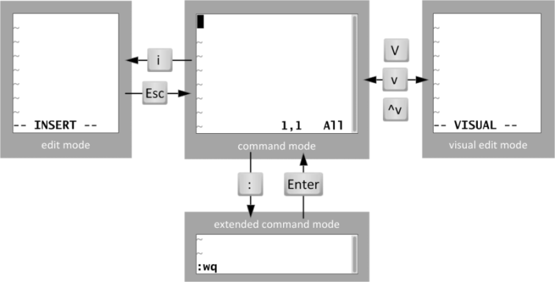

# 第五章：Vim编辑器和恢复ext4下误删除的文件-Xmanager工具

---

## 目录

* [vim 的使用](#vim)
* [实战：恢复ext4文件系统下误删除的文件](#ext4)
* [实战：使用xmanager等远程连接工具管理Linux](#xmanager)

## 内容

### <a href="#vim" id="vim">vim 的使用</a>

#### 检查系统是否安装了VIM工具

```
[root@spring ~]# which vim
/usr/bin/vim
[root@spring ~]# rpm -qf /usr/bin/vim
vim-enhanced-7.4.629-6.el7.x86_64
[root@spring ~]# rpm -qf `which vim`
vim-enhanced-7.4.629-6.el7.x86_64
[root@spring ~]# rpm -qf `which vi`
vim-minimal-7.4.629-6.el7.x86_64
```

扩展：
> 问：vi 和 vim 是同一个软件包安装的吗?  
> 答：NO，vim 是 vi 的增加版，最明显的区别就是 vim 可以语法加亮，它完全兼容 vi

#### 1、vim 编辑器模式



说明：

* i 当前字符之前插入 (光标前)
* I 行首插入 (行首)
* a 当前字符之后插入 (光标后) A 行尾插入(行尾) o 下一行插入 (另起一行) O 上一行插入(上一行插入)
* x 向后删除一个字符 等同于 delete
* X 向前删除一个字符
* u 撤销一步 每按一次就撤销一次
* r 替换

#### 在命令模式下做的操作
 
* 光标定位
* `h`、`j`、`k`、`l` 左下上右
* `0` 和 `home` 键表示切换到行首， $和 end 键表示切换到行尾
* `gg` 快速定位到文档的首行 , `G` 定位到未行
* `3gg` 或者 `3G` 快速定位到第 3 行
* `/string(字符串)` -----找到或定位你要找的单词或内容，如果相符内容比较*多，我们可以通过 N、n 来进行向上向下
* 查找，并且 vi 会对查找到的内容进行高亮显示，取消用 :noh
* `/^d` ----^意思表示以什么开头 ，，查找以字母 d 开头的内容
* `/t$` -----$意思表示以什么结尾，，查找以字母 t 结尾的内容
* vim + a.txt 打开文件后，光标会自动位于文件的最后一行

如何对文本进行编辑 删除、复制、粘贴、撤销

* `y` 复制（以字符为单位） :表示对单个字符进行复制，如果要复制整行，用 `yy`（以行为单位）
* 复制 N 行： `Nyy` ，比如： 2yy ，表示复制 2 行
* `dd`（删除，以行为单位，删除当前光标所在行）删除 N 行： `Ndd` ，比如： `2dd` ，表示删除 2 行
* `p` ： P 粘贴 
* 剪切： `dd`
* `x` 删除光标所在位置的字符
* `D` 从光标处删除到行尾
* u 撤销操作
* `ctrl+r` 还原撤销过的操作，将做过的撤销操作再还原回去，也就是说撤销前是什么样，再还原成什么样
* `r` 替换，或者说用来修改一个字符

**扩展：插入模式中的操作**

ctrl+p 可以进行补全操作,所需要的内容必须是在当前打开的文件内存在的，它只针对当前文件

#### 3、V 模式（列）

进入 v 模式 移动光标选择区域、

* 编程的时候需要进行多行注释： 
	1. ctrl+v 进入列编辑模式
	2. 向下或向上移动光标，把需要注释、编辑的行的开头选中起来
	3. 然后按大写的 I
	4. 再插入注释符或者你需要插入的符号,比如"#"
	5. 再按 Esc,就会全部注释或添加了

删除：再按 ctrl+v 进入列编辑模式；向下或向上移动光标 ；选中注释部分,然后按 d, 就会删除注释符号。

#### 4、命令行模式操作

* `:w` 保存 save
* :w! 强制保存
* :q 没有进行任何修改，退出 quit
* :q! 修改了，不保存，强制退出
* :wq 保存并退出
* :wq! 强制保存并退出
* :x 保存退出
* e! 还原到原来的状态推出--等于不保存退出

**调用外部文件或命令**

在命令行模式下操作：

* `:!ifconfig`调用系统命令
* !+命令
* 读取其他文件。（把其他文件中的内容追加到当前文档中）
* `:r /etc/hosts`

**文本替换**

* 格式 : 范围（其中%所有内容） s 分隔符 旧的内容 分隔符 新的内容 （分隔符可以自定义）默认是每一行的第一个符合要求的词 (/g 全部)
* :1,3 s/bin/xuegod 替换第 1 到 3 行中出现的第一个 bin 进行替换为 xuegod
* :1,3 s/bin/xuegod/g 替换第 1 到 3 行中查找到所有的 bin 进行替换为 xuegod
* :3 s/xue/aaaaa #只把第 3 行中内容替换了
* :% s/do/xuegod/g 将文本中所有的 do 替换成 xuegod
* :% s/do/xuegod/gi 将文本中所有的 do 替换成 xuegod, 并且忽略 do 的大小写
* :% s@a@b@g 将文本中所有的 a 替换成 b

#### 5 自定义 vim 使用环境

临时设置

* :`set nu` 设置行号
* :`set nonu` 取消设置行号
* :`noh` 取消高亮显示

永久设置环境

```
# 设置后会影响到系统所有的用户
[root@spring ~]# vim /etc/vimrc
```

~/.vimrc #在用户的家目录下，创建一个.vimrc。这样只影响到某一个用户，没有自己建一个

例：

```
[root@xuegod63 ~]# cat /root/.vimrc
set nu
[root@xuegod63 ~]# vim /root/.vimrc
```

vim 打开多个文件

```
# 以上下形势，打开两个文档
[root@spring ~]# vim -o /etc/passwd /etc/hosts
```

```
# 以左右方式打开两个文档
[root@spring ~]# vim -O /etc/passwd /etc/hosts
2 files to edit
```

> 注：ctrl+ww 在两文档之间进行切换编辑。大写 O 左右分屏，小写的 o 上下分屏

```
[root@spring ~]# echo aaa >> /sdb1/mima.txt
[root@spring ~]# cat /sdb1/mima.txt
aaa
[root@spring ~]# cp /etc/passwd /sdb1/passwd-copy
[root@spring ~]# echo aaa >> /sdb1/passwd-copy
[root@spring ~]# diff /etc/passwd /sdb1/passwd-copy
19a20
> aaa
```

#### .6 其它编辑器

* nano 编辑器
* emacs 编辑器
* GHOME 编辑器 gedit (前提是在图形界面下)

实战1：在Windows中编辑最好的汉字文本文档，上传到Linux打开乱码

实战2：解决将公司 Linux 服务器上脚本导到 windows 上打开串行的问题

### <a href="#ext4" id="ext4">实战：恢复ext4文件系统下误删除的文件</a>

ext4 文件系统上删除文件，可以恢复: extundelete ，ext3 恢复使用：ext3grep

windows 恢复误删除的文件： final data v2.0 汉化版 和 easyrecovery

Linux 文件系统由三部分组成：文件名，inode，block

windows 也由这三部分组成。

| a.txt    | inode                    | block            |
|------|----------------|-----------|
| 文件名 | 存放文件元数据信息 | 真正存放数据 |

查看 `inode` 中的文件属性; 通过 `stat` 命令查看 `inode` 中包含的内容

```
# 查看 inode 信息
[root@spring sdb1]# stat user.txt
  File: ‘user.txt’
  Size: 851       	Blocks: 8          IO Block: 4096   regular file
Device: 811h/2065d	Inode: 73          Links: 1
Access: (0644/-rw-r--r--)  Uid: (    0/    root)   Gid: (    0/    root)
Access: 2020-01-26 23:13:31.223000000 +0800
Modify: 2020-01-26 23:13:31.223000000 +0800
Change: 2020-01-26 23:13:31.223000000 +0800
 Birth: -
 ```

### <a href="xmanager" id="xmanager">实战：使用xmanager等远程连接工具管理Linux</a>