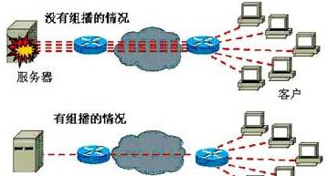
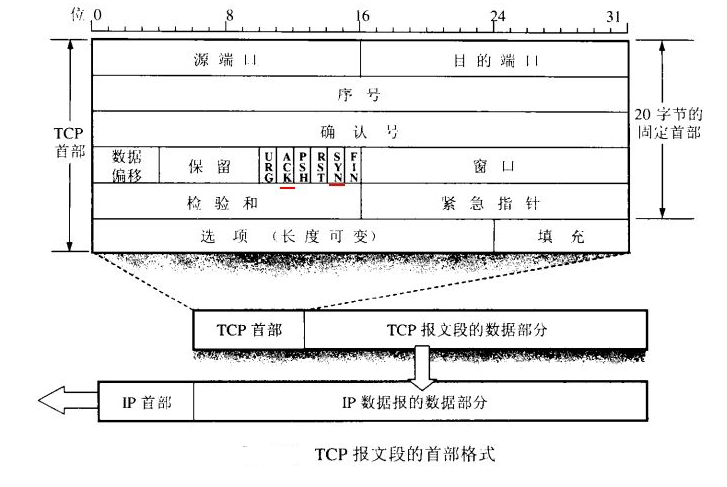
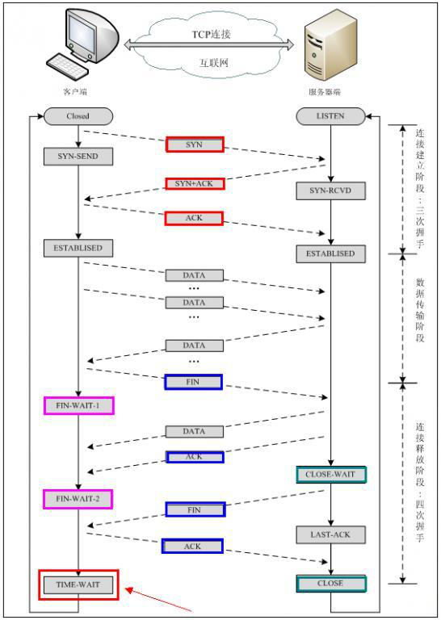

# 第十八章：Linux 网络管理技术

---

## 目录

* [OSI 七层模型和 TCP/IP 四层模型](#osi)
* [Linux 网络相关的调试命令](#networkCommand)
* [实战-在局域网中使用 awl 伪装 MAC 地址进行多线程 SYN 洪水攻击](#awl)

## 内容

### <a href="#osi" id="osi">OSI 七层模型和 TCP/IP 四层模型</a>

#### 1.1 OSI 七层参考模型，TCP/IP 四层参考模型


OSI 七层模型：OSI（Open System Interconnection）开放系统互连参考模型是国际标准化组织（ISO）制定的一个用于计算机或通信系统间互联的标准体系。

TCP/IP 四层模型：TCP/IP 参考模型是计算机网络的祖父 ARPANET 和其后继的因特网使用的参考模型。

分层作用：方便管理


七层模型优点：

1. 把复杂的网络划分成为更容易管理的层（将整个庞大而复杂的问题划分为若干个容易处理的小问题） 
2. 没有一个厂家能完整的提供整套解决方案和所有的设备，协议. 
3. 独立完成各自该做的任务，互不影响，分工明确，上层不关心下层具体细节，分层同样有益于网络排错功能与代表设备

| 分层 | 名字 | 功能 | 工作在该层的设备 |
|:----|:----|:----|:--------------|
| 7 | 应用层 | 提供用户界面 | QQ，IE 。应用程序 | 
| 6 | 表示层 | 表示数据，进行加密等处理 | QQ，IE 。应用程序 |
| 5 | 会话层 | 将不同应用程序的数据分离 | QQ，IE 。应用程序 |
| 4 | 传输层 | 提供可靠或不可靠的传输，在重传前执行纠错 | 防火墙 |
| 3 | 网络层 | 提供逻辑地址，路由器使用它们来选择路径 | 三层交换机、路由器 |
| 2 | 数据链路层 | 将分组拆分为字节，并讲字节组合成帧，使用 MAC 地址 提供介质访问，执行错误检测，但不纠错 | 二层交换机，网卡 |
| 1 | 物理层 | 在设备之间传输比特，指定电平，电缆速度和电缆针脚 | 集线器 |

**互动：为什么现代网络通信过程中用 TCP/IP 四层模型，而不是用 OSI 七层模型呢？**  
答：OSI 七层模型是理论模型，一般用于理论研究，他的分层有些冗余，实际应用，选择 TCP/IP 的四层模型。而且 OSI 自身也有缺陷，大多数人都认为 OSI 模型的层次数量与内容可能是最佳的选择，其实并非如此，其中会话层和表示层几乎是空的，而数据链路层和网络层包含内容太多，有很多的子层插入，每个子层都有不同的功能。

#### 1.2 常见网络相关的协议

* `ARP(Address Resolution Protocol)`：地址解析协议，将 IP 解析成 MAC 地址
* `DNS`：域名解析协议 www.baidu.com
*` SNMP(Simple Network Management Protocol)`：网络管理协议
* `DHCP(Dynamic Host Configuration Protocol)`：动态主机配置协议，它是在 TCP/IP 网络上使客户机获得配置信息的协议
* `FTP(File Transfer Protocol)`：文件传输协议，它是一个标准协议，是在计算机和网络之间交换文件的最简单的方法。
* `HTTP(Hypertext Transfer Protocol )`：超文本传输协议
* `HTTPS(Secure Hypertext Transfer Protocol)`：安全超文本传输协议，它是由 Netscape 开发并内置于其浏览器中，用于对数据进行压缩和解压操作.
* `ICMP(Internet Control Message Protocol)`：Internet 控制信息协议,互联网控制报文协议
* `ping ip` 定义消息类型有：TTL 超时、地址的请求与应答、信息的请求与应答、目的地不可到达
* `SMTP(Simple Mail Transfer Protocol)`：简单邮件传送协议
* `TELNET Protocol`：虚拟终端协议
* `TFTP(Trivial File Transfer Protocol)`：小文件传输协议
* `UDP(User Datagram Protocol)`：用户数据报协议，它是定义用来在互连网络环境中提供包交换的计算机通信的协议
* `TCP(Transmission Control Protocol)`： 传输控制协议，是一种面向连接的、可靠的、基于字节流的传输层通信协议 log 转发：开启一个协议：tcp(三次握手和四次挥手)

**TCP 协议和 UDP 协议**

1. TCP 协议：TCP(Transmission Control Protocol, 传输控制协议)是面向连接的协议，在收发数据前，必须和对方建立可靠的连接。
2. UDP 协议：UDP(User Datagram Protocol,用户数据报协议)，是一种无连接的传输层协议，提供面向事务的简单不可靠信息传送服务

**总结：TCP 与 UDP 的区别：**

1. 基于连接与无连接；
2. 对系统资源的要求（TCP 较多，UDP 少）；
3. UDP 程序结构较简单；UDP 信息包的标题很短，只有 8 个字节，相对于 TCP 的 20 个字节信息包的额外开销很小。所以传输速度可更快
4. TCP 保证数据正确性，UDP 可能丢包；TCP 保证数据顺序，UDP 不保证。
	+ 场景： 视频，语音通讯使用 udp，或网络环境很好，比如局域网中通讯可以使用 udp。 udp 数据传输完整性，可以通过应用层的软件来校对就可以了。
	+ tcp 传文件，数据完整性要求高。

#### 1.3 TCP 和 UDP 常用端口号名称

1、TCP 端口分配

| 端口号 | 协议 | 描述 |
|:------|:----|:----|
| 21 | ftp | 文件传输服务 |
| 22 | ssh | 安全远程连接服务 |
| 23 | telnet | 远程连接服务 |
| 25 | smtp | 电子邮件服务 |
| 53 | DNS | 域名解析服务，有 tcp53 也有用 udp53 端口传输 |
| 80 | http | web 服务 |
| 443 | https | 安全 web 服务 |

```
[root@spring ~]# vim /etc/services # 查看所有常见端口号及服务名称
You have mail in /var/spool/mail/root
```

iptables 或 netstat 要把端口解析成协议名时，都需要使用到这个文件。另外后期 xinetd 服务管理一些小服务时，也会使用到此文件来查询对应的小服务端口号。

注：有的服务是 UDP 和 TCP 端口都会监听的

#### 1.4 IP 地址分类

IP 地址分 5 类，常见的地址是 A、B、C 三类 

1. A 类地址:范围从 0-127，0 是保留的并且表示所有 IP 地址，而 127 也是保留的地址，并且是用于测试环回口用的。因此 A 类地址的可用的范围其实是从 1-126 之间。以子网掩码：255.0.0.0.
1. B 类地址：范围从 128-191，如 172.168.1.1，以子网掩码来进行区别：255.255.0.0
1. C 类地址：范围从 192-223，以子网掩码来进行区别： 255.255.255.0
1. D 类地址：范围从 224-239，被用在多点广播(Multicast)中。多点广播地址用来一次寻址一组计算机，它标识共享同一协议的一组计算机。
1. E 类地址：范围从 240-254，为将来使用保留。



ABC 3 类中私有 IP 地址范围：

* A：10.0.0.0--10.255.255.255 /8
* B: 172.16.0.0--172.31.255.255 /16
* C: 192.168.0.0--192.168.255.255 /24

> 互动： ping 127.0.0.1 可以 ping 通。ping 127.23.23.23 可以 ping 通吗？  
> 结论：这个 127 这个网段都用于环回口

```
[root@spring ~]# ping 127.23.23.23
PING 127.23.23.23 (127.23.23.23) 56(84) bytes of data.
64 bytes from 127.23.23.23: icmp_seq=1 ttl=64 time=0.023 ms
64 bytes from 127.23.23.23: icmp_seq=2 ttl=64 time=0.036 ms
64 bytes from 127.23.23.23: icmp_seq=3 ttl=64 time=0.031 ms
64 bytes from 127.23.23.23: icmp_seq=4 ttl=64 time=0.034 ms
64 bytes from 127.23.23.23: icmp_seq=5 ttl=64 time=0.030 ms
64 bytes from 127.23.23.23: icmp_seq=6 ttl=64 time=0.028 ms
```

### <a href="#networkCommand" id="networkCommand">Linux 网络相关的调试命令</a>

#### 2.1 查看网卡物理连接是否正常

```
[root@spring ~]# mii-tool enp0s3
enp0s3: no autonegotiation, 1000baseT-FD flow-control, link ok
```

查看 IP 相关信息

ifconfig 命令被用于配置和显示 Linux 内核中网络接口的网络参数。

```
[root@spring ~]# ifconfig
enp0s3: flags=4163<UP,BROADCAST,RUNNING,MULTICAST>  mtu 1500
        inet 192.168.2.220  netmask 255.255.255.0  broadcast 192.168.2.255
        inet6 fe80::4a13:c9e1:c2:41fe  prefixlen 64  scopeid 0x20<link>
        ether 08:00:27:6f:90:3c  txqueuelen 1000  (Ethernet)
        RX packets 710  bytes 61347 (59.9 KiB)
        RX errors 0  dropped 0  overruns 0  frame 0
        TX packets 350  bytes 125211 (122.2 KiB)
        TX errors 0  dropped 0 overruns 0  carrier 0  collisions 0

lo: flags=73<UP,LOOPBACK,RUNNING>  mtu 65536
        inet 127.0.0.1  netmask 255.0.0.0
        inet6 ::1  prefixlen 128  scopeid 0x10<host>
        loop  txqueuelen 1000  (Local Loopback)
        RX packets 14  bytes 1114 (1.0 KiB)
        RX errors 0  dropped 0  overruns 0  frame 0
        TX packets 14  bytes 1114 (1.0 KiB)
        TX errors 0  dropped 0 overruns 0  carrier 0  collisions 0

```

常见的一些网络接口

* eth0 ..... eth4 ... 以太网接口(linux6)
* waln0 无线接口
* eno177776 以太网接口 (linux7)
* ens33 以太网接口(linux7)
* bond0 team0 网卡绑定接口
* virbr0 虚拟交换机桥接接口
* br0 虚拟网桥接口
* lo 本地回环接口
* vnet0 KVM 虚拟机网卡接口

#### 2.2 修改网卡 IP 地址

```
# 方法 1：手工修改网卡配置文件
[root@spring ~]# vim /etc/sysconfig/network-scripts/ifcfg-enp0s3

TYPE="Ethernet"
PROXY_METHOD="none"
BROWSER_ONLY="no"
BOOTPROTO="none"               # 参数：static 静态 IP 或 dhcp 或 none 无（不指定），如是 none，配上 IP 地址和 static 效果一样
DEFROUTE="yes"
IPV4_FAILURE_FATAL="no"
IPV6INIT="yes"
IPV6_AUTOCONF="yes"
IPV6_DEFROUTE="yes"
IPV6_FAILURE_FATAL="no"
IPV6_ADDR_GEN_MODE="stable-privacy"
NAME="enp0s3" # 网卡名字
UUID="ed24b447-da46-4f2b-af3f-d6be431c5fbf" # 网卡 UUID，全球唯一
DEVICE="enp0s3"                    # 设备名字，在内核中识别的名字
ONBOOT="yes"                       # 启用该设备，如果 no，表示不启动此网络设备
IPADDR="192.168.2.220"           # IP 地址
PREFIX="24"                           # 子网掩码，24 相当于 255.255.255.0
GATEWAY="192.168.2.1"           # 默认网关
DNS1="8.8.8.8"                        # 首选 DNS 地址
DNS2="114.114.114.114"              # 备用 DNS 地址
NETMASK="255.255.255.0"
IPV6_PRIVACY="no"
```

```
[root@spring ~]# ifconfig -a #  -a 查看所有网络设备，包括没有启动的网卡设备
enp0s3: flags=4163<UP,BROADCAST,RUNNING,MULTICAST>  mtu 1500
        inet 192.168.2.220  netmask 255.255.255.0  broadcast 192.168.2.255
        inet6 fe80::4a13:c9e1:c2:41fe  prefixlen 64  scopeid 0x20<link>
        ether 08:00:27:6f:90:3c  txqueuelen 1000  (Ethernet)
        RX packets 1252  bytes 108423 (105.8 KiB)
        RX errors 0  dropped 0  overruns 0  frame 0
        TX packets 622  bytes 156795 (153.1 KiB)
        TX errors 0  dropped 0 overruns 0  carrier 0  collisions 0

lo: flags=73<UP,LOOPBACK,RUNNING>  mtu 65536
        inet 127.0.0.1  netmask 255.0.0.0
        inet6 ::1  prefixlen 128  scopeid 0x10<host>
        loop  txqueuelen 1000  (Local Loopback)
        RX packets 14  bytes 1114 (1.0 KiB)
        RX errors 0  dropped 0  overruns 0  frame 0
        TX packets 14  bytes 1114 (1.0 KiB)
        TX errors 0  dropped 0 overruns 0  carrier 0  collisions 0
```

```
# 默认新增加的网卡没有配置文件，现在手动添加一个
[root@spring ~]# cd /etc/sysconfig/network-scripts/
[rroot@spring network-scripts]# cp ifcfg-enp0s3 ifcfg-enp0s4
[root@spring network-scripts]# vim ifcfg-enp0s4 #修改内容
TYPE=Ethernet
PROXY_METHOD=none
BROWSER_ONLY=no
BOOTPROTO=none
DEFROUTE=yes
IPV4_FAILURE_FATAL=no
IPV6INIT=yes
IPV6_AUTOCONF=yes
IPV6_DEFROUTE=yes
IPV6_FAILURE_FATAL=no
IPV6_ADDR_GEN_MODE=stable-privacy
NAME=ifcfg-enp0s4
UUID=c713acec-674b-411d-9e61-646482a292ca #这一行删除掉
DEVICE=ifcfg-enp0s4
ONBOOT=yes
IPADDR=192.168.2.220 #改成 222 IP
PREFIX=24
GATEWAY=192.168.2.1
DNS1=114.114.114.114
IPV6_PRIVACY=no
PEERDNS=no
[root@spring ~]# systemctl restart NetworkManager
[root@spring ~]# ifconfig #发现 enp0s4 ，IP 地址没有修改成功
[root@spring ~]# service network restart #重启网络服务生效
[root@spring ~]# ifconfig #发现 enp0s4 ，IP 地址配置成功
```

CentOS8、CentOS7修改完成使配置生效（在修改配置文件后，需要运行nmcli con reload 使NetworkManager读取配置文件更改。接口依然需要重新启动，一遍修改生效：）


```
[root@spring ~]# nmcli connection reload
[root@spring ~]# nmcli connection down enp0s3
[root@spring ~]# nmcli connection up enp0s3
```

方法 2：[root@spring ~]# nmtui-edit 字符界面配 IP， 了解一下

例 1：启动关闭指定网卡：

```
[root@spring ~]# ifconfig enp0s4 down
[root@spring ~]# ifconfig
[root@spring ~]# ifconfig enp0s4 up
```

例 2：临时配置 IP 地址

```
[root@spring ~]# ifconfig enp0s4 192.168.2.90
# 或
[root@spring ~]# ifconfig enp0s4 192.168.2.90 netmask 255.255.255.0
```

例 3：给一个网络临时配置多个 IP 地址

```

[root@spring ~]# ifconfig enp0s3:1 192.168.2.101 netmask 255.255.255.0
[root@spring ~]# ifconfig
enp0s3: flags=4163<UP,BROADCAST,RUNNING,MULTICAST>  mtu 1500
        inet 192.168.2.220  netmask 255.255.255.0  broadcast 192.168.2.255
        inet6 fe80::4a13:c9e1:c2:41fe  prefixlen 64  scopeid 0x20<link>
        ether 08:00:27:6f:90:3c  txqueuelen 1000  (Ethernet)
        RX packets 1493  bytes 128223 (125.2 KiB)
        RX errors 0  dropped 0  overruns 0  frame 0
        TX packets 736  bytes 169549 (165.5 KiB)
        TX errors 0  dropped 0 overruns 0  carrier 0  collisions 0

enp0s3:1: flags=4163<UP,BROADCAST,RUNNING,MULTICAST>  mtu 1500
        inet 192.168.2.101  netmask 255.255.255.0  broadcast 192.168.2.255
        ether 08:00:27:6f:90:3c  txqueuelen 1000  (Ethernet)

lo: flags=73<UP,LOOPBACK,RUNNING>  mtu 65536
        inet 127.0.0.1  netmask 255.0.0.0
        inet6 ::1  prefixlen 128  scopeid 0x10<host>
        loop  txqueuelen 1000  (Local Loopback)
        RX packets 14  bytes 1114 (1.0 KiB)
        RX errors 0  dropped 0  overruns 0  frame 0
        TX packets 14  bytes 1114 (1.0 KiB)
        TX errors 0  dropped 0 overruns 0  carrier 0  collisions 0
```

#### 2.3 查看端口的监听状态

netstat 命令： 查看系统中网络连接状态信息，  
常用的参数格式 : netstat -anutp

* -a, --all 显示本机所有连接和监听的端口
*  -n, --numeric don't resolve names 以数字形式显示当前建立的有效连接和端口
*  -u 显示 udp 协议连接
*  -t 显示 tcp 协议连接
*  -p, --programs 显示连接对应的 PID 与程序名

```
[root@spring ~]# netstat -anutp
Active Internet connections (servers and established)
Proto Recv-Q Send-Q Local Address           Foreign Address         State       PID/Program name
tcp        0      0 127.0.0.1:25            0.0.0.0:*               LISTEN      902/master
tcp        0      0 0.0.0.0:514             0.0.0.0:*               LISTEN      767/rsyslogd
tcp        0      0 0.0.0.0:80              0.0.0.0:*               LISTEN      775/nginx: master p
tcp        0      0 0.0.0.0:22              0.0.0.0:*               LISTEN      713/sshd
tcp        0      0 192.168.2.220:22        192.168.2.198:59441     ESTABLISHED 1030/sshd: root@pts
tcp6       0      0 ::1:25                  :::*                    LISTEN      902/master
tcp6       0      0 :::514                  :::*                    LISTEN      767/rsyslogd
tcp6       0      0 :::22                   :::*                    LISTEN      713/sshd
```

* Proto===连接协议的种类
* Recv-Q===接收到字节数
* Send-Q===从本服务器，发出去的字节数
* Local Address===本地的 IP 地址，可以是 IP，也可以是主机名
* Foreign Address===远程主机的 IP 地址

**网络连接状态 `STATE`:**

* `CLOSED` ： 初始（无连接）状态。
* `LISTEN` ： 侦听状态，等待远程机器的连接请求。
* `ESTABLISHED`： 完成 TCP 三次握手后，主动连接端进入 `ESTABLISHED` 状态。此时，TCP 连接已经建立，可以进行通信。
* `TIME_WAIT` ： 在 TCP 四次挥手时，主动关闭端发送了 ACK 包之后，进入 TIME_WAIT 状态，等待最多 MSL 时间，让被动关闭端收到 ACK 包。

**扩展：**MSL，即 Maximum Segment Lifetime，一个数据分片（报文）在网络中能够生存的最长时间，在 RFC 793中定义 MSL 通常为 2 分钟，即超过两分钟即认为这个报文已经在网络中被丢弃了。对于一个 TCP 连接，在双方进入 TIME_WAIT 后，通常会等待 2 倍 MSL 时间后，再关闭掉连接，作用是为了防止由于 FIN 报文丢包，对端重发导致与后续的 TCP 连接请求产生顺序混乱

实战：服务器上有大量 TIME_WAI 连接，如何优化 TCP 连接，快速释放 tcp 连接 ？

```
[root@spring ~]# netstat -antup | grep TIME_WAIT
tcp 0 0 123.57.82.225:80 111.196.245.241:4002 TIME_WAIT -
tcp 0 0 123.57.82.225:80 111.196.245.241:3970 TIME_WAIT -
tcp 0 0 123.57.82.225:80 111.196.245.241:4486 TIME_WAIT -
tcp 0 0 123.57.82.225:80 111.196.245.241:3932 TIME_WAIT -
tcp 0 0 123.57.82.225:80 111.196.245.241:3938 TIME_WAIT -
tcp 0 0 123.57.82.225:80 111.196.245.241:3917 TIME_WAIT -
tcp 0 0 123.57.82.225:80 111.196.245.241:3944 TIME_WAIT -
tcp 0 0 123.57.82.225:80 111.196.245.241:3957 TIME_WAIT -
tcp 0 0 123.57.82.225:80 111.196.245.241:3922 TIME_WAIT -
```

解决：linux 下默认 MSL 等待时间是 60 秒

```
[root@spring ~]# cat /proc/sys/net/ipv4/tcp_fin_timeout
60
[root@spring ~]# echo 30 > /proc/sys/net/ipv4/tcp_fin_timeout # 通过缩短时间time_wait
时间来快速释放链接
```

修改主机名配置文件，作用：设置主机名永久生效

```
[root@spring ~]# vim /etc/hostname
```

配置 IP 与主机名（域名）的对应关系。

```
[root@spring ~]# vim /etc/hosts
```

#### 2.4 配置 DNS-路由相关信息

```
[root@spring ~]# cat /etc/resolv.conf # DNS 配置的配置文件
# Generated by NetworkManager
nameserver 8.8.8.8
```

注：在 centos5 版本，配置 DNS 用这个文件。在 centos6 以后，直接在网卡配置文件中指定：
DNS1=192.168.1.1

默认情况下，域名解析顺序： 本地 hosts 文件-》DNS 查询

互动：是不是一定先解析 hosts 再解析 DNS？  
本机域名解析顺序

```
[root@spring ~]# vim /etc/nsswitch.conf # 查找以下内容

#hosts:     db files nisplus nis dns
hosts:      files dns myhostname # 可以看到是先查看 files hosts 文件，再查看 DNS 的
```

查看路由信息：

```
[root@spring ~]# route -n
Kernel IP routing table
Destination     Gateway         Genmask         Flags Metric Ref    Use Iface
0.0.0.0         192.168.2.1     0.0.0.0         UG    100    0        0 enp0s3
192.168.2.0     0.0.0.0         255.255.255.0   U     100    0        0 enp0s3
```

<font color="#f00">注：0.0.0.0   192.168.2.1   0.0.0.0 #前面 0.0.0.0 表示任何网段，后面 0.0.0.0 表示匹配所有网段，这行就是默认网关</font>

参数： -n ：不要使用通讯协定或主机名称，直接使用 IP 或 port number；  
route 命令输出的路由表字段含义如下： 
 
* Destination 目标 ：The destination network or destination host. 目标网络或目标主机。  
* Gateway 网关 ：网关地址，如果是本地网段 IP，就显示 0.0.0.0   
* Genmask ：子网掩码  

添加/删除路由条目：
[root@spring ~]# route add [-net|-host] [网域或主机] netmask [mask] [gw|dev]
[root@spring ~]# route del [-net|-host] [网域或主机] netmask [mask] [gw|dev]

增加 (add) 与删除 (del) 路由的相关参数：

* -net ：表示后面接的路由为一个网域；
* -host ：表示后面接的为连接到单部主机的路由；
* netmask ：与网域有关，可以设定 netmask 决定网域的大小；
* gw ：gateway 的简写，后续接的是 IP 的数值喔，与 dev 不同；
* dev ：如果只是要指定由那一块网路卡连线出去，则使用这个设定，后面接 eth0 等

添加/删除路由条目：  
添加路由（把 Linux 做成路由器时或服务器有多个网卡，指定到不同网段走哪个网卡）  
实战场景：多个网卡，多个网段，实现不同数据走不同网卡。如果网络管理和生产数据分开管理。

```
[root@spring ~]# route add -net 192.168.3.0 netmask 255.255.255.0 dev enp0s3
[root@spring ~]# route -n
Kernel IP routing table
Destination     Gateway         Genmask         Flags Metric Ref    Use Iface
0.0.0.0         192.168.2.1     0.0.0.0         UG    100    0        0 enp0s3
192.168.2.0     0.0.0.0         255.255.255.0   U     100    0        0 enp0s3
192.168.3.0     0.0.0.0         255.255.255.0   U     0      0        0 enp0s3
```

删除路由

```
[root@spring ~]# route del -net 192.168.3.0 netmask 255.255.255.0
[root@spring ~]# route -n
Kernel IP routing table
Destination     Gateway         Genmask         Flags Metric Ref    Use Iface
0.0.0.0         192.168.2.1     0.0.0.0         UG    100    0        0 enp0s3
192.168.2.0     0.0.0.0         255.255.255.0   U     100    0        0 enp0s3
```

路由跟踪：查看经过多少个路由器到目标网址

实战场景： 新上线的服务器 www.xuegod.cn , 北京用户需要经过几跳可以到达服务器。

```
[root@spring ~]# traceroute baidu.com
-bash: traceroute: command not found
[root@spring ~]# yum install -y traceroute

[root@spring ~]# traceroute baidu.com
traceroute to baidu.com (39.156.69.79), 30 hops max, 60 byte packets
 1  gateway (192.168.2.1)  2.430 ms  2.386 ms  2.368 ms
 2  100.64.0.1 (100.64.0.1)  5.393 ms  5.384 ms  5.370 ms
 3  10.224.21.25 (10.224.21.25)  6.467 ms  6.275 ms  6.255 ms
 4  117.36.240.125 (117.36.240.125)  9.622 ms 117.36.240.21 (117.36.240.21)  10.663 ms 117.36.240.125 (117.36.240.125)  9.602 ms
 5  202.97.65.45 (202.97.65.45)  30.988 ms  30.579 ms 202.97.65.41 (202.97.65.41)  30.549 ms
 6  * * *
 7  * * *
 8  221.183.25.113 (221.183.25.113)  27.367 ms 221.183.9.197 (221.183.9.197)  27.035 ms  26.886 ms
 9  221.183.62.130 (221.183.62.130)  26.770 ms * *
10  * * *
11  39.156.27.1 (39.156.27.1)  27.780 ms 39.156.27.5 (39.156.27.5)  25.895 ms  25.862 ms
12  * * *
13  * * *
14  * * *
15  * * *
16  * * *
17  * * *
18  * * *
19  * * *
20  * * *
21  * * *
22  * * *
23  * * *
24  * * *
25  * * *
26  * * *
27  * * *
28  * * *
29  * * *
30  * * *
```

`ping` 命令的一般格式为：

* -c 数目 在发送指定数目的包后停止。
* -i 秒数 设定间隔几秒送一个网络封包给一台机器，预设值是一秒送一次。

```
[root@spring ~]# ping -i 0.01 192.168.1.1
PING 192.168.1.1 (192.168.1.1) 56(84) bytes of data.
```

指定从哪个端口出去。使用参数大写的 I

```
[root@spring ~]# ping -I enp0s3 192.168.1.1
PING 192.168.1.1 (192.168.1.1) from 192.168.2.220 enp0s3: 56(84) bytes of data.
```

<font color="#f00">互动：当 IP 地址冲突后或网关冲突后，在 windows 下有这个，在 linux 怎么办？</font>

arping： 查看 IP 地址是否有冲突

```
[root@spring ~]# arping -I enp0s3 192.168.2.1
ARPING 192.168.2.1 from 192.168.2.220 enp0s3
Unicast reply from 192.168.2.1 [CC:81:DA:76:5B:69]  169.735ms
```

watch

作用：实时监测命令的运行结果，可以看到所有变化数据包的大小

* -d, --differences ['dɪfərəns] #高亮显示指令输出信息不同之处；
* -n, --interval seconds [ˈɪntəvl] #指定指令执行的间隔时间（秒）；

```
[root@spring ~]# watch -d -n 1 "ifconfig enp0s3"

enp0s3: flags=4163<UP,BROADCAST,RUNNING,MULTICAST>  mtu 1500
        inet 192.168.2.220  netmask 255.255.255.0  broadcast 192.168.2.255
        inet6 fe80::4a13:c9e1:c2:41fe  prefixlen 64  scopeid 0x20<link>
        ether 08:00:27:6f:90:3c  txqueuelen 1000  (Ethernet)
        RX packets 3808  bytes 382706 (373.7 KiB)
        RX errors 0  dropped 0  overruns 0  frame 0
        TX packets 3879  bytes 522882 (510.6 KiB)
        TX errors 0  dropped 0 overruns 0  carrier 0  collisions 0
```

### <a href="#awl" id="awl">实战-在局域网中使用 awl 伪装 MAC 地址进行多线程 SYN 洪水攻击</a>

#### 3.1 tcp 三次握手及 tcp 连接状态

TCP 报文段的首部格式：



需要了解的信息：  

* ACK ： TCP 协议规定，只有 ACK=1 时有效，也规定连接建立后所有发送的报文的 ACK 必须为 1
* SYN(SYNchronization) ： 在连接建立时用来同步序号。当 SYN=1 而 ACK=0 时，表明这是一个连接请求报文。对方若同意建立连接，则应在响应报文中使 SYN=1 和 ACK=1. 因此, SYN 置 1 就表示这是一个连接请求或连接接受报文。
* synchronization [ˌsɪŋkrənaɪ'zeɪʃn] 同步
* FIN （finis）即完，终结的意思， 用来释放一个连接。当 FIN = 1 时，表明此报文段的发送方的数据已经发送完毕，并要求释放连接。
* finis ['faɪnɪs] 终结
* 建立 tcp 连接时的 tcp 三次握手和断开 tcp 连接时的 4 次挥手整体过程说明图：



实战 1：使用 tcpdump 抓包查看 tcp 三次握手过程

tcp 三次握手过程：

* Client：我可以给你发数据吗？
* Server：可以
* Client：好的


三次握手的核心是： 确认每一次包的序列号。  
tcp 三次握手过程：

1. 首先由 Client 发出请求连接即 SYN=1，声明自己的序号是 seq=x
2. 然后 Server 进行回复确认，即 SYN=1 ，声明自己的序号是 seq=y, 并设置为 ack=x+1,
3. 最后 Client 再进行一次确认，设置 ack=y+1.

`tcpdump` 常用参数：

* -c 指定包个数
* -n IP，端口用数字方式显示
* port 指定端口


互动：如何产生 tcp 的链接？

```
[root@spring ~]# tcpdump -n -c 3 port 22 -i enp0s3
tcpdump: verbose output suppressed, use -v or -vv for full protocol decode
listening on enp0s3, link-type EN10MB (Ethernet), capture size 262144 bytes
00:14:08.802506 IP 192.168.2.220.ssh > 192.168.2.198.61077: Flags [P.], seq 3621708958:3621709146, ack 274162594, win 293, options [nop,nop,TS val 4294774683 ecr 549532789], length 188
00:14:08.803226 IP 192.168.2.198.61077 > 192.168.2.220.ssh: Flags [.], ack 188, win 2045, options [nop,nop,TS val 549532807 ecr 4294774683], length 0
00:14:08.803426 IP 192.168.2.220.ssh > 192.168.2.198.61077: Flags [P.], seq 188:560, ack 1, win 293, options [nop,nop,TS val 4294774684 ecr 549532807], length 372
3 packets captured
4 packets received by filter
0 packets dropped by kernel
```

> 注：Flags [S] 中的 S 表示为 SYN 包为 1

client 主机返回 ACK，包序号为 ack=1 ，这是相对序号，如果需要看绝对序号，可以在 tcpdump 命令中加
-S

```
[root@spring ~]# tcpdump -n -c 3 port 22 -S -i enp0s3
tcpdump: verbose output suppressed, use -v or -vv for full protocol decode
listening on enp0s3, link-type EN10MB (Ethernet), capture size 262144 bytes
00:17:59.376431 IP 192.168.2.220.ssh > 192.168.2.198.61077: Flags [P.], seq 3621711886:3621712074, ack 274164574, win 293, options [nop,nop,TS val 37961 ecr 549762747], length 188
00:17:59.376847 IP 192.168.2.198.61077 > 192.168.2.220.ssh: Flags [.], ack 3621712074, win 2045, options [nop,nop,TS val 549762763 ecr 37961], length 0
00:17:59.377059 IP 192.168.2.220.ssh > 192.168.2.198.61077: Flags [P.], seq 3621712074:3621712446, ack 274164574, win 293, options [nop,nop,TS val 37961 ecr 549762763], length 372
3 packets captured
4 packets received by filter
0 packets dropped by kernel
```

TCP 三次握手连接状态详解：


TCP 连接状态详解：

* 服务器端：LISTEN：侦听来自远方的 TCP 端口的连接请求
* 客户端：SYN-SENT：在发送连接请求后等待匹配的连接请求
* 服务器端：SYN-RECEIVED：在收到和发送一个连接请求后等待对方对连接请求的确认
* 客户端/服务器端：ESTABLISHED：代表一个打开的连接

3.2 实战：在局域网中使用 awl 伪装 IP 地址进行多线程 SYN 洪水攻击

SYN 洪水攻击概述：SYN 洪水攻击主要源于： tcp 协议的三次握手机制


SYN 洪水攻击的过程：
在服务端返回一个确认的 SYN-ACK 包的时候有个潜在的弊端，如果发起的客户是一个不存在的客户端，那么服务端就不会接到客户端回应的 ACK 包。

这时服务端需要耗费一定的数量的系统内存来等待这个未决的连接，直到等待超关闭，才能施放内存。

如果恶意者通过通过 ip 欺骗，发送大量 SYN 包给受害者系统，导致服务端存在大量未决的连接并占用大量内存和 tcp 连接，从而导致正常客户端无法访问服务端，这就是 SYN 洪水攻击的过程。

