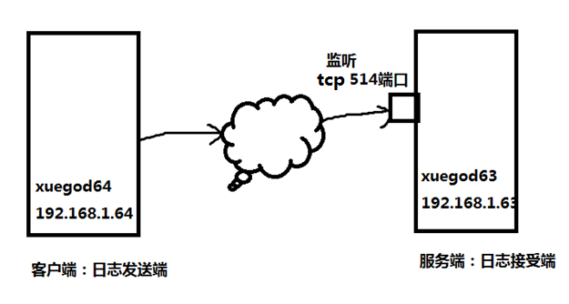

# 第十六章：Linux计划任务与日志管理

---

## 目录

* [16.1 计划任务-at-cron-计划任务使用方法](#atCron)
* [16.2 日志的种类和记录的方式-自定义 ssh 服务日志类型和存储位置](#ssh)
* [16.3 实战-日志切割-搭建远程日志收集服务器](#logs)
* [16.4 实战-配置公司内网服务器每天定时自动开关机](#actual)

## 内容

### <a href="#atCron" id="atCron">16.1 计划任务-at-cron-计划任务使用方法</a>

计划任务的安排方式分两种：

1. 一种是定时性的，也就是例行。每隔一定的周期就要重复来做这件事情
2. 一种是突发性的，就是这次做完了这个事情，就没有下次了。

* `at`：它是一个可以处理仅执行一次就结束的命令
* `crontab`：它是会把你指定的工作或任务，比如：脚本等，按照你设定的周期一直循环执行下去

```
[root@spring ~]# yum install -y at # 安装at

[root@spring ~]# systemctl list-unit-files | grep atd # 查看atd
atd.service                                   enabled

[root@spring ~]# systemctl start atd # 开启atd服务
[root@spring ~]# systemctl status atd # 查看atd服务状态
● atd.service - Job spooling tools
   Loaded: loaded (/usr/lib/systemd/system/atd.service; enabled; vendor preset: enabled)
   Active: active (running) since Sat 2020-02-08 15:48:08 CST; 10s ago
 Main PID: 1227 (atd)
   CGroup: /system.slice/atd.service
           └─1227 /usr/sbin/atd -f

Feb 08 15:48:08 spring systemd[1]: Started Job spooling tools.
[root@spring ~]# systemctl is-enabled atd # 查看是否开始开机启动服务，如果弹出enabled，说明开机启动此服务
enabled

# 在CentOS6查看开机启动服务：
[root@spring ~]# chkconfig --list | grep atd # 此命令在CentOS7上不能执行
```

```
[root@spring tmp]# at 12:50
at> mkdir /tmp/spring
at> touch /tmp/spring/a.txt
at> <EOT>
at> <EOT>
job 2 at Sun Feb  9 12:50:00 2020
Can't open /var/run/atd.pid to signal atd. No atd running?

[root@spring tmp]# systemctl restart atd # 解决方法

[root@spring tmp]# at 12:52 # 注意：如果是上午时间，后面加上 am，比如 9:20am
at> mkdir /tmp/spring # 输入你要执行的命令
at> touch /tmp/spring/a.txt
at> echo "Hello world!" >> /tmp/spring/a.txt
at> <EOT> # 结束：ctrl+d
job 3 at Sun Feb  9 12:52:00 2020
```

> 问：如果正在执行命令，ctrl+D ，按成 ctrl+S 会怎么样？ 尤其是使用 vim 保存，按成 ctrl+s   
> 答： ctrl+s 在 linux 下是锁定屏幕显示的意思，这时整个界面被锁定，不能进行正常输入。使用 ctrl+q 来解除锁定

```
[root@spring tmp]# at -l # 查看计划任务
1	Sun Feb  9 12:47:00 2020 a root
2	Sun Feb  9 12:50:00 2020 a root
3	Sun Feb  9 12:52:00 2020 a root
```

| 任务编号 | 执行的时间 | 队列 | 执行者 |
|:-------|:---------|:----|:------|
| 1 | Sun Feb  9 12:47:00 2020 | a | root |

```
[root@spring tmp]# atq # 查看计划任务
1	Sun Feb  9 12:47:00 2020 a root
2	Sun Feb  9 12:50:00 2020 a root
3	Sun Feb  9 12:52:00 2020 a root
```

```
[root@spring ~]# at -c 1 # 打印任务的内容到标准输出, 查看 5 号计划任务具体内容
#!/bin/sh
# atrun uid=0 gid=0
# mail root 0
umask 22
XDG_SESSION_ID=2; export XDG_SESSION_ID
HOSTNAME=spring; export HOSTNAME
SHELL=/bin/bash; export SHELL
HISTSIZE=1000; export HISTSIZE
SSH_CLIENT=192.168.2.198\ 56813\ 22; export SSH_CLIENT
SSH_TTY=/dev/pts/0; export SSH_TTY
USER=root; export USER
LS_COLORS=rs=0:di=38\;5\;27:ln=38\;5\;51:mh=44\;38\;5\;15:pi=40\;38\;5\;11:so=38\;5\;13:do=38\;5\;5:bd=48\;5\;232\;38\;5\;11:cd=48\;5\;232\;38\;5\;3:or=48\;5\;232\;38\;5\;9:mi=05\;48\;5\;232\;38\;5\;15:su=48\;5\;196\;38\;5\;15:sg=48\;5\;11\;38\;5\;16:ca=48\;5\;196\;38\;5\;226:tw=48\;5\;10\;38\;5\;16:ow=48\;5\;10\;38\;5\;21:st=48\;5\;21\;38\;5\;15:ex=38\;5\;34:\*.tar=38\;5\;9:\*.tgz=38\;5\;9:\*.arc=38\;5\;9:\*.arj=38\;5\;9:\*.taz=38\;5\;9:\*.lha=38\;5\;9:\*.lz4=38\;5\;9:\*.lzh=38\;5\;9:\*.lzma=38\;5\;9:\*.tlz=38\;5\;9:\*.txz=38\;5\;9:\*.tzo=38\;5\;9:\*.t7z=38\;5\;9:\*.zip=38\;5\;9:\*.z=38\;5\;9:\*.Z=38\;5\;9:\*.dz=38\;5\;9:\*.gz=38\;5\;9:\*.lrz=38\;5\;9:\*.lz=38\;5\;9:\*.lzo=38\;5\;9:\*.xz=38\;5\;9:\*.bz2=38\;5\;9:\*.bz=38\;5\;9:\*.tbz=38\;5\;9:\*.tbz2=38\;5\;9:\*.tz=38\;5\;9:\*.deb=38\;5\;9:\*.rpm=38\;5\;9:\*.jar=38\;5\;9:\*.war=38\;5\;9:\*.ear=38\;5\;9:\*.sar=38\;5\;9:\*.rar=38\;5\;9:\*.alz=38\;5\;9:\*.ace=38\;5\;9:\*.zoo=38\;5\;9:\*.cpio=38\;5\;9:\*.7z=38\;5\;9:\*.rz=38\;5\;9:\*.cab=38\;5\;9:\*.jpg=38\;5\;13:\*.jpeg=38\;5\;13:\*.gif=38\;5\;13:\*.bmp=38\;5\;13:\*.pbm=38\;5\;13:\*.pgm=38\;5\;13:\*.ppm=38\;5\;13:\*.tga=38\;5\;13:\*.xbm=38\;5\;13:\*.xpm=38\;5\;13:\*.tif=38\;5\;13:\*.tiff=38\;5\;13:\*.png=38\;5\;13:\*.svg=38\;5\;13:\*.svgz=38\;5\;13:\*.mng=38\;5\;13:\*.pcx=38\;5\;13:\*.mov=38\;5\;13:\*.mpg=38\;5\;13:\*.mpeg=38\;5\;13:\*.m2v=38\;5\;13:\*.mkv=38\;5\;13:\*.webm=38\;5\;13:\*.ogm=38\;5\;13:\*.mp4=38\;5\;13:\*.m4v=38\;5\;13:\*.mp4v=38\;5\;13:\*.vob=38\;5\;13:\*.qt=38\;5\;13:\*.nuv=38\;5\;13:\*.wmv=38\;5\;13:\*.asf=38\;5\;13:\*.rm=38\;5\;13:\*.rmvb=38\;5\;13:\*.flc=38\;5\;13:\*.avi=38\;5\;13:\*.fli=38\;5\;13:\*.flv=38\;5\;13:\*.gl=38\;5\;13:\*.dl=38\;5\;13:\*.xcf=38\;5\;13:\*.xwd=38\;5\;13:\*.yuv=38\;5\;13:\*.cgm=38\;5\;13:\*.emf=38\;5\;13:\*.axv=38\;5\;13:\*.anx=38\;5\;13:\*.ogv=38\;5\;13:\*.ogx=38\;5\;13:\*.aac=38\;5\;45:\*.au=38\;5\;45:\*.flac=38\;5\;45:\*.mid=38\;5\;45:\*.midi=38\;5\;45:\*.mka=38\;5\;45:\*.mp3=38\;5\;45:\*.mpc=38\;5\;45:\*.ogg=38\;5\;45:\*.ra=38\;5\;45:\*.wav=38\;5\;45:\*.axa=38\;5\;45:\*.oga=38\;5\;45:\*.spx=38\;5\;45:\*.xspf=38\;5\;45:; export LS_COLORS
MAIL=/var/spool/mail/root; export MAIL
PATH=/usr/local/sbin:/usr/local/bin:/usr/sbin:/usr/bin:/root/bin; export PATH
PWD=/root; export PWD
LANG=en_US.UTF-8; export LANG
HISTCONTROL=ignoredups; export HISTCONTROL
SHLVL=1; export SHLVL
HOME=/root; export HOME
LOGNAME=root; export LOGNAME
SSH_CONNECTION=192.168.2.198\ 56813\ 192.168.2.220\ 22; export SSH_CONNECTION
LESSOPEN=\|\|/usr/bin/lesspipe.sh\ %s; export LESSOPEN
XDG_RUNTIME_DIR=/run/user/0; export XDG_RUNTIME_DIR
cd /root || {
	 echo 'Execution directory inaccessible' >&2
	 exit 1
}
${SHELL:-/bin/sh} << 'marcinDELIMITER66b5fce1'
mkdir /tmp/spring
touch /tmp/spring/test.txt
eot

marcinDELIMITER66b5fce1
```

```
[root@spring ~]# ls /var/spool/at/
a000010192203f  a0000201922042  a0000301922044  spool
[root@spring ~]# tail -5 /var/spool/at/a000010192203f
mkdir /tmp/spring
touch /tmp/spring/test.txt
eot

marcinDELIMITER66b5fce1
```

**`at` 计划任务的特殊写法**

```
[root@spring ~]# at 1:05 2020-02-09 # 在某天
[root@spring ~]# at now +10min # 在 10 分钟后执行
[root@spring ~]# at 17:00 tommorrow # 明天下午 5 点执行
[root@spring ~]# at 6:00 pm +3 days # 在 3 天以后的下午 6 点执行
[root@spring ~]# at 23:00 < a.txt
```

**删除 `at` 计划任务**

语法： `atrm` 任务编号

```
[root@spring ~]# at -l
1	Sun Feb  9 12:47:00 2020 a root
2	Sun Feb  9 12:50:00 2020 a root
3	Sun Feb  9 12:52:00 2020 a root
[root@spring ~]# atrm 1
[root@spring ~]# atrm 2
[root@spring ~]# atrm 3
[root@spring ~]# at -l
```

### 1.3 crontab 定时任务的使用

* `crond` 命令定期检查是否有要执行的工作，如果有要执行的工作便会自动执行该工作
* `cron` 是一个 linux 下的定时执行工具，可以在无需人工干预的情况下运行作业。

linux 任务调度的工作主要分为以下两类：

1. 系统执行的工作：系统周期性所要执行的工作，如更新 whatis 数据库 updatedb 数据库，日志定期切割，收集系统状态信息，/tmp 定期清理
2. 用户任务调度 

```
# 启动 crond 服务
[root@spring ~]# systemctl start crond
[root@spring ~]# systemctl enable crond
```

#### 1.4 cron 命令参数介绍:

`crontab`的参数：

* crontab -u spring      # 指定spring用户的cron服务
* crontab -l                 # 累出当前用户下的cron服务的详细内容
* crontab -u spring -l   # 列出指定用户spring下的cron 服务的详细内容
* crontab -r                # 删除cron 服务
* crontab -e               # 编辑cron服务

```
[root@spring ~]# crontab -u root -l     # root 查看自己的 cron 计划任务
no crontab for root

[root@spring ~]# crontab -u spring -r #  root 想删除 san 的 cron 计划任务
no crontab for spring
```

<center>cron -e 编辑时的语法</center>


星期日用 0 或者 7 表示  
一行对应一个任务，特殊符号的含义：

| 符号 | 描述 | 值 |
|:----|:----|:---|
| * | 代表取值范围内的数字 | （任意/每）|
| / | 指定时间的间隔频率 | */10 0-23/2 |
| - | 代表从某个数字到某个数字 | 8-17 |
| , | 分开几个离散的数值 | 6,10-13,20 |

#### 1.5 创建计划任务

```
[root@spring ~]# crontab -e
no crontab for root - using an empty one
crontab: installing new crontab
[root@spring ~]# crontab -l
1 2 * * * tar zcvf /opt/grub2.tar.gz /boot/grub2
```

```
[root@spring ~]# crontab -u bin -e
no crontab for bin - using an empty one
crontab: installing new crontab
You have new mail in /var/spool/mail/root
[root@spring ~]# crontab -u bin -l
1 * * * * echo 'hello world!' >> /tmp/bin.txt
```

```
[root@spring ~]# ll /var/spool/cron/
total 8
-rw------- 1 root root 46 Feb  9 02:02 bin
-rw------- 1 root root 50 Feb  9 01:59 root
```

#### 1.6 系统级别的计划任务

```
[root@spring ~]# ll /etc/crontab
-rw-r--r--. 1 root root 451 Jun 10  2014 /etc/crontab

[root@spring ~]# vim /etc/crontab

SHELL=/bin/bash # 指定操作系统使用哪个 shell
PATH=/sbin:/bin:/usr/sbin:/usr/bin # 系统执行命令的搜索路径
MAILTO=root # 将执行任务的信息通过邮件发送给 xx 用户

# For details see man 4 crontabs

# Example of job definition:
# .---------------- minute (0 - 59)
# |  .------------- hour (0 - 23)
# |  |  .---------- day of month (1 - 31)
# |  |  |  .------- month (1 - 12) OR jan,feb,mar,apr ...
# |  |  |  |  .---- day of week (0 - 6) (Sunday=0 or 7) OR sun,mon,tue,wed,thu,fri,sat
# |  |  |  |  |
# *  *  *  *  * user-name  command to be executed

* * * * 5 root /bin/back.sh
```

也可以直接在/etc/crontab 中添加计划任务  
使用 crontab 命令的注意事项：  
环境变量的问题  
清理你的邮件日志 ，比如使用重定向 >/dev/null 2>&1

```
[root@spring ~]# ls /etc/cron
cron.d/       cron.daily/   cron.deny     cron.hourly/  cron.monthly/ crontab       cron.weekly/
```

**注：**
 
* cron.d/           # 是系统自动定期需要做的任务，但是又不是按小时，按天，按星期，按月来执行的，那么就放在这个目录下面。
* cron.deny       # 控制用户是否能做计划任务的文件;
* cron.monthly/ # 每月执行的脚本;
* cron.weekly/  # 每周执行的脚本;
* cron.daily/     # 每天执行的脚本;
* cron.hourly/   # 每小时执行的脚本;
* crontab         # 主配置文件 也可添加任务;

```
[root@spring ~]# find /etc/cron* -type f
/etc/cron.d/0hourly
/etc/cron.daily/logrotate
/etc/cron.daily/man-db.cron
/etc/cron.deny
/etc/cron.hourly/0anacron
/etc/crontab
```

> 互动：crontab 不支持每秒。 每 2 秒执行一次脚本，怎么写？  
> 在脚本的死循环中，添加命令 sleep 2 ，执行 30 次自动退出，然后添加计划任务：  
> * * * * * /back.sh

#### 1.7 实战-常见的计划任务写法和案例

```
# 常见写法：
# 每天晚上 21:00 重启 apache
0 21 * * * /etc/init.d/httpd restart
# 每月 1、10、22 日的 4 : 45 重启 apache。
45 4 1,10,22 * * /etc/init.d/httpd restart
# 每月 1 到 10 日的 4 : 45 重启 apache。
45 4 1-10 * * /etc/init.d/httpd restart
# 每隔两天的上午 8 点到 11 点的第 3 和第 15 分钟执行 apach
3,15 8-11 */2 * * /etc/init.d/httpd restart
# 晚上 11 点到早上 7 点之间，每隔一小时重启 apach
0 23-7/1 * * * /etc/init.d/apach restart
# 周一到周五每天晚上 21:15 寄一封信给 root@panda:
15 21 * * 1-5 mail -s "hi" root@panda < /etc/fstab
```

案例要求：
每天 22：00 备份/etc/目录到/tmp/backup 下面
将备份命令写入一个脚本中
每天备份文件名要求格式： 2017-08-19_etc.tar.gz
在执行计划任务时，不要输出任务信息

存放备份内容的目录要求只保留三天的数据

====================================================

mkdir /tmp/backup
tar zcf etc.tar.gz /etc
find /tmp/backup -name “*.tar.gz” -mtime +3 -exec rm -rf {}\;

====================================================

```
[root@spring ~]# vim backup.sh
[root@spring ~]# cat backup.sh
#!/bin/bash
find /tmp/backup -name "*.tar.gz" -mtime +3 -exec rm -f {}\;
# find /tmp/backup -name "*.tar.gz" -mtime +3 -delete
# find /tmp/backup -name "*.tar.gz" -mtime +3 | xargs rm -f
tar zcf /tmp/backup/`date + %F`_etc.tar.gz /etc

[root@spring ~]# crontab -e
crontab: installing new crontab
[root@spring ~]# crontab -l
1 2 * * * tar zcvf /opt/grub2.tar.gz /boot/grub2
0 22 * * * /root/backup.sh & > /dev/null
```

### <a href="#ssh" id="ssh">16.2 日志的种类和记录的方式-自定义 ssh 服务日志类型和存储位置</a>

在CentOS7中，系统日志消息由两个服务负责处理：`systemd-journald`和`rsyslog`

#### 2.1 常见日志文件的作用

系统日志文件概述：`/var/log`目录保管由`rsyslog`维护的，里面存放的一些特定于系统和服务的日志文件

| 日志文件               | 用途 |
|:---------------|:----|
| `/var/log/message` | 大多数系统日志消息记录在此处。有也例外的：如与身份验证，电子邮件处理相关的定期作业任务等 |
| `/var/log/secure`    | 安全和身份验证相关的消息和登录失败的日志文件。 ssh 远程连接产生的日志 |
| `/var/log/secure`    | 安全和身份验证相关的消息和错误的日志文件 |
| `/var/log/maillog`   | 与邮件服务器相关的消息日志文件 |
| `/var/log/cron`      | 与定期执行任务相关的日志文件 |
| `/var/log/boot.log` | 与系统启动相关的消息记录 |
| `/var/log/dmesg`   | 与系统启动相关的消息记录 |

**例 1**：查看哪个 IP 地址经常暴力破解系统用户密码

```
# ssh登录服务器，输错密码
maozhenongdeMBP:~ root# ssh spring@192.168.2.220
spring@192.168.2.220's password:
Permission denied, please try again.
spring@192.168.2.220's password:
Permission denied, please try again.
spring@192.168.2.220's password:
spring@192.168.2.220: Permission denied (publickey,gssapi-keyex,gssapi-with-mic,password).

# 查看哪个 IP 地址经常暴力破解系统用户密码
[root@spring ~]# grep Failed /var/log/secure
Feb  9 02:48:53 spring sshd[1518]: Failed password for spring from 192.168.2.198 port 58174 ssh2
Feb  9 02:48:57 spring sshd[1518]: Failed password for spring from 192.168.2.198 port 58174 ssh2
Feb  9 02:49:00 spring sshd[1518]: Failed password for spring from 192.168.2.198 port 58174 ssh2

[root@spring ~]# grep Failed /var/log/secure | awk '{print $11}' | uniq -c
      3 192.168.2.198 
```

> 注：`awk '{print $11}'` #以空格做为分隔符，打印第 11 列的数据  
> `uniq` 命令用于报告或忽略文件中的重复行  
> `-c` 或 `--count`：在每列旁边显示该行重复出现的次数  

**例 2**：`/var/log/wtmp`文件 也是一个二进制文件，记录每个用户的登录次数和持续时间等信息。  
可以用 last 命令输出 wtmp 中内容： last 显示到目前为止，成功登录系统的记录

```
[root@spring ~]# last
root     pts/0        192.168.2.198    Sun Feb  9 00:26   still logged in
root     tty1                          Sat Feb  8 16:23   still logged in
reboot   system boot  3.10.0-1062.9.1. Sun Feb  9 00:22 - 02:56  (02:33)
root     pts/0        192.168.2.198    Wed Feb  5 16:36 - down   (03:53)
root     tty1                          Wed Feb  5 16:35 - 20:29  (03:54)
reboot   system boot  3.10.0-1062.9.1. Wed Feb  5 16:35 - 20:29  (03:54)
root     tty1                          Wed Feb  5 12:53 - 13:54  (01:00)
reboot   system boot  3.10.0-1062.9.1. Wed Feb  5 12:52 - 20:29  (07:37)
root     tty1                          Mon Feb  3 20:52 - 21:38  (00:46)
reboot   system boot  3.10.0-1062.9.1. Mon Feb  3 20:52 - 21:38  (00:46)
root     tty1                          Mon Feb  3 20:42 - 20:52  (00:09)
reboot   system boot  3.10.0-1062.9.1. Mon Feb  3 20:42 - 20:52  (00:10)
root     tty1                          Mon Feb  3 20:40 - 20:41  (00:01)
reboot   system boot  3.10.0-1062.9.1. Mon Feb  3 20:40 - 20:52  (00:12)
root     tty1                          Fri Jan 31 18:54 - 19:25  (00:31)
reboot   system boot  3.10.0-1062.9.1. Fri Jan 31 18:53 - 20:52 (3+01:58)
root     tty1                          Fri Jan 31 18:50 - 18:53  (00:02)
reboot   system boot  3.10.0-1062.9.1. Fri Jan 31 18:46 - 20:52 (3+02:05)
root     tty1                          Fri Jan 31 18:09 - 18:40  (00:31)
reboot   system boot  3.10.0-1062.el7. Fri Jan 31 18:09 - 18:40  (00:31)

wtmp begins Fri Jan 31 18:09:04 2020
```

```
[root@spring ~]# last -f /var/log/wtmp
root     pts/0        192.168.2.198    Sun Feb  9 00:26   still logged in
root     tty1                          Sat Feb  8 16:23   still logged in
reboot   system boot  3.10.0-1062.9.1. Sun Feb  9 00:22 - 02:57  (02:34)
root     pts/0        192.168.2.198    Wed Feb  5 16:36 - down   (03:53)
root     tty1                          Wed Feb  5 16:35 - 20:29  (03:54)
reboot   system boot  3.10.0-1062.9.1. Wed Feb  5 16:35 - 20:29  (03:54)
root     tty1                          Wed Feb  5 12:53 - 13:54  (01:00)
reboot   system boot  3.10.0-1062.9.1. Wed Feb  5 12:52 - 20:29  (07:37)
root     tty1                          Mon Feb  3 20:52 - 21:38  (00:46)
reboot   system boot  3.10.0-1062.9.1. Mon Feb  3 20:52 - 21:38  (00:46)
root     tty1                          Mon Feb  3 20:42 - 20:52  (00:09)
reboot   system boot  3.10.0-1062.9.1. Mon Feb  3 20:42 - 20:52  (00:10)
root     tty1                          Mon Feb  3 20:40 - 20:41  (00:01)
reboot   system boot  3.10.0-1062.9.1. Mon Feb  3 20:40 - 20:52  (00:12)
root     tty1                          Fri Jan 31 18:54 - 19:25  (00:31)
reboot   system boot  3.10.0-1062.9.1. Fri Jan 31 18:53 - 20:52 (3+01:58)
root     tty1                          Fri Jan 31 18:50 - 18:53  (00:02)
reboot   system boot  3.10.0-1062.9.1. Fri Jan 31 18:46 - 20:52 (3+02:05)
root     tty1                          Fri Jan 31 18:09 - 18:40  (00:31)
reboot   system boot  3.10.0-1062.el7. Fri Jan 31 18:09 - 18:40  (00:31)

wtmp begins Fri Jan 31 18:09:04 2020
```

**例 3**：使用 `/var/log/btmp` 文件查看暴力破解系统的用户

`/var/log/btmp` 文件是记录错误登录系统的日志。如果发现`/var/log/btmp` 日志文件比较大，大于 1M，就算大了，就说明很多人在暴力破解 `ssh` 服务，此日志需要使用 `lastb` 程序查看

```
[root@spring ~]# lastb
spring   ssh:notty    192.168.2.198    Sun Feb  9 02:49 - 02:49  (00:00)
spring   ssh:notty    192.168.2.198    Sun Feb  9 02:48 - 02:48  (00:00)
spring   ssh:notty    192.168.2.198    Sun Feb  9 02:48 - 02:48  (00:00)

btmp begins Sun Feb  9 02:48:53 2020
```
```
# 发现后，使用防火墙，拒绝掉：命令如下：
iptables -A INPUT -i enp0s3 -s 192.168.2.198（暴力破解地址） -j DROP
# 将新规则追加于尾部入站请求 ens33 网卡，地址是 192.168.2.198 的 IP，被丢弃。
```

查看恶意 ip 试图登录次数：

```
[root@spring ~]# lastb | awk '{print $3}' | sort | uniq -c | sort -n
      1
      1 Sun
      3 192.168.2.198
```

清空日志：

```
[root@spring ~]# > /var/log/btmp # 方法一
[root@spring ~]# rm -rf /var/log/btmp && touch /var/log/btmp # 方法二
[root@spring ~]# systemctl restart rsyslog
```

**二者区别**：使用方法二，因为创建了新的文件，而正在运行的服务，还用着原来文件的 inode 号和文件描述码，所需要重启一下 rsyslog 服务。建议使用方法一 `> /var/log/btmp`

#### 2.2 日志的记录方式

日志的分类:

* `daemon` 后台进程相关
* `kern` 内核产生的信息
* `lpr` 打印系统产生的
* `authpriv` 安全认证
* `cron` 定时相关
* `mail` 邮件相关
* `syslog` 日志服务本身的
* `news` 新闻系统
* `local0~7` 自定义的日志设备
* `local0-local7 8` 个系统保留的类， 供其它的程序使用或者是用户自定义

日志的级别：轻->重

| 编码 | 优先级 | 严重性|
|:----|:-----|:------|
| 7 | debug | 信息对开发人员调试应用程序有用，在操作过程中无用 |
| 6 | info | 正常的操作信息，可以收集报告，测量吞吐量等 |
| 5 | notice | 注意，正常但重要的事件， |
| 4 | warning | 警告，提示如果不采取行动。将会发生错误。比如文件系统使用 90% |
| 3 | err | 错误，阻止某个模块或程序的功能不能正常使用 |
| 2 | crit | 关键的错误，已经影响了整个系统或软件不能正常工作的信息 |
| 1 | alert | 警报,需要立刻修改的信息 |
| 0 | emerg | 紧急，内核崩溃等严重信息 |

#### 2.3 rsyslog 日志服务

rhel5 ->服务名称 syslog ->配置文件 /etc/syslog.conf

rhel6-7 ->服务名称 rsyslog ->配置文件 /etc/rsyslog.conf

我们来查看一下日志的配置文件信息：

编辑配置文件 vim /etc/rsyslog.conf

```[root@spring ~]# vim /etc/rsyslog.conf

...

# Don't log private authentication messages!
*.info;mail.none;authpriv.none;cron.none                /var/log/messages

# The authpriv file has restricted access.
authpriv.*                                              /var/log/secure

# Log all the mail messages in one place.
mail.*                                                  -/var/log/maillog


# Log cron stuff
cron.*                                                  /var/log/cron

# Everybody gets emergency messages
*.emerg                                                 :omusrmsg:*

# Save news errors of level crit and higher in a special file.
uucp,news.crit                                          /var/log/spooler

# Save boot messages also to boot.log
local7.*                                                /var/log/boot.log
```

> 注：“- ”号： 邮件的信息比较多,现将数据存储到内存,达到一定大小,全部写到硬盘.有利于减少 I/O 进程的开销数据存储在内存,如果关机不当数据消失

#### 2.4 日志输入的规则

* . info 大于等于 info 级别的信息全部记录到某个文件
* .=级别 仅记录等于某个级别的日志
	+ 例:.=info 只记录 info 级别的日志
* .! 级别 除了某个级别意外,记录所有的级别信息
	+ 例.!err 除了 err 外记录所有
* .none 指的是排除某个类别 
	+ 例： mail.none 所有 mail 类别的日志都不记录

#### 2.5 实战-自定义 ssh 服务的日志类型和存储位置

```
[root@spring ~]# vim /etc/rsyslog.conf

 72 # Save boot messages also to boot.log
 73 local7.*                                                /var/log/boot.log
 74 local0.*                                                /var/log/sshd.log # 把 local0 类别的日志，保存到 /var/log/sshd.log 路径
```
 
```
[root@spring ~]# vim /etc/ssh/sshd_config
# 改：32 SyslogFacility AUTHPRIV
# 为：32 SyslogFacility local0
[root@spring ~]# systemctl restart rsyslog # 先重启 rsyslog 服务(生效配置)
[root@spring ~]# systemctl restart sshd    # 再重启 sshd 服务.生成日志
```

验证是否生成日志并查看其中的内容

```
[root@spring ~]# cat /var/log//sshd.log # 说明修改成功
Feb  9 03:24:22 spring sshd[1883]: Server listening on 0.0.0.0 port 22.
Feb  9 03:24:22 spring sshd[1883]: Server listening on :: port 22.
# 上面对就的信息：时间 主机 服务 进程 ID 相关的信息
```

如何防止日志删除？

```
[root@spring ~]# chattr +a /var/log/sshd.log
[root@spring ~]# lsattr /var/log/sshd.log
-----a---------- /var/log/sshd.log
[root@spring ~]# systemctl restart sshd
[root@spring ~]# cat /var/log/sshd.log # 重启服务，查看日志有所增加
Feb  9 03:24:22 spring sshd[1883]: Server listening on 0.0.0.0 port 22.
Feb  9 03:24:22 spring sshd[1883]: Server listening on :: port 22.
Feb  9 03:27:53 spring sshd[1883]: Received signal 15; terminating.
Feb  9 03:27:53 spring sshd[1894]: Server listening on 0.0.0.0 port 22.
Feb  9 03:27:53 spring sshd[1894]: Server listening on :: port 22.
```

> 注：这个功能看着很强大，其实不实用，因这样会让系统日志切割时报错，日志有时会太。最主的是，黑客可以取消这个属性。

```
[root@spring ~]# chattr -a /var/log/sshd.log # 取消，这里一定要取消，不然后面做日志切割报错
[root@spring ~]# lsattr /var/log/sshd.log
---------------- /var/log/sshd.log
```

### <a href="#logs" id="logs">16.3 实战-日志切割-搭建远程日志收集服务器</a>

#### 3.1 日志的切割

在 linux 下的日志会定期进行滚动增加，我们可以在线对正在进行回滚的日志进行指定大小的切割（动态），如果这个日志是静态的。比如没有应用向里面写内容。那么我们也可以用 split 工具进行切割；其中 Logrotate 支持按时间和大小来自动切分,以防止日志文件太大。

`logrotate` 配置文件主要有：`/etc/logrotate.conf` 以及 `/etc/logrotate.d/` 这个子目录下的明细配置文件。

`logrotate` 的执行由 `crond` 服务调用的

```
[root@spring ~]# vim /etc/cron.daily/logrotate # #查看 logrotate 脚本内容
``` 

`logrotate` 程序每天由 `cron` 在指定的时间（`/etc/crontab`）启动

日志是很大的,如果让日志无限制的记录下去 是一件很可怕的事情，日积月累就有几百兆占用磁盘的空间，如果你要找出某一条可用信息：-> 海底捞针

日志切割:当日志达到某个特定的大小,我们将日志分类,之前的日志保留一个备份,再产生的日志创建一个同名的文件保存新的日志.

```
[root@spring ~]# vim /etc/logrotate.conf

# see "man logrotate" for details
# rotate log files weekly
weekly

# keep 4 weeks worth of backlogs
rotate 4

# create new (empty) log files after rotating old ones
create

# use date as a suffix of the rotated file
dateext

# uncomment this if you want your log files compressed
#compress

# RPM packages drop log rotation information into this directory
include /etc/logrotate.d

# no packages own wtmp and btmp -- we'll rotate them here
# 单独配置信息
/var/log/wtmp {
    monthly
    create 0664 root utmp
        minsize 1M             # 文件超过 1M进行回滚，所以大家要知道它不一定每个月都会进行分割，要看这个文件大小来定
    rotate 1
}

/var/log/btmp {               # 指定的日志文件的名字和路径
    missingok                   # 如果文件丢失，将不报错
    monthly                      # 每月轮换一次
    create 0600 root utmp # 设置 btmp 这个日志文件的权限，属主，属组
    rotate 1                      # 日志切分后历史文件最多保存 1 份，不含当前使用的日志
}

# system-specific logs may be also be configured here.
```

说明：(全局参数)

* `weekly` ： 每周执行回滚，或者说每周执行一次日志回滚
* `rotate`： 表示日志切分后历史文件最多保存离现在最近的多少份 [rəʊˈteɪt] 旋转
* `create` ： 指定新创建的文件的权限与所属主与群组
* `dateext` ： 使用日期为后缀的回滚文件 #可以去`/var/log` 目录下看看

其它参数说明：

* `monthly`: 日志文件将按月轮循。其它可用值为‘daily’，‘weekly’或者‘yearly’。
* `rotate 5`: 一次将存储 5 个归档日志。对于第六个归档，时间最久的归档将被删除。
* `compress`: 在轮循任务完成后，已轮循的归档将使用 gzip 进行压缩。
* `delaycompress`: 总是与 compress 选项一起用，delaycompress 选项指示 logrotate 不要将最近的归档压缩，压缩将在下一次轮循周期进行。这在你或任何软件仍然需要读取最新归档时很有用。
* `missingok`: 在日志轮循期间，任何错误将被忽略，例如“文件无法找到”之类的错误。
* `notifempty`: 如果日志文件为空，轮循不会进行。
* `create 644 root root`: 以指定的权限创建全新的日志文件，同时 logrotate 也会重命名原始日志文件。
* `postrotate/endscript`: 在所有其它指令完成后，postrotate 和 endscript 里面指定的命令将被执行。在这种情况下，rsyslogd 进程将立即再次读取其配置并继续运行。
* `/var/lib/logrotate/status` 中默认记录 logrotate 上次轮换日志文件的时间。

```
[root@spring ~]# vim /etc/logrotate.d/sshd

/var/log/sshd.log {
        missingok
        weekly
        create 0600 root root
        minsize 1M
        rotate 3
}

[root@spring ~]# systemctl restart rsyslog
[root@spring ~]#  logrotate -d /etc/logrotate.d/sshd # 预演，不实际轮循
reading config file /etc/logrotate.d/sshd
Allocating hash table for state file, size 15360 B

Handling 1 logs

rotating pattern: /var/log/sshd.log  weekly (3 rotations)
empty log files are rotated, only log files >= 1048576 bytes are rotated, old logs are removed
considering log /var/log/sshd.log
  log does not need rotating (log has been already rotated)

[root@spring ~]# logrotate -vf /etc/logrotate.d/sshd # 强制轮循，也就是说即使轮循条件没有满足，也可以通过加-f 强制让 logrotate 轮循日志文件
reading config file /etc/logrotate.d/sshd
Allocating hash table for state file, size 15360 B

Handling 1 logs

rotating pattern: /var/log/sshd.log  forced from command line (3 rotations)
empty log files are rotated, only log files >= 1048576 bytes are rotated, old logs are removed
considering log /var/log/sshd.log
  log needs rotating
rotating log /var/log/sshd.log, log->rotateCount is 3
dateext suffix '-20200209'
glob pattern '-[0-9][0-9][0-9][0-9][0-9][0-9][0-9][0-9]'
renaming /var/log/sshd.log.3 to /var/log/sshd.log.4 (rotatecount 3, logstart 1, i 3),
old log /var/log/sshd.log.3 does not exist
renaming /var/log/sshd.log.2 to /var/log/sshd.log.3 (rotatecount 3, logstart 1, i 2),
old log /var/log/sshd.log.2 does not exist
renaming /var/log/sshd.log.1 to /var/log/sshd.log.2 (rotatecount 3, logstart 1, i 1),
old log /var/log/sshd.log.1 does not exist
renaming /var/log/sshd.log.0 to /var/log/sshd.log.1 (rotatecount 3, logstart 1, i 0),
old log /var/log/sshd.log.0 does not exist
log /var/log/sshd.log.4 doesn't exist -- won't try to dispose of it
renaming /var/log/sshd.log to /var/log/sshd.log.1
creating new /var/log/sshd.log mode = 0600 uid = 0 gid = 0  
```

```
[root@spring ~]# logrotate -vf /etc/logrotate.d/sshd
```

* `-v` 显示指令执行过程
* `-f` 强制执行

```
[root@spring ~]# ls /var/log/sshd*
/var/log/sshd.log  /var/log/sshd.log.1

[root@spring ~]# ll -h /var/log/sshd*
-rw------- 1 root root   0 Feb  9 03:49 /var/log/sshd.log # 再次查看日志文件大小，已经为 0
-rw------- 1 root root 346 Feb  9 03:27 /var/log/sshd.log.1
```

使用 logrotate 进行 nginx 日志分割

```
[root@spring ~]# vim /etc/logrotate.d/nginx

/var/log/nginx/*.log { # 指定日志文件位置，可用正则匹配
        daily                 # 调用频率，有：daily，weekly，monthly 可选
        missingok
        rotate 52          # 一次将存储 52 个归档日志。对于第53个归档，时间最久的归档将被删除。
        compress
        delaycompress
        notifempty
        create 640 nginx adm
        sharedscripts   # 所有的日志文件都轮转完毕后统一执行一次脚本
        postrotate       # 执行命令的开始标志
                if [ -f /var/run/nginx.pid ]; then             # 判断 nginx 是否启动
                        kill -USR1 `cat /var/run/nginx.pid` # 让 nginx 重新加载配置文件，生成新的日志文件，如果 nginx 没启动不做操作
                fi
        endscript        # 执行命令的结束标志
}
```

#### 3.4 配置远程日志服务器-实现日志集中的管理



server 端配置

```
[root@spring ~]# vim /etc/rsyslog.conf
# 将
 19 #$ModLoad imtcp
 20 #$InputTCPServerRun 514
 # 改为
 19 $ModLoad imtcp
 20 $InputTCPServerRun 514
```

> 注：使用 UDP 协议->速度快>不保证数据的完整，使用 TCP 协议>可靠.完整

```
[root@spring ~]# systemctl restart rsyslog # 重新启动 rsyslog

[root@spring ~]# netstat -anlpt | grep 514 # 查看服务监听的状态
tcp        0      0 0.0.0.0:514             0.0.0.0:*               LISTEN      1957/rsyslogd
tcp6       0      0 :::514                  :::*                    LISTEN      1957/rsyslogd
```

在服务端关闭 selinux 和防火墙

```
[root@spring ~]# getenforce
Enforcing
[root@spring ~]# setenforce 0 # 关闭 selinux 功能
setenforce: SELinux is disabled
[root@spring ~]# systemctl stop firewalld
[root@spring ~]# systemctl status firewalld
● firewalld.service - firewalld - dynamic firewall daemon
   Loaded: loaded (/usr/lib/systemd/system/firewalld.service; disabled; vendor preset: enabled)
   Active: inactive (dead)
     Docs: man:firewalld(1)
[root@spring ~]# iptables -F # 清空防火墙规则
```

client 端配置

```
[root@spring ~]# vim /etc/rsyslog.conf

*.* @@192.168.2.220:514

90 #*.* @@remote-host:514
91 *.* @@192.168.2.220:514
```

> 注： *.* 所有类别和级别的日志 ； @@192.168.2.220:514 运端 tcp 协议的日志服务端的 IP 和端口

```
[root@spring ~]# systemctl restart rsyslog.service                       # 重启 rsyslog 服务

[root@spring ~]# tail -f /var/log/messages | grep spring --color # 动态查看日志
```

在客户端 spring 进行测试

```
[root@spring ~]# logger "test" # logger 要模拟发送的日志
[root@spring ~]# tail -f /var/log/messages | grep spring --color # 服务器端到查看消息

Sun Feb  9 04:11:08 spring root: test
```

> 注：  
> 总结：服务器使用 udp 协议，客户端只能使用的配置文件中这一行只能有一个@  
> \*.* @192.168.1.64:514  
> 服务器使用 tcp 协议，客户端只能使用的配置文件中这一行必须有两个@@  
> \*.* @@192.168.1.64:514  

### <a href="#actual" id="actual">16.4 实战-配置公司内网服务器每天定时自动开关机</a>

为了节约公司开销，需要你设置公司的 svn 版本管理服务器，每天晚上 23:00 开机，每天早上 9:00 自动开机。

#### 4.2 定时关机

```
[root@spring ~]# crontab -e

0 23 * * * /usr/sbin/shutdown -h now

crontab: installing new crontab
```

#### 4.2 定时开机

这个可以通过设置 bios（位于主板中的最底层控制系统）来实现，前提是 bios 支持电源管理。
进入 bios，一般是在开机后出现主板画面是按 Delete 这个键，部分品牌机可能按 F2，进入 bios 设置界面了。然后通过键盘上的箭头选择 Power Management Setup，就进入电源管理设置了。


通过回车进入这个设置后，选择 Wake Up Event Setup，回车选择 Press Enter。


最后，在这个界面内继续找到 Resume By RTC Alarm，回车选择一下。


继续回车选择，将 Disabied 更改为 Enabled，然后继续回车确定。然后再继续设置时间点和日期。


然后选择日期，并且选择你需要电脑每天需要在几点开机，当然，要保证你的主板时间是准确的。


假如你需要每天都定时开机，就选择 Every Day，，你如果想要在每天 6:45 开机，就通过数字键输入 06：15:00，最后，一般按 F10 进行保存，重启电脑后生效。


