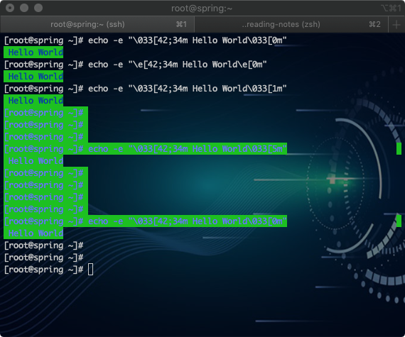
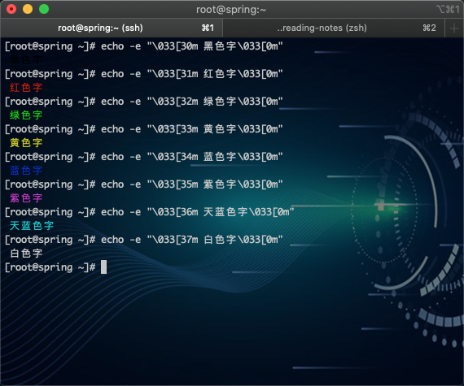
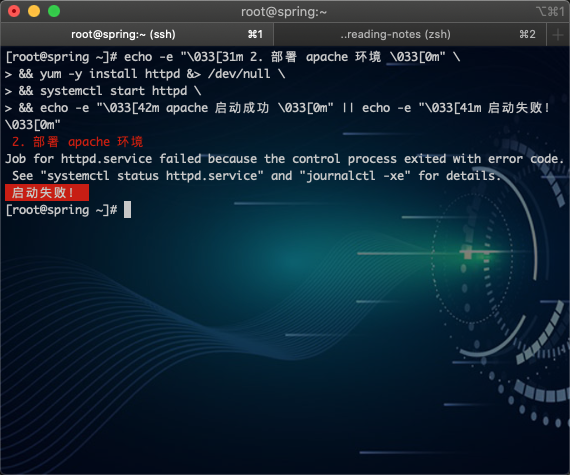
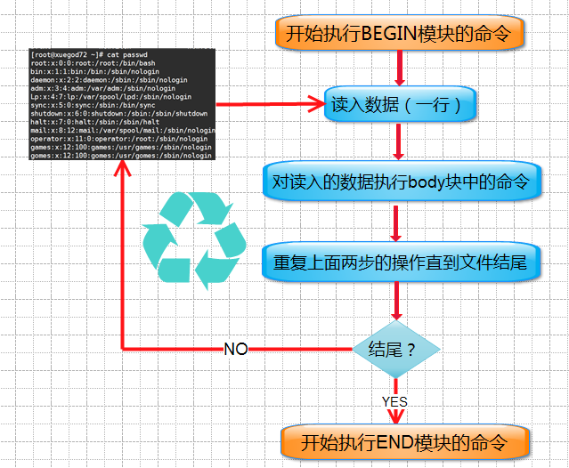
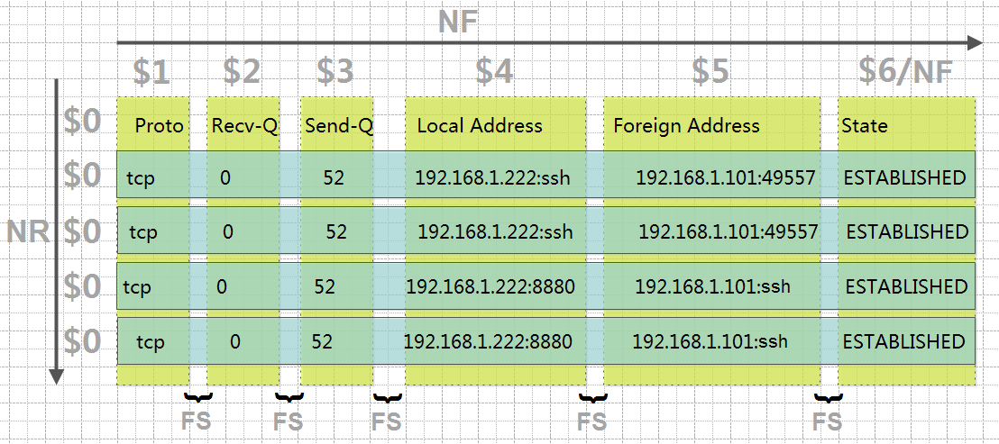

# 第二十四章：shell中色彩处理和awk使用技巧

---

## 目录

* [shell 中的色彩处理](#shellColor)
* [awk 基本应用](#awkBasicApplication)
* [awk 高级应用](#awkAdvancedApplication)
* [实战-shell 脚本实战](#actualCombat)

## 内容

### <a href="#shellColor" id="shellColor">shell 中的色彩处理</a>

shell 脚本中 echo 显示内容带颜色显示,echo 显示带颜色，需要使用参数-e

* 格式 1： echo -e “<font color="#f00">\033[背景颜色;文字颜色 m</font> 要输出的字符 <font color="#f00">\033[0m</font>”
* 格式 2：echo -e “<font color="#f00">\e[背景颜色;文字颜色 m</font> 要输出的字符<font color="#f00">\e[0m</font>”

例：绿底蓝字

```
[root@spring ~]# echo -e "\033[42;34m Hello World\033[0m"
 Hello World
[root@spring ~]# echo -e "\e[42;34m Hello World\e[0m"
 Hello World
```


注:其中 42 的位置代表底色，34 的位置代表的是字的颜色，0m 是清除所有格式

1. 字背景颜色和文字颜色之间是英文的分号";" 
2. 文字颜色后面有个 m 
3. 字符串前后可以没有空格，如果有的话，输出也是同样有空格
4. echo 显示带颜色，需要使用参数-e ,-e 允许对下面列出的加反斜线转义的字符进行解释.

控制选项：

* `\033[0m` 关闭所有属性
* `\033[1m `设置高亮度，加粗
* `\033[5m` 闪烁

```
[root@spring ~]# echo -e "\033[42;34m Hello World\033[1m"
 Hello World
[root@spring ~]#
[root@spring ~]#
[root@spring ~]#
[root@spring ~]# echo -e "\033[42;34m Hello World\033[5m"
 Hello World
[root@spring ~]#
[root@spring ~]#
[root@spring ~]#
[root@spring ~]#
[root@spring ~]# echo -e "\033[42;34m Hello World\033[0m"
 Hello World
[root@spring ~]#
```



常见 shell 输入带颜色文字： 3x 代表字的颜色，4x 代表背景色

```
echo -e "\033[30m 黑色字 \033[0m"
echo -e "\033[31m 红色字 \033[0m"
echo -e "\033[32m 绿色字 \033[0m"
echo -e "\033[33m 黄色字 \033[0m"
echo -e "\033[34m 蓝色字 \033[0m"
echo -e "\033[35m 紫色字 \033[0m"
echo -e "\033[36m 天蓝字 \033[0m"
echo -e "\033[37m 白色字 \033[0m"

echo -e "\033[40;37m 黑底白字 \033[0m"
echo -e "\033[41;37m 红底白字 \033[0m"
echo -e "\033[42;37m 绿底白字 \033[0m"
echo -e "\033[43;37m 黄底白字 \033[0m"
echo -e "\033[44;37m 蓝底白字 \033[0m"
echo -e "\033[45;37m 紫底白字 \033[0m"
echo -e "\033[46;37m 天蓝底白字 \033[0m"
echo -e "\033[47;30m 白底黑字 \033[0m"
```




**shell 色彩应用实战：**

```
[root@spring ~]# echo -e "\033[31m 2. 部署 apache 环境 \033[0m" \
> && yum -y install httpd &> /dev/null \
> && systemctl start httpd \
> && echo -e "\033[42m apache 启动成功 \033[0m" || echo -e "\033[41m 启动失败！ \033[0m"
```



### <a href="#awkBasicApplication" id="awkBasicApplication">awk 基本应用</a>

grep 和 egrep：文本过滤的  
sed：流编辑器，实现编辑的  
awk：文本报告生成器，实现格式化文本输出  

#### 2.1 概念

AWK 是一种优良的文本处理工具，Linux 及 Unix 环境中现有的功能最强大的数据处理引擎之一。这种编程及数据操作语言的最大功能取决于一个人所拥有的知识。awk 命名:Alfred Aho Peter 、Weinberger 和 brian 

`awk`---->`gawk` 即： `gun awk  `   
在 `linux` 上常用的是 `gawk`,`awk` 是 `gawk` 的链接文件     
`man gawk`----》pattern scanning and processing language 模式扫描和处理语言。     
`pattern` [ˈpætn] 模式 ； `process` [ˈprəʊses] 处理     
任何 awk 语句都是由模式和动作组成，一个 awk 脚本可以有多个语句。模式决定动作语句的触发条件和触发时间。

模式：   
正则表达式 : `/root/` 匹配含有 `root` 的行 `/*.root/`   
关系表达式： `<` `>` `&&` `||` `+` `*`   
匹配表达式： `~` `!` `~`   
动作：   
变量 命令 内置函数 流控制语句   
它的语法结构如下：   

```
awk [options] 'BEGIN{ print "start" } ‘pattern{ commands }’ END{ print "end" }' file   
```

其中：BEGIN END 是 AWK 的关键字部，因此必须大写；这两个部分开始块和结束块是可选的   


特殊模块：

* `BEGIN` 语句设置计数和打印头部信息，在任何动作之前进行
* `END` 语句输出统计结果，在完成动作之后执行



通过上面我们可以知道;AWK 它工作通过三个步骤

1. 读：从文件、管道或标准输入中读入一行然后把它存放到内存中
2. 执行：对每一行数据，根据 AWK 命令按顺序执行。默认情况是处理每一行数据，也可以指定模式
3. 重复：一直重复上述两个过程直到文件结束

AWK 支持两种不同类型的变量：内建变量，自定义变量

awk 内置变量（预定义变量）

* <font color="#f00">`$n` 当前记录的第 n 个字段，比如: \$1 表示第一个字段，\$2 表示第二个字段</font>
* `$0` 这个变量包含执行过程中当前行的文本内容
* `FILENAME` 当前输入文件的名
* <font color="#f00">`FS` 字段分隔符（默认是空格）</font>
* <font color="#f00">`NF` 表示字段数，在执行过程中对应于当前的字段数，NF：列的个数</font>
* `FNR` 各文件分别计数的行号
* <font color="#f00">`NR` 表示记录数，在执行过程中对应于当前的行号</font>
* `OFS` 输出字段分隔符（默认值是一个空格）
* `ORS` 输出记录分隔符（默认值是一个换行符）
* `RS` 记录分隔符（默认是一个换行符）



#### 2.2 实例演示

常用的命令选项：

* `-F` fs 指定分隔符
* `-v` 赋值一个用户自定义变量
* `-f` 指定脚本文件,从脚本中读取 awk 命令

（1）分隔符的使用

用法：-F<font color="#f00">fs 其中 fs 是指定输入分隔符，fs 可以是字符串或正则表达式;分隔符默认是空格</font>

常见写法：`-F`: `-F`, `-F[Aa]`

例 1：

```
[root@spring ~]# echo "AA BB CC DD" | awk '{ print $2 }'
BB
[root@spring ~]# echo "AA|BB|CC|DD" | awk -F "|" '{ print $2 }'
BB
[root@spring ~]# echo "AA,BB,CC,DD" | awk -F "," '{ print $2 }'
BB
[root@spring ~]# echo "AA,BB,CC,DD" | awk -F , '{ print $2 }'
BB

[root@spring ~]# awk -F: '{ print $1 }' /etc/passwd # 以：分隔，打印第 1 列用户名
root
bin
daemon
adm
lp
sync
shutdown
halt
mail
operator
games
ftp
nobody
systemd-network
dbus
polkitd
sshd
postfix
nginx
apache
spring1
spring2
spring3
mysql
```

例 2：指定多个分隔符

```
[root@spring ~]# echo "12AxAbADXaAD45" | awk -F "[aA]" '{ print $1 }'
12
[root@spring ~]# echo "12AxAbADXaAD45" | awk -F "[aA]" '{ print $2 }'
x
[root@spring ~]# echo "12AxAbADXaAD45" | awk -F "[aA]" '{ print $6 }'
D45
```

例 3：使用 FS 指定分隔符

```
[root@spring ~]# echo "12AxAbADXaAD45" | awk 'BEGIN { FS="aA" } { print $2 }'
D45
[root@spring ~]# echo "12AxAbADXaAD45" | awk 'BEGIN { FS="aA" } { print $1 }'
12AxAbADX
```

例 4：过滤出本系统的 IP 地址

```
[root@spring ~]# ifconfig enp0s3 | grep netmask
        inet 192.168.2.220  netmask 255.255.255.0  broadcast 192.168.2.255

[root@spring ~]# ifconfig enp0s3 | grep netmask | awk '{ print $2 }'
192.168.2.220   
```

（2）关系运算符的使用

```
[root@spring ~]# echo '1 3 42 23 53 55 32' > a.txt
[root@spring ~]# awk '{ print $1 + 10 }' a.txt
11

[root@spring ~]# cat a.txt
1 3 42 23 53 55 32
```

例 2：

```
[root@spring ~]# echo "one two three four" | awk '{ print $4 }'
four
[root@spring ~]# echo "one two three four" | awk '{ print $NF }'
four
[root@spring ~]# echo "one two three four" | awk '{ print $(NF-2) }'
two
[root@spring ~]# echo "one two three four" | awk '{ print $(NF/2-1) }'
one
```

例 2：打印出 passwd 文件中用户 UID 小于 10 的用户名和它登录使用的 shell

```
[root@spring ~]#
[root@spring ~]# awk -F: '$3<10 { print $1 $FN }' /etc/passwd # 直接输出格式太乱
rootroot:x:0:0:root:/root:/bin/bash
binbin:x:1:1:bin:/bin:/sbin/nologin
daemondaemon:x:2:2:daemon:/sbin:/sbin/nologin
admadm:x:3:4:adm:/var/adm:/sbin/nologin
lplp:x:4:7:lp:/var/spool/lpd:/sbin/nologin
syncsync:x:5:0:sync:/sbin:/bin/sync
shutdownshutdown:x:6:0:shutdown:/sbin:/sbin/shutdown
halthalt:x:7:0:halt:/sbin:/sbin/halt
mailmail:x:8:12:mail:/var/spool/mail:/sbin/nologin

[root@spring ~]# awk -F: '$3<10 { print $1 "<=========>" $FN }' /etc/passwd
root<=========>root:x:0:0:root:/root:/bin/bash
bin<=========>bin:x:1:1:bin:/bin:/sbin/nologin
daemon<=========>daemon:x:2:2:daemon:/sbin:/sbin/nologin
adm<=========>adm:x:3:4:adm:/var/adm:/sbin/nologin
lp<=========>lp:x:4:7:lp:/var/spool/lpd:/sbin/nologin
sync<=========>sync:x:5:0:sync:/sbin:/bin/sync
shutdown<=========>shutdown:x:6:0:shutdown:/sbin:/sbin/shutdown
halt<=========>halt:x:7:0:halt:/sbin:/sbin/halt
mail<=========>mail:x:8:12:mail:/var/spool/mail:/sbin/nologin
```

在\$1 和\$NF 之间加一下\t tab

```
[root@spring ~]# awk -F: '$3<10 { print $1 "\t\t\t" $NF }' /etc/passwd
root			/bin/bash
bin			/sbin/nologin
daemon			/sbin/nologin
adm			/sbin/nologin
lp			/sbin/nologin
sync			/bin/sync
shutdown			/sbin/shutdown
halt			/sbin/halt
mail			/sbin/nologin
```

<font color="#f00">注：awk 最外面使用了单引号'' ,里面都使用双引号“”</font>

输出多个列时，可以加`,`分隔一下

```
[root@spring ~]# awk -F: '$3<10 { print $1,$NF }' /etc/passwd
root /bin/bash
bin /sbin/nologin
daemon /sbin/nologin
adm /sbin/nologin
lp /sbin/nologin
sync /bin/sync
shutdown /sbin/shutdown
halt /sbin/halt
mail /sbin/nologin
```

例 2：打印出系统中 UID 大于 1000 且登录 shell 是/bin/bash 的用户

```
[root@spring ~]# awk -F: '$3>=1000 && $NF=="/bin/bash" { print $1 "\t\t\t" $NF }' /etc/passwd
spring1			/bin/bash
spring2			/bin/bash
spring3			/bin/bash
```

（3）在脚本中的一些应用

例：统计当前内存的使用率

```
[root@spring ~]# vim user-cache.sh
#!bin/bash
echo "当前系统内存使用百分比为："
USEFREE=`free -m | grep -i mem | awk '{ print $3/$2*100"%" }'`
echo -e "内存使用百分比：\e[31m${USEFREE}\e[0m"

[root@spring ~]# sh !$
sh user-cache.sh
当前系统内存使用百分比为：
内存使用百分比：9.68718%
```


### <a href="#awkAdvancedApplication" id="awkAdvancedApplication">awk 高级应用</a>

命令格式： 

``` 
awk [-F | -f | -v ] ‘BEGIN {} / / {command1;command2} END {}’file
```

* `-F` 指定分隔符
* `-f` 调用脚本
* `-v` 定义变量
* `‘{}’` 引用代码块
* `{…}` 命令代码块，包含一条或多条命令
* `BEGIN` 初始化代码块
* `/ str /` 匹配代码块，可以是字符串或正则表达式
* `{print A；print B}` 多条命令使用分号分隔
* `END` 结尾代码块

在 awk 中，pattern 有以下几种：

1.  `empty` 空模式，这个也是我们常用的
2. `/regular expression/` 仅处理能够被这个模式匹配到的行
3. 行范围匹配 `startline`,`endline`

例:打印以 root 开头的行

```
[root@spring ~]# awk -F: '/^root/{ print $0 }' /etc/passwd
root:x:0:0:root:/root:/bin/bash
```


例 1：输出行号大于等于 3 且行号小于等于 6 的行

```
[root@spring ~]# awk -F: '(NR>=3 && NR<=6){ print NR, $0 }' /etc/passwd
3 daemon:x:2:2:daemon:/sbin:/sbin/nologin
4 adm:x:3:4:adm:/var/adm:/sbin/nologin
5 lp:x:4:7:lp:/var/spool/lpd:/sbin/nologin
6 sync:x:5:0:sync:/sbin:/bin/sync
```

内置变量的特殊用法：

* `$0` 表示整个当前行
* `NF` 字段数量 NF(Number 数量 ; field 字段)  NR 每行的记录号，多文件记录递增 Record [ˈrekɔ:d]
* `\t` 制表符
* `\n` 换行符
* `~` 匹配
* `!~` 不匹配
* `-F'[:#/]+'` 定义三个分隔符

例 1：使用 NR 行号来定位，然后提取 IP 地址  
<font color="#f00">注：这个思路很好，之前都是通过 过滤关键字来定位，这次是通过行号，多了一种思路</font>

```
[root@spring ~]# awk '{ print NR "\t" $0 }' /etc/hosts /etc/hostname
1	127.0.0.1   localhost localhost.localdomain localhost4 localhost4.localdomain4
2	::1         localhost localhost.localdomain localhost6 localhost6.localdomain6
3	spring.CentOS7

[root@spring ~]# awk '{ print FNR "\t" $0 }' /etc/hosts /etc/hostname
1	127.0.0.1   localhost localhost.localdomain localhost4 localhost4.localdomain4
2	::1         localhost localhost.localdomain localhost6 localhost6.localdomain6
1	spring.CentOS7
```

注：

* 对于 NR 来说，在读取不同的文件时，NR 是一直加的 ；  
* 对于 FNR 来说，在读取不同的文件时，它读取下一个文件时，FNR 会从 1 开始重新计算的

例 3：使用 3 种方法去除首行

方法 1：

```
[root@spring ~]# route -n | grep -v ^Kernel
Destination     Gateway         Genmask         Flags Metric Ref    Use Iface
0.0.0.0         192.168.2.1     0.0.0.0         UG    100    0        0 enp0s3
192.168.2.0     0.0.0.0         255.255.255.0   U     100    0        0 enp0s3
```

方法 2：

```
[root@spring ~]# route -n | sed 1d # 删除第 1 行的内容
Destination     Gateway         Genmask         Flags Metric Ref    Use Iface
0.0.0.0         192.168.2.1     0.0.0.0         UG    100    0        0 enp0s3
192.168.2.0     0.0.0.0         255.255.255.0   U     100    0        0 enp0s3
```

方法 3：

```
[root@spring ~]# route -n | awk 'NR!=1{ print $0 }'
Destination     Gateway         Genmask         Flags Metric Ref    Use Iface
0.0.0.0         192.168.2.1     0.0.0.0         UG    100    0        0 enp0s3
192.168.2.0     0.0.0.0         255.255.255.0   U     100    0        0 enp0s3
```

例 4：匹配，使用 awk 查出以包括 root 字符的行 ， 有以下 3 种方法

```
[root@spring ~]# awk -F: "/root/{ print }" /etc/passwd
root:x:0:0:root:/root:/bin/bash
operator:x:11:0:operator:/root:/sbin/nologin

[root@spring ~]# awk -F: "/root/" /etc/passwd
root:x:0:0:root:/root:/bin/bash
operator:x:11:0:operator:/root:/sbin/nologin

[root@spring ~]# awk -F: '/root/{ print $0 }' /etc/passwd
root:x:0:0:root:/root:/bin/bash
operator:x:11:0:operator:/root:/sbin/nologin
```

做一个不匹配 root 行：

```
[root@spring ~]# awk -F: '!/root/{ print $0 }' /etc/passwd
bin:x:1:1:bin:/bin:/sbin/nologin
daemon:x:2:2:daemon:/sbin:/sbin/nologin
adm:x:3:4:adm:/var/adm:/sbin/nologin
lp:x:4:7:lp:/var/spool/lpd:/sbin/nologin
sync:x:5:0:sync:/sbin:/bin/sync
shutdown:x:6:0:shutdown:/sbin:/sbin/shutdown
halt:x:7:0:halt:/sbin:/sbin/halt
mail:x:8:12:mail:/var/spool/mail:/sbin/nologin
games:x:12:100:games:/usr/games:/sbin/nologin
ftp:x:14:50:FTP User:/var/ftp:/sbin/nologin
nobody:x:99:99:Nobody:/:/sbin/nologin
systemd-network:x:192:192:systemd Network Management:/:/sbin/nologin
dbus:x:81:81:System message bus:/:/sbin/nologin
polkitd:x:999:998:User for polkitd:/:/sbin/nologin
sshd:x:74:74:Privilege-separated SSH:/var/empty/sshd:/sbin/nologin
postfix:x:89:89::/var/spool/postfix:/sbin/nologin
nginx:x:998:996:nginx user:/var/cache/nginx:/sbin/nologin
apache:x:48:48:Apache:/usr/share/httpd:/sbin/nologin
spring1:x:1000:1000::/home/spring1:/bin/bash
spring2:x:1001:1001::/home/spring2:/bin/bash
spring3:x:1002:1002::/home/spring3:/bin/bash
mysql:x:27:27:MariaDB Server:/var/lib/mysql:/sbin/nologin
```

以 root 开头的行：

```
[root@spring ~]# awk -F: '/^root/{ print $0 }' /etc/passwd
root:x:0:0:root:/root:/bin/bash
```

以 bash 结尾的行：

```
[root@spring ~]# awk -F: '/bash$/{ print $0 }' /etc/passwd
root:x:0:0:root:/root:/bin/bash
spring1:x:1000:1000::/home/spring1:/bin/bash
spring2:x:1001:1001::/home/spring2:/bin/bash
spring3:x:1002:1002::/home/spring3:/bin/bash
```

例 5：条件表达式  
<font color="#f00">表达式?if-true:if-false</font> 问号前面是条件，如果条件为真执行 if-true,为假执行 if-false

例 1：如果 passwd 中 UID 小于 10，则给变量 USER 赋值成 aaa，否则赋值成 bbb

```
[root@spring ~]# awk -F: '{$3<10? USER="aaa" : USER="bbb"; print $1, USER}' /etc/passwd
root aaa
bin aaa
daemon aaa
adm aaa
lp aaa
sync aaa
shutdown aaa
halt aaa
mail aaa
operator bbb
games bbb
ftp bbb
nobody bbb
systemd-network bbb
dbus bbb
polkitd bbb
sshd bbb
postfix bbb
nginx bbb
apache bbb
spring1 bbb
spring2 bbb
spring3 bbb
mysql bbb
```

用 if(条件){命令 1；命令 2}elif(条件){命令；}else{命令}中，在比较条件中用( )扩起来，在 AWK 中，如果条件为 1 为真，0 为假  
例：如果 UID 大于 10 ，则输出 user=>用户名，否则输出 pass=>用户名

```
[root@spring ~]# awk -F: '{ if($3 > 10){ print "user=>" $1 } else { print "pass=>" $1 } }' /etc/passwd
pass=>root
pass=>bin
pass=>daemon
pass=>adm
pass=>lp
pass=>sync
pass=>shutdown
pass=>halt
pass=>mail
user=>operator
user=>games
user=>ftp
user=>nobody
user=>systemd-network
user=>dbus
user=>polkitd
user=>sshd
user=>postfix
user=>nginx
user=>apache
user=>spring1
user=>spring2
user=>spring3
user=>mysql
```

例：查出 UID 小于等于 5 且包括 bin/bash 的行

```
[root@spring ~]# awk -F: '{ if($3<=5 && $NF ~ "bin/bash"){ print $1, $NF } }' /etc/passwd
root /bin/bash
```

例 6：变量

1. 用`-v` 指定 var=value 变量名区分大小写的
2. 在程序中直接定义
3. 在 awk 里，使用变量不用加$符号。

```
[root@spring ~]# awk 'BEGIN{ print "'$var'" }' # 引用变量时，使用单引号+双引号括起来
text
```

例 7：格式化输出

`printf` 命令：格式化输出 `printf` “`FORMAT`”,`item1`,`item2`.......

`format` 使用注意事项： 

1. 其与 `print` 命令的最大不同是，`printf` 需要指定 `format` 样式
2. `format` 用于指定后面的每个 `item` 的输出格式
3. `printf` 语句不会自动打印换行符；`\n` 
4. `format` 格式的指示符都以`%`开头，后跟一个字符；如下：
	* `%c`: 显示字符的 ASCII 码
	* `%d`, `%i`：十进制整数
	* `%e`, `%E`：科学计数法显示数值
	* `%f`: 显示浮点数
	* `%g`, `%G`: 以科学计数法的格式或浮点数的格式显示数值；
	* `%s`: 显示字符串
	* `%u`: 无符号整数
	* `%%`: 显示%自身

例 1：输入 passwd 文件中的第 1 列内容，输出时不会换行

```
[root@spring ~]# awk -F: '{ printf "%s",$1 }' /etc/passwd
rootbindaemonadmlpsyncshutdownhaltmailoperatorgamesftpnobodysystemd-networkdbuspolkitdsshdpostfixnginxapachespring1spring2spring3mysql[root@spring ~]#
```

例 2：换行输出

```
[root@spring ~]# awk -F: '{ printf "%s\n",$1 }' /etc/passwd
root
bin
daemon
adm
lp
sync
shutdown
halt
mail
operator
games
ftp
nobody
systemd-network
dbus
polkitd
sshd
postfix
nginx
apache
spring1
spring2
spring3
mysql
```

例 3：在输出的字母前面添加自定义字符串 USERNAME:

```
[root@spring ~]# awk -F: '{ printf "USERNAME: %s\n",$1 }' /etc/passwd
USERNAME: root
USERNAME: bin
USERNAME: daemon
USERNAME: adm
USERNAME: lp
USERNAME: sync
USERNAME: shutdown
USERNAME: halt
USERNAME: mail
USERNAME: operator
USERNAME: games
USERNAME: ftp
USERNAME: nobody
USERNAME: systemd-network
USERNAME: dbus
USERNAME: polkitd
USERNAME: sshd
USERNAME: postfix
USERNAME: nginx
USERNAME: apache
USERNAME: spring1
USERNAME: spring2
USERNAME: spring3
USERNAME: mysql
```

例 4：对`$1` 和`$NF` 都做格式化输出

```
[root@spring ~]# awk -F: '{ printf "USERNAME: %s %s\n",$1, $NF }' /etc/passwd
USERNAME: root /bin/bash
USERNAME: bin /sbin/nologin
USERNAME: daemon /sbin/nologin
USERNAME: adm /sbin/nologin
USERNAME: lp /sbin/nologin
USERNAME: sync /bin/sync
USERNAME: shutdown /sbin/shutdown
USERNAME: halt /sbin/halt
USERNAME: mail /sbin/nologin
USERNAME: operator /sbin/nologin
USERNAME: games /sbin/nologin
USERNAME: ftp /sbin/nologin
USERNAME: nobody /sbin/nologin
USERNAME: systemd-network /sbin/nologin
USERNAME: dbus /sbin/nologin
USERNAME: polkitd /sbin/nologin
USERNAME: sshd /sbin/nologin
USERNAME: postfix /sbin/nologin
USERNAME: nginx /sbin/nologin
USERNAME: apache /sbin/nologin
USERNAME: spring1 /bin/bash
USERNAME: spring2 /bin/bash
USERNAME: spring3 /bin/bash
USERNAME: mysql /sbin/nologin
```

例 5：对`$1` 和`$NF` 都做格式化输出，在`$1` 和`$NF` 两者之间添加一串`====`字符进行输入

```
[root@spring ~]# awk -F: '{ printf "USERNAME: %s==========%s\n",$1, $NF }' /etc/passwd
USERNAME: root==========/bin/bash
USERNAME: bin==========/sbin/nologin
USERNAME: daemon==========/sbin/nologin
USERNAME: adm==========/sbin/nologin
USERNAME: lp==========/sbin/nologin
USERNAME: sync==========/bin/sync
USERNAME: shutdown==========/sbin/shutdown
USERNAME: halt==========/sbin/halt
USERNAME: mail==========/sbin/nologin
USERNAME: operator==========/sbin/nologin
USERNAME: games==========/sbin/nologin
USERNAME: ftp==========/sbin/nologin
USERNAME: nobody==========/sbin/nologin
USERNAME: systemd-network==========/sbin/nologin
USERNAME: dbus==========/sbin/nologin
USERNAME: polkitd==========/sbin/nologin
USERNAME: sshd==========/sbin/nologin
USERNAME: postfix==========/sbin/nologin
USERNAME: nginx==========/sbin/nologin
USERNAME: apache==========/sbin/nologin
USERNAME: spring1==========/bin/bash
USERNAME: spring2==========/bin/bash
USERNAME: spring3==========/bin/bash
USERNAME: mysql==========/sbin/nologin
```

awk 修饰符：

* N: 显示宽度；
* -: 左对齐；

一个字母占一个宽度。默认是右对齐

例 1：显示时用 10 个字符串右对齐显示。如果要显示的字符串不够 10 个宽度，以字符串的左边自动添加。一个字母占一个宽度。默认是右对齐

```
[root@spring ~]# awk -F":" '{ printf "%-18s\n", $1, $NF }' /etc/passwd
root
bin
daemon
adm
lp
sync
shutdown
halt
mail
operator
games
ftp
nobody
systemd-network
dbus
polkitd
sshd
postfix
nginx
apache
spring1
spring2
spring3
mysql
[root@spring ~]# awk -F":" '{ printf "%18s\n", $1, $NF }' /etc/passwd
              root
               bin
            daemon
               adm
                lp
              sync
          shutdown
              halt
              mail
          operator
             games
               ftp
            nobody
   systemd-network
              dbus
           polkitd
              sshd
           postfix
             nginx
            apache
           spring1
           spring2
           spring3
             mysql
```

例 3：第 1 列使用 15 个字符宽度左对齐输出，最后一列使用 15 个字符宽度右对齐输出

```
[root@spring ~]# awk -F":" '{ printf "USERNAME: %-15s %15s\n", $1, $NF }' /etc/passwd
USERNAME: root                  /bin/bash
USERNAME: bin               /sbin/nologin
USERNAME: daemon            /sbin/nologin
USERNAME: adm               /sbin/nologin
USERNAME: lp                /sbin/nologin
USERNAME: sync                  /bin/sync
USERNAME: shutdown         /sbin/shutdown
USERNAME: halt                 /sbin/halt
USERNAME: mail              /sbin/nologin
USERNAME: operator          /sbin/nologin
USERNAME: games             /sbin/nologin
USERNAME: ftp               /sbin/nologin
USERNAME: nobody            /sbin/nologin
USERNAME: systemd-network   /sbin/nologin
USERNAME: dbus              /sbin/nologin
USERNAME: polkitd           /sbin/nologin
USERNAME: sshd              /sbin/nologin
USERNAME: postfix           /sbin/nologin
USERNAME: nginx             /sbin/nologin
USERNAME: apache            /sbin/nologin
USERNAME: spring1               /bin/bash
USERNAME: spring2               /bin/bash
USERNAME: spring3               /bin/bash
USERNAME: mysql             /sbin/nologin
You have new mail in /var/spool/mail/root
```

例 4：使用开始和结束模块来格式化输出

```
[root@spring ~]# vim test.awk
BEGIN {
        print "UserId\t\t\tShell"
        print "=================="
        FS=":"
}
$3>=500 && $NF=="/sbin/nologin" {
        printf "%-20s %-20s\n", $1, $NF
}
END {
        print "=================="
}

[root@spring ~]# awk -f test.awk /etc/passwd
UserId			Shell
==================
polkitd              /sbin/nologin
nginx                /sbin/nologin
==================
```

### <a href="#actualCombat" id="actualCombat">实战-shell 脚本实战</a>

#### 4.1 检查服务器是否受到 DDOS 攻击脚本

思路：通过：netstat 查看网络连接数。如果一个 IP 地址对服务器建立很多连接数（比如一分钟产生了 100个连接），就认为发生了 DDOS

```
[root@spring ~]# yum -y install httpd # 安装 apache
[root@spring ~]# systemctl start httpd # 启动服务

[root@spring ~]# echo '<!DOCTYPE html>\n<html><head><meta charset="utf-8">\n<title>Documents</title></head>\n<body><h1>Hello httpd</h1></body></html>' > /var/www/html/index.html # 创建 apache 默认网站首页

[root@spring ~]# vim dos-test.sh # 写入以下内容
#!/bin/bash
netstat -ntu | awk '{ print $5 }' | cut -d: -f1 | sort | uniq -c | sort -n

# netstat -ntu | awk '{print $5}' | cut -d: -f1 | sort | uniq -c | sort -n
# 截取外网 IP 和端口 截取外网的 IP 以：为分隔符 ｜排序 ｜ 排除相同的记录 ｜ 排序并统计
``` 

测试，模拟 DDOS  
ab 命令：做压力测试的工具和性能的监控工具  
语法： ab -n 要产生的链接数总和 -c 同时打开的客户端数量 http：//链接  
安装 ab 命令：  

```
[root@spring ~]# rpm -qf `which ab` # 这个安装 apache 时，会自动安装上
httpd-tools-2.4.6-90.el7.centos.x86_64 

[root@spring ~]# ab -n 1000 -c 10 http://192.168.2.229/index.html
This is ApacheBench, Version 2.3 <$Revision: 1430300 $>
Copyright 1996 Adam Twiss, Zeus Technology Ltd, http://www.zeustech.net/
Licensed to The Apache Software Foundation, http://www.apache.org/

Benchmarking 192.168.2.229 (be patient)
apr_socket_recv: No route to host (113)
[root@spring ~]# ab -n 1000 -c 10 http://192.168.2.220/index.html
This is ApacheBench, Version 2.3 <$Revision: 1430300 $>
Copyright 1996 Adam Twiss, Zeus Technology Ltd, http://www.zeustech.net/
Licensed to The Apache Software Foundation, http://www.apache.org/

Benchmarking 192.168.2.220 (be patient)
Completed 100 requests
Completed 200 requests
Completed 300 requests
Completed 400 requests
Completed 500 requests
Completed 600 requests
Completed 700 requests
Completed 800 requests
Completed 900 requests
Completed 1000 requests
Finished 1000 requests


Server Software:        Apache/2.4.6
Server Hostname:        192.168.2.220
Server Port:            80

Document Path:          /index.html
Document Length:        127 bytes

Concurrency Level:      10
Time taken for tests:   0.348 seconds
Complete requests:      1000
Failed requests:        0
Write errors:           0
Total transferred:      388000 bytes
HTML transferred:       127000 bytes
Requests per second:    2870.96 [#/sec] (mean)
Time per request:       3.483 [ms] (mean)
Time per request:       0.348 [ms] (mean, across all concurrent requests)
Transfer rate:          1087.83 [Kbytes/sec] received

Connection Times (ms)
              min  mean[+/-sd] median   max
Connect:        0    0   0.1      0       3
Processing:     1    3   4.6      2      68
Waiting:        0    3   4.1      2      48
Total:          1    3   4.6      2      68

Percentage of the requests served within a certain time (ms)
  50%      2
  66%      3
  75%      3
  80%      3
  90%      5
  95%     14
  98%     17
  99%     17
 100%     68 (longest request)
```

互动： 如果你要对方发生 DDOS 攻击，你会攻击什么样的页面？  
答：访问一个页面比较大，页面越大，消耗服务器带宽就越大，攻击效果越明显

```
[root@spring ~]# sh dos-test.sh
      1 192.168.2.198
      1 Address
      1 servers)
   1005 192.168.2.220
```   