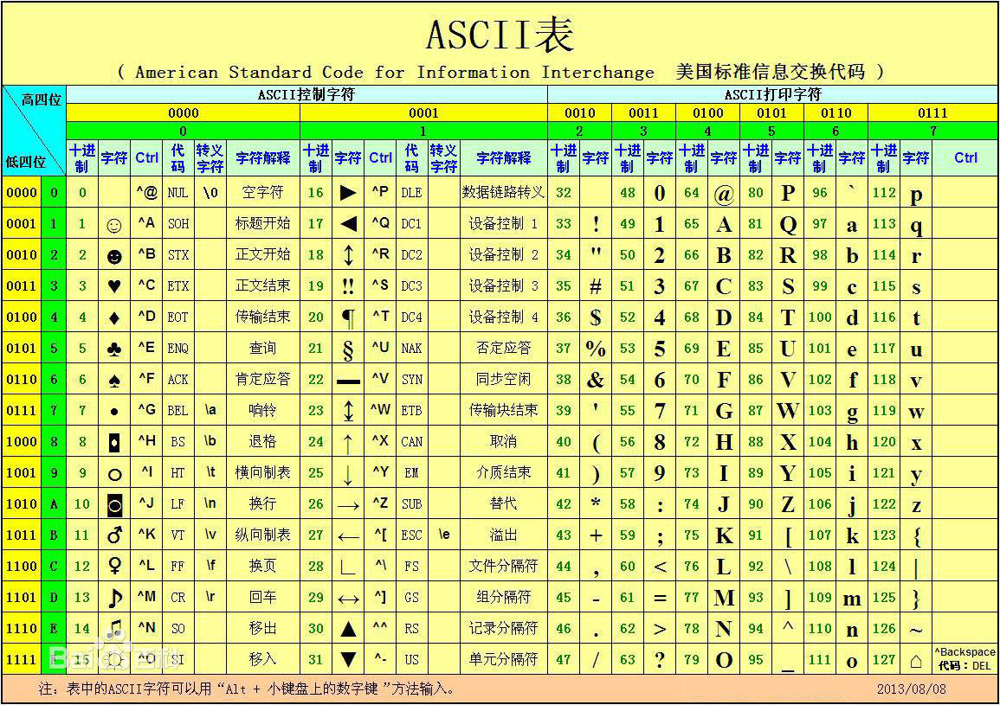

# 第二十章：条件判断和流程控制语句if

---

## 目录

* [read 命令键盘读取变量的值](#read)
* [流程控制语句 if](#if)
* [test 测试命令](#test)
* [流程控制过程中复杂条件和通配符](#wildcard)
* [实战：3 个 shell 脚本实战](#shell)

## 内容

### <a href="#read" id="read">read 命令键盘读取变量的值</a>

从键盘读取变量的值，通常用在 shell 脚本中与用户进行交互的场合。该命令可以一次读取多个变量的值，变量和输入的值都需要使用空格隔开。在 read 命令后面，如果没有指定变量名，读取的数据将被自动赋值给特定的变量REPLY

read 从键盘读入数据，赋给变量

```
[root@spring ~]# read
test
[root@spring ~]# echo $REPLY
test
[root@spring ~]# read a b
hello world
[root@spring ~]# echo $a $b
hello world
```

#### 1.1 read 常用见用法及参数

```
# 例 1：从标准输入读取一行并赋值给变量 answer
[root@spring ~]# read passwd
$USER
[root@spring ~]# echo $passwd
$USER

# 例 2：读取多个值，从标准输入读取一行，直至遇到第一个空白符或换行符。把用户键入的第一个词存到变量first 中，把该行的剩余部分保存到变量 last 中
[root@spring ~]# read first last
aa bb
[root@spring ~]# echo $first $last
aa bb

# 例 3：read -s passwd 将你输入的东西隐藏起来，值赋给 passwd。这个用户隐藏密码信息
[root@spring ~]# read -s passwd
[root@spring ~]# echo $passwd
admin123

# 例 4：输入的时间限制
[root@spring ~]# read -t 2 time # 超过2秒没有输入，直接退出
12
[root@spring ~]# echo $time
12
[root@spring ~]# read -t 1 time # 超过1秒没有输入，直接退出
[root@spring ~]# echo $time

# 例 5：输入的长度限制
[root@spring ~]# read -n 2 test # 最多只接受 2 个字符
na[root@spring ~]# echo $test
na

# 例 6：使用-r 参数输，允许让输入中的内容包括： \识别为普通字符。
[root@spring ~]# read -r line
sdf sdk sdfs /n
[root@spring ~]# echo $line
sdf sdk sdfs /n

[root@spring ~]# read line
sdfd sd/ dsf /n
[root@spring ~]# echo $line
sdfd sd/ dsf /n

# 例 7：-p 用于给出提示符，在前面的例子中我们使用了 echo –n “…“来给出提示符
[root@spring ~]# read -p "please input:" pass
please input:123456
[root@spring ~]# echo $pass
123456

[root@spring ~]# echo -n "please input: "; read pass
please input: 123456
[root@spring ~]# echo $pass
123456

# 例 8：read 综合实例
[root@spring ~]# vim test-read.sh

#!/bin/bash
read -p "请输入姓名：" NAME
read -p "请输入年龄：" AGE
read -p "请输入性别：" GENDER

cat<<EOF

==========================
你的基本信息如下：
姓名：$NAME
年龄：$AGE
性别：$GENDER
==========================

EOF

[root@spring ~]# sh test-read.sh
请输入姓名：蔺葳
请输入年龄：30
请输入性别：女

==========================
你的基本信息如下：
姓名：蔺葳
年龄：30
性别：女
==========================
```

### <a href="#if" id="if">流程控制语句 if</a>

#### 2.1 语法格式

```
if condition
then
	commands
fi

# or

if condition ; then
	commands
fi	
```


注：根据我们的命令退出码来进行判断（echo $? = 0）,如果是0，那么就执行then后面的命令

```
[root@spring ~]# vim if-1.sh

#!/bin/bash
if ls /mnt ; then
        echo "It's OK!"
fi

[root@spring ~]# sh if-1.sh
CentOS_BuildTag  GPL	   LiveOS    RPM-GPG-KEY-CentOS-7
EFI		 images    Packages  RPM-GPG-KEY-CentOS-Testing-7
EULA		 isolinux  repodata  TRANS.TBL
It's OK!
```

#### 双分支 if 语句

```
if condition ; then
	commands
else
	commands
fi
```


```
[root@spring ~]# vim if-else.sh

#!/bin/bash
read -p "检查目录是否存在，请输入目录：" INPUT_DIR
if ls $INPUT_DIR > /dev/null 2>&1 ; then
        echo "目录存在"
else
        echo "请输入正确的目录"
fi

[root@spring ~]# sh if-else.sh
检查目录是否存在，请输入目录：aaa
if-else.sh: line 8: syntax error: unexpected end of file
[root@spring ~]# vim +8 if-else.sh
[root@spring ~]# sh if-else.sh
检查目录是否存在，请输入目录：aaa
ls: cannot access aaa: No such file or directory
请输入正确的目录
[root@spring ~]# etc
bash: etc: command not found
[root@spring ~]# sh if-else.sh
检查目录是否存在，请输入目录：etc
ls: cannot access etc: No such file or directory
请输入正确的目录
[root@spring ~]# sh if-else.sh
检查目录是否存在，请输入目录：/etc
目录存在
```

```
[root@spring ~]# vim if-2.sh

#!/bin/bash
if grep root /etc/passwd ; then
        echo "It's OK"
else
        echo "It's Error"
fi
~

[root@spring ~]# sh !$
sh if-2.sh
root:x:0:0:root:/root:/bin/bash
operator:x:11:0:operator:/root:/sbin/nologin
It's OK
```

```
[root@spring ~]# vim if-3.sh
#!/bin/bash
if grep spring /etc/passwd ; then
        echo "It's OK"
else
        echo "It's Error"
fi

[root@spring ~]# sh !$
sh if-3.sh
It's Error
[root@spring ~]# adduser spring
[root@spring ~]# passwd spring
Changing password for user spring.
New password:
Retype new password:
passwd: all authentication tokens updated successfully.
[root@spring ~]# sh if-3.sh
spring:x:1000:1000::/home/spring:/bin/bash
It's OK
```

#### 2.3 多分支 if 语句

```
if condition 1 ; then
	commands
elif condition 2 ; then
	commands
elif condition 3 ; then
	commands
else
	commands
fi
```


```
# 例 4：判断用户在系统中是否存在，是否有家目录
[root@spring ~]# vim if-4.sh
#!/bin/bash
read -p "input a user: " INPUT_USER
if grep $INPUT_USER /etc/passwd ; then
        echo "The user $INPUT_USER exists on this system"
elif ls -d /home/$INPUT_USER ; then
        echo "The user $INPUT_USER not exists on this system"
        echo "$INPUT_USER has a home directory"
else
        echo "The user $INPUT_USER not exists on this system"
        echo "$INPUT_USER not has a directory"
fi

[root@spring ~]# mkdir /home/hye1213
[root@spring ~]# ls /home/
hye1213  spring
[root@spring ~]# sh if-4.sh
input a user: spring
spring:x:1000:1000::/home/spring:/bin/bash
The user spring exists on this system
[root@spring ~]# sh if-4.sh
input a user: hey1213
ls: cannot access /home/hey1213: No such file or directory
The user hey1213 not exists on this system
hey1213 not has a directory
[root@spring ~]# source if-4.sh
input a user: hye1213
/home/hye1213
The user hye1213 not exists on this system
hye1213 has a home directory
[root@spring ~]# sh if-4.sh
input a user: root
root:x:0:0:root:/root:/bin/bash
operator:x:11:0:operator:/root:/sbin/nologin
The user root exists on this system
```

### <a href="#test" id="test">test 测试命令</a>

Shell 中的 test 命令用于检查某个条件是否成立，它可以进行数值、字符和文件三个方面的测试  
格式：test 测试条件  
如果结果是对的，也叫结果为真，用$?=0 表示，反之为假，用非 0 表示  

#### 3.1 参数值表

| 参数 | 说明 | 示例 |
|:----:|:---|:----|
| -eq | 等于则为真 | [ “$a” -eq “$b” ] |
| -ne | 不等于则为真 | [ “$a” -ne “$b” ] |
| -gt | 大于则为真 | [ “$a” -gt “$b” ] |
| -ge | 大于等于则为真 | [ “$a” -ge “$b” ] |
| -lt | 小于则为真 | [ “$a” -lt “$b” ] |
| -le | 小于等于则为真 | [ “$a” -le “$b” ] |

```
[root@spring ~]# [2 -eq 2] && echo "OK" || echo "Error" # 语法错误'[' + ' ' + 与语法之间有空格 + ' ' + ']'
bash: [2: command not found
Error
[root@spring ~]# [ 2 -eq 2 ] && echo "OK" || echo "Error"
OK
[root@spring ~]# [ 2 -eq 1 ] && echo "OK" || echo "ERROR"
ERROR
```

```
[root@spring ~]# vim test-1.sh
#!/bin/bash
read -p "请输入第一个数字：" NUM_1
read -p "请输入第二个数字：" NUM_2
if [ $NUM_1 -eq $NUM_2 ] ; then
        echo "$NUM_1 等于 $NUM_2，两个数字相等"
else
        echo "$NUM_1 不等于 $NUM_2，两个数字不相等"

fi

[root@spring ~]# sh !$
sh test-1.sh
请输入第一个数字：3
请输入第二个数字：4
3 不等于 4，两个数字不相等
[root@spring ~]# sh test-1.sh
请输入第一个数字：2
请输入第二个数字：2
2 等于 2，两个数字相等
```

例 1：比较大小

```
[root@spring ~]# vim test-compare.sh
#!/bin/bash
if test 2 -eq 1 ; then
        echo "OK"
else
        echo "Error"
fi

if [ 2 -eq 2 ] ; then
        echo "OK"
else
        echo "Error"
fi

[root@spring ~]# sh !$
sh test-compare.sh
Error
OK
```

例 2： 比较整数大小

```
[root@spring ~]# vim test-integer-compare.sh
#!/bin/bash
read -p "Input Num1 Num2: " NUM_1 NUM_2
if [ $NUM_1 -gt $NUM_2 ] ; then
        echo "$NUM_1 > $NUM_2"
elif [ $NUM_1 -lt $NUM_2 ] ; then
        echo "$NUM_1 < $NUM_2"
else
        echo "$NUM_1 == $NUM_2"
fi

[root@spring ~]# sh !$
sh test-integer-compare.sh
Input Num1 Num2: 12 23
12 < 23
[root@spring ~]# sh test-integer-compare.sh
Input Num1 Num2: 12 8
12 > 8
[root@spring ~]# sh test-integer-compare.sh
Input Num1 Num2: 12 12
12 == 12
```

#### 3.2 字符串比较

| 参数          | 说明                               | 示例                     |
|:--------:|:---------------------|:---------------|
| ==            | 等于则为真                      | [ “\$a” == “\$b” ] |
| !=             | 不相等则为真                   | [ “\$a” != “\$b” ] |
| -z 字符串  | 字符串的长度为零则为真    | [ -z “\$a” ]          |
| -n 字符串  | 字符串的长度不为空则为真 | [ -n “\$a” ]          |
| str1 > str2 | str1 大于 str2 为真            | [ str1 \> str2 ]       |
| str1 < str2 | str1 小于 str2 为真            | [ str1 \< str2 ]       |

例 1：根据用户名判断是否是超级管理员

```
[root@spring ~]# vim test-string-administrator.sh
#!/bin/bash
read -p "请输入用户名：" USERNAME
if [ $USERNAME == 'root' ] ; then
        echo "Administration"
else
        echo "User"
fi

[root@spring ~]# sh !$
sh test-string-administrator.sh
请输入用户名：spring
User
[root@spring ~]# sh test-string-administrator.sh
请输入用户名：root
Administration
```

例 2：在做字符串大小比较的时候，注意字符串的顺序

* 大于号和小于号必须转义，要不然 SHELL 会把它当成重定向符号
* 大于和小于它们的顺序和 sort 排序是不一样的
* 在 test 比较测试中，它使用的是 ASCII 顺序，大写字母是小于小写字母的；sort 刚好相反

> 扩展： ASCII（American Standard Code for Information Interchange，美国信息交换标准代码）是基于拉丁字母的一套电脑编码系统，主要用于显示现代英语和其他西欧语言。它是现今最通用的单字节编码系统，并等同于国际标准 ISO/IEC 646。



```
[root@spring ~]# vim test-string-compare.sh
#!/bin/bash
VAR_1=test
VAR_2=Test

if [ $VAR_1 \> VAR_2 ] ; then
        echo "$VAR_1 > $VAR_2"
else
        echo "$VAR_1 < $VAR_1"
fi

[root@spring ~]# sh !$
sh test-string-compare.sh
test > Test
```

#### 3.3 文件比较

| 参数 | 说明 | 示例 |
|:----|:----|:----|
| -e 文件名 | 如果文件或目录存在则为真 | [ -e file ] |
| -r 文件名 | 如果文件存在且可读则为真 | [ -r file ] |
| -w 文件名 | 如果文件存在且可写则为真 | [ -w file ] |
| -x 文件名 | 如果文件存在且可执行则为真 | [ -x file ] |
| -s 文件名 | 如果文件存在且至少有一个字符则为真 | [ -s file ] |
| -d 文件名 | 如果文件存在且为目录则为真 | [ -d file ] |
| -f 文件名 | 如果文件存在且为普通文件则为真 | [ -f file ] |
| -c 文件名 | 如果文件存在且为字符型文件则为真 | [ -c file ] |
| -b 文件名 | 如果文件存在且为块特殊文件则为真 | [ -b file ] |
| file1 -nt fle2 | 检查 file1 是否比 file2 新 | [ file1 -nt file2 ] |
| file1 -ot file2 | 检查 file1 是否比 file2 旧 | [ file1 -ot file2 ] |

```
[root@spring ~]# [ -e /etc/passwd ] && echo "是文件" || echo "不是文件"
是文件
[root@spring ~]# [ -e /etc/passwd- ] && echo "是文件" || echo "不是文件"
是文件
[root@spring ~]# [ -e /etc/passwd-2 ] && echo "是文件" || echo "不是文件"
不是文件
[root@spring ~]# [ -r /etc/test.txt ]  && echo "文件存在并且不可读" || echo "文 件不存在"
文件不存在
[root@spring ~]# touch test.txt
[root@spring ~]# [ -r /root/test.txt ]  && echo "文件存在并且不可读" || echo "文件不存在"
文件存在并且不可读
[root@spring ~]# chomd 666 test.txt
bash: chomd: command not found
[root@spring ~]# chmod 666 test.txt
[root@spring ~]# [ -r /root/test.txt ]  && echo "文件存在并且不可读" || echo "文件不存在"
文件存在并且不可读
```

例：清空日志目录

```
[root@spring ~]# vim clean-log.sh
#!/bin/bash
if [ $USER != "root" ] ; then
        echo "脚本需要root用户执行"
        exit 10
fi

if [ ! -f /var/log/messages ] ; then
        echo "文件不存在"
        exit 12
fi

tail -100 /var/log/messages > /var/log/mesg.tmp

> /var/log/messages

mv /var/log/mesg.tmp /var/log/messages
echo "log chean up"

[root@spring ~]# logout
Connection to 192.168.2.220 closed.
maozhenongdeMBP:~ root# ssh root@192.168.2.220
root@192.168.2.220's password:
Last login: Tue Feb 11 23:41:31 2020 from 192.168.2.198
[root@spring ~]#
[root@spring ~]# exit 10
logout
Connection to 192.168.2.220 closed.
maozhenongdeMBP:~ root# echo $?
10
```

### <a href="#wildcard" id="wildcard">流程控制过程中复杂条件和通配符</a>

#### 4.1 判断第一种：两个条件都为真或有一个为真就执行

```
if [ condition1 ] && (||) [ condition2 ] ; then
	command1
elif [ condition3 ] && (||) [ condition4 ] ; then
	command2
else
	command other
fi

# or

if [ condition1 -a (-o) condition2 -a (-o) condition3 ] ; then
elif [ condition3 -a (-o) condition4 ] ; then
else
	command
fi

# or

if [[ condition1 && (||) condition2 ]] ; then
elif [[ condition3 && (||) condition4 ]] ; then
else 
	command
fi
```

#### 例 1：设置 umask

```
[root@xuegod63 ~]# vim /etc/profile # 参考
 55 # By default, we want umask to get set. This sets it for login shell
 56 # Current threshold for system reserved uid/gids is 200
 57 # You could check uidgid reservation validity in
 58 # /usr/share/doc/setup-*/uidgid file
 59 if [ $UID -gt 199 ] && [ "`/usr/bin/id -gn`" = "`/usr/bin/id -un`" ]; then
 60     umask 002
 61 else
 62     umask 022
 63 fi
```

```
[root@spring ~]# vim umask.sh
#!/bin/bash
if [ $UID -gt 199 ] && [ "`/usr/bin/id -gn`" = "`/usr/bin/id -un`" ]; then
        echo "umask 002"
else
        echo "I an root: umask 022"
fi

[root@spring ~]# sh !$
sh umask.sh
I an root: umask 022
```

例 2：[[ 。。。 ]]和[ 。。。]的区别

[[… ]] 运算符是[… ]运算符的扩充；[[… ]]能够支持 *，< 、>等符号且不需要转义符

```
[root@spring ~]# if [[ $USER == r* ]]; then echo "hello $USER"; else echo $USER not; fi
hello root
# 当只有一个[] 方括号时, 对比时 r* ，就表示两个字符串 r*
[root@spring ~]# if [ $USER == r* ]; then echo "hello $USER"; else echo $USER not; fi
root not
[root@spring ~]# if [[ $USER == [a-z]oot ]]; then echo "hello $USER"; else echo $USER not; fi
hello root
```

[[ 。。。 ]]和[ 。。。]的区别汇总：

1. 所有的字符与逻辑运算符直接用“空格”分开，不能连到一起。
2. 在[… ]表达式中，常见的> 、<需要加转义符\，大小比较
3. 进行逻辑运算符&& 、||比较时；如果用的[ ]符号，则用在外面，如[… ] && [… ] || [ …]如果
在[…]里面进行逻辑与或的比较，则用-a、-o 进行表示，如[ x = y –a x < z –o x > m ]
4. [[… ]] 运算符只是[… ]运算符的扩充；能够支持< 、>符号运算不需要转义符；它还是以字符串
比较大小。里面支持逻辑运算符 || 、 && ， 不再使用-a 、-o 
5. [[…]] 用 && 而不是 -a 表示逻辑“与”；用 || 而不是 -o 表示逻辑“或”
6. [[… ]]可以进行算术扩展，而[ ... ]不可以
7. [[...]]能用正则，而[...]不行
8. 双括号(( ))用于数学表达式
9. 双方括号号[[ ]]用于高级字符串处理，比如“模糊匹配”
10. [[]]对于字符串的比较支持并不好，尤其在使用[[]]和<>符号进行比较的时候会出现返回值错误
的情况。

#### 4.2 shell 中的通配符

| 字符 | 含义 | 实例 |
|:----|:----|:----|
| * | 匹配 0 或多个字符 | a*b a 与 b 之间可以有任意长度的任意字符, 也可以一个也没有, 如 aabcb, axyzb, a012b, ab。 |
| ? | 匹配任意一个字符 | a?b a与b之间必须也只能有一个字符, 可以是任意字符, 如 aab, abb, acb, a0b。 |
| [list] | 匹配 list 中的任意单一字符 | a[xyz]b a 与 b 之间必须也只能有一个字符, 但只能是 x 或 y 或 z, 如: axb, ayb, azb。 |
| [!list] | 匹配 除 list 中的任意单一字符 | a[!0-9]b a 与 b 之间必须也只能有一个字符, 但不能是阿拉伯数字, 如 axb, aab, a-b。 |
| [c1-c2] | 匹配 c1-c2 中的任意单一字符 如：[0-9]  [a-z] | a[0-9]b 0 与 9 之间必须也只能有一个字符 如 a0b, a1b... a9b。 |
| {string1,string2,...} | 匹配 sring1 或 string2 (或更多)其一字符串 | a{abc,xyz,123}b a 与 b 之间只能是 abc或 xyz 或 123 这三个字符串之一。 |

```
[root@spring ~]# ls /etc/*.conf
/etc/asound.conf  /etc/ld.so.conf      /etc/mke2fs.conf    /etc/sudo-ldap.conf
/etc/dracut.conf  /etc/libaudit.conf   /etc/nsswitch.conf  /etc/sysctl.conf
/etc/e2fsck.conf  /etc/libuser.conf    /etc/resolv.conf    /etc/vconsole.conf
/etc/host.conf    /etc/locale.conf     /etc/rsyslog.conf   /etc/yum.conf
/etc/kdump.conf   /etc/logrotate.conf  /etc/sestatus.conf
/etc/krb5.conf    /etc/man_db.conf     /etc/sudo.conf
[root@spring ~]# ls /etc/???.conf
/etc/yum.conf
[root@spring ~]# touch a{1,2,3}.txt
[root@spring ~]# ls /a[123].txt
ls: cannot access /a[123].txt: No such file or directory
[root@spring ~]# ls ./a[123].txt
./a1.txt  ./a2.txt  ./a3.txt
[root@spring ~]# ls ./a[1,2,3].txt
./a1.txt  ./a2.txt  ./a3.txt
[root@spring ~]# ls ./a{1,2,3}.txt
./a1.txt  ./a2.txt  ./a3.txt
[root@spring ~]# ls ./a[1,3].txt
./a1.txt  ./a3.txt
[root@spring ~]# ls ./a[13].txt
./a1.txt  ./a3.txt
```

### <a href="#shell" id="shell">实战：3 个 shell 脚本实战</a>

#### 5.1 实战 1：编写脚本检查服务器运行状态

```
[root@spring ~]# vim check-server-operation-status.sh
#!/bin/bash
read -p "Please input you filename: " FILE # 接收键盘输入并赋予变量 file。
if [ -z "$FILE" ]; then # 判断 file 变量是否为空
        echo "Error, please input a filename" # 如果为空，输出报错信息
elif [ ! -e "$FILE" ]; then # 判断 file 的值是否存在
        echo "Your input is not file" # 如果不存在，输出此信息
elif [ -f "$FILE" ]; then # 判断 file 的值是否为普通文件
        echo "$FILE is a regulare file" # 如果是普通文件输出此信息
elif [ -d "$FILE" ]; then # 判断 file 是否是目录文件
        echo "$FILE is a directory" # 如果是目录文件输出此信息
else # 如果都不是则执行本程序
        echo "$FILE is an other file" # 都不是的话输出此信息
fi

[root@spring ~]# sh !$
sh check-server-operation-status.sh
Please input you filename: test.txt
test.txt is a regulare file
[root@spring ~]# sh check-server-operation-status.sh
Please input you filename: asdfdsf
Your input is not file
[root@spring ~]# sh check-server-operation-status.sh
Please input you filename: demo.html
Your input is not file
[root@spring ~]# sh check-server-operation-status.sh
Please input you filename: a1.txt
a1.txt is a regulare file
```

#### 5.2 实战 2:根据学生的成绩判断 学生的优劣

```
[root@spring ~]# vim result-inquiry.sh
#!/bin/bash
read -p "Please enter your grade: " GRADE
if [ $GRADE -ge 0 ] && [ $GRADE -le 59 ]; then
        echo "failed"
elif [ $GRADE -ge 60 ] && [ $GRADE -le 70 ]; then
        echo "good"
elif [ $GRADE -ge 71 ] && [ $GRADE -le 85 ]; then
        echo "it is good"
elif [ $GRADE -ge 86 ] && [ $GRADE -le 100 ]; then
        echo "excellent"
else
        echo "Crade valid range is 0 - 100"
fi

[root@spring ~]# sh !$
sh result-inquiry.sh
Please enter your grade: -100
Crade valid range is 0 - 100
[root@spring ~]# sh result-inquiry.sh
Please enter your grade: 45
failed
[root@spring ~]# sh result-inquiry.sh
Please enter your grade: 65
good
[root@spring ~]# sh result-inquiry.sh
Please enter your grade: 80
it is good
[root@spring ~]# sh result-inquiry.sh
Please enter your grade: 99
excellent
[root@spring ~]# sh result-inquiry.sh
Please enter your grade: 101
Crade valid range is 0 - 100
```

#### 5.3 实战 3：每周一晚上 3:00 ，备份数据库服务器上 webdb 库的所有数据到系统的/mysqlbak 目录里，使用系统日期做备份文件名

```
[root@spring ~]# vim mysql-bak.sh
#!/bin/bash
BAK_NAME_FILE=`date +"%Y-%m-%d"`
BAK_DIR=/mysqlbak
USER=root
PASSWORD=Maomao@12345698,,
DB_NAME=web_db
[ -e $BAK_DIR ] || mkdir $BAK_DIR
mysaldump -u$USER -p$PASSWORD --flush-logs $DB_NAME > $BAK_DIR/${BAK_NAME_FILE}-
webdb.sql

# 因为 mysql 咱们还没有学，这里以/etc 目录来做实验
[root@spring ~]# vim etc-bak.sh
#!/bin/bash
BAK_NAME_FILE=`date +"%Y-%m-%d"`
BAK_DIR=/etcbak
SRCDIR=/etc

[ -e $BAK_DIR ] || mkdir $BAK_DIR
tar zcvf ${BAK_DIR}/${BAK_NAME_FILE}-etc.tar.gz /etc/
echo "==========================="
ls -lh ${BAK_DIR}/${BAK_NAME_FILE}-etc.tar.gz
echo "Back etc is OK!"

[root@spring ~]# chmod +x mysql-bak.sh
[root@spring ~]# sh etc-bak.sh
[root@spring ~]# ls /etcbak/
2020-02-12-etc.tar.gz
```