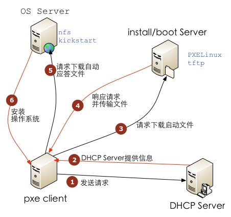
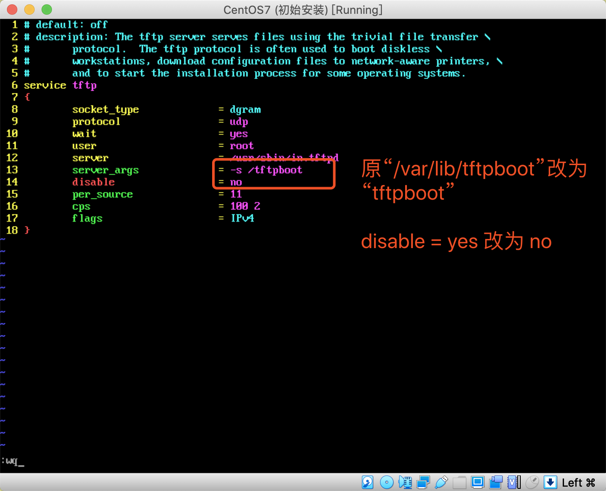

# 第七章：搭建无人执守安装服务器

---

## 目录

* [搭建无人执守安装服务器常见概念](#concept)
* [搭建无人执守安装服务器安装及相关配置文件](#configuration)
* [实战：为公司内网搭建一个搭建无人执守安装服务器](#actual)

## 内容

### <a href="#concept" id="concept">搭建无人执守安装服务器常见概念</a>

搭建无人执守安装服务器需要使用到的服务：`PXE` + `DHCP` + `TFTP` + `Kickstart` + `FTP`

#### 1.1 PXE 原理和概念：

PXE 严格来说并不是一种安装方式，而是一种引导的方式。进行 PXE 安装的必要条件是要安装的计算机中包含一个 PXE 支持的网卡（NIC），即网卡中必须要有 PXE Client。PXE （Pre-boot Execution Environment）协议使计算机可以通过网络启动。

协议分为 client 和 server 端，PXE client 在网卡的 ROM 中，当计算机引导时，BIOS 把 PXE client 调入内存执行，由 PXE client 将放置在远端的文件通过网络下载到本地运行。

运行 PXE 协议需要设置 DHCP 服务器 和 TFTP 服务器。DHCP 服务器用来给 PXE client（将要安装系统的主机）分配一个 IP 地址，由于是给 PXE client 分配 IP 地址，所以在配置 DHCP 服务器时需要增加相应的 PXE 设置。

此外，在 PXE client 的 ROM 中，已经存在了 TFTP Client。PXE Client 通过 TFTP 协议到 TFTP Server 上下载所需的文件。

#### 1.2 KickStart 概述

KickStart 是一种无人职守安装方式。KickStart 的工作原理是通过记录典型的安装过程中所需人工干预填写的各种参数，并生成一个名为 ks.cfg 的文件；在其后的安装过程中（不只局限于生成 KickStart 安装文件的机器）当出现要求填写参数的情况时，安装程序会首先去查找 KickStart 生成的文件，当找到合适的参数时，就采用找到的参数，当没有找到合适的参数时，才需要安装者手工干预。

这样，如果 KickStart 文件涵盖了安装过程中出现的所有需要填写的参数时，安装者完全可以只告诉安装程序从何处取 ks.cfg 文件，然后去忙自己的事情。等安装完毕，安装程序会根据 ks.cfg 中设置的重启选项来重启系统，并结束安装。

### <a href="#configuration" id="configuration">搭建无人执守安装服务器安装及相关配置文件</a>

实验环境

* 服务器：CentOS7 epn0s3 IP: 192.168.2.220 网卡模式： 桥接模式
* 服务器：CentOS7 epn0s8 IP: 192.168.2.222 网卡模式：LAN 必须以图形界面启动
* 客户端：CentOS7-2 epn0s3 IP: 192.168.2.218 网卡模式： LAN

```
[root@localhost ~]# yum -y install nm-connection-editor
[root@localhost ~]# nmtui
```

注：这里不能使用 nat 或仅主机模式，因为这两中模式中，都会自动分配 IP 地址。所以我们使用 LAN 模式，模拟出来一个纯粹的局域网。

```
[root@localhost ~]# vim /etc/sysconfig/network-scripts/ifcfg-enp0s8
HWADDR=00:0C:29:01:D7:18
TYPE=Ethernet
PROXY_METHOD=none
BROWSER_ONLY=no
BOOTPROTO=static
DEFROUTE=yes
IPV4_FAILURE_FATAL=no
IPV6INIT=yes
IPV6_AUTOCONF=yes
IPV6_DEFROUTE=yes
IPV6_FAILURE_FATAL=no
IPV6_ADDR_GEN_MODE=stable-privacy
NAME= enp0s8
UUID=47e70ab5-657a-3258-bf2f-035323ffb0a7
ONBOOT=yes
AUTOCONNECT_PRIORITY=-999
IPADDR=192.168.1.68
NETMASK=255.255.255.0
GATEWAY=192.168.1.1
DNS1=114.114.114.114
DNS2=8.8.8.8
```

<font color="#f00">设置每台服务器的 BIOS 引导顺序为： 先硬盘，再网络</font>

关闭防火墙和 selinux

```
[root@localhost ~]# systemctl stop firewalld; systemctl disable firewalld
```



<center>实验拓扑图和运行原理</center>

搭建 PXE + KickStart 步骤：

* DHCP 服务器用来给客户机分配 IP；
* TFTP 服务器用来存放 PXE 的相关文件，比如：系统引导文件；
* FTP 服务器用来存放系统安装文件；
* KickStart 所生成的 ks.cfg 配置文件；
* 带有一个 PXE 支持网卡的将安装的主机；

#### 2.2 搭建 PXE 环境服务

```
[root@localhost ~]# yum -y install vsftpd
[root@localhost ~]# mount /dev/cdrom /var/ftp/pub # 把光盘镜像挂载到 pub 下
mount: /dev/sr0 is write-protected, mounting read-only
[root@localhost ~]# systemctl start vsftpd
[root@localhost ~]# systemctl enable vsftpd
Created symlink from /etc/systemd/system/multi-user.target.wants/vsftpd.service to /usr/lib/systemd/system/vsftpd.service.

[root@hye ~]# cd /etc/yum.repos.d/
[root@hye yum.repos.d]# ls
CentOS-Base.repo           CentOS-fasttrack.repo   epel.repo               ius-testing.repo
CentOS-Base.repo.bak     CentOS-Media.repo       epel-testing.repo    nginx.repo
CentOS-CR.repo             CentOS-Sources.repo    ius-archive.repo
CentOS-Debuginfo.repo   CentOS-Vault.repo        ius.repo 
[root@hye yum.repos.d]# rm -rf ./*
[root@hye yum.repos.d]# vim CentOS7.repo
[centos7-yum]
name=centos7-source
baseurl=file:///mnt
enabled=1
gpgcheck=0
[root@hye yum.repos.d]# yum install lftp -y
[root@hye yum.repos.d]# lftp 192.169.2.220
lftp 192.168.2.220:~> ls

[root@localhost ~]# yum install tftp tftp-server xinetd -y
[root@localhost ~]# mkdir /tftpboot # 创建tftp家目录
[root@localhost ~]# vim /etc/xinetd.d/tftp
```



修改配置文件里面的 13，14 行。改成以下内容：

改：  
13 server_args = -s /var/lib/tftpboot  
14 disable = yes  

为：  
13 server_args = -s /tftpboot  
14 disable = no  

注：  

```
disable = no               # 不关闭 tftp 服务，就是开启 tftp 服务
server_args = -s /tftpboot # 这是 tftp 服务器运行时的参数。-s /tftpboot 表示服务器默认的目录是 /tftpboot,当你执行 put a.txt 时，文件会被放到服务器的/tftpboot/a.txt，省去你敲 put a /tftpboot/的麻烦。你也可以加其它服务器运行参数到这，具体可以执行 man tftpd 命令查阅。
```

<font color="#f00">接着重新启动 xinetd 服务，然后查看服务端口是否打开。</font>

```
[root@localhost ~]# systemctl restart xinetd
[root@localhost ~]# yum -y install lsof
[root@localhost ~]# lsof -i :69 # 查看69端口正在被哪个进程使用
COMMAND  PID  USER FD TYPE DEVICE  SIZE/OFF NODE NAME
xinetd   1773 root Su IPv4 19920   0t0      UDP  *:tftp

[root@localhost ~]# netstat -antup | grep 69 # 这种方法，只能看到xinetd进程
udp    0    0.0.0:69    0.0.0.0:*    1773/xinetd
```

#### 2.3 将 PXE 启动所需的相关文件复制到 tftp 家目录下

1、安装软件 `system-config-kickstart`、`syslinux`

```
[root@localhost ~]# yum -y install system-config-kickstart syslinux
```

2、准备 `tftp` 需要共享出去的文件

```
[root@localhost ~]# mkdir /tftpboot/pxelinux.cfg
[root@localhost ~]# cp /usr/share/syslinux/pxelinux.0 /tftpboot/ # 系统引导文件
```

<font color="#f00">注：只有安装了 `system-config-kickstart` 软件包，才会有`/usr/share/syslinux/`目录及目录中的文件。</font>

```
[root@localhost ~]# cp /mnt/images/pxeboot/vmlinuz /tftpboot/ # 内核文件
[root@localhost ~]# cp /mnt/images/pxeboot/initrd.img /tftpboot/ # 内核初始化镜像文件
[root@localhost ~]# cp /mnt/isolinux/isolinux.cfg /tftpboot/pxelinux.cfg/default # 引导菜单：isolinux.cfg--开机后选择启动项的菜单文件
[root@localhost ~]# chmod 644 /tftpboot/pxelinux.cfg/default # 赋予default文件644权限 
```

3、在 xuegod64 上测试 tftp

```
[root@hye ~]# rpm -ivh /mnt/Packages/tftp-5.2-22.el7.x86_64.rpm
[root@hye ~]# tftp 192.168.2.220
tftp> get vmlinuz
tftp> quit
[root@hye ~]# ll vmlinuz
```

4、安装 dhcp，修改配置文件及开启服务

```
[root@localhost ~]# yum -y install dhcp
```

配置DHCP服务器

```

[root@localhost ~]# cp /usr/share/doc/dhcp-4.2.5/dhcpd.conf.example /etc/dhcp/dhcp.conf
[root@localhost ~]# vim /etc/dhcp/dhcpd.conf # 只保留一个subnet{...},取掉其他subnet，改成以下内容

subnet 192.168.2.0 netmask 255.255.255.0 {
	range 192.168.1.100 192.168.1.200;
	option domain-name-servers 192.168.1.1;
	option domain-name "internal.example.org";
	option routers 192.168.1.1;
	option broadcast-address 192.168.1.255;
	default-lease-time 600;
	max-lease-time 7200;
	next-server 192.168.1.220;
	filename "pxelinux.0";
}

# 注：
# subnet 192.168.2.0 netmask 255.255.255.0 # 服务端 IP 网段及掩码。
# range 192.168.1.100 192.168.1.200; dhcp # 分发的地址范围，最好将本机 IP 包含在内。
# option domain-name-servers 192.168.2.1; # 指定默认 DNS 地址。
# option domain-name "internal.example.org"; # 指定默认域名。
# option routers 192.168.2.1; # 指定默认网关。
# default-lease-time 600;max-lease-time 7200; # IP 地址租约时间。
# next-server 192.168.2.220; # TFTP 服务器地址。
# filename "pxelinux.0"; # 指定引导文件位置，这里是 TFTP 根目录下的 pxelinux.0。

[root@localhost ~]# systemctl start dhcpd
```

5、CentOS7-2下测试DHCP获取地址

```
[root@hye ~]# vim /etc/sysconfig/network-scripts/ifcfg-enp0s3

TYPE=Ethernet
PROXY_METHOD=none
BROWSER_ONLY=no
BOOTPROTO=dhcp #改 none 为 dhcp 自动获取地址
。。。
NAME=ens33
UUID=c713acec-674b-411d-9e61-646482a292ca
DEVICE=enp0s3
ONBOOT=yes
# IPADDR=192.168.2.218 #以下这 4 行都删除或注释。
# PREFIX=24
# GATEWAY=192.168.2.1
# DNS1=114.114.114.114
IPV6_PRIVACY=no
PEERDNS=no

[root@hye ~]# systemctl restart network
[root@hye ~]# ifconfig
```

#### 2.4 修改 default，指定安装操作系统的方式和 ks.cfg 文件路径

```
[root@localhost ~]# vim /tftpboot/pxelinux.cfg/default

```

然后修改/tftpboot/pxelinux.cfg/default 的配置文件。  
改： 1 default vesamenu.c32  
为 ： 1 default linux  
<font color="#f00">修改第 1 行，后面的 linux 意思是寻找配置文件中第 61 行的 label linux </font> 
改：  
64 append initrd=initrd.img inst.stage2=hd:LABEL=CentOS\x207\x20x86_64 quiet  
为：  
64 append initrd=initrd.img inst.repo=ftp://192.168.2.220/pub inst.ks=ftp://192.168.2.220/ks.cfg  
注：指定通过网络启动系统时，通过 FTP 服务器访问 kickstart 文件。  

注：  
第 1 行：default linux 表示指定默认入口名称；  
第 61 到 64 行：表示定义的引导入口，要开始自动安装，安装程序必须能访问 kickstart 文件。  
有多种方法可访问 kickstart 文件，其中最常用的一种方法是通过网络服务器进行，例如：ftp 服务器、
WEB 服务器或 NFS 服务器，这种方法非常易于部署，并且也使管理更改变得十分简单。  
扩展：使安装程序指向 kickstart 文件的常见书写格式：  
ks=ftp://server/dir/file 如：ks=ftp://192.168.2.220/ks.cfg  
ks=http://server/dir/file 如：ks=http://192.168.2.220/ks.cfg  
ks=nfs:server:/dir/file 如：ks=nfs:192.168.2.220:/var/ftp/pub/ks.cfg  

```
[root@hye ~]# lftp 192.168.2.220
lftp 192.168.2.220: ~> ls
drwxr-xr-x    80    0    2048    Sep    05    2017    pub
lftp 192.168.2.220: ~> quit
```

### <a href="#actual" id="actual">实战：为公司内网搭建一个搭建无人执守安装服务器</a>

接下来我们制作 kickstart 的无人值守安装文件。

1. 在创建配置文件之前，我们需要更改下 yum 源为本地源，否则下面在选择软件包安装这一步不能
选择，提示被禁止。