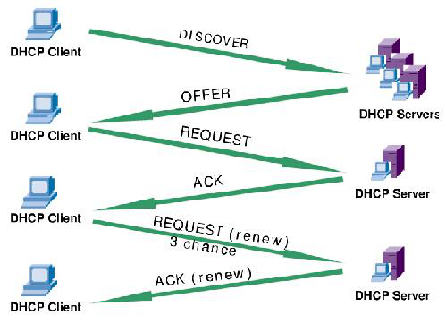
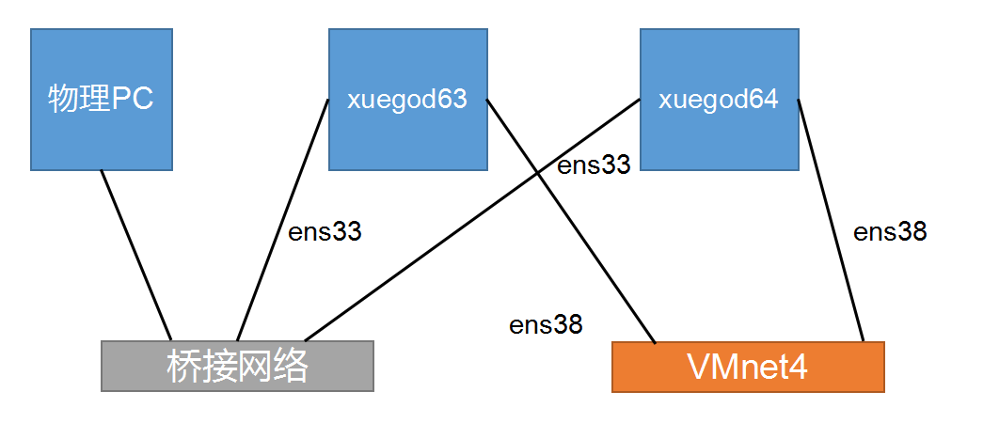
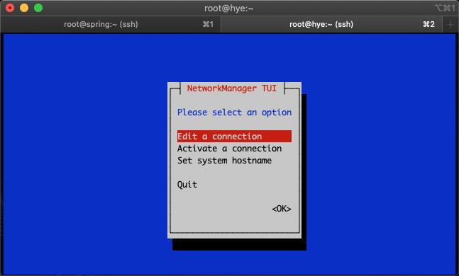
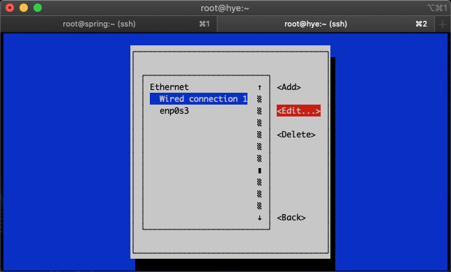
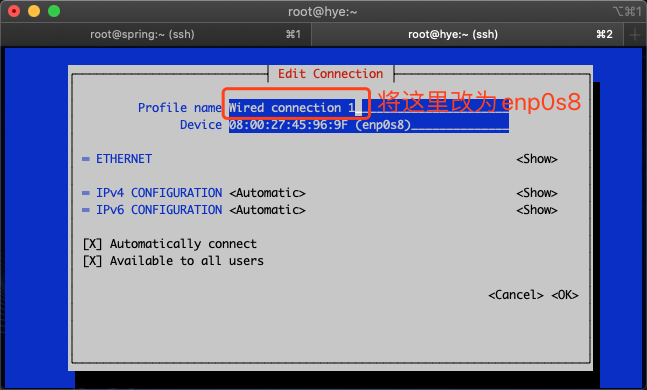
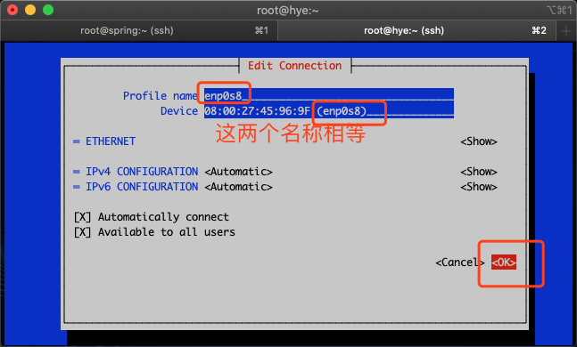

# 第三章：搭建DHCP服务实现动态分配IP地址-NTP网络同步时间

---

## 目录

* [DHCP 服务器工作原理](#dhcp)
* [使用 DHCP 为局域网中的机器分配 IP 地址](#dhcpLocalAreaNetwork)
* [使用 DHCP 为服务器分配固定 IP 地址](#dhcpService)
* [ntpdate 加计划任务同步服务器时间](#ntpdate)

## 内容

实验环境：

1. spring(源主机：192.168.2.220)
2. hye(源主机：192.168.2.218)

### <a href="#dhcp" id="dhcp">DHCP 服务器工作原理</a>

#### 1.1 DHCP 服务概述

名称：DHCP （Dynamic Host Configuration Protocol）动态主机配置协议  
功能：DHCP（Dynamic Host Configuration Protocol，动态主机配置协议）是一个局域网的网络协议，使用 UDP 协议工作， 主要有两个用途：

1. 给内部网络或网络服务供应商自动分配 `IP 地址`，`主机名`，`DNS 服务器`，`域名`
2. 配合其它服务，实现集成化管理功能。如：无人执守安装服务器

DHCP 是 C/S 模式，DHCP 服务端和客户端需要保持通信，DHCP 基于 UDP 协议，双方都有可能会主动向对方发起通信，因此双方都需要监听端口。

Server 端：DHCP Server（运行 dhcp 服务）  
UDP 服务：监听端口 67（bootps）

Client 端：DHCP Client（运行 dhcp 程序）  
UDP 服务：监听端口 68 （bootpc）

**DHCP 特点：**

1. 自动分配 IP 地址，方便管理。
2. DHCP 不会同时租借相同的 IP 地址给两台主机。
3. DHCP 管理员可以约束特定的计算机使用特定的 IP 地址。
4. 可以为每个 DHCP 作用域设置很多选项。
5. 客户机在不同子网间移动时不需要重新设置 IP 地址。每次都自动获取 IP 地址就可以了。

**DHCP 的缺点: **

1. <font color="#856404">当网络上存在多服务器时，一个 DHCP 服务器不能查出已被其它服务器租出去的 IP 地址；</font>
2. DHCP 服务器不能跨路由器与客户机通信，除非路由器允许 BOOTP 协议转发。

```
[root@hye ~]# vim /etc/services
   71 bootps          67/tcp                          # BOOTP server
   72 bootps          67/udp
   73 bootpc          68/tcp          dhcpc           # BOOTP client
   74 bootpc          68/udp          dhcpc
```

DHCP 协议由 bootp 协议发展而来，是 BOOTP 的增强版本，bootps 代表服务端端口， bootpc代表客户端端口。

bootp 协议：引导程序协议（BOOTP）。它可以让无盘工作站从一个中心服务器上获得 IP 地址，为局域网中的无盘工作站分配动态 IP 地址，并不需要每个用户去设置静态 IP 地址。

BOOTP 有一个缺点：<font color="#856404">您在设定前须事先获得客户端的硬件地址，而且，MCA 地址与 IP 的对应是静态的</font>。换而言之，BOOTP 非常缺乏“动态性 ”，若在有限的 IP 资源环境中，BOOTP 的一对一对应会造成非常可观的浪费。

DHCP 可以说是 BOOTP 的增强版本，它分为两个部分：一个是服务器端，而另一个是客户端。所有的 IP 网络设定数据都由 DHCP 服务器集中管理，并负责处理客户端的 DHCP 要求；而客户端则会使用从服务器分配下来的 IP 环境数据。比较 BOOTP, DHCP 透过“租约”的概念，有效且动态的分配客户端的TCP/IP 设定，而且，作为兼容考虑，DHCP 也完全照顾了 BOOTP Client 的需求。

#### 1.2 DHCP 服务运行原理



1、DHCP Client 发现阶段

（1） 即 DHCP 客户端寻找 DHCP 服务端的过程，对应于客户端发送 DHCP Discovery，因为 DHCP Server 对应于 DHCP 客户端是未知的，所以 DHCP 客户端发出的 DHCP Discovery 报文是广播包，源地址为 0.0.0.0 目的地址为 255.255.255.255。网络上的所有支持 TCP/IP 的主机都会收到该 DHCP Discovery 报文，但是只有 DHCP Server 会响应该报文。

> 注意：客户端执行 DHCP DISCOVER 后，如果没有 DHCP 服务器响应客户端的请求，客户端会随机使用 169.254.0.0/16 网段中的一个 IP 地址配置本机地址。

（2） 169.254.0.0/16 是 Windows 的自动专有 IP 寻址范围，也就是在无法通过 DHCP 获取 IP 地址时，由系统自动分配的 IP 地址段。

早期的 Linux 上并不会产生这条路由，现在有这条路由大概是为了和 Windows 兼容。

```
# 查看客户端请求地址系统日志
[root@hye ~]# grep "dchpd" /var/log/messages

[root@hye ~]# route -n
Kernel IP routing table
Destination     Gateway         Genmask         Flags Metric Ref    Use Iface
0.0.0.0         192.168.2.1     0.0.0.0         UG    100    0        0 enp0s3
0.0.0.0         192.168.2.1     0.0.0.0         UG    101    0        0 enp0s8
192.168.2.0     0.0.0.0         255.255.255.0   U     100    0        0 enp0s3
192.168.2.0     0.0.0.0         255.255.255.0   U     101    0        0 enp0s8
```

2、DHCP Server 提供阶段：

DHCP Server 提供阶段，即为 DHCP Server 响应 DHCP Discovery 所发的 DHCP Offer 阶段，即DHCP 服务器提供 IP 地址的阶段。在网络中接收到 DHCPdiscover 发现信息的 DHCP 服务器都会做出响应，它从尚未出租的 IP 地址中挑选一个分配给 DHCP 客户机，向 DHCP 客户机发送一个包含出租的 IP地址和其他设置的 DHCPoffer 提供信息。

3、DHCP Client 确认阶段：

即 DHCP 客户机选择某台 DHCP 服务器提供的 IP 地址的阶段。如果有多台 DHCP 服务器向 DHCP客户机发来的 DHCPoffer 提供信息，则 DHCP 客户机只接受第一个收到的 DHCPoffer 提供信息，然后它就以广播方式回答一个 DHCPrequest 请求信息，该信息中包含向它所选定的 DHCP 服务器请求 IP 地址的内容。之所以要以广播方式回答，是为了通知所有的 DHCP 服务器，他将选择某台 DHCP 服务器所提供的 IP 地址

4、DHCP Server 确认阶段：

即 DHCP 服务器确认所提供的 IP 地址的阶段。当 DHCP 服务器收到 DHCP 客户机回答的DHCPrequest 请求信息之后，它便向 DHCP 客户机发送一个包含它所提供的 IP 地址和其他设置的DHCPack 确认信息，告诉 DHCP 客户机可以使用它所提供的 IP 地址。然后 DHCP 客户机便将其 TCP/IP协议与网卡绑定，另外，除 DHCP 客户机选中的服务器外，其他的 DHCP 服务器都将收回曾提供的 IP 地址。

5、DHCP Client 重新登录网络：

当 DHCP Client 重新登录后，就不需要再发送 DHCP discover 发现信息了，而是直接发送包含前一次所分配的 IP 地址的 DHCP request 请求信息。当 DHCP 服务器收到这一信息后，它会尝试让 DHCP客户机继续使用原来的 IP 地址，并回答一个 DHCP ack 确认信息。如果此 IP 地址已无法再分配给原来的DHCP 客户机使用时（比如此 IP 地址已分配给其它 DHCP 客户机使用），则 DHCP 服务器给 DHCP 客户机回答一个 DHCP nack 否认信息。当原来的 DHCP 客户机收到此 DHCP nack 否认信息后，它就必须重新发送 DHCP discover 发现信息来请求新的 IP 地址。

6、DHCP Client 更新租约：

DHCP 获取到的 IP 地址都有一个租约，租约过期后，DHCP Server 将回收该 IP 地址，所以如果 DHCP Client 如果想继续使用该 IP 地址，则必须更新租约。更新的方式就是，当前租约期限过了一半后，DHCP Client 都会发送 DHCP Renew 报文来续约租期。

### <a href="#dhcpLocalAreaNetwork" id="dhcpLocalAreaNetwork">使用 DHCP 为局域网中的机器分配 IP 地址</a>

#### 2.1 安装 DHCP

```
[root@hye ~]# ls /mnt/Packages/dhcp*
/mnt/Packages/dhcp-4.2.5-77.el7.centos.x86_64.rpm 
/mnt/Packages/dhcp-common-4.2.5-77.el7.centos.x86_64.rpm 
/mnt/Packages/dhcp-libs-4.2.5-77.el7.centos.x86_64.rpm 
```

```
# 使用 Yum 进行安装
[root@hye ~]# yum -y install dhcp
```

1、配置文件位置

（1） 主配置文件：

```
[root@spring ~]# vim /etc/dhcp/dhcpd.conf
#
# DHCP Server Configuration file.
#   see /usr/share/doc/dhcp*/dhcpd.conf.example
#   see dhcpd.conf(5) man page
#
```

> 注：打开`/etc/dhcp/dhcpd.conf` 配置文件，发现提示寻找模板配置文件

（2） DHCP主程序包安装好后会自动生成主配置文件的范本文件

`/usr/share/doc/dhcp-4.2.5/dhcpd.conf.example`

<font color="#f00">补充：开源服务软件里， 以.sample 结尾的文件是软件的模板样例文件，需要关注下。</font>

将范本配置文件复制到/etc 目录下替换掉空白 dhcpd.conf 主配置文件

```
[root@spring ~]# cp /usr/share/doc/dhcp-4.2.5/dhcpd.conf.example /etc/dhcp/dhcpd.conf
cp: overwrite ‘/etc/dhcp/dhcpd.conf’? yes # 询问覆盖原有的文件，输入 y 即可
```

（3） 启动 DHCP 服务

```
[root@spring ~]# systemctl restart dhcpd
Job for dhcpd.service failed because the control process exited with error code. See "systemctl status dhcpd.service" and "journalctl -xe" for details.
```

此时启动会失败  
原因：启动失败的原因是 dhcp 服务器配置的 IP 地址和默认配置文件里定义的地址段不相同，在启动 DHCP 服务之前，需要给 DHCPServer 配置一个静态的 IP 地址

（4） 保证开机启动

```
[root@spring ~]# systemctl enable dhcpd # 配置的服务要保证开机启动
Created symlink from /etc/systemd/system/multi-user.target.wants/dhcpd.service to /usr/lib/systemd/system/dhcpd.service.
```

2、DHCP 配置文件参数说明

（1） 主配置文件介绍

DHCP 范本配置文件内容包含了部分参数、声明以及选项的用法，其中注释部分可以放在任何位置，并以“#”号开头，当一行内容结束时，以“;”号结束，大括号所在行除外可以看出整个配置文件分成全局和局部两个部分。但是并不容易看出哪些属于参数，哪些属于声明和选项。

（2） 概念与协议：

* 作用域：可以分配 IP 的范围 subnet 。
* 地址池：可以分配给客户端的 IP，range 包括的 IP。
* 保留地址：指定某个客户端使用一个特定 IP，通过 host 配置的。
* 租约(时间)：客户端可以使用这个 IP 地址的时间。

（3） 配置文件：`/etc/dhcp/dhcpd.conf` 部分配置解释。

`dhcpd.conf`说明：

1） 定义 dhcpd 自身的工作属性：  
例： log-facilify #定义日志 facilify

2） 全局地址分配属性：以 options 开头。  
例：option router 指定网关

3) 子网配置：如果子网中没有定义分配给客户端的 DNS，但全局中有定义，那么子网则继承全局的 DNS，如果子网中定义有 DNS，全局中也有定义 DNS，那么则根据那地个作用范围小则最终生效。

```
subnet 192.168.40.0 netmask 255.255.255.0 {
        option routers 192.168.40.1; # 在子网定义中也可以使用 option 定义网关，但仅在子网中范围生效
        range 192.168.40.20 192.168.40.50 netmask 255.255.255.0; # 定义分配的地址（地址池）
}
```

4） 主机配置：  
通常为某特定 MAC 地址固定的分配一个地址

```
host www {
        hardware ethernet 08:00:27:6f:90:a5; # 定义 MAC 地址
        fixedd-address 192.168.40.35;           # 定义固定 ip 地址
}
```

文件详解：

```
[root@spring ~]# vim /etc/dhcp/dhcpd.conf

# dhcpd.conf
#
# Sample configuration file for ISC dhcpd
#

# option definitions common to all supported networks...
option domain-name "notfoget.com"; # 搜索域
#option domain-name-servers ns1.example.org, ns2.example.org; # 全局默认 DNS
option domain-name-servers 192.168.2.1;

default-lease-time 600; # 默认最小租约期限（单位为秒）
max-lease-time 7200; # 最长租约期限（单位为秒）

# Use this to enble / disable dynamic dns updates globally.
#ddns-update-style none; # 动态 dns

# If this DHCP server is the official DHCP server for the local
# network, the authoritative directive should be uncommented.
#authoritative;

# Use this to send dhcp log messages to a different log file (you also
# have to hack syslog.conf to complete the redirection).
log-facility local7; # 日志反动地址，在/etc/rsyslog.conf 日志服务配置文件中定义所有发往 local7 的日志定义存放到/var/log/boot.log 文件中

# No service will be given on this subnet, but declaring it helps the
# DHCP server to understand the network topology.

subnet 10.152.187.0 netmask 255.255.255.0 {
}

# This is a very basic subnet declaration.

subnet 10.254.239.0 netmask 255.255.255.224 { # 定义分配的 IP 地址、掩码
  range 10.254.239.10 10.254.239.20; # 定义地址池，起始地址，结束地址，以空格分隔
  option routers rtr-239-0-1.example.org, rtr-239-0-2.example.org; # 提供的网关
}

# This declaration allows BOOTP clients to get dynamic addresses,
# which we don't really recommend.

subnet 10.254.239.32 netmask 255.255.255.224 {
  range dynamic-bootp 10.254.239.40 10.254.239.60; # 定义向 bootp 提供服务，兼容协议
  option broadcast-address 10.254.239.31; # 定义广播地址
  option routers rtr-239-32-1.example.org;
}

# A slightly different configuration for an internal subnet.
subnet 10.5.5.0 netmask 255.255.255.224 {
  range 10.5.5.26 10.5.5.30;
  option domain-name-servers ns1.internal.example.org; # 定义 DNS
  option domain-name "internal.example.org";
  option routers 10.5.5.1; # 定义默认网关
  option broadcast-address 10.5.5.31; # 定义广播地址
  default-lease-time 600; # 默认最小租约期限（单位为秒）
  max-lease-time 7200; # 最长租约期限（单位为秒）
}

# Hosts which require special configuration options can be listed in
# host statements.   If no address is specified, the address will be
# allocated dynamically (if possible), but the host-specific information
# will still come from the host declaration.

host passacaglia {
  hardware ethernet 0:0:c0:5d:bd:95;
  filename "vmunix.passacaglia";
  server-name "toccata.fugue.com";
}

# Fixed IP addresses can also be specified for hosts.   These addresses
# should not also be listed as being available for dynamic assignment.
# Hosts for which fixed IP addresses have been specified can boot using
# BOOTP or DHCP.   Hosts for which no fixed address is specified can only
# be booted with DHCP, unless there is an address range on the subnet
# to which a BOOTP client is connected which has the dynamic-bootp flag
# set.
host fantasia {
  hardware ethernet 08:00:07:26:c0:a5; # 定义对方的 MAC 地址
  fixed-address fantasia.fugue.com; # 定义固定 ip 地址
}

# You can declare a class of clients and then do address allocation
# based on that.   The example below shows a case where all clients
# in a certain class get addresses on the 10.17.224/24 subnet, and all
# other clients get addresses on the 10.0.29/24 subnet.

class "foo" {
  match if substring (option vendor-class-identifier, 0, 4) = "SUNW"; # 定义函数，用来定义特定系统分配特定的地址
}

shared-network 224-29 {
  subnet 10.17.224.0 netmask 255.255.255.0 {
    option routers rtr-224.example.org;
  }
  subnet 10.0.29.0 netmask 255.255.255.0 {
    option routers rtr-29.example.org;
  }
  pool {
    allow members of "foo";
    range 10.17.224.10 10.17.224.250;
  }
  pool {
    deny members of "foo";
    range 10.0.29.10 10.0.29.230;
  }
}
```

在 DHCP 引入了租约的概念，所以 DHCP 服务端在向各个客户端发送 IP 地址时会告知对方，分配的地址使用多长时间，或默认能使用多长时间，在分配的使用时间内，当达到百分之 50 时，客户端则自动向服务端发起续租请求（此时以单播方式进行通信）。

* `50%`：DHCP REQUEST，当达到 50%时，向服务端发起续租，只能在续租时刻起，续租过去的50%的两倍，如果此时续租失败，那么则到剩下的时间的 50%再次发起续租请求（就是整体的时间 75%）。
* `75%`：DHCP REQUEST，当达到整体的时间 75%时，再次发起续租请求，如果此时再次续租失败时，那么则到剩下的时间的 50%再次发起续租请求（就是整体的时间 87.5%）。
* `87.5%`：DHCP REQUEST，当达到整体的时间 87.5%时，再次发起续租请求，如果此时再次续租失败时，则会放弃续租此地址。

当会放弃续租上个使用的地址时，则再次发起 DHCP DISCOVER 广播，重新获取地址。

#### 2.2 常见声明的使用

1. subnet 网络号 netmask 子网掩码 {......}
	+ 作用：定义作用域，指定子网。
	+ 注意：网络号必须与 DHCP 服务器的网络号相同
2. range 起始 IP 地址结束 IP 地址
	+ 作用：指定动态IP 地址范围
	+ 注意：可以在 subnet（子网）声明中指定多个 range，但多个 range 所定义 IP 范围不能重复
3. 常用选项介绍
	+ 选项通常用来配置 DHCP 客户端的可选参数，比如定义客户端的 DNS 地址、默认网关等等选项
	+ 内容都是以option 关键字开始，常见选项使用如下：
		1.  option routers IP 地址
			- 作用：为客户端指定默认网关。 
		2. option domain-name
			- 作用：为客户端指定默认的域
		3. option domain-name-servers IP 地址
			- 作用：为客户端指定 DNS 服务器地址
			- 注意：1、2、3 选项可以用在全局配置中，也可以用在局部配置中  
4. 租约数据库文件。租约数据库文件用于保存一系列的租约声明，其中包含客户端的主机名、MAC 地址、分配到的IP地址，以及IP地址的有效期等相关信息。这个数据库文件是可编辑的ASCII 格式文本文件。每当发生租约变化的时候，都会在文件结尾添加新的租约记录。

DHCP 刚安装好后租约数据库文件dhcpd.leases 是个空文件，租约数据库文件位于`/var/lib/dhcpd/dhcpd.leases`，当DHCP 服务正常运行后就可以使用cat 命令查看租约数据库文件内容了

#### 2.3 实例：应用案例

公司有60 台计算机，IP 地址段为192.168.1.1-192.168.1.254，子网掩码是255.255.255.0，网关为192.168.1.1，192.168.1.2-192.168.1.30 网段地址给服务器配置，客户端可以使用的地址段为192.168.1.100-200，其余剩下的IP 地址为保留地址。

实验环境：

不建议虚拟机使用桥接模式操作此实验，因为你的局域网中有可能就有 DHCP 服务器，因此很难让客户端是从虚拟机搭建的 DHCP 服务器获得 IP 地址。  
另外，也可能造成公司局域网中其它机器因为获得了你 DHCP 服务器上的 IP 地址，而上不了网。

因此需要在 DHCP 主机上添加一张网卡，指定为 vmnet4，客户端也需要添加一张网卡，也需要指定为 vmnet4，使得两台主机在 VMnet4 虚拟网络内连接（两台主机都具有两张网卡，ens33 桥接连接物理主机，ens38 使用 VMnet4 相互连接），如图 3-4 所示。



<center>图 3-4 实验拓扑图</center>

```
[root@spring ~]# ls /etc/sysconfig/network-scripts/ifcfg-* # 没有发现添加后的网卡配置文件
/etc/sysconfig/network-scripts/ifcfg-enp0s3  /etc/sysconfig/network-scripts/ifcfg-lo

[root@hye ~]# ls /etc/sysconfig/network-scripts/ifcfg-* # 没有发现添加后的网卡配置文件
/etc/sysconfig/network-scripts/ifcfg-enp0s3  /etc/sysconfig/network-scripts/ifcfg-lo
```

原因是添加后的网卡配置文件命名问题，修改即可（两台主机都需要操作）

```
[root@spring ~]# nmtui # 使用 nmtui 工具进行修改
```

（1） 打开“网络管理器”---》选择“编辑连接”并回车选择，如图 3-7 所示



<center>图 3-7 网络管理器</center>

（2） 使用上下键选择“有线连接 1”，使用 tab 键把光标切换到“编辑”按键，并回车，如图 3-8 所示



<center>图 3-8 网络管理器</center>

（3） 在编辑连接界面中，把“配置名称”处原有的“Wired connection 1”更改为设备处后面括号的名称，并使用 tab 键切换光标至“确认”回车确认设置后会自动返回上一个界面，在此界面中连按两次 esc 键即可退出“网络管理器”，如图 3-9 所示



<center>图 3-9 网络管理器</center>



<center>图 3-10 配置名称修改</center>

（4） 确认主机上是否有添加后的网卡配置文件了

```
[root@spring ~]# ls /etc/sysconfig/network-scripts/ifcfg-*
/etc/sysconfig/network-scripts/ifcfg-enp0s3  /etc/sysconfig/network-scripts/ifcfg-lo
/etc/sysconfig/network-scripts/ifcfg-enp0s8
[root@hye ~]# ls /etc/sysconfig/network-scripts/ifcfg-*
/etc/sysconfig/network-scripts/ifcfg-enp0s3  /etc/sysconfig/network-scripts/ifcfg-lo
/etc/sysconfig/network-scripts/ifcfg-enp0s8
```

（5） 给 DHCP 服务器配置一个 192.168.1.0 网段的静态地址，否则服务不能启动。网卡配置文件，修改 BOOTPROTO=static、IPADDR=192.168.1.110、NETMASK=255.255.255.0

```
[root@spring ~]# vim /etc/sysconfig/network-scripts/ifcfg-enp0s8
HWADDR=08:00:27:12:3A:D8
TYPE=Ethernet
PROXY_METHOD=none
BROWSER_ONLY=no
BOOTPROTO=static
DEFROUTE=yes
IPV4_FAILURE_FATAL=no
IPV6INIT=yes
IPV6_AUTOCONF=yes
IPV6_DEFROUTE=yes
IPV6_FAILURE_FATAL=no
IPV6_ADDR_GEN_MODE=stable-privacy
NAME=enp0s8
UUID=a199e299-da63-30f0-9688-5d0ae7786b75
ONBOOT=yes
AUTOCONNECT_PRIORITY=-999
IPADDR=192.168.1.110
NETMASK=255.255.255.0

[root@spring ~]# systemctl restart network # 重启网络服务，使配置生效

[root@spring ~]# ifconfig enp0s8 # 查看 ens38 网卡配置是否生效
enp0s8: flags=4163<UP,BROADCAST,RUNNING,MULTICAST>  mtu 1500
        inet 192.168.1.110  netmask 255.255.255.0  broadcast 192.168.1.255
        inet6 fe80::6df4:aa92:ca9:1653  prefixlen 64  scopeid 0x20<link>
        ether 08:00:27:12:3a:d8  txqueuelen 1000  (Ethernet)
        RX packets 53  bytes 4033 (3.9 KiB)
        RX errors 0  dropped 0  overruns 0  frame 0
        TX packets 29  bytes 2566 (2.5 KiB)
        TX errors 0  dropped 0 overruns 0  carrier 0  collisions 0

```

（6） 修改 DCHP 配置文件

```
[root@spring ~]# vim /etc/dhcp/dhcpd.conf # 编辑 DHCP 配置文件，删除其他内容，只保留如下内容
# dhcpd.conf
#
# Sample configuration file for ISC dhcpd
#
subnet 192.168.1.0 netmask 255.255.255.0 {
        range 192.168.1.100 192.168.1.200;
        option domain-name-servers 192.168.1.1;
        option domain-name "notfoget.com";
        option routers 192.168.1.1;
        option broadcast-address 192.168.1.255;
        default-lease-time 600;
        max-lease-time 7200;
}

[root@spring ~]# systemctl start dhcpd # 启动 DCHP 服务
[root@spring ~]# ps aux | grep dhcp # 查看 DHCP 进程
dhcpd     1524  0.0  0.8 105984  8160 ?        Ss   00:52   0:00 /usr/sbin/dhcpd -f -cf /etc/dhcp/dhcpd.conf -user dhcpd -group dhcpd --no-pid
root      1526  0.0  0.0 112712   956 pts/0    R+   00:53   0:00 grep --color=auto dhcp

[root@spring ~]# netstat -tlunp | grep dhcpd
udp        0      0 0.0.0.0:67              0.0.0.0:*                           1524/dhcpd
```

（7）在 hye 主机上获取 IP 地址

```
[root@hye ~]# systemctl restart network # 重启网络服务，由于网络配置是 DHCP方式获取 IP，所以直接重启网络服务即可，如果网卡配置为非 DHCP 方式，需要修改为 DHCP 方式获取 IP 地址

[root@hye ~]# ifconfig enp0s8 # 查看是否获取 IP 成功
enp0s8: flags=4163<UP,BROADCAST,RUNNING,MULTICAST>  mtu 1500
        inet 192.168.1.100  netmask 255.255.255.0  broadcast 192.168.1.255
        inet6 fe80::58cc:6121:5ea6:1a36  prefixlen 64  scopeid 0x20<link>
        ether 08:00:27:45:96:9f  txqueuelen 1000  (Ethernet)
        RX packets 80  bytes 5653 (5.5 KiB)
        RX errors 0  dropped 0  overruns 0  frame 0
        TX packets 38  bytes 3324 (3.2 KiB)
        TX errors 0  dropped 0 overruns 0  carrier 0  collisions 0

```

（8） 查看默认网关

```
[root@hye ~]# route -n
Kernel IP routing table
Destination     Gateway         Genmask         Flags Metric Ref    Use Iface
0.0.0.0         192.168.2.1     0.0.0.0         UG    100    0        0 enp0s3
0.0.0.0         192.168.2.1     0.0.0.0         UG    101    0        0 enp0s8
192.168.2.0     0.0.0.0         255.255.255.0   U     100    0        0 enp0s3
192.168.2.0     0.0.0.0         255.255.255.0   U     101    0        0 enp0s8
```

（9） 查看 DNS

```
[root@hye ~]# cat /etc/resolv.conf
# Generated by NetworkManager
search lan CentOS7
nameserver 8.8.8.8
nameserver 192.168.2.1
```

（10） 查看租约数据库文件

```
[root@spring ~]# cat /var/lib/dhcpd/dhcpd.leases
# The format of this file is documented in the dhcpd.leases(5) manual page.
# This lease file was written by isc-dhcp-4.2.5

server-duid "\000\001\000\001%\342\307f\010\000'\022:\330";
```

### <a href="#dhcpService" id="dhcpService">使用 DHCP 为服务器分配固定 IP 地址</a>

#### 3.1 IP 地址绑定

在DHCP中的IP地址绑定，用于给客户端分配固定IP地址，比如：服务器需要使用固定IP地址时，就可以使用IP地址绑定，通过MAC地址与IP地址的对应关系为指定的物理地址计算机分配固定IP地址，在整个配置过程需要用到 host 声明和hardware、fixed-address 参数

（1） host 主机名 {......}  
作用：用于定义保留地址。

（2） hardware 类型硬件地址  
作用：定义网络接口类型和硬件地址。常用类型为以太网（ethernet）,地址为MAC 地址。

（3） fixed-address IP 地址  
作用：定义DHCP客户端指定的IP地址。

1、编辑 DHCP 配置文件

```
[root@spring ~]# vim /etc/dhcp/dhcpd.conf # 找到对应的子网范围，修改成以下内容
# dhcpd.conf
#
# Sample configuration file for ISC dhcpd
#
subnet 192.168.1.0 netmask 255.255.255.0 {
        range 192.168.1.100 192.168.1.200;
        option domain-name-servers 192.168.1.1;
        option domain-name "notfoget.com";
        option routers 192.168.1.1;
        option broadcast-address 192.168.1.255;
        default-lease-time 600;
        max-lease-time 7200;
        host hye { # 此段内容，要写在 subnet 字段中，和 subnet 配合使用
                hardware ethernet 08:00:27:45:96:9f; # 指定 hye 主机的 MAC 地址
                fixed-address 192.168.1.112; # 指定为 hye 主机分配的地址
        }
}
```

2、重启 DHCP 服务

```
[root@spring ~]# systemctl restart dhcpd
```

3、重启 hye 主机网络服务，使其重新发起获取地址请求

```
[root@hye ~]# systemctl restart network
Restarting network (via systemctl): [ 确定 ]

[root@hye ~]# ifconfig enp0s8
enp0s8: flags=4163<UP,BROADCAST,RUNNING,MULTICAST>  mtu 1500
        inet 192.168.1.112  netmask 255.255.255.0  broadcast 192.168.1.255
        inet6 fe80::58cc:6121:5ea6:1a36  prefixlen 64  scopeid 0x20<link>
        ether 08:00:27:45:96:9f  txqueuelen 1000  (Ethernet)
        RX packets 140  bytes 10105 (9.8 KiB)
        RX errors 0  dropped 0  overruns 0  frame 0
        TX packets 84  bytes 7680 (7.5 KiB)
        TX errors 0  dropped 0 overruns 0  carrier 0  collisions 0
```

> 注意：在生成环境中使用 DHCP 服务，往往需要结合实际是网络环境来搭建，在大多数的企业当中都是采用路由器的 DHCP 服务来提供 IP 地址。

### <a href="#ntpdate" id="ntpdate">ntpdate 加计划任务同步服务器时间</a>

#### 4.1 ntpdate 同步时间用法：

不同机器之间的时间同步，为了避免主机时间因为长期运作下所导致的时间偏差，进行时间同步(synchronize)的工作是非常必要的。Linux 系统下，一般使用 ntp 服务器来同步不同机器的时间。一台机器，可以同时是 ntp 服务器和 ntp 客户机。在网络中，推荐使用像 DNS 服务器一样分层的时间服务器来同步时间。

同步时间，可以使用 ntpdate 命令，也可以使用 ntpd 服务进行时间同步。

```
[root@spring ~]# yum install ntpdate -y # 安装 ntpdate 工具
```

使用 ntpdate 比较简单。命令使用格式：

```
ntpdate [-nv] [NTP IP/hostname]
```

```
[root@spring ~]# ntpdate 120.25.115.20 # 使用 IP 方式进行时间同步，前提是所指定的 IP 主机的需要提供网络时间服务
22 Feb 01:36:29 ntpdate[1611]: step time server 120.25.115.20 offset 2.757694 sec

# 使用主机名称进行时间同步，此例以ntp1.aliyun.com 网络时间服务为例
[root@spring ~]# ntpdate ntp1.aliyun.com
22 Feb 01:37:11 ntpdate[1613]: adjust time server 120.25.115.20 offset -0.000433 sec
```

但这样的同步，只是强制性的将系统时间设置为 ntp 服务器时间，一般配合 cron 命令，来进行定期同步设置。比如，在 crontab 中添加：

```
[root@spring ~]# crontab -e # 添加计划任务，并定义在每天的 12 点整同步时间，ntp 服务器为 120.25.115.20
no crontab for root - using an empty one
crontab: installing new crontab

0 12 * * * /usr/sbin/ntpdate 120.25.115.20
```

扩展知识：

1. 让 NTP 服务同步硬件时间，提及一点，ntp 服务，默认只会同步系统时间。如果想要让 ntp 同时同步硬件时间，可以设置`/etc/sysconfig/ntpdate` 文件。在`/etc/sysconfig/ntpdate` 文件中，把 `SYNC_HWCLOCK=no` 改成`SYNC_HWCLOCK=yes` 则可以使硬件时间与系统时间一起同步。
2. Linux 系统时间和 BIOS 时间是不是一定一样的

```
[root@spring ~]# vim /etc/sysconfig/ntpdate
# Options for ntpdate
OPTIONS="-p 2"

# Set to 'yes' to sync hw clock after successful ntpdate
# SYNC_HWCLOCK=no
SYNC_HWCLOCK=yes
```

查看硬件 BIOS 时间：

* `hwclock -r` ：读出 BIOS 的时间（查看硬件时间）。
* `hwclock -w` ：将当前系统时间写入 BIOS 中。

```
[root@spring ~]# date -s "2020-02-22 01:45:22" # 设置系统时间
Sat Feb 22 01:45:22 CST 2020
```

```
[root@spring ~]# hwclock -r # 查看硬件时间
Sat 22 Feb 2020 01:45:09 AM CST  -0.266207 seconds
```

```
[root@spring ~]# date # 查看系统时间
Sat Feb 22 01:45:22 CST 2020
``` 

```
[root@spring ~]# hwclock -w # 将系统时间同步到硬件时间
```

```
[root@spring ~]# hwclock -r # 查看硬件时间，硬件时间和系统同步了
Sat 22 Feb 2020 01:47:49 AM CST  -0.165706 seconds
```