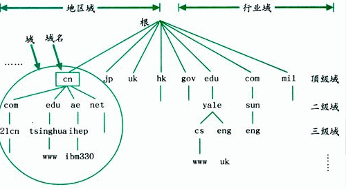
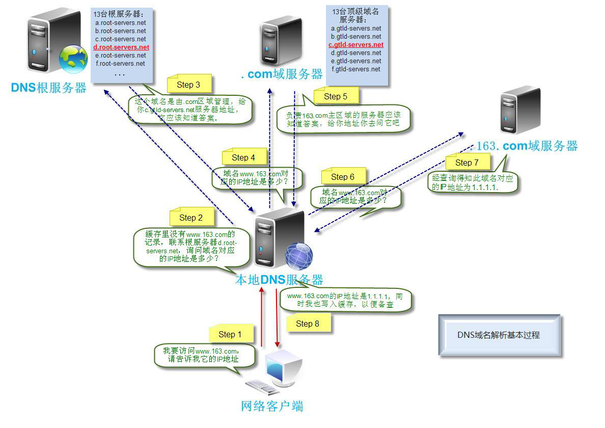
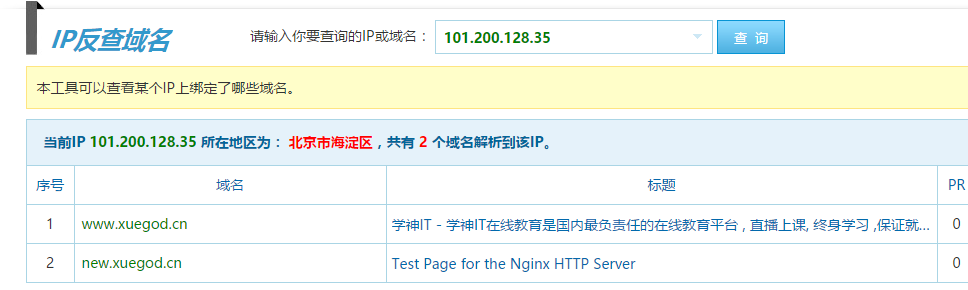

# 第五章：搭建DNS服务器实现域名解析

---

## 目录

* [DNS 服务器常见概念](#dnsService)
* [DNS 服务器安装及相关配置文件](#dnsConfig)
* [实战：为公司内网搭建一个 DNS 服务器](#setUpDnsService)
* [实战：DNS 递归查询和搭建 DNS 转发服务器](#dnsForwardingServer)
* [实战：搭建 DNS 主从服务器](#dnsMasterAndSlaveServer)

## 内容

实验环境：

1. spring(源主机：192.168.2.220)
2. hye(目标主机：192.168.2.218)

特别说明：  
在以下的实验当中，配置文件中的内容说明或调整配置时，如书面上没有出现的内容并在实验主机中的配置文件中出现的内容，则不需要修改，仅需要修改书面上出的加粗字体部分的内容。

### <a href="#dnsService" id="dnsService">DNS 服务器常见概念</a>

DNS（Domain Name System）域名系统，在 TCP/IP 网络中有非常重要的地位，能够提供域名与IP 地址的解析服务，而不用去记住能够被机器直接读取的 IP 数串。通过域名，最终得到该域名对应的 IP 地址的过程叫做域名解析（或主机名解析）。DNS 协议运行在 UDP 协议之上，使用端口号 53。

DNS 是一个分布式数据库，命名系统采用层次的逻辑结构，如同一棵倒置的树，这个逻辑的树形结构称为域名空间，由于 DNS 划分了域名空间，所以各机构可以使用自己的域名空间创建 DNS 信息，如图 5-1 所示。

> 注：DNS 域名空间中，树的最大深度不得超过 127 层，树中每个节点最长可以存储 63 个字符。



#### 1.1 域和域名

DNS 树的每个节点代表一个域，通过这些节点，对整个域名空间进行划分，成为一个层次结构。域名空间的每个域的名字，通过域名进行表示。

域名：通常由一个完全合格域名（FQDN）标识。FQDN 能准确表示出其相对于 DNS 域树根的位置，也就是节点到 DNS 树根的完整表述方式，从节点到树根采用反向书写，并将每个节点用“.”分隔，对于DNS 域 google 来说，其完全正式域名（FQDN）为 google.com。

例如，google 为 com 域的子域，其表示方法为 google.com，而 www 为 google 域中的子域，可以使用 www.google.com 表示。

注意：通常，FQDN 有严格的命名限制，长度不能超过 256 字节，只允许使用字符 a-z,0-9,A-Z和减号（-）。点号（.）只允许在域名标志之间（例如“google.com”）或者 FQDN 的结尾使用。域名不区分大小写，由最顶层到下层，可以分成：根域、顶级域、二级域、子域。

Internet 域名空间的最顶层是根域（root），其记录着 Internet 的重要 DNS 信息，由 Internet域名注册授权机构管理，该机构把域名空间各部分的管理责任分配给连接到 Internet 的各个组织，“.”全球有 13 个根(root)服务器

DNS 根域下面是顶级域，也由 Internet 域名注册授权机构管理。共有 3 种类型的顶级域。

**组织域**：采用 3 个字符的代号，表示 DNS 域中所包含的组织的主要功能或活动。比如 `com` 为商业机构组织，`edu` 为教育机构组织，`gov` 为政府机构组织，`mil` 为军事机构组织，`net` 为网络机构组织，`org` 为非营利机构组织，`int` 为国际机构组织。  
**地址域**：采用两个字符的国家或地区代号。如 `cn` 为中国，`kr` 为韩国，`us` 为美国。    
**反向域**：这是个特殊域，名字为 `in-addr.arpa`，用于将 IP 地址映射到名字（反向查询）。

对于顶级域的下级域，Internet 域名注册授权机构授权给 Internet 的各种组织。当一个组织获得了对域名空间某一部分的授权后，该组织就负责命名所分配的域及其子域，包括域中的计算机和其他设备，并管理分配的域中主机名与 IP 地址的映射信息。

#### 1.2 区(Zone)

区是 DNS 名称空间的一部分，其包含了一组存储在 DNS 服务器上的资源记录。使用区的概念，DNS 服务器回答关于自己区中主机的查询，每个区都有自己的授权服务器。

#### 1.3 主域名服务器与辅助域名服务器

当区的辅助服务器启动时，它与该区的主控服务器进行连接并启动一次区传输，区辅助服务器定期与区主控服务器通信，查看区数据是否改变。如果改变了，它就启动一次数据更新传输。

每个区必须有主服务器，另外每个区至少要有一台辅助服务器，否则如果该区的主服务器崩溃了，就无法解析该区的名称。

辅助服务器的优点：

1. **容错能力** 配置辅助服务器后，在该区主服务器崩溃的情况下，客户机仍能解析该区的名称。一般把区的主服务器和区的辅助服务器安装在不同子网上，这样如果到一个子网的连接中断，DNS 客户机还能直接查询另一个子网上的名称服务器。
2. **减少广域链路的通信量** 如果某个区在远程有大量客户机，用户就可以在远程添加该区的辅助服务器，并把远程的客户机配置成先查询这些服务器，这样就能防止远程客户机通过慢速链路通信来进行 DNS 查询。
3.  **减轻主服务器的负载**辅助服务器能回答该区的查询，从而减少该区主服务器必须回答的查询数。

#### 1.4 DNS 相关概念

（1） DNS 服务器

运行 DNS 服务器程序的计算机，储存 DNS 数据库信息。DNS 服务器会尝试解析客户机的查询请求。在解答查询时，如果 DNS 服务器能提供所请求的信息，就直接回应解析结果，如果该 DNS 服务器没有相应的域名信息，则为客户机提供另一个能帮助解析查询的服务器地址，如果以上两种方法均失败，则回应客户机没有所请求的信息或请求的信息不存在。

（2）DNS 缓存

DNS 服务器在解析客户机请求时，如果本地没有该 DNS 信息，则可以会询问其他 DNS 服务器，当其他域名服务器返回查询结果时，该 DNS 服务器会将结果记录在本地的缓存中，成为 DNS 缓存。当下一次客户机提交相同请求时，DNS 服务器能够直接使用缓存中的 DNS 信息进行解析。

（3） DNS 查询方式： 递归查询和迭代查询

一个 DNS 查询过程，通过 8 个步骤的解析过程就使得客户端可以顺利访问 www.163.com 这个域名，但实际应用中，通常这个过程是非常迅速的，如图 5-2 所示。



<center>图 5-2 DNS 查询过程示意图</center>

1. 客户机提交域名解析请求，并将该请求发送给本地的域名服务器。
2. 当本地的域名服务器收到请求后，就先查询本地的缓存。如果有查询的 DNS 信息记录，则直接返回查询的结果。如果没有该记录，本地域名服务器就把请求发给根域名服务器。
3. 根域名服务器再返回给本地域名服务器一个所查询域的顶级域名服务器的地址。
4. 本地服务器再向返回的域名服务器发送请求。
5. 接收到该查询请求的域名服务器查询其缓存和记录，如果有相关信息则返回客户机查询结果，否则通知客户机下级的域名服务器的地址。
6. 本地域名服务器将查询请求发送给返回的 DNS 服务器。
7. 域名服务器返回本地服务器查询结果（如果该域名服务器不包含查询的 DNS 信息，查询过程将重复<6>、<7>步骤，直到返回解析信息或解析失败的回应。
8. 本地域名服务器将返回的结果保存到缓存，并且将结果返回给客户机

#### 1.5 两种查询方式

（1） 递归查询

递归查询是一种 DNS 服务器的查询模式，在该模式下 DNS 服务器接收到客户机请求，必须使用一个准确的查询结果回复客户机。如果 DNS 服务器本地没有存储查询 DNS 信息，那么该服务器会询问其他服务器，并将返回的查询结果提交给客户机。

（2）迭代查询

DNS 服务器另外一种查询方式为迭代查询，当客户机发送查询请求时，DNS 服务器并不直接回复查询结果，而是告诉客户机另一台 DNS 服务器地址，客户机再向这台 DNS 服务器提交请求，依次循环直到返回查询的结果为止。

#### 1.6 正向解析与反向解析

正向解析：正向解析是指域名到 IP 地址的解析过程。

```
[root@localhost ~]# ping www.baidu.com
PING www.wshifen.com (104.193.88.123) 56(84) bytes of data.
64 bytes from 104.193.88.123 (104.193.88.123): icmp_seq=2 ttl=52 time=278 ms
64 bytes from 104.193.88.123 (104.193.88.123): icmp_seq=3 ttl=52 time=199 ms
64 bytes from 104.193.88.123 (104.193.88.123): icmp_seq=6 ttl=52 time=268 ms
^C
--- www.wshifen.com ping statistics ---
7 packets transmitted, 3 received, 57% packet loss, time 6006ms
rtt min/avg/max/mdev = 199.193/248.701/278.363/35.236 ms
```

反向解析：反向解析是从 IP 地址到域名的解析过程。反向解析的作用为服务器的身份验证，如图 5-4 所示。
[http://dns.aizhan.com/](http://dns.aizhan.com/)



<center>图 5-4 反向解析域名</center>

#### 1.7 DNS 资源记录

1. **SOA 资源记录** 每个区在区的开始处都包含了一个起始授权记录（Start of Authority Record）,简称 SOA 记录。SOA 定义了域的全局参数，进行整个域的管理设置。一个区域文件只允许存在唯一的 SOA 记录。
2. **NS 资源记录** NS（Name Server）记录是域名服务器记录，用来指定该域名由哪个 DNS 服务器来进行解析。每个区在区根处至少包含一个 NS 记录。
3. **A 资源记录**地址（A）资源记录把 FQDN 映射到 IP 地址。 因为有此记录，所以 DNS 服务器能解析 FQDN 域名对应的 IP 地址。
4. **PTR 资源记录** 相对于 A 资源记录，指针（PTR）记录把 IP 地址映射到 FQDN。 用于反向查询，通过 IP 地址，找到域名。
5. **CNAME 资源记录** 别名记录（CNAME）资源记录创建特定 FQDN 的别名。用户可以使用 CNAME 记录来隐藏用户网络的实现细节，使连接的客户机无法知道真正的域名。
6. **MX 资源记录** 邮件交换（MX）资源记录，为 DNS 域名指定邮件交换服务器，邮件交换服务器是为 DNS 域名处理或转发邮件的主机。处理邮件指把邮件投递到目的地或转交另一不同类型的邮件传送者。转发邮件指把邮件发送到最终目的服务器，用简单邮件传输协议 SMTP 把邮件发送给离最终目的地最近的邮件交换服务器，或使邮件经过一定时间的排队。

DNS 的模式： C/S 模式

DNS 监听的端口号：

```
[root@localhost ~]# vim /etc/services # 查看 services 文件
```

端口：

```
tcp/53   udp/53     # 用于客户端查询
tcp/953 udp/953   # 用于 DNS 主从同步
```

### <a href="#dnsConfig" id="dnsConfig">DNS 服务器安装及相关配置文件</a>

#### 2.1 安装 DNS

BIND 简介：  
BIND 全称为 Berkeley Internet Name Domain（伯克利因特网名称域系统），BIND 主要有三个版本：BIND4、BIND8、BIND9。  
BIND8 版本：融合了许多提高效率、稳定性和安全性的技术，而 BIND9 增加了一些超前的理念：IPv6支持、密钥加密、多处理器支持、线程安全操作、增量区传送等等。

```
[root@localhost ~]# yum install -y bind bind-chroot bind-utils
bind-9.9.4-50.el7.x86_64              # 该包为 DNS 服务的主程序包。
bind-chroot-9.9.4-50.el7.x86_64   # 提高安全性。
# bind-chroot 是 bind 的一个功能，使 bind 可以在一个 chroot 的模式下运行，也就是说,bind 运行时的/（根）目录，并不是系统真正的/（根）目录，只是系统中的一个子目录而已，这样做的目的是为了提高安全性，因为在 chroot 的模式下，bind 可以访问的范围仅限于这个子目录的范围里，无法进一步提升，进入到系统的其他目录中。
bind-utils-9.9.4-50.el7.x86_64.rpm # 该包为客户端工具，系统默认已经安装的了，它用于搜索域名指令。
```

#### 2.2 DNS 服务器相关配置文件

```
[root@localhost ~]# ls /etc/named.conf
/etc/named.conf # 是 BIND 的核心配置文件，它包含了 BIND 的基本配置，但其并不包括区域数据。

[root@localhost ~]# ls /var/named/ # 目录为 DNS 数据库文件存放目录，每一个域文件都放在这里
chroot  dynamic   named.empty      named.loopback
data    named.ca  named.localhost  slaves
```

#### 2.3 启动服务

```
[root@localhost ~]# systemctl start named    # 启动 DNS 服务
[root@localhost ~]# systemctl enable named # 设置为开机自动启动
Created symlink from /etc/systemd/system/multi-user.target.wants/named.service to /usr/lib/systemd/system/named.service.
[root@localhost ~]# netstat -antup | grep 53 # 查看 53 号端口是否监听
tcp        0      0 127.0.0.1:953           0.0.0.0:*               LISTEN      1165/named
tcp        0      0 127.0.0.1:53            0.0.0.0:*               LISTEN      1165/named
tcp        0      0 192.168.2.220:56731     193.0.14.129:53         TIME_WAIT   -
tcp        0      0 192.168.2.220:44455     192.36.148.17:53        TIME_WAIT   -
tcp        0      0 192.168.2.220:58886     198.41.0.4:53           TIME_WAIT   -
tcp        0      0 192.168.2.220:48046     192.203.230.10:53       TIME_WAIT   -
tcp        0      0 192.168.2.220:39454     192.5.5.241:53          TIME_WAIT   -
tcp        0      0 192.168.2.220:46287     199.7.83.42:53          TIME_WAIT   -
tcp        0      0 192.168.2.220:37158     199.7.91.13:53          TIME_WAIT   -
tcp        0      0 192.168.2.220:37049     192.112.36.4:53         TIME_WAIT   -
tcp6       0      0 ::1:953                 :::*                    LISTEN      1165/named
tcp6       0      0 ::1:53                  :::*                    LISTEN      1165/named
udp        0      0 127.0.0.1:53            0.0.0.0:*                           1165/named
udp6       0      0 ::1:53                  :::*                                1165/named
```

#### 2.4 服务的使用方法

```
[root@localhost ~]# vim /etc/resolv.conf # 编辑 resolv.conf 文件，添加 DNS，此文件的生效范围是全局的，即是所有网卡的可以有效
  1 # Generated by NetworkManager
  2 # nameserver 8.8.8.8
  3 nameserver 202.106.46.151
  
[root@hye ~]# vim /etc/sysconfig/network-scripts/ifcfg-enp0s3  
```

#### 2.5 配置文件详解

配置 DNS 服务器解析：xuegod.cn

```
[root@localhost ~]# cp /etc/named.conf /etc/named.conf.bak # 备份named.conf
[root@localhost ~]# vim /etc/named.conf # 编辑 DNS 配置
//
// named.conf
//
// Provided by Red Hat bind package to configure the ISC BIND named(8) DNS
// server as a caching only nameserver (as a localhost DNS resolver only).
//
// See /usr/share/doc/bind*/sample/ for example named configuration files.
//
// See the BIND Administrator's Reference Manual (ARM) for details about the
// configuration located in /usr/share/doc/bind-{version}/Bv9ARM.html

options {
        listen-on port 53 { 127.0.0.1; };
        listen-on-v6 port 53 { ::1; };
        directory       "/var/named";
        dump-file       "/var/named/data/cache_dump.db";
        statistics-file "/var/named/data/named_stats.txt";
        memstatistics-file "/var/named/data/named_mem_stats.txt";
        recursing-file  "/var/named/data/named.recursing";
        secroots-file   "/var/named/data/named.secroots";
        allow-query     { localhost; };

        /*
         - If you are building an AUTHORITATIVE DNS server, do NOT enable recursion.
         - If you are building a RECURSIVE (caching) DNS server, you need to enable
           recursion.
         - If your recursive DNS server has a public IP address, you MUST enable access
           control to limit queries to your legitimate users. Failing to do so will
           cause your server to become part of large scale DNS amplification
           attacks. Implementing BCP38 within your network would greatly
           reduce such attack surface
        */
        recursion yes;

        dnssec-enable yes;
        dnssec-validation yes;

        /* Path to ISC DLV key */
        bindkeys-file "/etc/named.root.key";

        managed-keys-directory "/var/named/dynamic";

        pid-file "/run/named/named.pid";
        session-keyfile "/run/named/session.key";
};

logging {
        channel default_debug {
                file "data/named.run";
                severity dynamic;
        };
};

zone "." IN {
        type hint;
        file "named.ca";
};

include "/etc/named.rfc1912.zones";
include "/etc/named.root.key";
```

* `options`：对全局生效
* `zone`：针对某个区域生效
* `type` 字段指定区域的类型，对于区域的管理至关重要，一共分为六种：
	1. `Master`：主 DNS 服务器：拥有区域数据文件，并对此区域提供管理数据
	2. `Slave`：辅助 DNS 服务器：拥有主 DNS 服务器的区域数据文件的副本，辅助 DNS 服务器会从主DNS 服务器同步所有区域数据。
	3. `Stub`：stub 区域和 slave 类似，但其只复制主 DNS 服务器上的 NS 记录而不像辅助 DNS 服务器会复制所有区域数据。
	4. `Forward`：一个 forward zone 是每个域的配置转发的主要部分。一个 zone 语句中的 type forward 可以包括一个 forward 和/或 forwarders 子句，它会在区域名称给定的域中查询。如果没有forwarders 语句或者 forwarders 是空表，那么这个域就不会有转发，消除了 options 语句中有关转发的配置。
	5. `Hint`：根域名服务器的初始化组指定使用线索区域 hint zone，当服务器启动时，它使用根线索来查找根域名服务器，并找到最近的根域名服务器列表。	
### <a href="#setUpDnsService" id="setUpDnsService">实战：为公司内网搭建一个 DNS 服务器</a>

#### 3.1 配置正向解析区域

修改配置文件，授权 DNS 服务器管理 xuegod.cn 区域，并把该区域的区域文件命名为xuegod.cn

```
[root@localhost ~]# vim /etc/named.conf #编辑DNS配置文件，修改如下配置文件区域的内容，其他区域不需要做修改，保持默认
//
// named.conf
//
// Provided by Red Hat bind package to configure the ISC BIND named(8) DNS
// server as a caching only nameserver (as a localhost DNS resolver only).
//
// See /usr/share/doc/bind*/sample/ for example named configuration files.
//
// See the BIND Administrator's Reference Manual (ARM) for details about the
// configuration located in /usr/share/doc/bind-{version}/Bv9ARM.html

options {
        listen-on port 53 { any; };      # 把原来的 127.0.0.1 改为 any
        listen-on-v6 port 53 { any; }; # 把原来的::1，改为 any
        directory       "/var/named";
        dump-file       "/var/named/data/cache_dump.db";
        statistics-file "/var/named/data/named_stats.txt";
        memstatistics-file "/var/named/data/named_mem_stats.txt";
        recursing-file  "/var/named/data/named.recursing";
        secroots-file   "/var/named/data/named.secroots";
        allow-query     { any; };        # 把原来的 localhost，改为 any

        /*
         - If you are building an AUTHORITATIVE DNS server, do NOT enable recursion.
         - If you are building a RECURSIVE (caching) DNS server, you need to enable
           recursion.
         - If your recursive DNS server has a public IP address, you MUST enable access
           control to limit queries to your legitimate users. Failing to do so will
           cause your server to become part of large scale DNS amplification
           attacks. Implementing BCP38 within your network would greatly
           reduce such attack surface
        */
        recursion yes;

        dnssec-enable yes;       # 是否支持 DNSSEC 开关，默认为 yes
        dnssec-validation yes;   # 是否进行 DNSSEC 确认开关
        dnssec-lookaside auto; # 加入此项当设置 dnssec-lookaside，它为验证器提供另外一个能在网络区域的顶层验证 DNSKEY 的方法

        /* Path to ISC DLV key */
        bindkeys-file "/etc/named.root.key";

        managed-keys-directory "/var/named/dynamic";

        pid-file "/run/named/named.pid";
        session-keyfile "/run/named/session.key";
};

logging {
        channel default_debug {
                file "data/named.run";
                severity dynamic;
        };
};

zone "xuegod.cn" IN {         # 把原来的 . 改为 xuegod.cn
        type master;              # 把原来的 hint，改为 master
        file "xuegod.cn.zone"; # 把原来的 named.ca，改为 xuegod.cn.zone。
};

include "/etc/named.rfc1912.zones";
include "/etc/named.root.key";
```

创建 zone 文件

```
[root@localhost ~]# cd /var/named/ # 切换工作目录至/var/named 目录下
[root@localhost named]# cp -a named.localhost xuegod.cn.zone # 复制named.localhost 文件为 xuegod.cn.zone 文件，在复制过程中需要加-a 选项，保持原有的权限
[root@localhost named]# vim xuegod.cn.zone # 编辑该文件中的内容
$TTL 1D
xuegod.cn.      IN SOA  dns.xuegod.cn. root.xuegod.cn. (
                                        0       ; serial
                                        1D      ; refresh
                                        1H      ; retry
                                        1W      ; expire
                                        3H )    ; minimum
xuegod.cn.      NS      dns.xuegod.cn.
dns.xuegod.cn.  A       192.168.2.220
www.xuegod.cn.  A       192.168.2.220
www1.xuegod.cn. CNAME   www.xuegod.cn.
```

配置文件参数说明：

```
$TTL 1D：设置有效地址解析记录的默认缓存时间，默认为 1 天也就是 1D。
xuegod.cn. IN SOA dns. xuegod.cn. root. xuegod.cn.
# 原来的@表示当前的域 xuegod.cn.，为方便大家记忆，在此直接写成 xuegod.cn. 
# 设置 SOA 记录为：dns.xuegod.cn. 
# 在此配置文件中写域名时，都把根 . 也需要写上。
# 域管理邮箱 root.xuegod.cn. 由于@有其他含义，所以用“.”代替@。
0 ：更新序列号，用于标示数据库的变换，可以在 10 位以内，如果存在辅助 DNS 区域，建议每次更
新完数据库，手动加 1。
1D ：刷新时间，从域名服务器更新该地址数据库文件的间隔时间，默认为 1 天。
1H ：重试延时，从域名服务器更新地址数据库失败以后，等待多长时间，默认为 1 小时。
1W ：到期，失效时间，超过该时间仍无法更新地址数据库，则不再尝试，默认为一周。
3H ：设置无效地址解析记录（该数据库中不存在的地址）默认缓存时间。设置无效记录，最少缓存
时间为 3 小时。
NS @ ：域名服务器记录，用于设置当前域的 DNS 服务器的域名地址，
A 127.0.0.1： 设置域名服务器的 A 记录，地址为 ipv4 的地址 127.0.0.1，可以设置成 192.168.100.102
AAAA ::1：设置域名服务器的 A 记录，地址为 ipv6 的地址。
资源记录参数详解：
CNAME 资源记录
别名（CNAME）资源记录用于为某个主机指定一个别名
CNAME 资源记录语法格式：
别名 CNAME 主机名
www1.xuegod.cn. CNAME www.xuegod.cn.
MX 资源记录
MX（邮件交换器）资源记录提供邮件传递信息。该记录会指定区域内的邮件服务器名称。
MX 资源记录语法格式：
mail A 192.168.1.63
MX 192.168.1.63
PTR 资源记录
指针（PTR）资源记录。该记录与 A 记录相反，用于查询 IP 地址与主机名的对应关系。
```

#### 3.2 根区域设置及对应区域文件

根区域是一个较为特殊的区域，记录列出了全球根域名服务器的信息，域名通常用“.”表示，如表 5-1 
所示

| 区域      | 说明 |
|:-------|:----|
| SOA      | 区域授权起始记录，区域文件第一条记录，而且一个区域文件只能有一条 |
| NS        | 域的授权名称服务器 |
| MX        | 域的邮件交换器，要跟着一个优先级值，越小越好 |
| A          | IPV4主机地址 | 
| AAAA    | IPV6主机地址 |
| PTR      | 解析IP的指针 |
| CNAME | 权威（正式）名称，定义别名记录 |

重启 DNS 服务器

```
[root@localhost named]# systemctl restart named
```

修改 DNS 地址

```
[root@localhost named]# vim /etc/resolv.conf
# Generated by NetworkManager
# nameserver 8.8.8.8
nameserver 192.168.2.220 # DNS 修改为 xuegod63 主机 IP
```

配置网卡

```
[root@hye ~]# vim /etc/sysconfig/network-scripts/ifcfg-enp0s3
TYPE="Ethernet"
PROXY_METHOD="none"
BROWSER_ONLY="no"
BOOTPROTO="static"
DEFROUTE="yes"
IPV4_FAILURE_FATAL="no"
IPV6INIT="yes"
IPV6_AUTOCONF="yes"
IPV6_DEFROUTE="yes"
IPV6_FAILURE_FATAL="no"
IPV6_ADDR_GEN_MODE="stable-privacy"
NAME="enp0s3"
UUID="e8abadc2-8064-4950-afc3-d38091f52818"
DEVICE="enp0s3"
NM_CONTROLLED="yes"
ONBOOT="yes"
IPADDR="192.168.2.218"
NETMASK=255.255.255.0
PREFIX="24"
GATEWAY="192.168.2.1"
DNS1="8.8.8.8"
IPV6_PRIVACY="no"

[root@xuegod64 ~]# systemctl restart network # 重启动网络服务
[root@localhost ~]# ping www.xuegod.cn
PING www.xuegod.cn (192.168.2.220) 56(84) bytes of data.
64 bytes from localhost.localdomain (192.168.2.220): icmp_seq=1 ttl=64 time=0.012 ms
64 bytes from localhost.localdomain (192.168.2.220): icmp_seq=2 ttl=64 time=0.029 ms
64 bytes from localhost.localdomain (192.168.2.220): icmp_seq=3 ttl=64 time=0.029 ms
64 bytes from localhost.localdomain (192.168.2.220): icmp_seq=4 ttl=64 time=0.034 ms
64 bytes from localhost.localdomain (192.168.2.220): icmp_seq=5 ttl=64 time=0.029 ms
--- www.xuegod.cn ping statistics ---
5 packets transmitted, 5 received, 0% packet loss, time 4001ms
rtt min/avg/max/mdev = 0.012/0.026/0.034/0.009 ms
```

### <a href="#dnsForwardingServer" id="dnsForwardingServer">实战：DNS 递归查询和搭建 DNS 转发服务器</a>

#### 4.1 使用 DNS 支持递归查询

```
[root@localhost ~]# vim /etc/named.conf # 修改DNS配置文件，修改如下内容
options {
        listen-on port 53 { any; };
        listen-on-v6 port 53 { any; };
        directory       "/var/named";
        dump-file       "/var/named/data/cache_dump.db";
        statistics-file "/var/named/data/named_stats.txt";
        memstatistics-file "/var/named/data/named_mem_stats.txt";
        recursing-file  "/var/named/data/named.recursing";
        secroots-file   "/var/named/data/named.secroots";
        allow-query     { any; };

        /*
         - If you are building an AUTHORITATIVE DNS server, do NOT enable recursion.
         - If you are building a RECURSIVE (caching) DNS server, you need to enable
           recursion.
         - If your recursive DNS server has a public IP address, you MUST enable access
           control to limit queries to your legitimate users. Failing to do so will
           cause your server to become part of large scale DNS amplification
           attacks. Implementing BCP38 within your network would greatly
           reduce such attack surface
        */
        recursion yes;

        #dnssec-enable yes;
        #dnssec-validation yes;
        #dnssec-lookaside auto;

        /* Path to ISC DLV key */
        bindkeys-file "/etc/named.root.key";

        managed-keys-directory "/var/named/dynamic";

        pid-file "/run/named/named.pid";
        session-keyfile "/run/named/session.key";
};
```

只需要把以上三条内容注释了，其它内容不用改，这样客户端才能通过这个 DNS 进行递归查询，把 dns 加密通讯功能关闭，才可以和根服务器时行迭代查询。

重启 DNS 服务，使配置文件生效

```
[root@localhost ~]# systemctl restart named
```

```
[root@hye ~]# ping www.baidu.com
PING www.a.shifen.com (61.135.169.125) 56(84) bytes of data.
64 bytes from 61.135.169.125 (61.135.169.125): icmp_seq=1 ttl=52 time=23.5 ms
64 bytes from 61.135.169.125 (61.135.169.125): icmp_seq=2 ttl=52 time=23.4 ms
64 bytes from 61.135.169.125 (61.135.169.125): icmp_seq=3 ttl=52 time=24.1 ms
64 bytes from 61.135.169.125 (61.135.169.125): icmp_seq=4 ttl=52 time=23.7 ms
64 bytes from 61.135.169.125 (61.135.169.125): icmp_seq=5 ttl=52 time=24.1 ms
64 bytes from 61.135.169.125 (61.135.169.125): icmp_seq=6 ttl=52 time=24.3 ms
64 bytes from 61.135.169.125 (61.135.169.125): icmp_seq=7 ttl=52 time=25.7 ms
64 bytes from 61.135.169.125 (61.135.169.125): icmp_seq=8 ttl=52 time=25.0 ms
^C
--- www.a.shifen.com ping statistics ---
8 packets transmitted, 8 received, 0% packet loss, time 11067ms
rtt min/avg/max/mdev = 23.464/24.272/25.793/0.769 ms
```

#### 4.2 搭建 DNS 转发服务器

```
vim /etc/named.conf
zone "xuegod.cn" IN {
        #type master;               # 注释此项
        type forward;               # 添加此项，类型为转发
        #file "xuegod.cn.zone"; # 注释此项
        forward only;               # 仅执行转发操作，only：仅转发，first：先查找本地 zone，再转发
        forwarders { 8.8.8.8; };  # 指定转发查询请求的 DNS 服务器列表
};
[root@localhost ~]# systemctl restart named # 重启 DNS 服务，使配置文件生效
```

在 xuegod64 主机上进行测试

```
[root@hye ~]# ping www.baidu.com
PING www.a.shifen.com (61.135.169.121) 56(84) bytes of data.
64 bytes from 61.135.169.121 (61.135.169.121): icmp_seq=1 ttl=52 time=28.5 ms
64 bytes from 61.135.169.121 (61.135.169.121): icmp_seq=2 ttl=52 time=23.9 ms
64 bytes from 61.135.169.121 (61.135.169.121): icmp_seq=3 ttl=52 time=23.6 ms
64 bytes from 61.135.169.121 (61.135.169.121): icmp_seq=4 ttl=52 time=22.7 ms
64 bytes from 61.135.169.121 (61.135.169.121): icmp_seq=5 ttl=52 time=23.7 ms
64 bytes from 61.135.169.121 (61.135.169.121): icmp_seq=6 ttl=52 time=22.8 ms
64 bytes from 61.135.169.121 (61.135.169.121): icmp_seq=7 ttl=52 time=23.5 ms
64 bytes from 61.135.169.121 (61.135.169.121): icmp_seq=8 ttl=52 time=23.8 ms
64 bytes from 61.135.169.121 (61.135.169.121): icmp_seq=9 ttl=52 time=23.8 ms
64 bytes from 61.135.169.121 (61.135.169.121): icmp_seq=10 ttl=52 time=24.0 ms
^C
--- www.a.shifen.com ping statistics ---
10 packets transmitted, 10 received, 0% packet loss, time 9023ms
rtt min/avg/max/mdev = 22.780/24.079/28.554/1.559 ms
```

### <a href="#dnsMasterAndSlaveServer" id="dnsMasterAndSlaveServer">实战：搭建 DNS 主从服务器</a>

#### 5.1 搭建 DNS 主从服务器

1、搭建一个主 DNS 服务器 A，配置内容如下

```
[root@localhost ~]# vim /etc/named.conf
zone "xuegod.cn" IN {
        type master; # 指定类型为 master
        file "xuegod.cn.zone"; # 指定为 xuegod.cn.zone
        allow-transfer { 192.168.2.1/24 }; # 指定允许哪个网段的从 DNS 服务器，可以同步主 DNS 服务器 zone 文件，不写默认为所有
};

[root@localhost ~]# systemctl restart named
```

2、从 DNS 服务器的配置

要求：主从系统时间一定要保持一致。

```
[root@hye ~]# yum -y install bind bind-chroot bind-utils 
[root@hye ~]# systemctl start named
[root@hye ~]# cp /etc/named.conf /etc/named.conf.bak
[root@hye ~]# vim /etc/named.conf
options {
        listen-on port 53 { any; };
        listen-on-v6 port 53 { any; };
        directory       "/var/named";
        dump-file       "/var/named/data/cache_dump.db";
        statistics-file "/var/named/data/named_stats.txt";
        memstatistics-file "/var/named/data/named_mem_stats.txt";
        recursing-file  "/var/named/data/named.recursing";
        secroots-file   "/var/named/data/named.secroots";
        allow-query     { any; };

        /*
         - If you are building an AUTHORITATIVE DNS server, do NOT enable recursion.
         - If you are building a RECURSIVE (caching) DNS server, you need to enable
           recursion.
         - If your recursive DNS server has a public IP address, you MUST enable access
           control to limit queries to your legitimate users. Failing to do so will
           cause your server to become part of large scale DNS amplification
           attacks. Implementing BCP38 within your network would greatly
           reduce such attack surface
        */
        recursion yes;

        #dnssec-enable yes;
        #dnssec-validation yes;

        /* Path to ISC DLV key */
        bindkeys-file "/etc/named.root.key";

        managed-keys-directory "/var/named/dynamic";

        pid-file "/run/named/named.pid";
        session-keyfile "/run/named/session.key";
};

......

zone "xuegod.cn" IN {
        type slave;
        file "slaves/xuegod.cn.zone.file";
        masters { 192.168.2.220; };
};
```

注：这样从 DNS 服务器就可以从主 DNS 服务器上获取 DNS 解析记录信息了。写时注意 slave slaves master 单词的书写，有的加 s 有的不加  
重启从DNS 服务器会在：/var/named/slaves文件夹下自动创建一个文件 xuegod.cn.zone.file 这
个文件是从 DNS 服务器从主 DNS 服务器上获取的数据  
这样随便一个 DNS 就可以获取主 DNS 服务器的解析记录，不安全，文章的后面会讲如何进行主从认证。  
注：主 DNS 记录中应该有两 NS 记录，一条是主 DNS 的 NS 记录，一条是从 DNS 服务器的域名记录。

```
[root@hye ~]# systemctl restart named
[root@hye ~]# ls /var/named/slaves/
xuegod.cn.zone.file # 看到这个文件，说明成功了
```

#### 5.2 zone 文件中的其它记录信息。 通过 DNS 做负载均衡

编辑主 DNS 服务器上/var/name/ xuegod.cn.zone 的配置文件

```
$TTL 1D
xuegod.cn.      IN SOA  dns.xuegod.cn. root.xuegod.cn. (
                                        0       ; serial
                                        1D      ; refresh
                                        1H      ; retry
                                        1W      ; expire
                                        3H )    ; minimum
xuegod.cn.      NS      dns.xuegod.cn.
dns.xuegod.cn.  A       192.168.2.220
www.xuegod.cn. 1  A       192.168.2.220 # #DNS 做简单的负载均衡,1 表示此记录在客户端保存 1 秒
www.xuegod.cn. 1  A       192.168.2.218
www.xuegod.cn. 1  A       192.168.2.1
# DNS 做简单的负载均衡,1 表示此记录在客户端保存 1 秒。这样客户访问 www.xuegod.cn 时，可以解析成 192.168.2.220 或 192.168.2.218 或 192.168.2.1 从而实现负载均衡
www1.xuegod.cn. CNAME   www.xuegod.cn.
xuegod.cn.      MX      10 mail.xuegod.cn. # 添加邮件记录
mail.xuegod.cn. A       192.168.2.220
bbs.xuegod.cn.  CNAME   www.xuegod.cn.
```

#### 5.3 DNS 主从密钥认证

主服务器重启时，会主动给从服务器发送信息，让从服务器更新自己的记录，通讯端口采用 TCP 的53 端口

注：TSIG （主从 DNS 的时间必须一样）

1、同步时间：

```
[root@localhost named]# yum -y install ntp # 安装 ntp 工具
[root@localhost named]# vim /etc/ntp.conf # 查看 ntp 服务器
[root@localhost named]# ntpdate 0.rhel.pool.ntp.org # 同步时间
```

2、生成密钥，进行主从认证（在主 DNS 服务器上操作）

```
[root@localhost ~]# rpm -qf `which dnssec-keygen `
bind-9.11.4-9.P2.el7.x86_64
```

dnssec-keygen 命令使用格式：dnssec-keygen -a hmac-md5 -b 128 -n HOST 名字

```
[root@localhost chroot]# dnssec-keygen -a hmac-md5 -b 128 -n HOST abc # 生成一对对称钥匙
Kabc.+157+40237
```

选项说明：

| 选项 | 说明 |
|:----|:----|
| -a hmac-md5 | #-a 选项指定加密算法，采用 hmac-md5 加密算法。 |
| -b 128 | #-b 选项指定密钥长度，生成的密钥长度为 128 位。 |
| -n | #密钥类型。我们选择主机类型：HOST 。<br> -n <nametype>: ZONE \| HOST \| ENTITY \| USER \| OTHER |
| abc | #为生成密钥的名字 |

在生成的过程中需要的时间比较长，因为生成密钥需要一些随机事件，因此可以通过移动鼠标或执行find / 来产生一些随机事件，整个过程等待大约 2 分钟。

```
[root@localhost chroot]# find /
```

3、查看生成的密钥对

```
[root@localhost chroot]# ls
Kabc.+157+40237.key  Kabc.+157+40237.private
[root@localhost chroot]# cat Kabc.+157+40237.private
Private-key-format: v1.3
Algorithm: 157 (HMAC_MD5)
Key: RxovBh7xnCXXY+K6AM+raw==
Bits: AAA=
Created: 20200223175455
Publish: 20200223175455
Activate: 20200223175455
[root@localhost chroot]# cat Kabc.+157+54214.key
cat: Kabc.+157+54214.key: No such file or directory
[root@localhost chroot]# cat Kabc.+157+40237.key
abc. IN KEY 512 3 157 RxovBh7xnCXXY+K6AM+raw==
```

4、修改主 DNS 配置

```
[root@localhost chroot]# vim /etc/named.conf
options {
        listen-on port 53 { any; };
        listen-on-v6 port 53 { any; };
        directory       "/var/named";
        dump-file       "/var/named/data/cache_dump.db";
        statistics-file "/var/named/data/named_stats.txt";
        memstatistics-file "/var/named/data/named_mem_stats.txt";
        recursing-file  "/var/named/data/named.recursing";
        secroots-file   "/var/named/data/named.secroots";
        allow-query     { any; };
        
        dnssec-enable yes;       # 取原来注释
        dnssec-validation yes;   # 取原来注释
        dnssec-lookaside auto;  # 取原来注释

...
    
key abckey {
        algorithm hmac-md5;
        secret "RxovBh7xnCXXY+K6AM+raw==";
};

zone "xuegod.cn" IN {
        type master;
        file "xuegod.cn.zone";
        allow-transfer { key abckey; }; # 采用密钥进行同步
};
```

5、重启服务

```
[root@localhost chroot]# systemctl restart named
```

6、从 DNS 服务器：192.168.2.218

```
[root@hye ~]# vim /etc/named.conf
options {
        listen-on port 53 { any; };
        listen-on-v6 port 53 { any; };
        directory       "/var/named";
        dump-file       "/var/named/data/cache_dump.db";
        statistics-file "/var/named/data/named_stats.txt";
        memstatistics-file "/var/named/data/named_mem_stats.txt";
        recursing-file  "/var/named/data/named.recursing";
        secroots-file   "/var/named/data/named.secroots";
        allow-query     { any; };
        dnssec-enable yes;
        dnssec-validation yes;
        dnssec-lookaside auto;
}   

key dnssec-namekey {
        algorithm hmac-md5;
        secret "QkYFiFRa6KAaLdRCvKN1mw==";
};

zone "xuegod.cn" IN {
        type slave;
        file "slaves/xuegod.cn.zone.file";
        masters { 192.168.2.220 key dnssec-namekey; };
};
```

7、重启服务进行测试

```
[root@localhost chroot]# cd
[root@localhost ~]# systemctl restart named
```

8、从 DNS 服务器上测试

```
[root@hye slaves]# systemctl restart named
[root@hye slaves]# ls /var/named/slaves/
xuegod.cn.zone.file
```

#### 5.4 测试工具

nslookup 测试域名解析

1、非交互式模式  
语法： nslookup 域名或 IP 地址

```
[root@hye slaves]# nslookup www.xuegod.cn
Server:		8.8.8.8
Address:	8.8.8.8#53

Non-authoritative answer:
Name:	www.xuegod.cn
Address: 101.200.128.35
```

2、交互模式

```
[root@hye slaves]# nslookup
> www.g.cn
Server:		8.8.8.8
Address:	8.8.8.8#53

Non-authoritative answer:
Name:	www.g.cn
Address: 203.208.40.55
Name:	www.g.cn
Address: 203.208.40.63
Name:	www.g.cn
Address: 203.208.40.47
Name:	www.g.cn
Address: 203.208.40.56
```

#### 5.5 命令 dig

Linux 下使用 dig 命令来查询域名信息，当然也可以使用 nslookup，但 dig 比 nslookup 更方便更强大一些。

```
[root@hye ~]# rpm -qf `which dig`
bind-utils-9.11.4-9.P2.el7.x86_64
```

例：使用 114.114.114.114 DNS 服务器解析 www.xuegod.cn

```
[root@hye ~]# dig @114.114.114.114 www.xuegod.cn

; <<>> DiG 9.11.4-P2-RedHat-9.11.4-9.P2.el7 <<>> @114.114.114.114 www.xuegod.cn
; (1 server found)
;; global options: +cmd
;; Got answer:
;; ->>HEADER<<- opcode: QUERY, status: NOERROR, id: 42794
;; flags: qr rd ra; QUERY: 1, ANSWER: 1, AUTHORITY: 0, ADDITIONAL: 0

;; QUESTION SECTION:
;www.xuegod.cn.			IN	A

;; ANSWER SECTION:
www.xuegod.cn.		600	IN	A	101.200.128.35

;; Query time: 50 msec
;; SERVER: 114.114.114.114#53(114.114.114.114)
;; WHEN: Mon Feb 24 05:53:29 CST 2020
;; MSG SIZE  rcvd: 47
```
