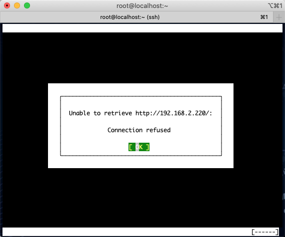
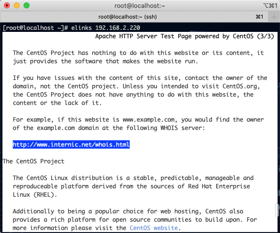

# 第六章：使用Apache搭建Web网站服务器

---

## 目录

* [apache 服务器概述-安装](#installApache)
* [配置 web 服务器-搭建 LAMP 环境](#settingWeb)
* [修改 web 网站根目录-配置别名-虚拟目录](#webRoot)
* [实现 apache 打开软链接功能-禁止显示目录列表-用户认证](#apache)
* [apache 虚拟主机基于-IP-域名-端口三种搭建方式](#apacheIp)

## 内容

<font color="#f00">注意：本节课是用 rpm 包来搭建 LAMP 环境，主要是让同学们初步了解下相关概念和LAMP 环境的功能，后期会带大家用源码编译的方式来精讲 LAMP 和 LNMP 环境，包括环境搭建，调优等等。</font>

Apache 服务端：nogfoget1.com IP: 192.168.2.220

Apache 客户端：nogfoget2.com IP: 192.168.2.218

### <a href="#installApache" id="installApache">apache 服务器概述-安装</a>

WEB 服务器也称为 WWW(WORLD WIDE WEB，万维网)服务器，主要功能是提供网上信息浏览服务。

常见的Web服务器：`httpd(apache)`、`nginx+PHP`、`tomcat(jsp+html)`、`win:ISS`

<font color="#f00">今天的主角：`LAMP`=`Linux`+`Apache`+`Mysql`+`PHP` 中的 Apache（HTTPD）</font>

类 LINUX 系统

`Linux`+`Apache`+`Mysql`/`MariaDB`+`Perl`/`PHP`/`Python` 一组常用来搭建动态网站或者服务器的开源软件，本身都是各自独立的程序，但是因为常被放在一起使用，拥有了越来越高的兼容度，共同组成了一个强大的 Web 应用程序平台。随着开源潮流的蓬勃发展，开放源代码 的 `LAMP` 已经与 `J2EE` 和`.net` 商业软件形成三足鼎立之势，并且该软件开发的项目在软件方 面的投资成本较低，因此受到整个 IT 界的关注。从网站的流量上来说，50%以上的访问流量 是 LAMP 来提供的，LAMP 是最强大的网站解决方案。

**Apache定义**

Apache HTTPD Server 简称 Apache，是 Apache 软件基金会的一个开源的网页服务器， 可以在大多数计算机操作系统中运行，由于其多平台和安全性被广泛使用，是最流行的 Web 服务器端软件之一。它快速、可靠并且可通过简单的 API 扩展，将 Perl/Python 等解释器编译到服务器中！Apache HTTP 服务器是一个模块化的服务器,各个功能使用模块化进行插拔！目前支持 Windows，Linux，Unix 等平台！

Apache 软件基金会（也就是 Apache Software Foundation，简称为 ASF），是专门为运作一个开源软件项目的 Apache 的团体提供支持的非盈利性组织，这个开源软件项目就是 Apache 项目！那么我们的 HTTPD 也只是 Apache 的开源项目之一！

主要的开源项目：HTTP Server，Ant，DB，iBATIS，Jakarta，Logging，Maven，Struts，Tomcat，Tapestry，Hadoop 等等。只是最有名的是 HTTP Server，所以现在所说的 Apache 已经就是 HTTPD Server 的代号了! 我们还见的比较多的是 Tomcat，Hadoop 等项目

官方网站：[http://www.apache.org/](http://www.apache.org/) httpd：[http://httpd.apache.org/](http://httpd.apache.org/)

**MySQL定义**

MySQL 是一个关系型数据库管理系统，由瑞典 MySQL AB 公司开发，目前属于 Oracle 旗下公司，他也是最流行的关系型数据库管理系统！特别是在 WEB 应用方面！

关系型数据库：它通过数据、关系和对数据的约束三者组成的数据模型来存放和管理数据

官方网站：[http://www.mysql.com/](http://www.mysql.com/)

**PHP定义**

PHP（外文名:PHP: Hypertext Preprocessor，中文名：“超文本预处理器”）是一种通用开源脚本语言。语法吸收了 C 语言、Java 和 Perl 的特点，利于学习，使用广泛，主要适用于 Web 开发领域。PHP 独特的语法混合了 C、Java、Perl 以及 PHP 自创的语法。它可以比 CGI 或者 Perl 更快速地执行动态网页。用 PHP 做出的动态页面与其他的编程语言相比， PHP 是将程序嵌入到 HTML（标准通用标记语言下的一个应用）文档中去执行，执行效率比完全生成 HTML 标记的 CGI 要高许多；PHP 还可以执行编译后代码，编译可以达到加密和优化代码运行，使代码运行更快。

简单的说，PHP 就是一个脚本解释器！ 官方网站：[http://php.net/](http://php.net/)

PHP 服务器安装好之后，升级切记注意，不要盲目升级！因为它会废弃很多废弃低效的语法!

### <a href="#settingWeb" id="settingWeb">配置 web 服务器-搭建 LAMP 环境</a>


<center>LAMP 工作原理</center>

工作模式是：B/S 模式

工作端口是：80/http 正常端口 443/https SSL 端口

安装服务器端：httpd

```
[root@localhost ~]# yum -y install httpd httpd-devel
```

* `httpd-2.4.6-67.el7.centos.x86_64.rpm`：<font color="#f00">Apache 服务的主程序包，服务器端必须安装该软件包</font>
* `httpd-devel-2.4.6-67.el7.centos.x86_64.rpm`：<font color="#f00">Apache 开发程序包</font>
* `httpd-manual-2.4.6-67.el7.centos.noarch.rpm`：<font color="#f00">Apache手册文档，包含HTML 格式的Apache 计划的Apache User's Guide 说明指南</font>

后自动解决安装很多依赖的软件包，后期大家在学习源码编译安装的时候，会遇到这样的问题，需要手动把依赖的包安装好，才能编译通过。

安装字符界面的下浏览器客户端：elinks

```
[root@localhost ~]# yum install elinks -y
```



<center>字符界面的下浏览器客户端elinks</center>

```
[root@localhost ~]# ll /etc/httpd/conf/httpd.conf
-rw-r--r-- 1 root root 11753 Aug  6  2019 /etc/httpd/conf/httpd.conf

[root@localhost ~]# systemctl start httpd.service    # 启动服务
[root@localhost ~]# systemctl enable httpd.service # 开机自动启动服务
Created symlink from /etc/systemd/system/multi-user.target.wants/httpd.service to /usr/lib/systemd/system/httpd.service.

[root@localhost ~]# netstat -anutp | grep 80
tcp        0      0 0.0.0.0:22              0.0.0.0:*               LISTEN      780/sshd
tcp6       0      0 :::80                   :::*                    LISTEN      2348/httpd
tcp6       0      0 :::22                   :::*                    LISTEN      780/sshd
```

通过浏览器可以访问 [http://192.168.2.220/](http://192.168.2.220/)

或者

```
[root@localhost ~]# elinks 192.168.2.220
```



```
[root@localhost ~]# vim /etc/httpd/conf/httpd.conf

  1 #
  2 # This is the main Apache HTTP server configuration file.  It contains the
  3 # configuration directives that give the server its instructions.
  4 # See <URL:http://httpd.apache.org/docs/2.4/> for detailed information.
  5 # In particular, see
  6 # <URL:http://httpd.apache.org/docs/2.4/mod/directives.html>
  7 # for a discussion of each configuration directive.
  8 #
  9 # Do NOT simply read the instructions in here without understanding
 10 # what they do.  They're here only as hints or reminders.  If you are unsure
 11 # consult the online docs. You have been warned.
 12 #
 13 # Configuration and logfile names: If the filenames you specify for many
 14 # of the server's control files begin with "/" (or "drive:/" for Win32), the
 15 # server will use that explicit path.  If the filenames do *not* begin
 16 # with "/", the value of ServerRoot is prepended -- so 'log/access_log'
 17 # with ServerRoot set to '/www' will be interpreted by the
 18 # server as '/www/log/access_log', where as '/log/access_log' will be
 19 # interpreted as '/log/access_log'.
 20
 21 #
 22 # ServerRoot: The top of the directory tree under which the server's
 23 # configuration, error, and log files are kept.
 24 #
 25 # Do not add a slash at the end of the directory path.  If you point
 26 # ServerRoot at a non-local disk, be sure to specify a local disk on the
 27 # Mutex directive, if file-based mutexes are used.  If you wish to share the
 28 # same ServerRoot for multiple httpd daemons, you will need to change at
 29 # least PidFile.
 30 #
 31 ServerRoot "/etc/httpd"
 32
 33 #
 34 # Listen: Allows you to bind Apache to specific IP addresses and/or
 35 # ports, instead of the default. See also the <VirtualHost>
 36 # directive.
 37 #
 38 # Change this to Listen on specific IP addresses as shown below to
 39 # prevent Apache from glomming onto all bound IP addresses.
 40 #
 41 #Listen 12.34.56.78:80
 42 Listen 80
 43
 44 #
 45 # Dynamic Shared Object (DSO) Support
 46 #
 47 # To be able to use the functionality of a module which was built as a DSO you
 48 # have to place corresponding `LoadModule' lines at this location so the
 49 # directives contained in it are actually available _before_ they are used.
 50 # Statically compiled modules (those listed by `httpd -l') do not need
 51 # to be loaded here.
 52 #
 53 # Example:
 54 # LoadModule foo_module modules/mod_foo.so
 55 #
 56 Include conf.modules.d/*.conf
 57
 58 #
 59 # If you wish httpd to run as a different user or group, you must run
 60 # httpd as root initially and it will switch.
 61 #
 62 # User/Group: The name (or #number) of the user/group to run httpd as.
 63 # It is usually good practice to create a dedicated user and group for
 64 # running httpd, as with most system services.
 65 #
 66 User apache
 67 Group apache
 68
 69 # 'Main' server configuration
 70 #
 71 # The directives in this section set up the values used by the 'main'
 72 # server, which responds to any requests that aren't handled by a
 73 # <VirtualHost> definition.  These values also provide defaults for
 74 # any <VirtualHost> containers you may define later in the file.
 75 #
 76 # All of these directives may appear inside <VirtualHost> containers,
 77 # in which case these default settings will be overridden for the
 78 # virtual host being defined.
 79 #
 80
 81 #
 82 # ServerAdmin: Your address, where problems with the server should be
 83 # e-mailed.  This address appears on some server-generated pages, such
 84 # as error documents.  e.g. admin@your-domain.com
 85 #
 86 ServerAdmin root@localhost
 87
 88 #
 89 # ServerName gives the name and port that the server uses to identify itself.
 90 # This can often be determined automatically, but we recommend you specify
 91 # it explicitly to prevent problems during startup.
 92 #
 93 # If your host doesn't have a registered DNS name, enter its IP address here.
 94 #
 95 #ServerName www.example.com:80 # 服务器主机名
 96
 97 #
 98 # Deny access to the entirety of your server's filesystem. You must
 99 # explicitly permit access to web content directories in other
100 # <Directory> blocks below.
101 #
102 <Directory />
103     AllowOverride none
104     Require all denied
105 </Directory>
106
107 #
108 # Note that from this point forward you must specifically allow
109 # particular features to be enabled - so if something's not working as
110 # you might expect, make sure that you have specifically enabled it
111 # below.
112 #
113
114 #
115 # DocumentRoot: The directory out of which you will serve your
116 # documents. By default, all requests are taken from this directory, but
117 # symbolic links and aliases may be used to point to other locations.
118 #
119 DocumentRoot "/var/www/html"
120
121 #
122 # Relax access to content within /var/www.
123 #
124 <Directory "/var/www">
125     AllowOverride None
126     # Allow open access:
127     Require all granted
128 </Directory>
129
130 # Further relax access to the default document root:
131 <Directory "/var/www/html">
132     #
133     # Possible values for the Options directive are "None", "All",
134     # or any combination of:
135     #   Indexes Includes FollowSymLinks SymLinksifOwnerMatch ExecCGI MultiViews
136     #
137     # Note that "MultiViews" must be named *explicitly* --- "Options All"
138     # doesn't give it to you.
139     #
140     # The Options directive is both complicated and important.  Please see
141     # http://httpd.apache.org/docs/2.4/mod/core.html#options
142     # for more information.
143     #
144     Options Indexes FollowSymLinks
145
146     #
147     # AllowOverride controls what directives may be placed in .htaccess files.
148     # It can be "All", "None", or any combination of the keywords:
149     #   Options FileInfo AuthConfig Limit
150     #
151     AllowOverride None
152
153     #
154     # Controls who can get stuff from this server.
155     #
156     Require all granted
157 </Directory>
158
159 #
160 # DirectoryIndex: sets the file that Apache will serve if a directory
161 # is requested.
162 #
163 <IfModule dir_module>
164     DirectoryIndex index.html
165 </IfModule>
166
167 #
168 # The following lines prevent .htaccess and .htpasswd files from being
169 # viewed by Web clients.
170 #
171 <Files ".ht*">
172     Require all denied
173 </Files>
174
175 #
176 # ErrorLog: The location of the error log file.
177 # If you do not specify an ErrorLog directive within a <VirtualHost>
178 # container, error messages relating to that virtual host will be
179 # logged here.  If you *do* define an error logfile for a <VirtualHost>
180 # container, that host's errors will be logged there and not here.
181 #
182 ErrorLog "logs/error_log"
183
184 #
185 # LogLevel: Control the number of messages logged to the error_log.
186 # Possible values include: debug, info, notice, warn, error, crit,
187 # alert, emerg.
188 #
189 LogLevel warn
190
191 <IfModule log_config_module>
192     #
193     # The following directives define some format nicknames for use with
194     # a CustomLog directive (see below).
195     #
196     LogFormat "%h %l %u %t \"%r\" %>s %b \"%{Referer}i\" \"%{User-Agent}i\"" combined
197     LogFormat "%h %l %u %t \"%r\" %>s %b" common
198
199     <IfModule logio_module>
200       # You need to enable mod_logio.c to use %I and %O
201       LogFormat "%h %l %u %t \"%r\" %>s %b \"%{Referer}i\" \"%{User-Agent}i\" %I %O" combinedio
202     </IfModule>
203
204     #
205     # The location and format of the access logfile (Common Logfile Format).
206     # If you do not define any access logfiles within a <VirtualHost>
207     # container, they will be logged here.  Contrariwise, if you *do*
208     # define per-<VirtualHost> access logfiles, transactions will be
209     # logged therein and *not* in this file.
210     #
211     #CustomLog "logs/access_log" common
212
213     #
214     # If you prefer a logfile with access, agent, and referer information
215     # (Combined Logfile Format) you can use the following directive.
216     #
217     CustomLog "logs/access_log" combined
218 </IfModule>
219
220 <IfModule alias_module>
221     #
222     # Redirect: Allows you to tell clients about documents that used to
223     # exist in your server's namespace, but do not anymore. The client
224     # will make a new request for the document at its new location.
225     # Example:
226     # Redirect permanent /foo http://www.example.com/bar
227
228     #
229     # Alias: Maps web paths into filesystem paths and is used to
230     # access content that does not live under the DocumentRoot.
231     # Example:
232     # Alias /webpath /full/filesystem/path
233     #
234     # If you include a trailing / on /webpath then the server will
235     # require it to be present in the URL.  You will also likely
236     # need to provide a <Directory> section to allow access to
237     # the filesystem path.
238
239     #
240     # ScriptAlias: This controls which directories contain server scripts.
241     # ScriptAliases are essentially the same as Aliases, except that
242     # documents in the target directory are treated as applications and
243     # run by the server when requested rather than as documents sent to the
244     # client.  The same rules about trailing "/" apply to ScriptAlias
245     # directives as to Alias.
246     #
247     ScriptAlias /cgi-bin/ "/var/www/cgi-bin/"
248
249 </IfModule>
250
251 #
252 # "/var/www/cgi-bin" should be changed to whatever your ScriptAliased
253 # CGI directory exists, if you have that configured.
254 #
255 <Directory "/var/www/cgi-bin">
256     AllowOverride None
257     Options None
258     Require all granted
259 </Directory>
260
261 <IfModule mime_module>
262     #
263     # TypesConfig points to the file containing the list of mappings from
264     # filename extension to MIME-type.
265     #
266     TypesConfig /etc/mime.types
267
268     #
269     # AddType allows you to add to or override the MIME configuration
270     # file specified in TypesConfig for specific file types.
271     #
272     #AddType application/x-gzip .tgz
273     #
274     # AddEncoding allows you to have certain browsers uncompress
275     # information on the fly. Note: Not all browsers support this.
276     #
277     #AddEncoding x-compress .Z
278     #AddEncoding x-gzip .gz .tgz
279     #
280     # If the AddEncoding directives above are commented-out, then you
281     # probably should define those extensions to indicate media types:
282     #
283     AddType application/x-compress .Z
284     AddType application/x-gzip .gz .tgz
285
286     #
287     # AddHandler allows you to map certain file extensions to "handlers":
288     # actions unrelated to filetype. These can be either built into the server
289     # or added with the Action directive (see below)
290     #
291     # To use CGI scripts outside of ScriptAliased directories:
292     # (You will also need to add "ExecCGI" to the "Options" directive.)
293     #
294     #AddHandler cgi-script .cgi
295
296     # For type maps (negotiated resources):
297     #AddHandler type-map var
298
299     #
300     # Filters allow you to process content before it is sent to the client.
301     #
302     # To parse .shtml files for server-side includes (SSI):
303     # (You will also need to add "Includes" to the "Options" directive.)
304     #
305     AddType text/html .shtml
306     AddOutputFilter INCLUDES .shtml
307 </IfModule>
308
309 #
310 # Specify a default charset for all content served; this enables
311 # interpretation of all content as UTF-8 by default.  To use the
312 # default browser choice (ISO-8859-1), or to allow the META tags
313 # in HTML content to override this choice, comment out this
314 # directive:
315 #
316 AddDefaultCharset UTF-8
317
318 <IfModule mime_magic_module>
319     #
320     # The mod_mime_magic module allows the server to use various hints from the
321     # contents of the file itself to determine its type.  The MIMEMagicFile
322     # directive tells the module where the hint definitions are located.
323     #
324     MIMEMagicFile conf/magic
325 </IfModule>
326
327 #
328 # Customizable error responses come in three flavors:
329 # 1) plain text 2) local redirects 3) external redirects
330 #
331 # Some examples:
332 #ErrorDocument 500 "The server made a boo boo."
333 #ErrorDocument 404 /missing.html
334 #ErrorDocument 404 "/cgi-bin/missing_handler.pl"
335 #ErrorDocument 402 http://www.example.com/subscription_info.html
336 #
337
338 #
339 # EnableMMAP and EnableSendfile: On systems that support it,
340 # memory-mapping or the sendfile syscall may be used to deliver
341 # files.  This usually improves server performance, but must
342 # be turned off when serving from networked-mounted
343 # filesystems or if support for these functions is otherwise
344 # broken on your system.
345 # Defaults if commented: EnableMMAP On, EnableSendfile Off
346 #
347 #EnableMMAP off
348 EnableSendfile on
349
350 # Supplemental configuration
351 #
352 # Load config files in the "/etc/httpd/conf.d" directory, if any.
```

* `ServerName` 192.168.1.235:80 # 服务器主机名
* `PidFile run/httpd.pid` # 运行进程 ID 存放
* `Timeout 60` # 超时时间，多少 s 没有反应就超时
* `KeepAlive Off` # 是否允许一个永久的链接，设置为 OFF 的时候，不能保持连接功能，传输效率比较低，设置为 ON 时，可以提高服务器传输文件的效率，建议开启
* `MaxKeepAliveRequests` 100 # 设置 KeepAlive 为 ON 时，设置客户端每次连接允许 请求相应最大文件数，默认 100 个
* `KeepAliveTimeout 15` # 超时时间，同一个客户端下一个请求 15s 没收到就 超时
* `Listen 80` # 监听端口，默认本地 IP，如果指定 ip 写上 IP:80
* `<IfModule prefork.c>`
* `StartServers8` # 服务开始起启动 8 个进程
* `MinSpareServers5` # 最小空闲 5 个进程
* `MaxSpareServers20` # 最多空闲 20 个进程
* `ServerLimit256` # 服务器允许配置进程数上线
* `MaxClients256` # 最大连接数 256，超过要进入等候队列
* `MaxRequestsPerChild4000` # 每个进程生存期内服务最大的请求数量，0 表示用不 结束
* `</IfModule>`
* `<Directory />`
* `Options FollowSymLinks` # Options Indexes 目录浏览 FollowSymLinks 用连接
* 浏览
* `AllowOverride None` # 设置为 none，忽略.htaccess
* `</Directory>`
* `LoadModule auth_basic_module modules/mod_auth_basic.so` # 载入的库，模块
* `Include conf.d/*.conf` # conf.d 里面的 conf 文件也属有效配置文件
* `User apache` # 运行以哪个身份运行
* `Group apache` # 运行以哪个组的身份运行
* `ServerAdmin root@localhost` # 管理员邮箱
* `DocumentRoot "/var/www/html"` # 默认的主目录，如果改动要改动两处，Directory
* `<Directory "/var/www/html">`
* `Options Indexes FollowSymLinks AllowOverride None`
* `Order allow,deny` # 这里默认后者生效，也就是 deny 生效
* `Allow from all` # 这里说允许所有
* `</Directory>`
* `LogLevel warn` # 日志等级
* `DirectoryIndex index.html index.html.var` #首页
* `AccessFileName .htaccess` # access 文件名，也可以在这里定义伪静态、防盗链等，不建议在这个文件定义
* `AddDefaultCharset UTF-8` # 支持的语言，默认编码配置文件的最后是虚拟主机的字段，其中你大部分字段做个了解即可，用到的时候去查 即可

```
[root@localhost ~]# yum -y install httpd mariadb mariadb-server php php-mysql

[root@localhost ~]# systemctl start mariadb.service
[root@localhost ~]# systemctl enable mariadb.service
Created symlink from /etc/systemd/system/multi-user.target.wants/mariadb.service to /usr/lib/systemd/system/mariadb.service.

[root@localhost ~]# mysql_secure_installation # 初始化数据库

NOTE: RUNNING ALL PARTS OF THIS SCRIPT IS RECOMMENDED FOR ALL MariaDB
      SERVERS IN PRODUCTION USE!  PLEASE READ EACH STEP CAREFULLY!

In order to log into MariaDB to secure it, we'll need the current
password for the root user.  If you've just installed MariaDB, and
you haven't set the root password yet, the password will be blank,
so you should just press enter here.

Enter current password for root (enter for none):
ERROR 1045 (28000): Access denied for user 'root'@'localhost' (using password: YES)
Enter current password for root (enter for none):
OK, successfully used password, moving on...

Setting the root password ensures that nobody can log into the MariaDB
root user without the proper authorisation.

Set root password? [Y/n] Y
New password:
Re-enter new password:
Password updated successfully!
Reloading privilege tables..
 ... Success!


By default, a MariaDB installation has an anonymous user, allowing anyone
to log into MariaDB without having to have a user account created for
them.  This is intended only for testing, and to make the installation
go a bit smoother.  You should remove them before moving into a
production environment.

Remove anonymous users? [Y/n] Y
 ... Success!

Normally, root should only be allowed to connect from 'localhost'.  This
ensures that someone cannot guess at the root password from the network.

Disallow root login remotely? [Y/n] Y
 ... Success!

By default, MariaDB comes with a database named 'test' that anyone can
access.  This is also intended only for testing, and should be removed
before moving into a production environment.

Remove test database and access to it? [Y/n] Y
 - Dropping test database...
 ... Success!
 - Removing privileges on test database...
 ... Success!

Reloading the privilege tables will ensure that all changes made so far
will take effect immediately.

Reload privilege tables now? [Y/n] Y
 ... Success!

Cleaning up...

All done!  If you've completed all of the above steps, your MariaDB
installation should now be secure.

Thanks for using MariaDB!

[root@localhost ~]# mysql -uroot -pMaomao@1213
Welcome to the MariaDB monitor.  Commands end with ; or \g.
Your MariaDB connection id is 14
Server version: 5.5.64-MariaDB MariaDB Server

Copyright (c) 2000, 2018, Oracle, MariaDB Corporation Ab and others.

Type 'help;' or '\h' for help. Type '\c' to clear the current input statement.

MariaDB [(none)]> show databases;
+--------------------+
| Database           |
+--------------------+
| information_schema |
| mysql              |
| performance_schema |
+--------------------+
3 rows in set (0.00 sec)

MariaDB [(none)]> exit;
Bye
```

```
[root@localhost html]# vim index.php # 测试 apache 是否支持 php
<?php 
phpinfo();

[root@localhost html]# systemctl restart httpd # 重启Apache
```

扩展：探针：一个 PHP 编写的文件，可以实时查看服务器硬盘资源、内存占用、网卡流量、系统负载、服务器时间等信息，定时刷新一次。以及包括服务器 IP 地址，Web 服务器环境监测，php 等信息。

例1： 搭建一台测试web服务器

部门内部搭建一台WEB服务器，采用的IP地址和端口为192.168.2.220:80，首页采用index.html文件。管理员E-mail地址为 cat@notfoget.com，网页的编码类型采用UTF-8，所有网站资源都存放在/var/www/html目录下，并将Apache的配置文件根目录设置为/etc/httpd目录。

* 设置Apache 的根目录为/etc/httpd
* 设置 httpd 监听端口 80
* 设置管理员E-mail地址为 cat@xuegod.cn
* 设置 WEB 服务器的主机名和监听端口为 192.168.0.63:80
* 设置 Apache 文档目录为/var/www/html
* 设置主页文件为 index.html
* 设置服务器的默认编码为 UTF-8

<font color="#f00">注：改配置文件之前，记得先备份一份，以便恢复。</font>

```
[root@localhost ~]# cd /etc/httpd/conf/
[root@localhost conf]# ls
httpd.conf  magic
[root@localhost conf]# cp httpd.conf httpd.conf.bak
[root@localhost conf]# vim httpd.conf
ServerRoot "/etc/httpd" # apache 配置文件的根目录
Timeout 60 # 超时时间
Listen 80   # 监听的端口
ServerAdmin cat@xuegod.cn # 设置管理员，e-mail 地址
ServerName 192.168.0.63:80 # 服务器主机名
DocumentRoot "/var/www/html" # 网站页面根目录
Options Indexes FollowSymLinks # 当一个目录没有默认首页时，允许显示此目录列表
DirectoryIndex index.html index.php # 指定默认首页
AddDefaultCharset UTF-8 # 设置服务器的默认编码为： UTF-8
```

```
[root@localhost ~]# vim /etc/httpd/conf.d/welcome.conf # 取消 apache 默认欢迎页
#
# This configuration file enables the default "Welcome" page if there
# is no default index page present for the root URL.  To disable the
# Welcome page, comment out all the lines below.
#
# NOTE: if this file is removed, it will be restored on upgrades.
# 这里注释
# <LocationMatch "^/+$">
#     Options -Indexes
#     ErrorDocument 403 /.noindex.html
# </LocationMatch>

<Directory /usr/share/httpd/noindex>
    AllowOverride None
    Require all granted
</Directory>

Alias /.noindex.html /usr/share/httpd/noindex/index.html
Alias /noindex/css/bootstrap.min.css /usr/share/httpd/noindex/css/bootstrap.min.css
Alias /noindex/css/open-sans.css /usr/share/httpd/noindex/css/open-sans.css
Alias /images/apache_pb.gif /usr/share/httpd/noindex/images/apache_pb.gif
Alias /images/poweredby.png /usr/share/httpd/noindex/images/poweredby.png

[root@localhost ~]# systemctl restart httpd
```

### <a href="#webRoot" id="webRoot">修改 web 网站根目录-配置别名-虚拟目录</a>

LAMP 环境，几种不同的安全访问机制的实现：

一、修改网站目录对应参数及权限：

修改网站默认根目录，并且设置访问权限，只有在我允许的范围之内可以访问

修改网站默认根目录

设置文档目录为`/var/www/html/bbs`

修改 DocumentRoot 路径为 指定的目录

```
[root@localhost ~]# vim /etc/httpd/conf/httpd.conf
DocumentRoot "/var/www/html/bbs"

# Further relax access to the default document root:
<Directory "/var/www/html/bbs"> # 修改目录
    #
    # Possible values for the Options directive are "None", "All",
    # or any combination of:
    #   Indexes Includes FollowSymLinks SymLinksifOwnerMatch ExecCGI MultiViews
    #
    # Note that "MultiViews" must be named *explicitly* --- "Options All"
    # doesn't give it to you.
    #
    # The Options directive is both complicated and important.  Please see
    # http://httpd.apache.org/docs/2.4/mod/core.html#options
    # for more information.
    #
    Options FollowSymLinks # 不允许目录浏览

    #
    # AllowOverride controls what directives may be placed in .htaccess files.
    # It can be "All", "None", or any combination of the keywords:
    #   Options FileInfo AuthConfig Limit
    #
    AllowOverride None

    #
    # Controls who can get stuff from this server.
    #
    Require all granted
    Order allow,deny # 顺序
    Allow from 192.168.2.1/24 # 从哪里来的允许
    Deny from 192.168.2.1/24 # 从哪里来的拒绝
    Allow from .baidu.com     # 域的写法
</Directory>

# Allow 和 Deny 都会读取，但是根据order的设置，如果冲突的时候，睡在后面谁生效，不冲突都生效
```

<font color="#f00">注意:上面的访问控制的方法是 Apache2.2 版本中的写法,在 2.4 中是不支持的</font>

Apache2.4 的访问控制:

```
Require all granted #允许所有
Require all denied #拒绝所有
Require method http-method [http-method] ... #允许，特定的 HTTP 方法
Require user userid [ userid ] ... #允许，特定用户
Require group group-name [group-name] ... #允许，特定用户组
Require valid-user # #允许，有效用户
Require ip 10 172.20 192.168.2 #允许 特定 IP 和网段
```

二、使用别名，引用网站根目录以外的路径。

将/usr/local/phpdata 目录通过虚拟目录功能添加到网站根目录。当访问 http://192.168.2.220/ phpdata/ 时，就可以访问目录/usr/local/phpdata 中的内容

注：apache 的别名也叫虚拟目录

语法：

AliasURL 路径 PATH 物理路径

```
[root@localhost ~]# vim /etc/httpd/conf/httpd.conf
261 Alias /phpdata/ "/usr/local/phpdata/"
262 <Directory "/usr/local/phpdata/">
263         Options Indexes FollowSymLinks
264         AllowOverride None
265         Require all granted
266 </Directory>
```

注：Alias /phpdata/ "/usr/local/phpdata/" #/phpdata/ 可以随意起。比如改/phpdata/ 为/php/ 则访问链接： http://192.168.0.63/php/

```
http://192.168.2.220/phpdata/index.html
```

<font color="#f00">当一个目录下没有默认首页时，访问 http://192.168.0.63/phpdata/禁止显示目录列表</font>

显示目录的效果：

```
[root@localhost ~]# cp -a /boot/grub/ /var/www/html/bbs/
[root@localhost ~]# ll !$
ll /var/www/html/bbs/
total 8
drwxr-xr-x. 2 root root  27 Jan 31 18:02 grub
-rw-r--r--  1 root root 319 Mar  1 19:47 index.html
-rw-r--r--  1 root root  17 Mar  1 19:48 index.php

[root@localhost ~]# cd /var/www/html/bbs/
[root@localhost bbs]# rm -rf index.html

[root@localhost bbs]# vim /etc/httpd/conf/httpd.conf

Options -Indexes FollowSymLink #注释 index 这行即可
```

### <a href="#apache" id="apache">实现 apache 打开软链接功能-禁止显示目录列表-用户认证</a>

<font color="#f00">一、通过用户认证的方式，对网站下`/usr/local/phpdata/`目录进行保护。设置`/usr/local/phpdata/`目录，只能通过用户名密码方式访问。</font>

```
# 在需要使用用户验证的目录的相关 Directory 段落添加以下红色标记内容：

261 Alias /phpdata/ "/usr/local/phpdata"
262 <Directory "/usr/local/phpdata/">
263         # Options Indexes FollowSymLinks
264         AllowOverride None
265         # Require all granted
266         authtype basic
267         authname "My web site"
268         authuserfile /etc/httpd/conf/passwd.secret
269         require valid-user
270 </Directory>
```

参数说明：

* `authtype basic` # authtype 命令：指定认证类型为：basic。
* `authname "My web site"` # AuthName 命令：指定认证区域名称。区域名称是在提示要求认证的对话框中显示给用户的。
* `authuserfile /etc/httpd/conf/passwd.secret` # AuthUserFile 命令：指定一个包含用户名和密码的文本文件，每行一对。
* `require` 命令 # 指定哪些用户或组才能被授权访问。如：
	+ `require user user1 user2` (只有用户 user1 和 user2 可以访问)
	+ `require valid-user` # (在 AuthUserFile 指定的文件中任何用户都可以访问)

<font color="#f00">利用 Apache 附带的程序 htpasswd，生成包含用户名和密码的文本文</font>

```
[root@localhost ~]# htpasswd -cm
Usage:
	htpasswd [-cimBdpsDv] [-C cost] passwordfile username
	htpasswd -b[cmBdpsDv] [-C cost] passwordfile username password

	htpasswd -n[imBdps] [-C cost] username
	htpasswd -nb[mBdps] [-C cost] username password
 -c  Create a new file.
 -n  Don't update file; display results on stdout.
 -b  Use the password from the command line rather than prompting for it.
 -i  Read password from stdin without verification (for script usage).
 -m  Force MD5 encryption of the password (default).
 -B  Force bcrypt encryption of the password (very secure).
 -C  Set the computing time used for the bcrypt algorithm
     (higher is more secure but slower, default: 5, valid: 4 to 31).
 -d  Force CRYPT encryption of the password (8 chars max, insecure).
 -s  Force SHA encryption of the password (insecure).
 -p  Do not encrypt the password (plaintext, insecure).
 -D  Delete the specified user.
 -v  Verify password for the specified user.
On other systems than Windows and NetWare the '-p' flag will probably not work.
The SHA algorithm does not use a salt and is less secure than the MD5 algorithm.
[root@localhost ~]# htpasswd -cm /etc/httpd/conf/passwd.secret tom
New password: 123456
Re-type new password: 123456
Adding password for user tom
```

<font color="#f00">第一个生成用户名和密码，需要创建文件，因此需要加-c 参数</font>

```
[root@localhost ~]# htpasswd -h
htpasswd: illegal option -- h
Usage:
	htpasswd [-cimBdpsDv] [-C cost] passwordfile username
	htpasswd -b[cmBdpsDv] [-C cost] passwordfile username password

	htpasswd -n[imBdps] [-C cost] username
	htpasswd -nb[mBdps] [-C cost] username password
 -c  Create a new file.
 -n  Don't update file; display results on stdout.
 -b  Use the password from the command line rather than prompting for it.
 -i  Read password from stdin without verification (for script usage).
 -m  Force MD5 encryption of the password (default).
 -B  Force bcrypt encryption of the password (very secure).
 -C  Set the computing time used for the bcrypt algorithm
     (higher is more secure but slower, default: 5, valid: 4 to 31).
 -d  Force CRYPT encryption of the password (8 chars max, insecure).
 -s  Force SHA encryption of the password (insecure).
 -p  Do not encrypt the password (plaintext, insecure).
 -D  Delete the specified user.
 -v  Verify password for the specified user.
On other systems than Windows and NetWare the '-p' flag will probably not work.
The SHA algorithm does not use a salt and is less secure than the MD5 algorithm.

[root@localhost ~]# htpasswd -m /etc/httpd/conf/passwd.secret bob
New password:
Re-type new password:
Adding password for user bob

[root@localhost ~]# cat /etc/httpd/conf/passwd.secret
tom:$apr1$SAuuvpTN$XlS85eMCzGcgvCxBETe6b0
bob:$apr1$ta0kG5VS$LBxCficbaFkzAs6w6NeV21
```

### <a href="#apacheIp" id="apacheIp">apache 虚拟主机基于-IP-域名-端口三种搭建方式</a>

一、配置 apache 虚拟主机，实现在一台服务器上运行多个网站

apache 虚拟主机实现有三种方法：

1. 通过不同的 IP 地址
2. 通过不同的域名
3. 通过不同的端口号

三种都需要把虚拟主机功能打开：

方法 1：通过不同的 IP 地址，解析不同域名给服务器增加 IP（另一个域名解析出来的那个 IP）。

```
[root@localhost ~]# ifconfig enp0s3:1 192.168.2.221 netmask 255.255.255.0
[root@localhost ~]# ifconfig
enp0s3: flags=4163<UP,BROADCAST,RUNNING,MULTICAST>  mtu 1500
        inet 192.168.2.220  netmask 255.255.255.0  broadcast 192.168.2.255
        inet6 fe80::4a13:c9e1:c2:41fe  prefixlen 64  scopeid 0x20<link>
        ether 08:00:27:6f:90:3c  txqueuelen 1000  (Ethernet)
        RX packets 49978  bytes 46304677 (44.1 MiB)
        RX errors 0  dropped 0  overruns 0  frame 0
        TX packets 19788  bytes 2845535 (2.7 MiB)
        TX errors 0  dropped 0 overruns 0  carrier 0  collisions 0

enp0s3:1: flags=4163<UP,BROADCAST,RUNNING,MULTICAST>  mtu 1500
        inet 192.168.2.221  netmask 255.255.255.0  broadcast 192.168.2.255
        ether 08:00:27:6f:90:3c  txqueuelen 1000  (Ethernet)

lo: flags=73<UP,LOOPBACK,RUNNING>  mtu 65536
        inet 127.0.0.1  netmask 255.0.0.0
        inet6 ::1  prefixlen 128  scopeid 0x10<host>
        loop  txqueuelen 1000  (Local Loopback)
        RX packets 63  bytes 35973 (35.1 KiB)
        RX errors 0  dropped 0  overruns 0  frame 0
        TX packets 63  bytes 35973 (35.1 KiB)
        TX errors 0  dropped 0 overruns 0  carrier 0  collisions 0
[root@localhost ~]# mkdir /var/www/html/bbs/
[root@localhost ~]# echo "bbs.notfoget.com" > /var/www/html/bbs/index.html

[root@localhost ~]# cd /etc/httpd/conf.d/
[root@localhost conf.d]# vim bbs.conf

<VirtualHost 192.168.2.220:80>
        ServerAdmin webmaster@dummy-host.example.com
        DocumentRoot /var/www/html
        ServerName dummy-host.example.com
        ErrorLog logs/dummy-host.example.com-error_log
        CustomLog logs/dummy-host.example.com-access_log common
</VirtualHost>
<VirtualHost 192.168.2.221:80>
        ServerAdmin webmaster@dummy-host.example.com
        DocumentRoot /var/www/html/bbs/
        ServerName dummy-host.example.com
        ErrorLog logs/dummy-host.example.com-error_log
        CustomLog logs/dummy-host.example-access_log common
</VirtualHost>

[root@localhost conf.d]# systemctl restart httpd
```

http://192.168.2.220/

http://192.168.2.221/

方法二：

通过不同域名：在域名管理后台，修改 DNS 配置，api.notfoget.com 与 bbs.notfoget.com 解析成相同的 IP。

```
[root@localhost conf.d]# vim /etc/httpd/conf.d/bbs.conf
<VirtualHost *:80>
        ServerAdmin webmaster@dummy-host.example.com
        DocumentRoot /var/www/html
        ServerName api.notfoget.com
        ErrorLog logs/api.notfoget.com-error_log
        CustomLog logs/api.notfoget.com-access_log common
</VirtualHost>
<VirtualHost *:80>
        ServerAdmin webmaster@dummy-host.example.com
        DocumentRoot /var/www/html/bbs/
        ServerName bbs.notfoget.com
        ErrorLog logs/bbs.notfoget.com-error_log
        CustomLog logs/bbs.notfoget.com-access_log common
</VirtualHost>

[root@localhost conf.d]# vim /etc/hosts
127.0.0.1   localhost localhost.localdomain localhost4 localhost4.localdomain4
::1         localhost localhost.localdomain localhost6 localhost6.localdomain6

192.168.2.220 api.notfoget.com
192.168.2.220 bbs.notfoget.com

[root@localhost conf.d]# elinks bbs.notfoget.com
[root@localhost conf.d]# elinks api.notfoget.com
```

方法 3：基于端口配置虚拟主机：

```
[root@localhost conf.d]# vim /etc/httpd/conf.d/bbs.conf
<VirtualHost *:80>
        ServerAdmin webmaster@dummy-host.example.com
        DocumentRoot /var/www/html
        ServerName api.notfoget.com
        ErrorLog logs/api.notfoget.com-error_log
        CustomLog logs/api.notfoget.com-access_log common
</VirtualHost>
<VirtualHost *:81>
        ServerAdmin webmaster@dummy-host.example.com
        DocumentRoot /var/www/html/bbs/
        ServerName bbs.notfoget.com
        ErrorLog logs/bbs.notfoget.com-error_log
        CustomLog logs/bbs.notfoget.com-access_log common
</VirtualHost>

改：
Listen 80 
为：
Listen 80 
Listen 81 
# 更改为你要添加的多个端口
```
