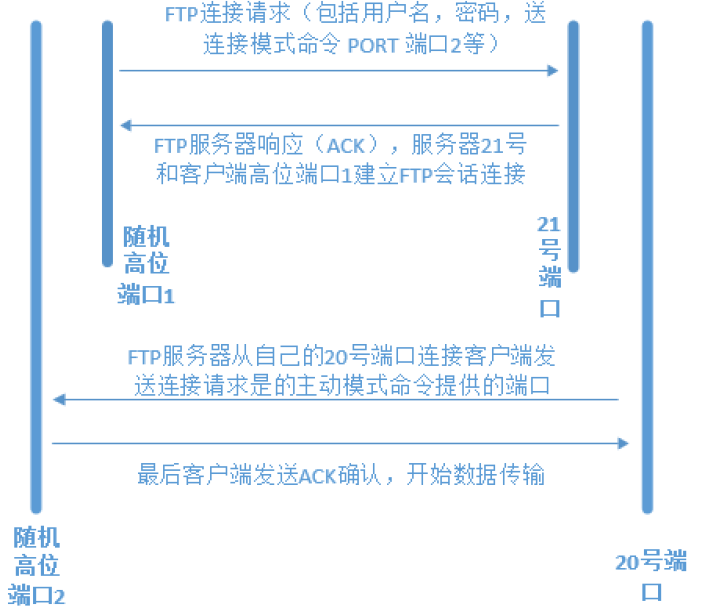
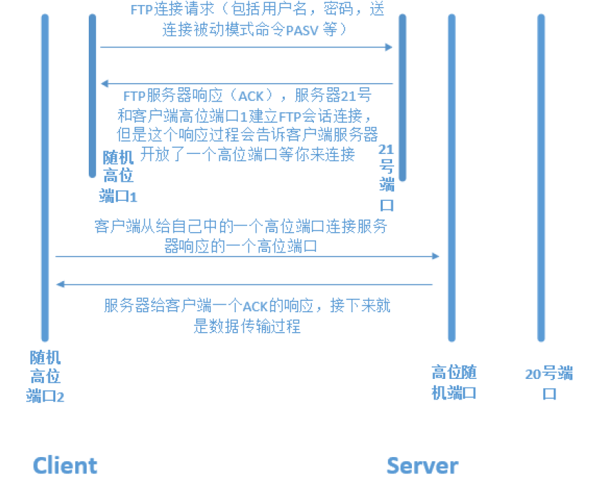
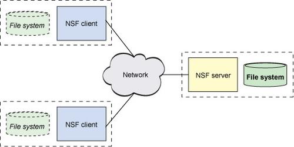

# 第四章：搭建FTP服务器实现文件共享和NFS服务器配置

---

## 目录

* [VSFTP 服务器概述](#vsftp)
* [安装配置 VSFTP](#installVsftp)
* [实战：匿名访问 VSFTP](#)
* [实战：用户名密码方式访问 VSFTP](#)
* [NFS 概述-配置 NFS 服务器并实现开机自动挂载](#nfs)

## 内容

实验环境：

1. spring(源主机：192.168.2.220)
2. hye(目标主机：192.168.2.218)

### <a href="#vsftp" id="vsftp">VSFTP 服务器概述</a>

#### 1.1 FTP 服务概述

FTP 服务器（File Transfer Protocol Server）是在互联网上提供文件存储和访问服务的计算机，它们依照 FTP 协议提供服务。

FTP（File Transfer Protocol: 文件传输协议）作用：Internet 上用来传送文件的协议。

常见 FTP 服务器：

* Windows：`Serv-U` 、`FTP Server`、`filezilla_server`
* Linux：`ProFTPD`:（Professional FTP daemon）一个 Unix 平台上或是类 Unix 平台上（如 Linux, FreeBSD 等）的 FTP 服务器程序。

#### 1.2 本节主讲：VSFTP

VSFTP是一个基于GPL 发布的类 Unix 系统上使用的FTP 服务器软件，它的全称是 Very Secure FTP 从此名称可以看出来，编制者的初衷是代码的安全。

特点：它是一个安全、高速、稳定的 FTP 服务器。

VSFTP 模式： C/S 模式

FTP 监听的端口：

* 端口 20：用于传输数据
* 端口 21：用于传输指令

```
[root@localhost ~]# vim /etc/services
ftp-data        20/sctp                 # FTP
```

#### 1.3 工作流程（原理）分为两种模式

**主动和被动模式：**  
FTP 会话包含了两个通道，控制通道和数据传输通道，FTP 的工作有两种模式，一种是主动模式，一种是被动模式，以 FTP Server 为参照，主动模式，服务器主动连接客户端传输；被动模式，等待客户的连接。

**主动模式的工作原理：**  
FTP 客户端连接到 FTP 服务器的 21 号端口，发送用户名和密码，客户端随机开放一个端口（1024以上），发送PORT 命令到FTP服务器，告知服务器客户端采用主动模式并开放端口，FTP 服务器收到 PORT主动模式命令和端口后，通过服务器的 20 号端口和客户端开放的端口连接，发送数据，原理如图 4-2 所示，（无论是主动还是被动模式，首先的控制通道都是先建立起来，只是在数据传输模式上的区别）



<center>图 4-2 FTP 主动模式工作原理图</center>

**被动模式的工作原理：**  
PASV 是 Passive 的缩写，中文成为被动模式，工作原理：FTP 客户端连接到 FTP 服务器所监听的21 号端口，发送用户名和密码，发送 PASV 命令到 FTP 服务器，服务器在本地随机开放一个端口（1024以上），然后把开放的端口告知客户端，而后客户端再连接到服务器开放的端口进行数据传输，原理如图4-3 所示。



<center>图 4-3 FTP 被动模式工作原理图</center>

> 注：以上的说明主动和被动，是相对于的 FTP server 端而判断，如果 server 去连接 client 开放的端口，说明是主动的，相反，如果 client 去连接 server 开放的端口，则是被动。

### <a href="#installVsftp" id="installVsftp">安装配置 VSFTP</a>

```
# 使用 rpm 安装本地光盘中的 vsftp 程序包
[root@localhost ~]# rpm -ivh /mnt/Packages/vsftpd-3.0.2-25.el7.x86_64.rpm
```

```
# 使用 Yum 直接安装
[root@localhost ~]# yum -y install vsftpd
```

#### 2.1 安装客户端

```
[root@hye ~]# yum -y install lftp
```

> 注：从 CentOS 开始，系统镜像中默认没有 ftp 客户端命令。取而代之的是 lftp 命令

Linux 客户端：lftp 是一个功能强大的下载工具，它支持访问文件的协议: `ftp`、`ftps`、`http`、`https`、`hftp`、`fish`(其 中 ftps 和 https 需要在编译的时候包含 openssl 库)，`llftp` 的界面非常类似一个 Shell，有命令补全、历史记录、允许多个后台任务执行等功能，使用起来非常方便。它还有书签、排队、镜像、断点续传、多进程下载、等功能。

#### 2.2 配置文件位置

```
[root@localhost ~]# ls -la /etc/vsftpd/
total 32
drwxr-xr-x   2 root root   88 Feb 22 04:21 .
drwxr-xr-x. 76 root root 8192 Feb 22 04:21 ..
-rw-------   1 root root  125 Oct 31  2018 ftpusers     # 用于指定哪些用户不能访问 FTP 服务器，即黑名单
-rw-------   1 root root  361 Oct 31  2018 user_list     # 指定允许使用 VSFTP 的用户列表文件，即白名单
-rw-------   1 root root 5116 Oct 31  2018 vsftpd.conf # vsftpd 的核心配置文件
-rwxr--r--   1 root root  338 Oct 31  2018 vsftpd_conf_migrate.sh # 是 vsftpd 操作的一些变量和设置脚本

[root@localhost ~]# ls /var/ftp/ # 默认情况下匿名用户的根目录"/var/ftp/"
pub
```

```
[root@localhost ~]# vim /etc/vsftpd/user_list
# vsftpd userlist
# If userlist_deny=NO, only allow users in this file
# If userlist_deny=YES (default), never allow users in this file, and # 如果 userlist_deny= YES（默认），绝不允许在这个文件中的用户登录 ftp，甚至不提示输入密码
# do not even prompt for a password.
# Note that the default vsftpd pam config also checks /etc/vsftpd/ftpusers
# for users that are denied.
root
bin
daemon
adm
lp
sync
shutdown
halt
mail
news
uucp
operator
games
nobody
~
```

#### 2.3 启动服务

```
[root@localhost ~]# systemctl start vsftpd    # 启动 FTP 服务
[root@localhost ~]# systemctl enable vsftpd # 设置开启自动启动 FTP 服务
Created symlink from /etc/systemd/system/multi-user.target.wants/vsftpd.service to /usr/lib/systemd/system/vsftpd.service.
```

> 注意关闭 iptables 和 SElinux

```
# 查看 FTP 服务监听的端口
[root@localhost ~]# netstat -antup | grep ftp
tcp6       0      0 :::21                   :::*                    LISTEN      1155/vsftpd
```

思考：以上内容中说明 FTP 监听两个端口，但目前 FTP 已经启动了，但经过查看，只查看到 21 号端口，还有 20 号端口没有查看到？  
答案：是因为没有数据传输，20 号端口是用于传输数据的，所以 20 号端口是尚未开启，如有数据传输时，20 号端口则会开启。

#### 2.4 FTP 服务的使用方法

```
[root@hye ~]# lftp 192.168.2.220
```

### <a href="#anonymousAccess" id="anonymousAccess">实战：匿名访问 VSFTP</a>

```
[root@localhost ~]# cd /etc/vsftpd/ # 切换工作目录至 FTP 工作目录下
[root@localhost vsftpd]# cp vsftpd.conf{,.bak} # 使用命令展开式，FTP 配置文件备份，便于后期恢复还原
[root@localhost vsftpd]# ls
ftpusers  user_list  vsftpd.conf  vsftpd.conf.bak  vsftpd_conf_migrate.sh
```

```
[root@localhost ~]# vim /etc/vsftpd/vsftpd.conf
# Example config file /etc/vsftpd/vsftpd.conf
#
# The default compiled in settings are fairly paranoid. This sample file
# loosens things up a bit, to make the ftp daemon more usable.
# Please see vsftpd.conf.5 for all compiled in defaults.
#
# READ THIS: This example file is NOT an exhaustive list of vsftpd options.
# Please read the vsftpd.conf.5 manual page to get a full idea of vsftpd's
# capabilities.
#
# Allow anonymous FTP? (Beware - allowed by default if you comment this out).
anonymous_enable=YES 
#
# Uncomment this to allow local users to log in.
# When SELinux is enforcing check for SE bool ftp_home_dir
local_enable=YES
#
# Uncomment this to enable any form of FTP write command.
write_enable=YES
#
# Default umask for local users is 077. You may wish to change this to 022,
"vsftpd.conf" 128L, 5116C                                                1,1           Top
# Example config file /etc/vsftpd/vsftpd.conf
#
# The default compiled in settings are fairly paranoid. This sample file
# loosens things up a bit, to make the ftp daemon more usable.
# Please see vsftpd.conf.5 for all compiled in defaults.
#
# READ THIS: This example file is NOT an exhaustive list of vsftpd options.
# Please read the vsftpd.conf.5 manual page to get a full idea of vsftpd's
# capabilities.
#
# Allow anonymous FTP? (Beware - allowed by default if you comment this out).
anonymous_enable=YES
#
# Uncomment this to allow local users to log in.
# When SELinux is enforcing check for SE bool ftp_home_dir
local_enable=YES
#
# Uncomment this to enable any form of FTP write command.
write_enable=YES
#
# Default umask for local users is 077. You may wish to change this to 022,
# if your users expect that (022 is used by most other ftpd's)
local_umask=022
#
# Uncomment this to allow the anonymous FTP user to upload files. This only
# has an effect if the above global write enable is activated. Also, you will
# obviously need to create a directory writable by the FTP user.
# When SELinux is enforcing check for SE bool allow_ftpd_anon_write, allow_ftpd_full_access
anon_upload_enable=YES # 允许匿名用户上传文件并可以创建目录
anon_other_write_enable=YES # 匿名帐号可以有写的权限
#
# Uncomment this if you want the anonymous FTP user to be able to create
# new directories.
#anon_mkdir_write_enable=YES # 允许匿名用户上传文件并可以创建目录
#
# Activate directory messages - messages given to remote users when they
# go into a certain directory.
dirmessage_enable=YES
#
# Activate logging of uploads/downloads.
xferlog_enable=YES
#
# Make sure PORT transfer connections originate from port 20 (ftp-data).
connect_from_port_20=YES
#
# If you want, you can arrange for uploaded anonymous files to be owned by
# a different user. Note! Using "root" for uploaded files is not
# recommended!
#chown_uploads=YES
#chown_username=whoever
#
# You may override where the log file goes if you like. The default is shown
# below.
                                                                         1,1           Top
# Example config file /etc/vsftpd/vsftpd.conf
#
# The default compiled in settings are fairly paranoid. This sample file
# loosens things up a bit, to make the ftp daemon more usable.
# Please see vsftpd.conf.5 for all compiled in defaults.
#
# READ THIS: This example file is NOT an exhaustive list of vsftpd options.
# Please read the vsftpd.conf.5 manual page to get a full idea of vsftpd's
# capabilities.
#
# Allow anonymous FTP? (Beware - allowed by default if you comment this out).
anonymous_enable=YES
#
# Uncomment this to allow local users to log in.
# When SELinux is enforcing check for SE bool ftp_home_dir
local_enable=YES
#
# Uncomment this to enable any form of FTP write command.
write_enable=YES
#
# Default umask for local users is 077. You may wish to change this to 022,
# if your users expect that (022 is used by most other ftpd's)
local_umask=022
#
# Uncomment this to allow the anonymous FTP user to upload files. This only
# has an effect if the above global write enable is activated. Also, you will
# obviously need to create a directory writable by the FTP user.
# When SELinux is enforcing check for SE bool allow_ftpd_anon_write, allow_ftpd_full_access
#anon_upload_enable=YES
#
# Uncomment this if you want the anonymous FTP user to be able to create
# new directories.
#anon_mkdir_write_enable=YES
#
# Activate directory messages - messages given to remote users when they
# go into a certain directory.
dirmessage_enable=YES
#
# Activate logging of uploads/downloads.
xferlog_enable=YES
#
# Make sure PORT transfer connections originate from port 20 (ftp-data).
connect_from_port_20=YES
#
# If you want, you can arrange for uploaded anonymous files to be owned by
# a different user. Note! Using "root" for uploaded files is not
# recommended!
#chown_uploads=YES
#chown_username=whoever
#
# You may override where the log file goes if you like. The default is shown
# below.
#xferlog_file=/var/log/xferlog
#
# If you want, you can have your log file in standard ftpd xferlog format.
# Note that the default log file location is /var/log/xferlog in this case.
xferlog_std_format=YES
#
# You may change the default value for timing out an idle session.
#idle_session_timeout=600
#
# You may change the default value for timing out a data connection.
#data_connection_timeout=120
#
# It is recommended that you define on your system a unique user which the
                                                                         1,1           Top
# Example config file /etc/vsftpd/vsftpd.conf
#
# The default compiled in settings are fairly paranoid. This sample file
# loosens things up a bit, to make the ftp daemon more usable.
# Please see vsftpd.conf.5 for all compiled in defaults.
#
# READ THIS: This example file is NOT an exhaustive list of vsftpd options.
# Please read the vsftpd.conf.5 manual page to get a full idea of vsftpd's
# capabilities.
#
# Allow anonymous FTP? (Beware - allowed by default if you comment this out).
anonymous_enable=YES
#
# Uncomment this to allow local users to log in.
# When SELinux is enforcing check for SE bool ftp_home_dir
local_enable=YES
#
# Uncomment this to enable any form of FTP write command.
write_enable=YES
#
# Default umask for local users is 077. You may wish to change this to 022,
# if your users expect that (022 is used by most other ftpd's)
local_umask=022
#
# Uncomment this to allow the anonymous FTP user to upload files. This only
# has an effect if the above global write enable is activated. Also, you will
# obviously need to create a directory writable by the FTP user.
# When SELinux is enforcing check for SE bool allow_ftpd_anon_write, allow_ftpd_full_access
#anon_upload_enable=YES
#
# Uncomment this if you want the anonymous FTP user to be able to create
# new directories.
#anon_mkdir_write_enable=YES
#
# Activate directory messages - messages given to remote users when they
# go into a certain directory.
dirmessage_enable=YES
#
# Activate logging of uploads/downloads.
xferlog_enable=YES
#
# Make sure PORT transfer connections originate from port 20 (ftp-data).
connect_from_port_20=YES
#
# If you want, you can arrange for uploaded anonymous files to be owned by
# a different user. Note! Using "root" for uploaded files is not
# recommended!
#chown_uploads=YES
#chown_username=whoever
#
# You may override where the log file goes if you like. The default is shown
# below.
#xferlog_file=/var/log/xferlog
#
# If you want, you can have your log file in standard ftpd xferlog format.
# Note that the default log file location is /var/log/xferlog in this case.
xferlog_std_format=YES
#
# You may change the default value for timing out an idle session.
#idle_session_timeout=600
#
# You may change the default value for timing out a data connection.
#data_connection_timeout=120
#
# It is recommended that you define on your system a unique user which the
# ftp server can use as a totally isolated and unprivileged user.
                                                                         1,1           Top
# below.
#xferlog_file=/var/log/xferlog
#
# If you want, you can have your log file in standard ftpd xferlog format.
# Note that the default log file location is /var/log/xferlog in this case.
xferlog_std_format=YES
#
# You may change the default value for timing out an idle session.
#idle_session_timeout=600
#
# You may change the default value for timing out a data connection.
#data_connection_timeout=120
#
# It is recommended that you define on your system a unique user which the
# ftp server can use as a totally isolated and unprivileged user.
#nopriv_user=ftpsecure
#
# Enable this and the server will recognise asynchronous ABOR requests. Not
# recommended for security (the code is non-trivial). Not enabling it,
# however, may confuse older FTP clients.
#async_abor_enable=YES
#
# By default the server will pretend to allow ASCII mode but in fact ignore
# the request. Turn on the below options to have the server actually do ASCII
# mangling on files when in ASCII mode. The vsftpd.conf(5) man page explains
# the behaviour when these options are disabled.
# Beware that on some FTP servers, ASCII support allows a denial of service
# attack (DoS) via the command "SIZE /big/file" in ASCII mode. vsftpd
# predicted this attack and has always been safe, reporting the size of the
# raw file.
# ASCII mangling is a horrible feature of the protocol.
#ascii_upload_enable=YES
#ascii_download_enable=YES
#
# You may fully customise the login banner string:
#ftpd_banner=Welcome to blah FTP service.
#
# You may specify a file of disallowed anonymous e-mail addresses. Apparently
# useful for combatting certain DoS attacks.
#deny_email_enable=YES
# (default follows)
#banned_email_file=/etc/vsftpd/banned_emails
#
# You may specify an explicit list of local users to chroot() to their home
# directory. If chroot_local_user is YES, then this list becomes a list of
# users to NOT chroot().
# (Warning! chroot'ing can be very dangerous. If using chroot, make sure that
# the user does not have write access to the top level directory within the
# chroot)
#chroot_local_user=YES
#chroot_list_enable=YES
# (default follows)
#chroot_list_file=/etc/vsftpd/chroot_list
#
# You may activate the "-R" option to the builtin ls. This is disabled by
# default to avoid remote users being able to cause excessive I/O on large
# sites. However, some broken FTP clients such as "ncftp" and "mirror" assume
# the presence of the "-R" option, so there is a strong case for enabling it.
#ls_recurse_enable=YES
#
# When "listen" directive is enabled, vsftpd runs in standalone mode and
# listens on IPv4 sockets. This directive cannot be used in conjunction
# with the listen_ipv6 directive.
listen=NO
#
# This directive enables listening on IPv6 sockets. By default, listening
# on the IPv6 "any" address (::) will accept connections from both IPv6
# and IPv4 clients. It is not necessary to listen on *both* IPv4 and IPv6
# sockets. If you want that (perhaps because you want to listen on specific
# addresses) then you must run two copies of vsftpd with two configuration
# files.
# Make sure, that one of the listen options is commented !!
listen_ipv6=YES

pam_service_name=vsftpd
userlist_enable=YES
tcp_wrappers=YES
```

```
[root@localhost vsftpd]# systemctl restart vsftpd # 重启 FTP 服务，使配置文件生效

[root@localhost ~]# chown ftp.ftp /var/ftp/pub/ # 修改 FTP 共享目录属主、属组为 ftp 用户
```

再次测试，结果：可以新建文件夹，但是不能重命名，不能删除

```
[root@localhost vsftpd]# vim vsftpd.conf
anon_other_write_enable=YES # 匿名帐号可以有写的权限

[root@localhost vsftpd]# systemctl restart vsftpd
```

> 但是可以删除文件夹了，这个参数对匿名用户来说权限太大，不安全，使用这个参数需要考虑安全性。注意，默认匿名用户家目录的权限是 755，这个权限是不能改变的。切记！

```
[root@localhost vsftpd]# mkdir /var/ftp/hye # 创建/var/ftp/xuegoddata目录

[root@localhost vsftpd]# chown ftp.ftp /var/ftp/hye # 修改目录属主、属组为 ftp 用户

[root@localhost vsftpd]# ll -d !$
ll -d /var/ftp/hye
drwxr-xr-x 2 ftp ftp 6 Feb 22 05:04 /var/ftp/hye

[root@localhost vsftpd]# systemctl restart vsftpd
```

### <a href="#usernameAccess" id="usernameAccess">实战：用户名密码方式访问 VSFTP</a>

公司内部现在有一台 FTP 和 WEB 服务器，FTP 的功能主要用于维护公司的网站内容，包括上传文件、创建目录、更新网页等等。公司现有两个部门负责维护任务，他们分别使用 team1 和 team2帐号进行管理。先要求仅允许 team1 和 team2 帐号登录 FTP 服务器，但不能登录本地系统，并将这两个帐号的根目录限制为/var/www/html，不能进入该目录以外的任何目录。

ftp 和 www web 服务器相结合

www web 服务器根目录：/var/www/html

只允许：team1 和 team2 两用户 可以上传，vsftp 禁止匿名

**分析：**  
将 FTP 和 WEB 服务器做在一起是企业经常采用的方法，这样方便实现对网站的维护，为了增强安全性，首先需要使用仅允许本地用户访问，并禁止匿名用户登录。其次使用 chroot 功能将 team1 和team2 锁定在/var/www/html 目录下。如果需要删除文件则还需要注意本地权限。

（1）、 建立维护网站内容的 ftp 帐号 team1 和 team2 并禁止本地登录，然后设置其密码。

```
[root@localhost ~]# useradd -s /sbin/nologin team1 # 创建 team1 用户，并禁止登录系统。
[root@localhost ~]# useradd -s /sbin/nologin team2 # 创建 team2 用户，并禁止登录系统。

[root@localhost ~]# passwd team1 # 设置 team1 用户密码
Changing password for user team1.
New password:
BAD PASSWORD: The password is shorter than 8 characters
Retype new password:
passwd: all authentication tokens updated successfully.

[root@localhost ~]# echo '123456' | passwd --stdin team2 # 设置 team2 用户密码
Changing password for user team2.
passwd: all authentication tokens updated successfully.
```

（2）、配置 vsftpd.conf 主配置文件并作相应修改

```
[root@localhost ~]# cp /etc/vsftpd/vsftpd.conf.bak /etc/vsftpd/vsftpd.conf
cp: overwrite ‘/etc/vsftpd/vsftpd.conf’? yes

[root@localhost ~]# vim /etc/vsftpd/vsftpd.conf
# anonymous_enable=YES
anonymous_enable=NO # 禁止匿名用户登录
#
# Uncomment this to allow local users to log in.
# When SELinux is enforcing check for SE bool ftp_home_dir
local_enable=YES # 允许本地用户登录

102 local_root=/var/www/html # 设置本地用户的根目录为/var/www/html
103 #chroot_local_user=YES
104 #chroot_list_enable=YES
105 chroot_list_enable=YES # 激 chroot 功能
106 # (default follows)
107 #chroot_list_file=/etc/vsftpd/chroot_list
108 chroot_list_file=/etc/vsftpd/chroot_list # 设置锁定用户在根目录中的列表文件。此文件存放要锁定的用户名
109 allow_writeable_chroot=YES # 允许锁定的用户有写的权限
```

（3） 、建立/etc/vsftpd/chroot_list 文件，添加 team1 和 team2 帐号

```
[root@localhost ~]# touch /etc/vsftpd/chroot_list # 创建 chroot_list 文件。
[root@localhost ~]# ll !$
ll /etc/vsftpd/chroot_list
-rw-r--r-- 1 root root 0 Feb 22 05:21 /etc/vsftpd/chroot_list

[root@localhost ~]# vim /etc/vsftpd/chroot_list # 写入以下内容，一行一个用户名
team1
team2
```

（4）、 修改本地权限

```
[root@localhost ~]# ll -d /var/www/html # 以长格式查看/var/www/html/目录，-d 选项用于查看目录本身，不包含目录下的文件
drwxr-xr-x 2 root root 6 Feb 22 05:22 /var/www/html
[root@localhost ~]# chmod -R o+w /var/www/html # 赋予/var/www/html/目录和该目录下所有文件的写权限

[root@localhost ~]# ll -d /var/www/html
drwxr-xrwx 2 root root 6 Feb 22 05:22 /var/www/html
```

（5） 、重启 vsftpd 服务使配置生效

```
[root@localhost ~]# systemctl restart vsftpd
[root@localhost ~]# cp /etc/passwd /var/www/html/
```

（6）、 测试

```
[root@hye ~]# lftp 192.168.2.218 -u team1,123456
lftp team1@192.168.2.218:~> ls
`ls' at 0 [Delaying before reconnect: 17]
```

> 备注：CentOS Linux release 7.7.1908 (Core) 版本 lftp测试失败

补充: 配置 vsftpd,使用 SSL 证书加密数据传输
FTP 与 HTTP 一样缺省状态都是基于明文传输，希望 FTP 服务器端与客户端传输保证安全，可以
为 FTP 配置 SSL

#### 4.1 使用 OpenSSL 生成自签证书

```
[root@localhost vsftpd]# openssl req -new -x509 -nodes -out vsftpd.pem -keyout vsftpd.pem -days 3560
Generating a 2048 bit RSA private key
.......................................+++
............................................................................................................................+++
writing new private key to 'vsftpd.pem'
-----
You are about to be asked to enter information that will be incorporated
into your certificate request.
What you are about to enter is what is called a Distinguished Name or a DN.
There are quite a few fields but you can leave some blank
For some fields there will be a default value,
If you enter '.', the field will be left blank.
-----
Country Name (2 letter code) [XX]:ZH
State or Province Name (full name) []:SX
Locality Name (eg, city) [Default City]:XA
Organization Name (eg, company) [Default Company Ltd]:YJX
Organizational Unit Name (eg, section) []:YJX
Common Name (eg, your name or your server's hostname) []:YJX.COM
Email Address []:YJX@163.com
```

OpenSSL 简单参数解释:

```
req       # 是 X.509 Certificate Signing Request （CSR，证书签名请求）管理的一个命令。
-new    # 指生成证书请求
-x509   # X.509 证书数据管理。
-nodes # 表示私钥不加密
days     # 定义证书的有效日期。
newkey # 指定证书密钥处理器。
keyout  # 设置密钥存储文件。
out       # 设置证书存储文件，注意证书和密钥都保存在一个相同的文件
```

#### 4.2 创建证书文件存放目录

```
[root@localhost vsftpd]# mkdir .sslkey # 创建隐藏目录存放证书文件
[root@localhost vsftpd]# mv vsftpd.pem .sslkey/ # 移动证书文件到.sslkey 目录下
[root@localhost vsftpd]# chmod 400 .sslkey/vsftpd.pem # 赋予证书文件 400 权限

[root@localhost vsftpd]# vim /etc/vsftpd/vsftpd.conf
118 # config ssl
119 ssl_enable=YES # 启用 SSL 支持
120 allow_anon_ssl=NO
121 force_local_data_ssl=YES
122 force_local_logins_ssl=YES
123 force_anon_logins_ssl=YES
124 force_anon_data_ssl=YES
# 上面四行 force 表示强制匿名用户使用加密登陆和数据传输
125 ssl_tlsv1=YES # 指定 vsftpd 支持 TLS v1
126 ssl_sslv2=NO # 指定 vsftpd 支持 SSL v2
127 ssl_sslV3=NO # 指定 vsftpd 支持 SSL v3
128 require_ssl_reuse=NO # 不重用 SSL 会话,安全配置项
129 ssl_ciphers=HIGH # 允许用于加密 SSL 连接的 SSL 算法。这可以极大地限制那些尝试发现使用存在缺陷的特定算法的攻击者
130 rsa_cert_file=/etc/vsftpd/.sslkey/vsftpd.pem
131 rsa_private_key_file=/etc/vsftpd/.sslkey/vsftpd.pem
# 定义 SSL 证书和密钥文件的位置
```

> 注意：上面的配置项不要添加到 vsftpd.conf 文件最后,否则启动报错

```
[root@localhost vsftpd]# systemctl restart vsftpd
Job for vsftpd.service failed because the control process exited with error code. See "systemctl status vsftpd.service" and "journalctl -xe" for details.
```

```
[root@localhost vsftpd]# systemctl status vsftpd.service
● vsftpd.service - Vsftpd ftp daemon
   Loaded: loaded (/usr/lib/systemd/system/vsftpd.service; enabled; vendor preset: disabled)
   Active: failed (Result: exit-code) since Sat 2020-02-22 11:21:25 CST; 2min 27s ago
  Process: 1154 ExecStart=/usr/sbin/vsftpd /etc/vsftpd/vsftpd.conf (code=exited, status=2)
 Main PID: 1084 (code=killed, signal=TERM)

Feb 22 11:21:25 localhost.localdomain systemd[1]: Starting Vsftpd ftp daemon...
Feb 22 11:21:25 localhost.localdomain vsftpd[1154]: 500 OOPS: unrecognised variable in ...3
Feb 22 11:21:25 localhost.localdomain systemd[1]: vsftpd.service: control process exit...=2
Feb 22 11:21:25 localhost.localdomain systemd[1]: Failed to start Vsftpd ftp daemon. # error
Feb 22 11:21:25 localhost.localdomain systemd[1]: Unit vsftpd.service entered failed state.
Feb 22 11:21:25 localhost.localdomain systemd[1]: vsftpd.service failed.
Hint: Some lines were ellipsized, use -l to show in full.
```

```
[root@localhost ~]# journalctl -xe
Feb 22 11:25:29 localhost.localdomain systemd[1]: Started Session 1 of user root.
-- Subject: Unit session-1.scope has finished start-up
-- Defined-By: systemd
-- Support: http://lists.freedesktop.org/mailman/listinfo/systemd-devel
--
-- Unit session-1.scope has finished starting up.
--
-- The start-up result is done.
Feb 22 11:25:29 localhost.localdomain systemd-logind[567]: New session 1 of user root.
-- Subject: A new session 1 has been created for user root
-- Defined-By: systemd
-- Support: http://lists.freedesktop.org/mailman/listinfo/systemd-devel
-- Documentation: http://www.freedesktop.org/wiki/Software/systemd/multiseat
--
-- A new session with the ID 1 has been created for the user root.
--
-- The leading process of the session is 575.
Feb 22 11:25:29 localhost.localdomain login[575]: pam_unix(login:session): session opened f
Feb 22 11:25:29 localhost.localdomain login[575]: ROOT LOGIN ON tty1
Feb 22 11:25:44 localhost.localdomain sshd[1046]: Accepted password for root from 192.168.2
Feb 22 11:25:44 localhost.localdomain systemd[1]: Started Session 2 of user root.
-- Subject: Unit session-2.scope has finished start-up
-- Defined-By: systemd
-- Support: http://lists.freedesktop.org/mailman/listinfo/systemd-devel
--
-- Unit session-2.scope has finished starting up.
--
-- The start-up result is done.
Feb 22 11:25:44 localhost.localdomain systemd-logind[567]: New session 2 of user root.
-- Subject: A new session 2 has been created for user root
-- Defined-By: systemd
-- Support: http://lists.freedesktop.org/mailman/listinfo/systemd-devel
-- Documentation: http://www.freedesktop.org/wiki/Software/systemd/multiseat
--
-- A new session with the ID 2 has been created for the user root.
--
-- The leading process of the session is 1046.
Feb 22 11:25:44 localhost.localdomain sshd[1046]: pam_unix(sshd:session): session opened fo
Feb 22 11:33:30 localhost.localdomain polkitd[557]: Registered Authentication Agent for uni
Feb 22 11:33:30 localhost.localdomain systemd[1]: Starting Vsftpd ftp daemon...
-- Subject: Unit vsftpd.service has begun start-up
-- Defined-By: systemd
-- Support: http://lists.freedesktop.org/mailman/listinfo/systemd-devel
--
-- Unit vsftpd.service has begun starting up.
Feb 22 11:33:30 localhost.localdomain vsftpd[1072]: 500 OOPS: unrecognised variable in conf
Feb 22 11:33:30 localhost.localdomain systemd[1]: vsftpd.service: control process exited, c
Feb 22 11:33:30 localhost.localdomain systemd[1]: Failed to start Vsftpd ftp daemon. # error
-- Subject: Unit vsftpd.service has failed
-- Defined-By: systemd
-- Support: http://lists.freedesktop.org/mailman/listinfo/systemd-devel
--
-- Unit vsftpd.service has failed.
--
-- The result is failed.
Feb 22 11:33:30 localhost.localdomain systemd[1]: Unit vsftpd.service entered failed state.
Feb 22 11:33:30 localhost.localdomain systemd[1]: vsftpd.service failed.
Feb 22 11:33:30 localhost.localdomain polkitd[557]: Unregistered Authentication Agent for u
lines 1728-1784/1784 (END)
```

### <a href="#nfs" id="nfs">NFS 概述-配置 NFS 服务器并实现开机自动挂载</a>

#### 5.1 NFS 服务端概述：

NFS，是 Network File System 的简写，即网络文件系统。网络文件系统是 FreeBSD 支持的文件系统中的一种，也被称为 NFS.，NFS 允许一个系统在网络上与他人共享目录和文件。通过使用 NFS，用户和程序可以像访问本地文件一样访问远端系统上的文件，如图 4-18 所示。



<center>图 4-18 NFS 网络文件系统拓扑图</center>

NFS 的模式： C/S 模式  
NFS 监听的端口： 2049  
CentOS7 是以 NFSv4 作为默认版本，NFSv4 使用 TCP 协议（端口号是 2049）和 NFS 服务器建立连接。

#### 5.2 安装 NFS

```
[root@localhost ~]# yum -y install rpcbind nfs-utils # 使用 Yum 安装 NFS
```

1、NFS 的主目录

```
[root@localhost ~]# ls /etc/exports
/etc/exports
```

2、启动 NFS 服务

```
[root@localhost ~]# netstat -antpu | grep 2049          # 先查看 2049 端口是否开放
[root@localhost ~]# systemctl start rpcbind                # 启动 rpcbind
[root@localhost ~]# systemctl start nfs-server.service # 启动 NFS

[root@localhost ~]# netstat -antpu | grep 2049          # 再次查看端口监听状态
tcp        0      0 0.0.0.0:2049            0.0.0.0:*               LISTEN      -
tcp6       0      0 :::2049                 :::*                    LISTEN      -
udp        0      0 0.0.0.0:2049            0.0.0.0:*                           -
udp6       0      0 :::2049                 :::*

[root@localhost ~]# chkconfig nfs-server on              # 设置 NFS 开机自动启动
Note: Forwarding request to 'systemctl enable nfs-server.service'.
Created symlink from /etc/systemd/system/multi-user.target.wants/nfs-server.service to /usr/lib/systemd/system/nfs-server.service.
```

3、服务的使用方法

```
# showmount -e NFS 服务器 IP

[root@localhost ~]# showmount -e 192.168.2.220
Export list for 192.168.2.220:
```

4、客户端挂载方法：

```
mount -t nfs IP:/路径/ /本地路径

[root@hye ~]# mkdir /testnfs
[root@hye ~]# echo 'nfsclient' > /testnfs/testfile.txt # 在工作目录下创建一个文件
[root@hye ~]# chmod -R o+w /testnfs/ # 修改权限（或者 在配置exports时，添加  no_root_squash，放开root权限，如：（rw，no_root_squash），但是为了安全最好不要）

# OR

[root@localhost testnfs]# chown nfsnobody.nfsnobody -R /testnfs/

[root@hye ~]# mount -t nfs 192.168.2.220:/testnfs/ /testnfs/
mount.nfs: access denied by server while mounting 192.168.2.220:/testnfs/
```

5、修改配置文件，实战举例

```
[root@localhost ~]# mkdir /testnfs
[root@localhost ~]# echo 'nfsserver' > /testnfs/testnfs
[root@localhost ~]# chmod -R o+w /testnfs/
[root@localhost ~]# cd /testnfs/
[root@localhost testnfs]# pwd
/testnfs
[root@localhost testnfs]# vim /etc/exports
/testnfs *(rw)
```

说明：

* `/media` 表示共享的目录。
* `*` 表示对所有网段开放权限，也可以设置指定特定的网段。
* `(rw)` 表示访问权限。

```
[root@localhost testnfs]# exportfs -rv # 重新读取配置文件不中断服务
exporting *:/testnfs
[root@localhost testnfs]# showmount -e 192.168.2.220
Export list for 192.168.2.220:
/testnfs *
```

6、挂载 NFS 服务的共享设备：

```
[root@hye ~]# mount -t nfs 192.168.2.220:/testnfs/ /testnfs/
[root@hye ~]# df -h
Filesystem              Size  Used Avail Use% Mounted on
devtmpfs                486M     0  486M   0% /dev
tmpfs                   496M     0  496M   0% /dev/shm
tmpfs                   496M  6.8M  489M   2% /run
tmpfs                   496M     0  496M   0% /sys/fs/cgroup
/dev/sda3                10G  2.1G  8.0G  21% /
/dev/sr0                4.4G  4.4G     0 100% /mnt
/dev/sda1               497M  151M  346M  31% /boot
tmpfs                   100M     0  100M   0% /run/user/0
192.168.2.220:/testnfs   10G  1.6G  8.4G  16% /testnfs
```

7、实现开机自动挂载 NFS 服务共享设备

```
[root@hye testnfs]# vim /etc/fstab # #编辑/etc/fstab 文件,在文件最后添加自动挂载的信息

192.168.2.220:/testnfs /testnfs nfs defaults 0 0

# OR

[root@hye testnfs]# echo "192.168.2.220:/testnfs /opt nfs defaults 0 0" >> /etc/fstab
```

8、验证写入权限

```
[root@hye testnfs]# touch message.txt

[root@localhost testnfs]# ls
demo.test  message.txt  testnfs
```

以下是一些 NFS 共享的常用参数：

```
ro                        # 只读访问。
rw                       # 读写访问。
sync                    # 资料同步写入到内存与硬盘当中。
async                  # 资料会先暂存于内存当中，而非直接写入硬盘。
secure                 # NFS 通过 1024 以下的安全 TCP/IP 端口发送。
insecure               # NFS 通过 1024 以上的端口发送。
wdelay                 # 如果多个用户要写入 NFS 目录，则归组写入（默认）。
no_wdelay            # 如果多个用户要写入 NFS 目录，则立即写入，当使用 async 时，无需此设置。
hide                     # 在 NFS 共享目录中不共享其子目录。
no_hide                # 共享 NFS 目录的子目录。
subtree_check      # 如果共享/usr/bin 之类的子目录时，强制 NFS 检查父目录的权限（默认）。
no_subtree_check # 和上面相对，不检查父目录权限。
all_squash            # 共享文件的 UID 和 GID 映射匿名用户 anonymous，适合公用目录。
no_all_squash       # 保留共享文件的 UID 和 GID（默认）。
root_squash         # root 用户的所有请求映射成如 anonymous 用户一样的权限（默认）。
no_root_squash    # root 用户具有根目录的完全管理访问权限。
```

选项使用方法示例：

```
[root@localhost testnfs]# cat /etc/exports
/testnfs/a/no_root_squash *(rw,no_root_squash)
/testnfs/a/sync 192.168.0.0/24(rw,sync)
/testnfs/a/ro 192.168.1.64(ro)
/testnfs/a/all_squash 192.168.0.0/24(rw,all_squash,anonuid=500,anongid=500)
/testnfs/a/async 192.168.3.0/255.255.255.0(async)
/testnfs/a/rw 192.168.3.0/255.255.255.0(rw) 192.168.4.0/255.255.255.0(rw)
/testnfs/a/root_squash *(rw,root_squash)
```

> 注意：在发布共享目录的格式中除了共享目录是必跟参数外，其他参数都是可选的。并且共享目录与客户端之间及客户端与客户端之间需要使用空格符号，但是客户端与参数之间是不能有空格。

NFS 客户端挂载参数的优化：  
NFS 高并发环境下的服务端重要优化（mount -o 参数）。  

* `async`：异步同步，此参数会提高 I/O 性能，但会降低数据安全（除非对性能要求很高，对数据可靠性不要求的场合。一般生产环境，不推荐使用）。  
* `noatime`：取消更新文件系统上的 inode 访问时间,提升 I/O 性能，优化 I/O 目的，推荐使用。  
* `nodiratime`：取消更新文件系统上的 directory inode 访问时间，高并发环境，推荐显式应用该选项，提高系统性能。
* `intr`：可以中断不成功的挂载。
* `rsize/wsize`：读取（rsize）/写入（wsize）的区块大小（block size），这个设置值可以影响客户端与服务端传输数据的缓冲存储量。一般来说，如果在局域网内，并且客户端与服务端都具有足够的内存，这个值可以设置大一点，比如说 32768（bytes）,提升缓冲区块将可提升 NFS 文件系统的传输能力。但设置的值也不要太大，最好是实现网络能够传输的最大值为限。

内核优化：

```
[root@localhost ~]# vim /etc/sysctl.conf # 修改/etc/sysctl.conf，在文件最后添加如下
# sysctl settings are defined through files in
# /usr/lib/sysctl.d/, /run/sysctl.d/, and /etc/sysctl.d/.
#
# Vendors settings live in /usr/lib/sysctl.d/.
# To override a whole file, create a new file with the same in
# /etc/sysctl.d/ and put new settings there. To override
# only specific settings, add a file with a lexically later
# name in /etc/sysctl.d/ and put new settings there.
#
# For more information, see sysctl.conf(5) and sysctl.d(5).
net.core.wmem_default = 8388608 #内核默认读缓存
net.core.rmem_default = 8388608 #内核默认写缓存
net.core.rmem_max = 16777216 #内核最大读缓存
net.core.wmem_max = 16777216 #内核最大写缓存

[root@localhost ~]# sysctl -p # 使用 sysctl.conf 文件内的参数生效，执行命令输出的
net.core.wmem_default = 8388608 #内核默认读缓存
net.core.rmem_default = 8388608 #内核默认写缓存
net.core.rmem_max = 16777216    #内核最大读缓存
net.core.wmem_max = 16777216    #内核最大写缓存

[root@hye testnfs]# mount -t nfs -o noatime,nodiratime,rsize=131072,wsize=131072,intr 192.168.2.220:/testnfs /testnfs/
mount.nfs: /testnfs is busy or already mounted
[root@hye ~]# umount /testnfs/
[root@hye ~]# mount -t nfs -o noatime,nodiratime,rsize=131072,wsize=131072,intr 192.168.2.220:/testnfs /testnfs/
```
