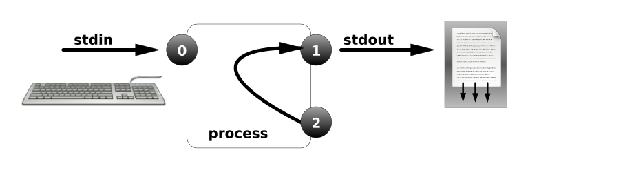
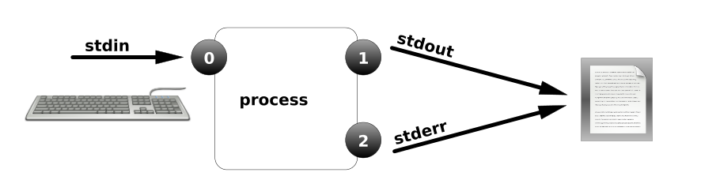
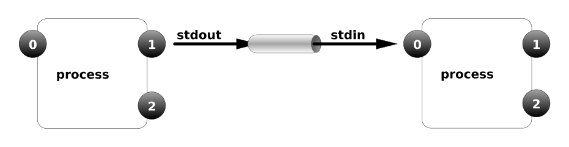
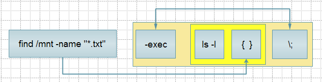

# 第十一章：重定向和文件的查找

---

## 目录

* [文件描述符](#fileDescriptor)
* [重定向含义-管道的使用-tee命令](#teeCommand)
* [which-whereis-locate-grep-find 命令](#whichWhereisLocateGrepFindCommand)
* [命令判断](#commandJudgment)

## 内容

### <a href="#fileDescriptor" id="fileDescriptor">文件描述符</a>

文件描述符：是内核葳了高效管理已被打开的文件所创建的索引，用于指向被打开的文件，所有执行I/O操作的系统调用都通过文件描述符；文件描述符石一个简单的非负整数，用以标明每一个进程所打开的文件，程序刚刚启动的时候，第一个打开的文件是0，第二个打开的文件是1，以此类推。也可以理解为是一个文件的身份ID

用户通过操作系统处理信息的过程中，使用的交互设备文件（键盘，鼠标，显示器）

| Number | Channel name | Description        | Default connection | Usage |
|:------:|:-----------:|:-------------:|:---------------:|:-----:|
| 0         | stdin              | Standard input    | Keyboard               | read only |
| 1          | stdout            | Standard output | Terminal                 | write only |
| 2         | stderr            | Standard error     | Terminal                | write only |
| 3+       | filename         | Other files          | none                     | read and/or write |

**输入、输出标准说明**

* STDIN     标准输入  默认的设备是键盘 文件编号为：0
* STDOUT 标准输出  默认的设备是显示器 文件编号为：1，也可以重定向到文件
* STDERR  标准错误 默认的设备是显示器 文件编号为：2，也可以重定向到文件


```
# 终端1
[root@spring ~]# vim /etc/passwd

# 终端2
[root@spring ~]# ps -aux | grep passwd
root      1117  1.3  0.2 149328  5304 pts/0    S+   13:45   0:00 vim /etc/passwd
root      1119  0.0  0.0 112712   964 pts/1    S+   13:45   0:00 grep --color=auto passwd
[root@spring ~]# ll /proc/1117/fd
total 0
lrwx------ 1 root root 64 Jan 29 13:46 0 -> /dev/pts/0
lrwx------ 1 root root 64 Jan 29 13:46 1 -> /dev/pts/0
lrwx------ 1 root root 64 Jan 29 13:45 2 -> /dev/pts/0
lrwx------ 1 root root 64 Jan 29 13:46 4 -> /etc/.passwd.swp
```

> 注：这些0，1，2，4就是文件的描述符。一个进程启动时，都会打开3个文件：标准输入、标准输出、和错误处理。这3个文件分别对应文件描述符为0、1、2也就是宏替换STDIN_FILENO、STDOUT_FILENO和STDERR_FIKENO

`/proc/进程 ID/fd` #这个 fd 目录下，专门存文件描述符

> 注：对文件描述符的操作就是对文件本身的操作。 我可以直接通过操作文件描述来修改文件

```
# 查看一个进程最多可以同时打开的文件数
[root@spring ~]# ulimit -n
1024
```

```
# 临时修改一个进程最多可以同时打开的文件数为 2048
[root@spring ~]# ulimit -n 2048
[root@spring ~]# ulimit -n
2048
```

### <a href="#teeCommand" id="teeCommand">重定向含义-管道的使用-tee命令</a>

#### 输出重定向

定义：将命令的正常输出结果保存到指定的文件中，而不是直接显示在显示器的屏幕上。

重定向输出使用">" ">>" 操作符

语法：

1. ">" 文件名 # 表示将标准输出的内容，写到后面的文件中，如果此文件已经存在，将会覆盖原文件中的内容 
2. ">>" 文件名 # 表示将标准输出的内容，追加到后面的文件中。若重定向的输出的文件不存在，则会新建该文件。

```
# 查看当前主机的ＣＰＵ的类型保存到 cpu.txt 文件中(而不是直接显示到屏幕上)
[root@spring ~]# cat /proc/cpuinfo > cpu.txt
[root@spring ~]#
[root@spring ~]# ll cpu.txt
-rw-r--r-- 1 root root 839 Jan 29 13:57 cpu.txt

# 将内核的版本信息追加到 cpu.txt
[root@spring ~]# uname -a >> cpu.txt
[root@spring ~]# cat cpu.txt
processor	: 0
vendor_id	: GenuineIntel
cpu family	: 6
model		: 78
model name	: Intel(R) Core(TM) i5-6267U CPU @ 2.90GHz
stepping	: 3
cpu MHz		: 2903.998
cache size	: 4096 KB
physical id	: 0
siblings	: 1
core id		: 0
cpu cores	: 1
apicid		: 0
initial apicid	: 0
fpu		: yes
fpu_exception	: yes
cpuid level	: 22
wp		: yes
flags		: fpu vme de pse tsc msr pae mce cx8 apic sep mtrr pge mca cmov pat pse36 clflush mmx fxsr sse sse2 ht syscall nx rdtscp lm constant_tsc rep_good nopl xtopology nonstop_tsc eagerfpu pni pclmulqdq monitor ssse3 cx16 pcid sse4_1 sse4_2 x2apic movbe popcnt aes xsave avx rdrand hypervisor lahf_lm abm 3dnowprefetch invpcid_single fsgsbase avx2 invpcid rdseed clflushopt md_clear flush_l1d
bogomips	: 5807.99
clflush size	: 64
cache_alignment	: 64
address sizes	: 39 bits physical, 48 bits virtual
power management:

Linux spring 3.10.0-1062.9.1.el7.x86_64 #1 SMP Fri Dec 6 15:49:49 UTC 2019 x86_64 x86_64 x86_64 GNU/Linux

# 清空一个文件
[root@spring ~]# > cpu.txt
[root@spring ~]# cat cpu.txt
```

#### 输入重定向

```
# 将命令中接收输入的途径由默认的键盘改为其他文件.而不是等待从键盘输入
[root@spring ~]# grep root /etc/passwd
root:x:0:0:root:/root:/bin/bash
operator:x:11:0:operator:/root:/sbin/nologin

[root@spring ~]# grep root < /etc/passwd
root:x:0:0:root:/root:/bin/bash
operator:x:11:0:operator:/root:/sbin/nologin
```

```
[root@spring ~]# cat > demo.html <<EOF
> <!DOCTYPE html>
> <html lang="zh-CN">
> <head>
> <meta charset="utf-8">
> <title>Demo</title>
> </head>
> <body>
> <h1>Hello World</h1>
> <p>This is a static page.</p>
> </body>
> </html>
> EOF

[root@spring ~]# cat demo.html
<!DOCTYPE html>
<html lang="zh-CN">
<head>
<meta charset="utf-8">
<title>Demo</title>
</head>
<body>
<h1>Hello World</h1>
<p>This is a static page.</p>
</body>
</html>
```

```
[root@spring ~]# vim p.sh

  1 #!/bin/bash
  2
  3 cat <<efo
  4 ================
  5 1.mysql
  6 2.httpd
  7 3.python
  8 4.js
  9 ================
 10 efo

[root@spring ~]# chmod +x p.sh
[root@spring ~]# ./p.sh
================
1.mysql
2.httpd
3.python
4.js
================
```

#### 错误重定向

将命令执行过程中出现的错误信息（选项或参数错误）保存到指定的文件，而不是直接显示到显示器

作用：错误信息保存到文件

操作符: 错误重定向符号：`2>` ； 标准输入： `1<` 或简写 `<` ; 标准输出： `0>` 或 `>`

在实际应用中，错误重定向可以用来收集执行的错误信息.为排错提供依据；对于 shell 脚本还可以将无关紧要的错误信息重定向到空文件/dev/null 中，以保持脚本输出的简洁

```
# 错误显示的内容和正确显示的内容分开
[root@spring ~]# ll /etc/passwd asdfdsaf
ls: cannot access asdfdsaf: No such file or directory
-rw-r--r-- 1 root root 1194 Jan 28 07:06 /etc/passwd

[root@spring ~]# ls /etc/passwd sadfasdf > a.txt
ls: cannot access sadfasdf: No such file or directory
[root@spring ~]# cat a.txt
/etc/passwd

[root@spring ~]# ls /etc/passwd sdafasdf 2> a.txt
/etc/passwd
[root@spring ~]# cat a.txt
ls: cannot access sdafasdf: No such file or directory
```

> 注：使用 `2>` 操作符时,会像使用 `>` 一样覆盖目标文件的内容，若追加而不覆盖文件的内容即可使用 `2>>` 操作符

#### null 黑洞和 zero 空文件

1、把`/dev/null` 看作"黑洞"，所有写入它的内容都会永远丢失. 而尝试从它那儿读取内容则什么也读不到. 然 而 /dev/null 对命令行和脚本都非常的有用.

```
[root@spring ~]# echo aaa > /dev/null
[root@spring ~]# cat /dev/null
```

2、`/dev/zero` 在类 UNIX 操作系统中, `/dev/zero` 是一个特殊的文件，当你读它的时候，它会提供无限的空字符(NULL, ASCII NUL, 0x00)。典型用法是用它来产生一个特定大小的空白文件。

1. `if` 代表输入文件。如果不指定 if，默认就会从 stdin 中读取输入。
1. `of` 代表输出文件。如果不指定 of，默认就会将 stdout 作为默认输出。
1. `bs` 代表字节为单位的块大小。
1. `count` 代表被复制的块数。

```
[root@spring ~]# dd if=/dev/zero of=b.txt bs=1M count=50
50+0 records in
50+0 records out
52428800 bytes (52 MB) copied, 0.0746043 s, 703 MB/s
[root@spring ~]# ll b.txt
-rw-r--r-- 1 root root 52428800 Jan 29 14:33 b.txt
[root@spring ~]# ll -h b.txt
-rw-r--r-- 1 root root 50M Jan 29 14:33 b.txt
```

```
# 正确的内容写入一个文件，错误的写入一个文件
[root@spring ~]# ls /tmp xxx > ok.txt 2 > err.txt
ls: cannot access xxx: No such file or directory
ls: cannot access 2: No such file or directory
```

#### &>和>&符号

&表示等同于的意思

把正确和错误的消息输入到相同的位置

* 1>&2 把标准输出重定向到标准错误
* 2>&1 把标准错误重定向到标准输出，如图:



把正确和错误的消息输入到相同的位置



**互动： 工作中 shell 脚本中的 >/dev/null 2>&1 是什么意思？**

```
# ：将标准输出和错误输出全部重定向到/dev/null 中,也就是将产生的所有信息丢弃.
[root@spring ~]# cat /etc/passwd > /dev/null 2>&1
```

#### 管道 | 的使用

语法：command-a | command-b | command-c | ......



1. 管道命令只处理前一个命令正确输出，不处理错误输出
1. 管道右边的命令，必须能够接收标准输入的数据流命令才行
1. 管道符可以把两条命令连起来，它可以链接多个命令使用

```
[root@spring ~]# ps -aux | grep sshd
root       813  0.0  0.2 112920  4328 ?        Ss   13:08   0:00 /usr/sbin/sshd -D
root      1074  0.0  0.3 161528  6224 ?        Ss   13:42   0:02 sshd: root@pts/0
root      1095  0.0  0.3 161528  6224 ?        Ss   13:43   0:00 sshd: root@pts/1
root      1524  0.0  0.0 112712   960 pts/0    R+   14:56   0:00 grep --color=auto sshd
```

#### tee 命令（了解）

功能：读取标准输入的数据，并将其内容输出成文件。

语法：tee [-a][--help][--version][文件...]

参数：

* -a, --append 内容追加到给定的文件而非覆盖
* --help 在线帮助

tee 指令会从标准输入设备读取数据，将其内容输出到标准输出设备，同时保存成文件


```
# 将磁盘使用的信息写入文件
[root@spring ~]# df -h | tee disk.log
Filesystem      Size  Used Avail Use% Mounted on
devtmpfs        990M     0  990M   0% /dev
tmpfs          1000M     0 1000M   0% /dev/shm
tmpfs          1000M  8.6M  991M   1% /run
tmpfs          1000M     0 1000M   0% /sys/fs/cgroup
/dev/sda3        17G  1.9G   16G  12% /
/dev/sr0        4.4G  4.4G     0 100% /mnt
/dev/sda1       497M  151M  346M  31% /boot
tmpfs           200M     0  200M   0% /run/user/0
# 将文件系统使用的信息追加到文件
[root@spring ~]# df -h | tee -a disk.log
Filesystem      Size  Used Avail Use% Mounted on
devtmpfs        990M     0  990M   0% /dev
tmpfs          1000M     0 1000M   0% /dev/shm
tmpfs          1000M  8.6M  991M   1% /run
tmpfs          1000M     0 1000M   0% /sys/fs/cgroup
/dev/sda3        17G  1.9G   16G  12% /
/dev/sr0        4.4G  4.4G     0 100% /mnt
/dev/sda1       497M  151M  346M  31% /boot
tmpfs           200M     0  200M   0% /run/user/0
```

> 注：可以使用来记录日志

### <a href="#whichWhereisLocateGrepFindCommand" id="whichWhereisLocateGrepFindCommand">which-whereis-locate-grep-find 命令</a>

which-whereis-locate-grep find 命令使用

查找文件一般有以下几个命令：

* `which` 查看可执行文件的位置
* `whereis` 查看可执行文件的位置及相关文件
* `locate` 配合数据库缓存，快速查看文件位置
* `grep` 过滤匹配，它是一个文件搜索工具
* `find` 查找相关文件

```
[root@spring ~]# which cd
/usr/bin/cd
```

```
[root@spring ~]# whereis cd
cd: /usr/bin/cd /usr/share/man/man1/cd.1.gz
```

locate 命令和 find -name 功能差不多，是它的另外一种写法，但是这个要比 find 搜索快的多，因为 find 命令查找的是具体目录文件，而 locate 它搜索的是一个数据库/var/lib/mlocate/mlocate.db，这个数据库中存有本地所有的文件信息；这个数据库是Linux自动创建并每天自动更新维护。相关的配置信息在/etc/updatedb.conf，查看定时任务信息在/etc/cron.daily/mlocate

```
yum install mlocate
locate: can not stat () `/var/lib/mlocate/mlocate.db': No such file or directory
[root@spring ~]# touch /opt/xuegod.txt
[root@spring ~]# updatedb # 如果对当天文件查找，需要手动更新数据库 updatedb
```

`grep` 查找使用

作用：过滤,它能够使用正则表达式来搜索文本，并把结果打印出来

参数：

* `-v` 取反
* `-i` 忽略大小写
* `^#` 以#开头
* `#$` 以#结尾
* `^$` 空行
* `-n` 对过滤的内容加上行号
* `|` 或者的意思

```
[root@spring ~]# ps -aux | grep sshd | grep -v grep
root       813  0.0  0.2 112920  4328 ?        Ss   13:08   0:00 /usr/sbin/sshd -D
root      1074  0.0  0.3 161528  6224 ?        Ss   13:42   0:02 sshd: root@pts/0
root      1095  0.0  0.3 161528  6224 ?        Ss   13:43   0:00 sshd: root@pts/1
[root@spring ~]# grep bash$ /etc/passwd
root:x:0:0:root:/root:/bin/bash
spring:x:1000:1000::/home/spring:/bin/bash
oracle:x:1100:1100::/home/oracle:/bin/bash
hye:x:1200:1101::/home/hye:/bin/bash
market:x:1202:1202::/mnt/market:/bin/bash

[root@spring ~]# grep "nologin\|root" /etc/passwd |wc -l  # \ 表示转义符
19
[root@spring ~]# egrep "nologin|root" /etc/passwd | wc -l # 查看包括 nologin 或 root 的行
19
```

#### find 命令使用（必会，参数比较多）

```
格式：find pathname -options [-print]
	命令字 路径名称   选项      输出
```

参数：

* `pathname`: `find` 命令所查找的目录路径，不输入代表当前目录例如用 . 来表示当前目录，用 `/` 来表示系统根目录。
* `find` 命令选项: `-name` 按照文件名查找文件。 “名称”
	+ `-perm` 按照文件权限来查找文件。666 777 等 `-user` 按照文件属主来查找文件
	+ `-group` 按照文件所属的组来查找文件
	+ `-mtime` `-n` / `+n` 按照文件的更改时间来查找文件，
		- `- n` 表示文件更改时间距现在 n 天以内
		- `+ n`表示文件更改时间距现在 n 天以前
	+ -type 查找某一类型的文件
		- `b` - 块设备文件
		- `d` - 目录
		- `c` - 字符设备文件
		- `p` - 管道文件
		- `l` - 符号链接文件
		- `f` - 普通文件
	+ `-size n` 查找符合指定的文件大小的文件
	+ `-exec` 对匹配的文件执行该参数所给出的其他 `linux` 命令，相应命令的形式为' 命令 `{}` `\;`，注意`{}`和 `\;`之间的空格，{}代表查到的内容

```
[root@spring ~]# find . -name "*.txt"
./demo.txt
```

按照更改时间或访问时间等查找文件

如果希望按照更改时间来查找文件，可以使用 mtime、atime 或 ctime 选项

* `mtime`: 文件最后一次修改的时间
* `atime`: 最后一次访问时间
* `ctime`: 文件的最后一次变化时间，也就是修改时间

```
# 希望在 root 目录下查找更改时间在 1 天以内，被黑客修改的文件
[root@spring ~]# find /root/ -mtime -1
/root/
/root/.bash_history
/root/.a.txt.swp
/root/.viminfo
/root/demo.txt
```

对查找内容执行相应命令

-exec 这个选项参数后面可以跟自定义的 SHELL 命令，格式如下：



```
[root@spring ~]# find . -name "*.back" -exec ls -l {} \;
-rw-r--r-- 1 root root 0 Jan 29 15:27 ./3.back
-rw-r--r-- 1 root root 0 Jan 29 15:27 ./1.back
-rw-r--r-- 1 root root 0 Jan 29 15:27 ./2.back
```

```
[root@spring ~]# find . -name "*.back" -exec mv {} /opt \;
[root@spring ~]# ls /opt/
1.back  3.back  dump_grub2  dump_passwd  test-back1  test-full
2.back  a.txt   dump_grup2  dump_sdb1    test-back2
```

```
# 把查找到的文件复制到一个指定的目录
[root@spring ~]# find /root -name "*.txt" -exec cp {} /opt \;
[root@spring ~]# ll /opt/
total 148
-rw-r--r-- 1 root root     0 Jan 29 15:27 1.back
-rw-r--r-- 1 root root     0 Jan 29 15:27 2.back
-rw-r--r-- 1 root root     0 Jan 29 15:27 3.back
-rw-r--r-- 1 root root     0 Jan 29 00:47 a.txt
-rw-r--r-- 1 root root     0 Jan 29 15:33 demo.txt
-rw-r--r-- 1 root root 27944 Jan 26 14:29 dump_grub2
-rw-r--r-- 1 root root     0 Jan 26 14:28 dump_grup2
-rw-r--r-- 1 root root 23328 Jan 26 14:22 dump_passwd
-rw-r--r-- 1 root root 23008 Jan 26 14:15 dump_sdb1
-rw-r--r-- 1 root root 21696 Jan 26 20:10 test-back1
-rw-r--r-- 1 root root 22024 Jan 26 20:15 test-back2
-rw-r--r-- 1 root root 22696 Jan 26 20:08 test-full
```

```
# xargs 和 find 命令结合 复制文件 -i 表示 find 传递给 xargs 的结果 由{}来代替 (了解)
[root@spring ~]# rm -rf /opt/*
[root@spring ~]# find . -name "*.txt" | xargs -i cp {} /opt
[root@spring ~]# ls /opt
demo.txt
```

查找多个类型文件

比较符的使用：

* `-a` and 并且
* `-o` or 或者
* `+` 超过
* `-` 低于

```
[root@spring ~]# touch a.pdf back.sh
[root@spring ~]# find . -name "*.sh" -o -name "*.pdf"
./a.pdf
./back.sh

[root@spring ~]# find /etc -size +20k -a -size -50k | wc -l
18

[root@spring ~]# find /etc -size +20k | wc -l
37
```

```
# 按权限查找：-perm
[root@spring ~]# find /bin/ -perm 755   # 等于 0755 权限的文件或目录
[root@spring ~]# find /bin/ -perm -644 # -perm -644 至少有 644 权限的文件或目录
```

```
# 创建文件并设置权限
[root@spring ~]# mkdir ccc
[root@spring ~]# chmod 777 ccc
[root@spring ~]# mkdir test
[root@spring ~]# chmod 1777 test
[root@spring ~]# touch b.sh
[root@spring ~]# chmod 4777 b.sh

# 查找
[root@spring ~]# find /root/ -perm 777
/root/ccc
[root@spring ~]# find /root/ -perm 1777
/root/test
[root@spring ~]# find /root/ -perm 4777
/root/b.sh

[root@spring ~]# ll
total 12
-rw-------. 1 root root 1457 Jan 13 21:02 anaconda-ks.cfg
-rw-r--r--  1 root root    0 Jan 29 15:38 a.pdf
-rw-r--r--  1 root root    0 Jan 29 15:38 back.sh
-rwsrwxrwx  1 root root    0 Jan 29 15:44 b.sh
drwxrwxrwx  2 root root    6 Jan 29 15:43 ccc
-rw-r--r--  1 root root    0 Jan 29 15:23 demo.txt
-rw-r--r--. 1 root root  501 Jan 13 21:27 fstab01
-rw-r--r--. 1 root root  501 Jan 13 21:27 fstab02
drwxrwxrwt  2 root root    6 Jan 29 15:43 test

# 把系统中权限不低于 777 的危险目录查找出来
[root@spring ~]# find /root/ -perm -777
/root/ccc
/root/test
/root/b.sh

# 把系统中权限不低于 777 的危险文件查找出来
[root@spring ~]# find / -type f -perm 777
find: ‘/proc/1672/task/1672/fdinfo/6’: No such file or directory
find: ‘/proc/1672/fdinfo/5’: No such file or directory
```

#### 查找的目录深度：

-maxdepth 1 #只查找目录第一层的文件和目录

```
# /bin 后面要有/
[root@spring ~]# find /bin/ -maxdepth 1 -perm 755 
# 这个命令无法满足我们的需求
[root@spring ~]# find /bin -maxdepth 1 -perm 755
```

```
# 查找系统中所有属于用户 mk 的文件，并把这个文件，放到/root/findresults 目录下
[root@spring ~]# mkdir /root/findresults
[root@spring ~]#  find / -user spring -exec cp -a {} /root/findresults/ \;
find: ‘/proc/1900/task/1900/fd/6’: No such file or directory
find: ‘/proc/1900/task/1900/fdinfo/6’: No such file or directory
find: ‘/proc/1900/fd/5’: No such file or directory
find: ‘/proc/1900/fdinfo/5’: No such file or directory
cp: cannot overwrite non-directory ‘/root/findresults/spring’ with directory ‘/home/spring’
```

> 互动： 同一个目录下，可以创建文件 spring 和文件夹 spring 吗？同一个目录下创建的文件名和目录名一样吗？  
> 答：不可以

```
[root@spring ~]# find / -user spring # 发现
find: ‘/proc/1986/task/1986/fd/6’: No such file or directory
find: ‘/proc/1986/task/1986/fdinfo/6’: No such file or directory
find: ‘/proc/1986/fd/5’: No such file or directory
find: ‘/proc/1986/fdinfo/5’: No such file or directory
/root/findresults/spring
/root/findresults/.bash_logout
/root/findresults/.bash_profile
/root/findresults/.bashrc
/root/findresults/.bash_history
/root/findresults/b.txt
/root/findresults/c.txt
/root/findresults/a.txt
/root/findresults/.viminfo
/var/spool/mail/spring
/home/spring
/home/spring/.bash_logout
/home/spring/.bash_profile
/home/spring/.bashrc
/home/spring/.bash_history
/home/spring/b.txt
/home/spring/c.txt
/home/spring/a.txt
/home/spring/.viminfo

[root@spring ~]# ll /var/spool/mail/spring # 查看这个文件
-rw-rw---- 1 spring mail 0 Jan 27 10:23 /var/spool/mail/spring

[root@spring ~]# ll /home/spring
total 4
---------- 1 spring spring 13 Jan 27 22:25 a.txt
-rw-rw-r-- 1 spring spring  0 Jan 27 22:17 b.txt
-rw-rw-r-- 1 spring spring  0 Jan 27 22:17 c.txt

[root@spring ~]# mv /var/spool/mail/spring /var/spool/mail/spring.mail
[root@spring ~]# rm -rf /root/findresults/*
[root@spring ~]# find / -user spring -exec cp -a {} /root/findresults/ \;
find: ‘/proc/2117/task/2117/fd/6’: No such file or directory
find: ‘/proc/2117/task/2117/fdinfo/6’: No such file or directory
find: ‘/proc/2117/fd/5’: No such file or directory
find: ‘/proc/2117/fdinfo/5’: No such file or directory
cp: ‘/root/findresults/.bash_logout’ and ‘/root/findresults/.bash_logout’ are the same file
cp: ‘/root/findresults/.bash_profile’ and ‘/root/findresults/.bash_profile’ are the same file
cp: ‘/root/findresults/.bashrc’ and ‘/root/findresults/.bashrc’ are the same file
cp: ‘/root/findresults/.bash_history’ and ‘/root/findresults/.bash_history’ are the same file
cp: ‘/root/findresults/.viminfo’ and ‘/root/findresults/.viminfo’ are the same file
# 再修改过来
[root@spring ~]# mv /var/spool/mail/spring.mail /var/spool/mail/spring
```

### <a href="#commandJudgment" id="commandJudgment">命令判断</a>

#### 用到的三个特殊符号： `;` 、`&&`、 `||`

*  `;`分号 不考虑指令的相关性，连续执行, 分号`;` 不保证命令全部执行成功的

```
[root@spring ~]# sync ; shutdown -F
Shutdown scheduled for Wed 2020-01-29 16:25:45 CST, use 'shutdown -c' to cancel.
[root@spring ~]#
Broadcast message from root@spring (Wed 2020-01-29 16:24:45 CST):

The system is going down for power-off at Wed 2020-01-29 16:25:45 CST!

^C
```

* `&&` 逻辑与====》它是只有在前面的命令执行成功后，后面的命令才会去执行

```
[root@spring ~]# cd /opt/ && touch /opt/a.txt && ll
total 0
-rw-r--r-- 1 root root 0 Jan 29 16:26 a.txt
-rw-r--r-- 1 root root 0 Jan 29 15:36 demo.txt
[root@spring opt]#

# 源码编译经典使用方法
[root@spring ~]# ./configure && make -j 4 && make install
```

* `||` 逻辑或===》如果前面的命令执行成功，后面的命令就不去执行了；或者如果前面的执行不成功，才会去执行后面的命令

```
[root@spring opt]#
[root@spring opt]# ls xxx || cd /mnt
ls: cannot access xxx: No such file or directory
[root@spring mnt]#
[root@spring mnt]# pwd
/mnt

[root@spring mnt]# ls /etc/passwd || cd /etc
/etc/passwd
```

| 命令情况 | 说明 |
|:-------|:----|
| 命令 1 `&&` 命令 2 | 如果命令 1 执行，且执行正确($? = 0)，然后执行命令 2<br>如果命令 1 执行完成，但是执行错误（$? ≠0），那么后面的命令是不会执行的 |
| 命令 1 `||` 命令 2 | 如果命令 1 执行，且执行正确($? = 0)，那么命令 2 不执行<br>如果命令 1 执行，但执行错误($? ≠ 0)，那么命令 2 执行 |

```
# 运算顺序：LINUX 执行命令，是从左到右一个一个执行,从上到下执行
[root@spring mnt]# cd /opt/back || mkdir /opt/back && touch /opt/back/back.tar && ls /opt/back
-bash: cd: /opt/back: No such file or directory
back.tar
```
