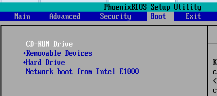
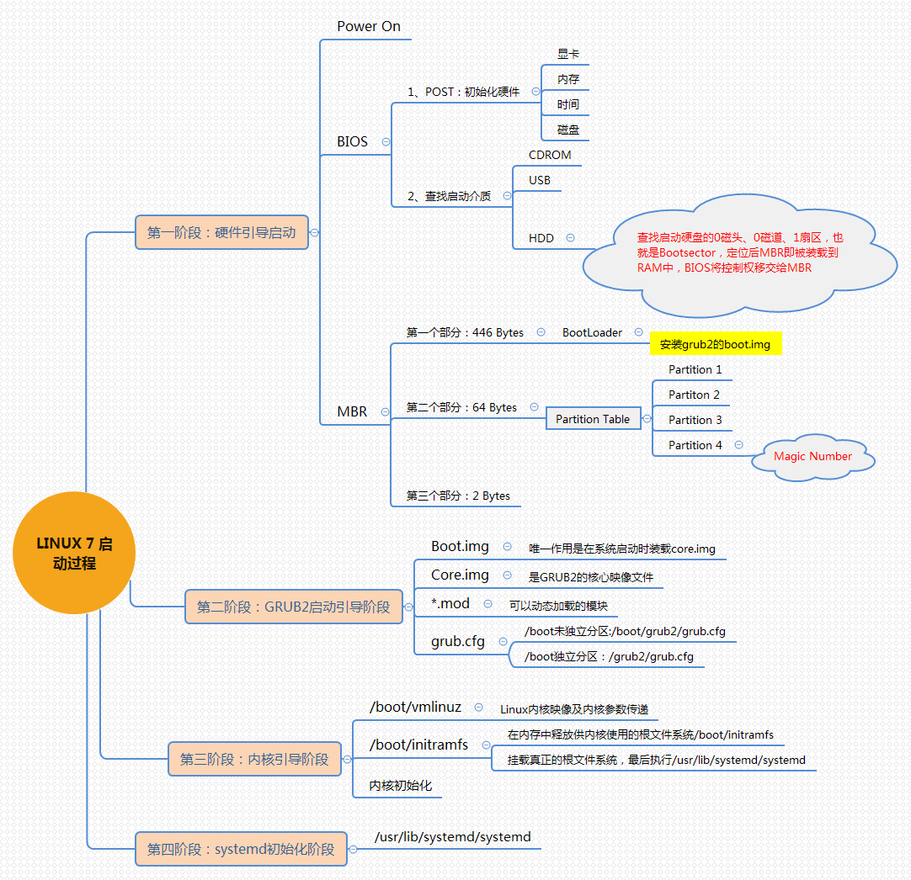
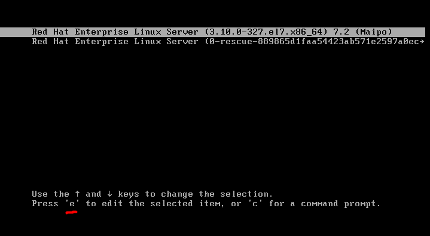
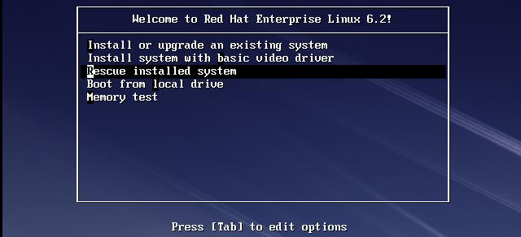
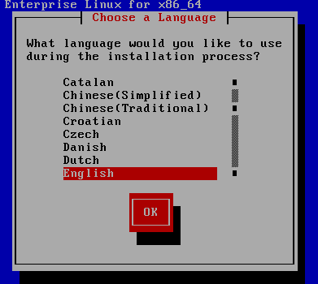
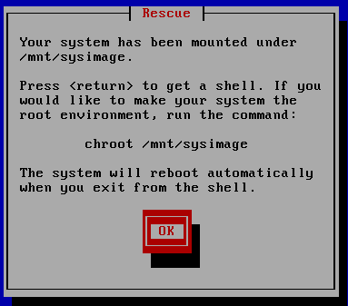
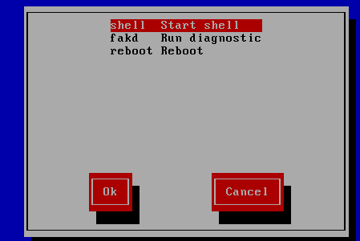
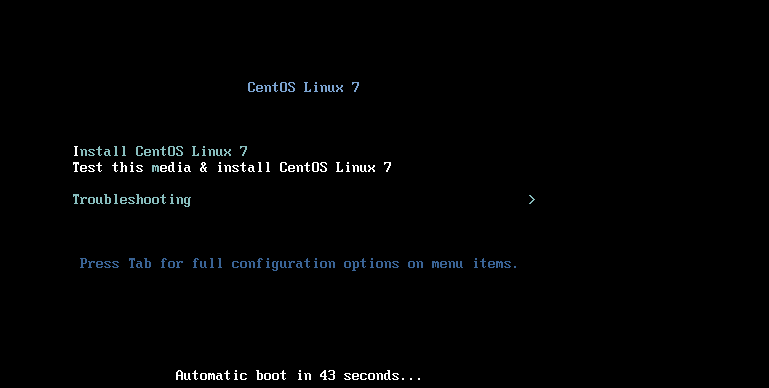
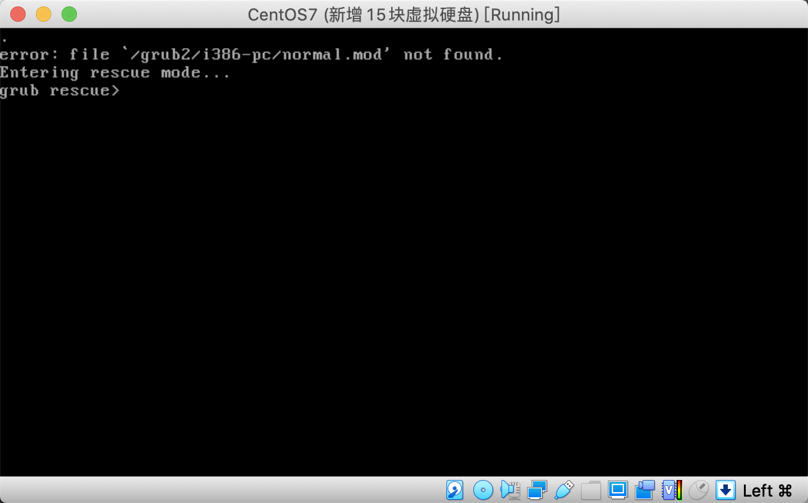

# 第十七章：Linux系统启动原理及故障排除

---

## 目录

* [centos6 系统启动过程及相关配置文件](#CentOS6SystemStartupProcess)
* [centos7 系统启动过程及相关配置文件](#CentOS7SystemStartupProcess)
* [实战-加密 grub 防止黑客通过单用户系统破解 root 密码](#grub)
* [实战-通过 liveCD 进入救模式-重装 grub 修复损坏的系统](#liveCD)

## 内容

### <a href="#CentOS6SystemStartupProcess" id="CentOS6SystemStartupProcess">centos6 系统启动过程及相关配置文件</a>

#### 1.1 centos6 系统启动过程

1. 加载 BIOS 的硬件信息，跟据设定取得第一个可开机引导设置，如：光驱，硬盘，网络，USB； 如果是硬盘为第一引导。
2. 读取硬盘中 MBR 的 boot Loader 就是 grub 引导
3. 依据 boot loader 的设定，到引导分区加载 Kernel ，Kernel 会开始侦测硬件并加载驱劢程序；
4. 在硬件驱动成功后，Kernel 会主动执行 init 程序，而 init 会取得 run-level 信息；
5. init 执行 /etc/rc.d/rc.sysinit 文件来准备软件执行的作业环境 (如网络、时区等)；
6. init 执行 run-level 下各个服务并启动 (script 方式)；
7. init 执行开机后自动运行脚本 /etc/rc.d/rc.local 文件；
8. init 执行虚拟终端机控制程序 mingetty 来启动 login 程序，最后就等待用户登入啦；



GRUB（GRand Unified Bootloader 简称“GRUB”）是一个来自 GNU 项目的多操作系统启动程序。

MBR 的硬盘的 0 柱面、0 磁头、1 扇区称为主引导扇区（也叫主引导记录 MBR）。它由三个部分组成，主引导程序、硬盘分区表 DPT（Disk Partition table）和硬盘有效标志（55AA）。

<font color="#f00">互动：为什么 MBR 分区表，只能分 4 个主分区？</font>

注：磁盘默认一个扇区大小为：512 字节。MBR 由以下 3 部分组成：

* 第一部分是：主引导程序（boot loader）占 446 个字节。主引导程序，它负责从活动分区中装载，并运行系统引导程序。
* 第二部分是 Partition table 区（分区表），即 DPT，占 64 个字节，硬盘中分区有多少以及每一分区的大小都记在其中。每个分区表项长 16 个字节，16*4=64 字节。为分区项 1、分区项 2、分区项 3、分区项 4。64 字节只存 4 个分区表。
* 第三部分是 MBR 有效标识位，占 2 个字节，固定为 55AA。如果这个标志位 0xAA55，就认为这个是 MBR。

所以：16*4+446+2=512


#### 1.2 centos6 启动相关的配置文件

```
[root@spring ~]# vim /boot/grub/grub.conf

default=0                                                      # 设定默认启动菜单项，当系统中有多个内核时，0 表示默认加载第 1 个，1 表示第 2 个内核
timeout=5                                                     # 菜单项等待选项时间为 5s
splashimage=(hd0,0)/grub/splash.xpm.gz         # 指明菜单背景图片路径为
hiddenmenu                                                  # 隐藏菜单
title CentOS (2.6.32-358.6.1.el6.x86_64) # 定义菜单项
root (hd0,0) grub                                           # 查找 stage2 及 kernel 文件所在设备分区，grub 的根
kernel /vmlinuz-2.6.32-358.6.1.el6.x86_64 ro root=/dev/vg_have/lv_root rd_NO_LUKS 
LANG=en_US.UTF-8 SYSFONT=latarcyrheb-sun16 crashkernel=auto rhgb quiet # 启动的内核
initrd /initramfs-2.6.32-358.6.1.el6.x86_64.img # 内核匹配的 ramfs 文件
```

修改系统启动级别：

```
[root@spring ~]# vim /etc/inittab
# Default runlevel. The runlevels used are:
# 0 - halt (Do NOT set initdefault to this)
# 1 - Single user mode
# 2 - Multiuser, without NFS (The same as 3, if you do not have networking)
# 3 - Full multiuser mode
# 4 - unused
# 5 - X11
# 6 - reboot (Do NOT set initdefault to this)
# 
id:3:initdefault: # 这里决定系统启动的级别
```

`/etc/rc.d/rc.sysinit` shell 脚本 作用：系统初始化： 像：主机名 和`/etc/fstab` 都在这里指定了，完成了包括 `mount` 分区 激活 `swap` 加载 `modules` 等重要的工作。

启动对应级别下的服务如： init 3 级别  
<font color="#f00">/etc/rc.d/rc3.d/（这里的程序/服务 S 开头的全部开机执行；K 开头的表示开机不执行，表明了关机时顺序）</font>rcn.d (n 为 1 到 6) 是对应于不同的 runlevel 下起不同的服务. 这些目录下都是一些符号连接, 连接到<font color="#f00">/etc/rc.d/init.d</font> 下的一些文件.以 S 开头的表示要启动, 以 K 开头的不启动.  
第一个字母后面的数值是一个优先级.

```
[root@spring ~]# ll /etc/rc.d/rc3.d/ | grep network
lrwxrwxrwx. 1 root root 17 Jan 31 18:02 S10network -> ../init.d/network # 表示 network 是第 10
个启动的服务。 所以 init 是顺序启动系统，需要一个一个服务启动成功，再执行下一步操作，启动系统比较慢。而centos7 中的 systemd 可以并行启动多个服务，启动比较快。
```

```
[root@spring ~]# vim /etc/init.d/network

#! /bin/bash
#
# network       Bring up/down networking
#
# chkconfig: 2345 10 90
```

看有 chkconfig 的那一行, 2345 表示在 runlevel 2 3 4 5 下被启动, 10 是为此服务的启动顺序, 90 为关机时，关闭此服务的顺序。

```
[root@spring ~]# chkconfig --list | grep network
network 0:off 1:off 2:on3:on4:on5:on6:off

[root@spring ~]# ll /etc/rc.d/rc3.d/ | grep network
lrwxrwxrwx. 1 root root 17 Jan 31 18:02 S10network -> ../init.d/network # 开机顺序

[root@spring ~]# chkconfig network off
[root@spring ~]# ll /etc/rc.d/rc3.d/ | grep network
lrwxrwxrwx  1 root root 17 Feb  9 04:50 K90network -> ../init.d/network # #只显示 k90 关机顺序了

[root@spring ~]# chkconfig --list network
network		0:off	1:off	2:off	3:off	4:of	5:off6:off
```

所有服务都运行成功后，设置开机自动执行某个命令： /etc/rc.local

```
[root@spring ~]# vim /etc/rc.local
[root@spring ~]# ll !$
ll /etc/rc.local
lrwxrwxrwx. 1 root root 13 Jan 31 18:15 /etc/rc.local -> rc.d/rc.local

[root@spring ~]# ll /etc/rc.d/rc.local
-rw-r--r--. 1 root root 473 Oct 19 00:48 /etc/rc.d/rc.local
```

运行 mingetty 命令，打开 tty1-6

```
[root@spring ~]# ps -aux | grep ming
Warning: bad syntax, perhaps a bogus '-'? See /usr/share/doc/procps-3.2.8/FAQ
root 2346 0.0 0.0 4116 548 tty2 Ss+ 20:55 0:00 /sbin/mingetty /dev/tty2
root 2348 0.0 0.0 4116 548 tty3 Ss+ 20:55 0:00 /sbin/mingetty /dev/tty3
root 2350 0.0 0.0 4116 544 tty4 Ss+ 20:55 0:00 /sbin/mingetty /dev/tty4
root 2352 0.0 0.0 4116 544 tty5 Ss+ 20:55 0:00 /sbin/mingetty /dev/tty5
root 2354 0.0 0.0 4116 544 tty6 Ss+ 20:55 0:00 /sbin/mingetty /dev/tty6
```

```
[root@spring ~]# runlevel # 查看系统启动级别
N 5

[root@spring ~]# init 3
[root@spring ~]# runlevel 
5 3 # 由 5 启动级别进入 3 级别
[root@spring ~]# init 5
[root@spring ~]# runlevel 
3 5 #由 3 启动级别进入 5 级别
```

### <a href="#CentOS7SystemStartupProcess" id="CentOS7SystemStartupProcess">centos7 系统启动过程及相关配置文件</a>

#### 2.1 centos7 系统启动过程

**CentOS7 引导顺序**：

1. UEFi 或 BIOS 初始化，运行 POST 开机自检
2. 选择启动设备
3. 引导装载程序, centos7 是 grub2
4. 加载装载程序的配置文件：/etc/grub.d/（根据此目录下文件设置 grub.cfg）
/etc/default/grub（根据此文件设置 grub.cfg） /boot/grub2/grub.cfg
5. 加载内核选项
6. 加载 initramfs 初始化伪文件系统（虚拟文件系统，/boot/initramfs 能通过 boot loader 加载到内存中。用于提供启动过程中的重要内核模块。）
7. 内核初始化，centos7 使用 systemd 代替 init
8. 执行 initrd.target 所有单元，包括挂载/etc/fstab
9. 从 initramfs 根文件系统切换到磁盘根目录
10. systemd 执行默认 target 配置，配置文件/etc/systemd/system/default.target
11. systemd 执行 sysinit.target 初始化系统及 basic.target 准备操作系统
12. systemd 启动 multi-user.target 下的本机与服务器服务
13. systemd 执行 multi-user.target 下的/etc/rc.d/rc.local
14. Systemd 执行 multi-user.target 下的 getty.target 及登录服务
15. systemd 执行 graphical 需要的服务

<center>centos7 启动过程</center>



```
[root@spring ~]# find /boot/ -name *img*
/boot/grub2/i386-pc/core.img
/boot/grub2/i386-pc/boot.img
/boot/initramfs-0-rescue-d9a3bf30ef8dad45b3ce714bf7fcaf7e.img
/boot/initramfs-3.10.0-1062.el7.x86_64.img
/boot/initramfs-3.10.0-1062.9.1.el7.x86_64.img
```

#### 2.2 Systemd 运行原理-了解一下

<font color="#f00">Systemd 概述</font>：systemd 即为 system daemon [ˈdi:mən] 守护进程，是 linux 下的一种 init 软件,开发目标是系统服务间的依赖关系，并依此实现系统初始化时服务的并行启动，同时达到降低 Shell 的系统开销的效果，最终代替现在常用的 System V 与 BSD 风格 init 程序。

与多数发行版使用的 System V 风格 init 相比，systemd 采用了以下新技术：

1. 采用 Socket 激活式与总线激活式服务，以提高相互依赖的各服务的并行运行性能；
2. 用 Cgroups 代替 PID 来追踪进程，以此即使是两次 fork 之后生成的守护进程也不会脱离 systemd 的控制。

<font color="#f00">unit 对象</font>：unit 表示不同类型的 systemd 对象，通过配置文件进行标识和配置；文件中主要包含了系统服务、监听 socket、保存的系统快照以及其它与 init 相关的信息

Systemd 配置文件：

* <font color="#f00">`/usr/lib/systemd/system/` # 这个目录存储每个服务的启动脚本，类似于之前的`/etc/init.d/`</font>
* `/run/systemd/system/`     # 系统执行过程中所产生的服务脚本，比上面目录优先运行
* `/etc/systemd/system/`     # 管理员建立的执行脚本，类似于`/etc/rc.d/rcN.d/Sxx` 类的功能，比上面目录优先运行

> 注意： 对于新创建的 unit 文件，或者修改了的 unit 文件，要通知 systemd 重载此配置文件,而后可以选择重启

```
[root@spring ~]# systemctl daemon-reload
```

centos5-6-7 3 个系统版本启动过程：

CentOS 5: SysV init ； CentOS 6: Upstart ；CentOS 7: Systemd


#### 2.3 管理系统服务

命令： systemctl COMMAND name.service

| -                                           | CentOS6                 | CentOS7 |
|:-------------------------|:----------------|:--------|
| 启动                                       | service name start   | systemctl start name.service |
| 停止                                       | service name stop    | systemctl stop name.service |
| 重启                                       | service name restart | systemctl restart name.service |
| 状态                                       | service name status  | systemctl status name.service |
| 重载或重启服务(先加载，再启动) | -                            | systemctl reload-or-restart name.service |

chkconfig 命令的对应关系

| -                                           | CentOS6                 | CentOS7 |
|:-------------------------|:----------------|:--------|
| 设定某服务开机自启 | chkconfig name on | systemctl enable name.service | 
| 设定某服务开机禁止启动 | chkconfig name off | systemctl disable name.service | 
| 查看所有服务的开机自启状态 | chkconfig --list | systemctl list-unit-files --type service | 
| 用来列出该服务在哪些运行级别下启用和禁用 | chkconfig sshd –list | ls<br>/etc/systemd/system/*.wants/sshd.service | 
| 查看服务是否开机自启 | - | systemctl is-enabled name.service |

```

[root@spring ~]# systemctl list-unit-files # 显示状态
UNIT FILE                                     STATE
proc-sys-fs-binfmt_misc.automount             static
dev-hugepages.mount                           static
dev-mqueue.mount                              static
proc-sys-fs-binfmt_misc.mount                 static
sys-fs-fuse-connections.mount                 static
sys-kernel-config.mount                       static
sys-kernel-debug.mount                        static
tmp.mount                                     disabled
brandbot.path                                 disabled
systemd-ask-password-console.path             static
systemd-ask-password-plymouth.path            static
systemd-ask-password-wall.path                static
session-1.scope                               static
session-2.scope                               static
arp-ethers.service                            disabled
atd.service                                   enabled
auditd.service                                enabled
autovt@.service                               enabled
blk-availability.service                      disabled
brandbot.service                              static
lines 1-21
```

* `loaded:Unit` 配置文件已处理
* `active(running)`:一次或多次持续处理的运行
* `active(exited)`:成功完成一次性的配置
* `active(waiting)`:运行中，等待一个事件
* `inactive`:不运行
* `enabled`:开机启动
* `disabled`:开机不启动
* `static`:开机不启动，但可被另一个启用的服务激活

#### 2.4 运行级别

centos6 下 Linux 运行级别 0-6 的各自含义

1. 0： 关机模式
1. 1：单用户模式 ，一用于破解 root 密码
1. 2：无网络，支持的多用户模式
1. 3：有网络支持的多用户模式（一般叫字符界面，工作中最长使用的模式）
1. 4：保留，未使用
1. 5：有网络支持，支持图形界面，支持的多用户模式（图形界面）
1. 6：重新引导系统，及重启

可以在不同级别下，设置服务是否随系统启动运行。在 centOS7 上运行级别的含义已经和之前不同了，已 由.target 来代替运行级别，我们可以称 target 为目标态，我们可以通过 target 定制更符合我们工作运行环境。

```
[root@spring ~]# ls /usr/lib/systemd/system/*.target
/usr/lib/systemd/system/basic.target               /usr/lib/systemd/system/poweroff.target
/usr/lib/systemd/system/bluetooth.target           /usr/lib/systemd/system/printer.target
/usr/lib/systemd/system/cryptsetup-pre.target      /usr/lib/systemd/system/reboot.target
/usr/lib/systemd/system/cryptsetup.target          /usr/lib/systemd/system/remote-cryptsetup.target
/usr/lib/systemd/system/ctrl-alt-del.target        /usr/lib/systemd/system/remote-fs-pre.target
/usr/lib/systemd/system/default.target             /usr/lib/systemd/system/remote-fs.target
/usr/lib/systemd/system/emergency.target           /usr/lib/systemd/system/rescue.target
/usr/lib/systemd/system/final.target               /usr/lib/systemd/system/rpcbind.target
/usr/lib/systemd/system/getty-pre.target           /usr/lib/systemd/system/runlevel0.target
/usr/lib/systemd/system/getty.target               /usr/lib/systemd/system/runlevel1.target
/usr/lib/systemd/system/graphical.target           /usr/lib/systemd/system/runlevel2.target
/usr/lib/systemd/system/halt.target                /usr/lib/systemd/system/runlevel3.target
/usr/lib/systemd/system/hibernate.target           /usr/lib/systemd/system/runlevel4.target
/usr/lib/systemd/system/hybrid-sleep.target        /usr/lib/systemd/system/runlevel5.target
/usr/lib/systemd/system/initrd-fs.target           /usr/lib/systemd/system/runlevel6.target
/usr/lib/systemd/system/initrd-root-fs.target      /usr/lib/systemd/system/shutdown.target
/usr/lib/systemd/system/initrd-switch-root.target  /usr/lib/systemd/system/sigpwr.target
/usr/lib/systemd/system/initrd.target              /usr/lib/systemd/system/sleep.target
/usr/lib/systemd/system/iprutils.target            /usr/lib/systemd/system/slices.target
/usr/lib/systemd/system/kexec.target               /usr/lib/systemd/system/smartcard.target
/usr/lib/systemd/system/local-fs-pre.target        /usr/lib/systemd/system/sockets.target
/usr/lib/systemd/system/local-fs.target            /usr/lib/systemd/system/sound.target
/usr/lib/systemd/system/machines.target            /usr/lib/systemd/system/suspend.target
/usr/lib/systemd/system/multi-user.target          /usr/lib/systemd/system/swap.target
/usr/lib/systemd/system/network-online.target      /usr/lib/systemd/system/sysinit.target
/usr/lib/systemd/system/network-pre.target         /usr/lib/systemd/system/system-update.target
/usr/lib/systemd/system/network.target             /usr/lib/systemd/system/timers.target
/usr/lib/systemd/system/nss-lookup.target          /usr/lib/systemd/system/time-sync.target
/usr/lib/systemd/system/nss-user-lookup.target     /usr/lib/systemd/system/umount.target
/usr/lib/systemd/system/paths.target
```

```
[root@spring ~]# ll /usr/lib/systemd/system/*.target | grep runlevel
lrwxrwxrwx. 1 root root  15 Jan 31 18:15 /usr/lib/systemd/system/runlevel0.target -> poweroff.target
lrwxrwxrwx. 1 root root  13 Jan 31 18:15 /usr/lib/systemd/system/runlevel1.target -> rescue.target
lrwxrwxrwx. 1 root root  17 Jan 31 18:15 /usr/lib/systemd/system/runlevel2.target -> multi-user.target
lrwxrwxrwx. 1 root root  17 Jan 31 18:15 /usr/lib/systemd/system/runlevel3.target -> multi-user.target
lrwxrwxrwx. 1 root root  17 Jan 31 18:15 /usr/lib/systemd/system/runlevel4.target -> multi-user.target
lrwxrwxrwx. 1 root root  16 Jan 31 18:15 /usr/lib/systemd/system/runlevel5.target -> graphical.target
lrwxrwxrwx. 1 root root  13 Jan 31 18:15 /usr/lib/systemd/system/runlevel6.target -> reboot.target
```

注： 发现在 runlevel2-4 都是调用 <font color="#f00">multi-user.target 这个 unit。所以在 centos7</font> 上 runlevel2-4 是一个意思

```
[root@spring ~]# systemctl list-unit-files --type target # 查看所有 target 的状态
UNIT FILE                 STATE
basic.target              static
bluetooth.target          static
cryptsetup-pre.target     static
cryptsetup.target         static
ctrl-alt-del.target       disabled
default.target            enabled
emergency.target          static
final.target              static
getty-pre.target          static
getty.target              static
graphical.target          static
halt.target               disabled
hibernate.target          static
hybrid-sleep.target       static
initrd-fs.target          static
initrd-root-fs.target     static
initrd-switch-root.target static
initrd.target             static
iprutils.target           disabled
kexec.target              disabled
```

```
[root@spring ~]# systemctl list-dependencies runlevel3.target # 查看 3 级别 Unit 的所有依赖
runlevel3.target
● ├─atd.service
● ├─auditd.service
● ├─crond.service
● ├─dbus.service
● ├─irqbalance.service
● ├─NetworkManager.service
● ├─nginx.service
● ├─plymouth-quit-wait.service
● ├─plymouth-quit.service
● ├─postfix.service
● ├─rhel-configure.service
● ├─rsyslog.service
● ├─sshd.service
● ├─systemd-ask-password-wall.path
● ├─systemd-logind.service
● ├─systemd-readahead-collect.service
● ├─systemd-readahead-replay.service
● ├─systemd-update-utmp-runlevel.service
● ├─systemd-user-sessions.service
● ├─tuned.service
lines 1-21
```

Unit 之间存在依赖关系：A 依赖于 B，就意味着 Systemd 在启动 A 的时候，同时会去启动 B。也可以理解为运行级别下都开启哪些服务

在 centOS7 上所谓的目标态，其实就是由各种指定的服务和基础 target 组合而成的。

总结：centos6 和 7 运行级别的变化

6                           7  
init                         systemd 

---

Traditional runlevel  |  New target name Symbolically linked to...  
Runlevel 0              | runlevel0.target -> poweroff.target  
Runlevel 1               | runlevel1.target -> rescue.target  
Runlevel 2              | runlevel2.target -> multi-user.target  
Runlevel 3              | runlevel3.target -> multi-user.target  
Runlevel 4              | runlevel4.target -> multi-user.target  
Runlevel 5              | runlevel5.target -> graphical.target  
Runlevel 6              | runlevel6.target -> reboot.target  

---

Init 0 -> systemctl poweroff 关机  
Init 1 -> systemctl isolate rescue.target 单用户  
Init 3 -> systemctl isolate multi-user.target 字符界面  
Init 5 -> systemctl isolate graphical.target 图形化  
Init 6 -> systemctl reboot 重启  

---

#### 2.5 运行级别的切换

1、在 CentOS6 上，我们切换级别使用 init，在 CentOS7 上虽然也能使用，但是调用的不再是原来的程序了。centos7 使用 systemctl isolate name.target 来切换 target。 # isolate [ˈaɪsəleɪt] 分离，隔离

在 CentOS6/7 下切换到字符界面：

```
[root@spring ~]# init 3 # 切换到字符界面
[root@spring ~]# init 5 # 切换到图形界面
```

CentOS7 切换到字符界面

```
[root@spring ~]# systemctl isolate multi-user.target
# 或
[root@spring ~]# systemctl isolate runlevel3.target
```

2、CentOS7 设置默认系统默认启动级别

systemctl set-default name.target 来修改我们的目标态。

```
[root@spring ~]# ll /etc/systemd/system/default.target # 查看默认目标态
lrwxrwxrwx. 1 root root 37 Jan 31 18:06 /etc/systemd/system/default.target -> /lib/systemd/system/multi-user.target
```

注：它其实就是创建了一个软链接到指定的 target 上去了

例 1：默认系统启动使用 3 级别字符界面

```
[root@spring ~]# systemctl set-default multi-user.target
Removed symlink /etc/systemd/system/default.target.
Created symlink from /etc/systemd/system/default.target to /usr/lib/systemd/system/multi-user.target.

[root@spring ~]# ll /etc/systemd/system/default.target # 查看链接
lrwxrwxrwx 1 root root 41 Feb  9 05:36 /etc/systemd/system/default.target -> /usr/lib/systemd/system/multi-user.target
```

例 2：默认系统启动使用 5 级别图形界面

```
[root@spring ~]# systemctl set-default graphical.target
```

#### 2.6 grub2 和 grub 区别-了解

* 在 centOS6 上，我们的 `grub` 文件是`/boot/grub/grub.conf `
* 在 centOS7 使用 `grub2`，配置文件改成`/boot/grub2/grub.cfg` 了，但是功能还是大致一样的都是用于加载内核的，不过在 centOS7 上设置默认启动项发生了一些变化。

<font color="#f00">互动：如查我们的系统中有两个内核？改变默认启动的内核顺序？</font>

例 1: centos7 修改内核启动顺序

```
[root@spring ~]# vim /etc/default/grub
GRUB_TIMEOUT=5 # 开机时 grub 默认 5 秒后启动内核
GRUB_DISTRIBUTOR="$(sed 's, release .*$,,g' /etc/system-release)"
# GRUB_DEFAULT=saved
GRUB_DEFAULT=1 # 这里我们改成 1，0 代表第一个内核，1 代表第二个，以此类推
GRUB_DISABLE_SUBMENU=true
GRUB_TERMINAL_OUTPUT="console"
GRUB_CMDLINE_LINUX="spectre_v2=retpoline rhgb quiet"
GRUB_DISABLE_RECOVERY="true"

[root@spring ~]# grub2-mkconfig -o /boot/grub2/grub.cfg # 修改完成后，并没有立即生效，使
用此命令来生成 grub2.cfg 文件，我们在下次启动的时候就会默认选择新的默认内核。
Generating grub configuration file ...
Found linux image: /boot/vmlinuz-3.10.0-1062.9.1.el7.x86_64
Found initrd image: /boot/initramfs-3.10.0-1062.9.1.el7.x86_64.img
Found linux image: /boot/vmlinuz-3.10.0-1062.el7.x86_64
Found initrd image: /boot/initramfs-3.10.0-1062.el7.x86_64.img
Found linux image: /boot/vmlinuz-0-rescue-d9a3bf30ef8dad45b3ce714bf7fcaf7e
Found initrd image: /boot/initramfs-0-rescue-d9a3bf30ef8dad45b3ce714bf7fcaf7e.img
done

[root@spring ~]# uname -r # 查当前系统内核
3.10.0-1062.9.1.el7.x86_64
[root@spring ~]# reboot 
[root@spring ~]# uname -r
3.10.0-1062.el7.x86_64     # 重启成功后， 发现加载的内核变了
```

例 2: centos6 修改内核启动顺序-了解

```
[root@spring ~]# vim /boot/grub/grub.conf

改：10 default=0
为：10 default=1

[root@spring ~]# reboot 
```

### <a href="#grub" id="grub">实战-加密 grub 防止黑客通过单用户系统破解 root 密码</a>

问：如何防止别人恶意通过单用户系统破解 root 密码，进入系统窃取数据？

答：给 grub 加密，不让别人通过 grub 进入单用户。

#### 3.1 基于 centos6 进行 grub 加密

```
[root@spring ~]# grub-md5-crypt 
Password: 123456
Retype password: 123456
$1$oaqo5$3d/cmTosm68jTw6o1wCu31
[root@spring ~]# vim /boot/grub/grub.conf
#boot=/dev/sda
default=0
timeout=5
splashimage=(hd0,0)/grub/splash.xpm.gz
hiddenmenu
password --md5 $1$oaqo5$3d/cmTosm68jTw6o1wCu31
title Red Hat Enterprise Linux (2.6.32-220.el6.x86_64)
root (hd0,0)
```


重启测试：  
编辑 grub 时，需要按下 p 键，然后输入密码：123456


#### 3.2 基于 centos7 进行 grub 加密

```
[root@spring ~]# grub2-mkpasswd-pbkdf2
Enter password: Maomao@1213
Reenter password: Maomao@1213
PBKDF2 hash of your password is grub.pbkdf2.sha512.10000.EC79AA38D6FE4D27274BBD504BE97B331576B648DF387992918EBC9880B025F93EE561BBDC0452925820F1592562BF6CC7B803C41531078EF91CA38A371AD4C7.8EF88A8B03EDD3432BBB6915FD0EAB0E074AC7396BFA98DE79F2B2BF814DC8029D2ABED4A0141CB474F4E8F6F8F9CE26F4CCE21B696D17C80A2BC583D87A66D1

[root@spring ~]# vim /etc/grub.d/00_header # 在最后后面添加如下内容，注 spring 这个用户名可
以换成自己的用户名

[root@spring ~]# vim /etc/grub.d/00_header

cat <<EOF
set superusers='spring'
password_pbkdf2 spring grub.pbkdf2.sha512.10000.EC79AA38D6FE4D27274BBD504BE97B331576B648DF387992918EBC9880B025F93EE561BBDC0452925820F1592562BF6CC7B803C41531078EF91CA38A371AD4C7.8EF88A8B03EDD3432BBB6915FD0EAB0E074AC7396BFA98DE79F2B2BF814DC8029D2ABED4A0141CB474F4E8F6F8F9CE26F4CCE21B696D17C80A2BC583D87A66D1
EOF

[root@spring ~]# grub2-mkconfig -o /boot/grub2/grub.cfg
Generating grub configuration file ...
Found linux image: /boot/vmlinuz-3.10.0-1062.9.1.el7.x86_64
Found initrd image: /boot/initramfs-3.10.0-1062.9.1.el7.x86_64.img
Found linux image: /boot/vmlinuz-3.10.0-1062.el7.x86_64
Found initrd image: /boot/initramfs-3.10.0-1062.el7.x86_64.img
Found linux image: /boot/vmlinuz-0-rescue-d9a3bf30ef8dad45b3ce714bf7fcaf7e
Found initrd image: /boot/initramfs-0-rescue-d9a3bf30ef8dad45b3ce714bf7fcaf7e.img
done
```



输入用户名和密码


看到可以进入 GRUB 菜单，就证明你加密成功了


### <a href="#liveCD" id="liveCD">实战-通过 liveCD 进入救模式-重装 grub 修复损坏的系统</a>

实战场景：当系统坏了，进不去了，还需要把里面的数据复制出来，怎么办？  
可以进入救援模式拷贝数据

#### 4.1 基于 6 版本系统进入救援模式










ramfs ： 内存文件系统  
chroot /mnt/sysimage # 切换文件系统根


#### 4.2 实战-当 MBR 引导记录损坏后-重装 grub 进行修复

使用场景： 修复 MBR，主要出现在安装双系统时，后安装的系统把原来系统的 MBR 删除了，需要修复。

第一步：在 centOS7 下破坏硬盘的前 446 字节：

```
[root@spring ~]# dd if=/dev/zero of=/dev/sda bs=1 count=446
446+0 records in
446+0 records out
446 bytes (446 B) copied, 0.00102031 s, 437 kB/s
```

第二步：将 centos7 系统光盘挂载到虚拟机光驱上，，重启计算机，修改 BIOS 引导顺序，让光盘启动。

```

```


进入启动的界面



上面有三项，我们选择第三项进入 troubleshooting 故障排除界面 ，进入第三项后，点击第二项，进入救援模式的 centos 的系统


然后我们进入如下模式，选择 1，继续进行，接下来，我们就会进入到一个 shell 模式中，不需要切根，进行系统修复：


先退一下，再重启，修复完成


#### 4.3 实战-在 centOS7 下误删除 grub 文件进行修复

第一步：删除 grub2

```
[root@spring ~]# rm -rf /boot/grub2
```

第二步，重启计算机

```
[root@spring ~]# reboot
```




使用 live cd 进入救援模式后：  
第一步：切根


然后执行命令
grub2-install


下图中，我们可以看到在 grub2 文件夹中，还没有 grub.cfg 文件，接下来，我们需要生成配置文件：进入到 grub2 下


