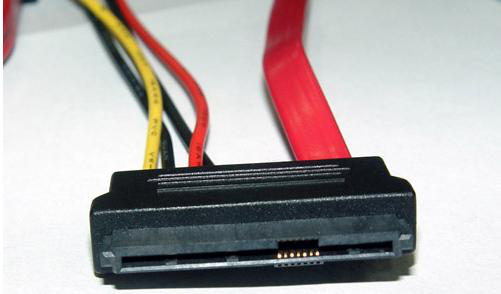
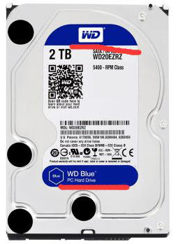
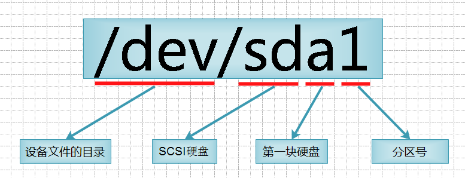
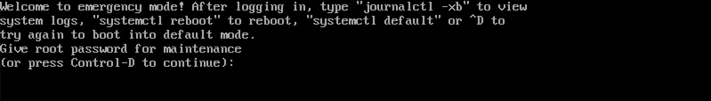

# 第十二章：磁盘介绍与管理

---

## 目录

* [SAS-SATA-SSD-SCSI-IDE 硬盘讲解](#aboutHardDrives)
* [磁盘分区工具和挂载](#diskPartitioningAndMounting)
* [实战扩展 swap 分区](#swapPartition)

## 目录

### <a href="#aboutHardDrives" id="aboutHardDrives">SAS-SATA-SSD-SCSI-IDE 硬盘讲解</a>

常见的磁盘类型：

* [SAS 硬盘](#SAS)
* [SATA 硬盘](#SATA)
* [SSD 硬盘](#SSD)
* [SCSI 硬盘](#SCSI)
* [IDE 硬盘](#IDE)
* [FC 硬盘](#FC)

#### <a href="#SAS" id="SAS">SAS 硬盘</a>

SAS(Serial Attached SCSI)即串行连接 SCSI，是新一代的 SCSI 技术。和现在流行的Serial ATA(SATA)硬盘相同，都是采用串行技术以获得更高的传输速度，并通过缩短连结线改善内部空间等。SAS 是并行 SCSI 接口之后开发出的全新接口。 此接口的设计是为了改善存储系统的效能、可用性和扩充性，并且提供与 SATA 硬盘的兼容性。

* SAS（串行连接 SCSI 接口）
* SAS（Serial Attached SCSI），串行连接 SCSI 接口，串行连接小型计算机系统接口。
* SAS 是新一代的 SCSI 技术，和现在流行的 Serial ATA(SATA)硬盘相同，都是采用串行技术以获得更高的传输速度，并通过缩短连结线改善内部空间等。
* SAS 的接口技术可以向下兼容 SATA。

#### <a href="#SATA" id="SATA">SATA 硬盘</a>

使用 SATA（Serial ATA）口的硬盘又叫串口硬盘。2001 年，由 Intel、APT、Dell、IBM、希捷、迈拓这几大厂商组成的 Serial ATA 委员会正式确立了 Serial ATA 1.0 规范。

2002 年，虽然串行 ATA 的相关设备还未正式上市，但 Serial ATA 委员会已抢先确立了 Serial ATA 2.0 规范（SATA II）。

Serial ATA 采用串行连接方式，串行 ATA 总线使用嵌入式时钟信号，具备了更强的纠错能力，与以往相比其最大的区别在于能对传输指令（不仅仅是数据）进行检查， 如果发现错误会自动矫正，这在很大程度上提高了数据传输的可靠性。串行接口还具有结构简单、支持热插拔的优点。

串口硬盘是一种完全不同于并行 ATA 的新型硬盘接口类型，由于采用串行方式传输数据而知名。相对于并行 ATA 来说，就具有非常多的优势。

* a). Serial ATA 以连续串行的方式传送数据，一次只会传送 1 位数据。这样能减少SATA 接口的针脚数目，使连接电缆数目变少，效率也会更高。
* b). 实际上，Serial ATA 仅用四支针脚就能完成所有的工作，分别用于连接电缆、连接地线、发送数据和接收数据，同时这样的架构还能降低系统能耗和减小系统复杂性。
* c). Serial ATA 的起点更高、发展潜力更大，Serial ATA 1.0 定义的数据传输率可达150MB/s；这比最快的并行 ATA（即 ATA/133）所能达到 133MB/s 的最高数据传输率还高；而在 Serial ATA 2.0 的数据传输率达到 300MB/s；最终 SATA 将实现 600MB/s 的最高数据传输率。
* 在选购主板时，其实并无必要太在意 IDE 接口传输标准有多快，其实在 ATA 100，ATA 133 以及 SATA 150 下硬盘性能都差不多，因为受限于硬盘的机械结构和数据存取方式，硬盘的性能瓶颈是硬盘的内部数据传输率而非外部接口标准，目前主流硬盘的内部数据传 输率离 ATA 100 的 100MB/sec 都还差得很远。所以要按照自己的具体需求选购。

**SATA II**

SATA 的速度是每秒 1.5Gbps(150MB/sec)，SATA2（Serial ATA 2.0 规范）的速度是每秒 3Gbps(300MB/sec)。SATAⅡ接口主板能插 SATA 硬盘，SATA 接口主板不能插SATAⅡ盘硬，这都是向下兼 容的。

SATA II 是在 SATA 的基础上发展起来的，其主要特征是外部传输率从 SATA 的1.5G 进一步提高到了 3G，此外还包括 NCQ（Native Command Queuing，原生命令队列）、端口多路器（Port Multiplier）、交错启动（Staggered Spin-up）等一系列的技术特征。单纯的外部传输率达到 3Gbps 并不是真正的 SATA II。

SATA II 的关键技术就是 3Gbps 的外部传输率和 NCQ 技术。 NCQ 技术可以对硬盘的指令执行顺序进行优化，避免像传统硬盘那样机械地按照接收指令的先后顺序移动磁头读写硬盘的不同位置，与此相反，它会在接收命令后 对其进行排序，排序后的磁头将以高效率的顺序进行寻址，从而避免磁头反复移动带来的损耗，延长硬盘寿命。

另外并非所有的 SATA 硬盘都可以使用 NCQ 技术，除了硬盘本身要支持 NCQ 之外，也要求主板芯片组的 SATA 控制器支持 NCQ。此外，NCQ 技术不支持 FAT 文件系统，只支持 NTFS 文件系统。

由于 SATA 设备市场比较混乱，不少 SATA 设备提供商在市场宣传中滥用“SATA II”的现象愈演愈烈，例如某些号称“SATA II”的硬盘却仅支持 3Gbps 而不支持 NCQ，而某些只具有 1.5Gbps 的硬盘却又支持 NCQ。所以，由希捷(Seagate)所主导的 SATA- IO(SerialATA International Organization，SATA 国际组织，原 SATA 工作组)又宣布了 SATA 2.5 规范，收录了原先 SATA II 所具有的大部分功能——从 3Gbps 和 NCQ 到交错启动(StaggeredSpin-up)、热插拔(Hot Plug)、端口多路器(Port Multiplier)以及比较新的 eSATA(ExternalSATA，外置式 SATA 接口)等等。

值得注意的是，部分采用较早的仅支持 1.5Gbps 的南桥芯片(例如 VIA VT8237 和NVIDIA nForce2 MCP-R/MCP-Gb)的主板在使用 SATA II 硬盘时，可能会出现找不到硬盘或蓝屏的情况。不过大部分硬盘厂商都在硬盘上设置了一个速度选择跳线，以便强制选择1.5Gbps 或 3Gbps 的工作模 式(少数硬盘厂商则是通过相应的工具软件来设置)，只要把硬盘强制设置为 1.5Gbps，SATA II 硬盘照样可以在老主板上正常使用。

SATA 硬盘在设置 RAID 模式时，一般都需要安装主板芯片组厂商所提供的驱动，但也有少数较老的 SATA RAID 控制器在打了最新补丁的某些版本的 Windows XP 系统里不需要加载驱动就可以组建 RAID。

#### <a href="#SSD" id="SSD"> SSD 硬盘</a>

固态硬盘（Solid State Disk 或 Solid State Drive），也称作电子硬盘或者固态电子盘，是由控制单元和固态存储单元（DRAM 或 FLASH 芯片）组成的硬盘。固态硬盘的接口规范和定义、功能及使 用方法上与普通硬盘的相同，在产品外形和尺寸上也与普通硬盘一致。由于固态硬盘没有普通硬盘的旋转介质，因而抗震性极佳。其芯片的工作温度范围很宽 （-40~85℃）。目前广泛应用于军事、车载、工控、视频监控、网络监控、网络终端、电力、医疗、航空等、导航设备等领域。目前由于成本较高，正在逐渐 普及到 DIY 市场。

由于固态硬盘技术与传统硬盘技术不同，所以产生了不少新兴的存储器厂商。厂商只需购买 NAND 存储器，再配合适当的控制芯片，就可以制造固态硬盘了。新一代的固态硬盘普遍采用 SATA-2 接口。

固态硬盘的存储介质分为两种，一种是采用闪存（FLASH 芯片）作为存储介质，另外一种是采用 DRAM 作为存储介质。

（1）基于闪存的固态硬盘（IDE FLASH DISK、Serial ATA Flash Disk）：

采用 FLASH 芯片作为存储介质，这也是我们通常所说的 SSD。它的外观可以被制作成多种模样，例如：笔记本硬盘、微硬盘、存储卡、优盘等样式。这种 SSD 固态硬盘最大的优点就是可以移动，而且数据保护不受电源控制，能适应于各种环境，但是使用年限不高，适合于个人用户使用。

在基于闪存的固态硬盘中，存储单元又分为两类：SLC（Single Layer Cell 单层单元）和 MLC（Multi-Level Cell 多层单元）。

SLC 的特点是成本高、容量小、但是速度快，而 MLC 的特点是容量大成本低，但是速度慢。MLC 的每个单元是 2bit 的，相对 SLC 来说整整多了一倍。不过，由于每个MLC 存储单元中存放的资料较多，结构相对复杂，出错的几率会增加，必须进行错误修正，这个动作导致其性能大幅落后于结构简单的 SLC 闪存。 此外，SLC 闪存的优点是复写次数高达 100000 次，比 MLC 闪存高 10 倍。此外，为了保证 MLC 的寿命，控制芯片都校验和智能磨损平衡技术算法，使得 每个存储单元的写入次数可以平均分摊，达到 100万小时故障间隔时间(MTBF)。

（2）基于 DRAM 的固态硬盘：

采用 DRAM 作为存储介质，目前应用范围较窄。它仿效传统硬盘的设计、可被绝大部分操作系统的文件系统工具进行卷设置和管理，并提供工业标准的 PCI 和 FC 接口用于连接主机或者服务器。应用方式可分为 SSD 硬盘和 SSD 硬盘阵列两种。它是一种高性能的存储器，而且使用寿命很长，美中不足的是需要独立电源 来保护数据安全。

#### <a href="#SCSI" id="SAS">SCSI 硬盘</a>

SCSI 的英文全称为“Small Computer System Interface”（小型计算机系统接口），是同IDE（ATA）完全不同的接口，IDE 接口是普通 PC 的标准接口，而 SCSI 并不是专门为硬盘设计的 接口，是一种广泛应用于小型机上的高速数据传输技术。SCSI 接口具有应用范围广、多任务、带宽大、CPU 占用率低，以及热插拔等优点，但较高的价格使得 它很难如 IDE 硬盘般普及，因此 SCSI 硬盘主要应用于中、高端服务器和高档工作站中。

#### <a href="#IDE" id="IDE"> IDE 硬盘</a>

IDE（Integrated Drive Electronics 集成驱动器电子）的缩写，它的本意是指把控制器与盘体集成在一起的硬盘驱动器，是一种硬盘的传输接口，它有另一个名称叫做 ATA（Advanced Technology Attachment），这两个名词都有厂商在用，指的是相同的东西。

IDE 的规格后来有所进步，而推出了 EIDE（Enhanced IDE）的规格名称，而这个规格同时又被称为 Fast ATA。所不同的是 Fast ATA 是专指硬盘接口，而 EIDE 还制定了连接光盘等非硬盘产品的标准。而这个连接非硬盘类的 IDE 标准，又称为 ATAPI 接口。而之后再推出更快的接口，名称都只剩下 ATA 的字样，像是 Ultra ATA、ATA/66、ATA/100 等。

早期的 IDE 接口有两种传输模式，一个是 PIO（Programming I/O）模式，另一个是DMA（Direct Memory Access）。虽然 DMA 模式系统资源占用少，但需要额外的驱动程序或设置，因此被接受的程度比较低。后来在对速度要求愈来愈高的情况下，DMA 模式由于执行效率较好，操作系统开始直接支持，而且厂商更推出了愈来愈快的 DMA 模式传输速度标准。而从英特尔的 430TX 芯片组开始，就提供了对 Ultra DMA 33 的支持，提供了最大 33MB/sec 的的数据传输率，以后又很快发展到了 ATA 66，ATA 100 以及迈拓提出的 ATA 133 标准，分别提供 66MB/sec，100MB/sec 以及 133MB/sec 的最大数据传输率。值得注意的是，迈拓提出的 ATA 133 标准并没能获得业界的广泛支持，硬盘厂商中只有迈拓自己才采用 ATA 133 标准，而日立（IBM），希捷和西部数据则都采用 ATA100 标准，芯片组厂商中也只有 VIA，SIS，ALi 以及 nViidia 对次标准提供支持，芯片组
厂商中英特尔则只支持 ATA 100 标准。

各种 IDE 标准都能很好的向下兼容，例如 ATA 133 兼容 ATA 66/100 和 Ultra DMA33，而 ATA 100 也兼容 Ultra DMA 33/66。要特别注意的是，对 ATA 66 以及以上的 IDE 接口传输标准而言，必须使用专门的 80芯 IDE 排线，其与普通的 40 芯 IDE 排线相比，增加了 40 条地线以提高信号的稳定性。

#### <a href="#FC" id="FC"> FC 硬盘</a>

光纤通道的英文拼写是 Fiber Channel，和 SCIS 接口一样光纤通道最初也不是为硬盘设计开发的接口技术，是专门为网络系统设计的，但随着存储系统对速度的需求，才逐渐应用到硬 盘系统中。光纤通道硬盘是为提高多硬盘存储系统的速度和灵活性才开发的，它的出现大大提高了多硬盘系统的通信速度。光纤通道的主要特性有：热插拔性、高速带宽、远程连接、连接设备数量大等。

光纤通道是为在像服务器这样的多硬盘系统环境而设计，能满足高端工作站、服务器、海量存储子网络、外设间通过集线器、交换机和点对点连接进行双向、串行数据通讯等系统对高数据传输率的要求。


SAS和SATA接口对比


SAS磁盘线



磁盘尺寸：

* 3.5 英寸设计
* 2.5 英寸设计
* 此前主流的桌面磁盘和服务器磁盘都是采用 3.5 英寸设计，而 SAS 硬盘除了具有传统的 3.5 英寸规格之外，还采用了 2.5 英寸的缩小版，这样可以在机架式服务器有限的空间内安装更多的磁盘以扩充存储系统的容量，也能够为其他配件腾出更大的空间，以便通风散热，在 2U 高度内使用 8 个 2.5 英寸的 SAS硬盘位已经成为大多数服务器厂商的选择。

<font color="#f00">已经被淘汰的硬盘：</font>


数据线和电源接口，串型和并型 哪个快?

并口为什么没有串口快？ 

* 串口形容一下就是 一条车道，而并口就是有 8 个车道。同一时刻能传送 8 位（一个字节）数据。
* 但是并不是并口快，由于 8 位通道之间的互相干扰。传输受速度就受到了限制。当传输出错时，要
同时重新传 8 个位的数据，<font color="#f00">而且传输速度越快，干扰越严重</font>。这是硬伤，这样速度就无法提升上来。
* 串口没有干扰，传输出错后重发一位就可以了。而且串口传输的时钟频率要比并口高。

常见硬盘品牌：希捷、三星、浦科特、闪迪、英特尔、东芝、英睿达、建兴、创见、金士顿、西部数据

硬盘分几种？

* A. 从工作原理来说：
	+ 固态：价格相对贵，寿命长，读取速度
	+ 机械：怕摔、怕磁，（单位换下来的坏盘会做消磁处理），读取速度---》磁道寻址时间，潜伏时间
* B. 从硬盘的接口来说
	+  STAT：用在低端服务器多
	+  SAS、SCSI：用在中高服务器
	+ PCIE M.2

对 LINUX 来说，在内核中，不同的接口对应有不同的命名方式：

| 操作系统 | IDE | STAT/SCSI | SAS |
|:-------|:---|:----------|:----|
| RHEL5   | /dev/hda | /dev/sda | /dev/sda |
| RHEL6   | /dev/sda | /dev/sda | /dev/sda |
| KVM      | /dev/vda |||

以西部数据为例，了解一下 SATA 盘。




### <a href="#diskPartitioningAndMounting" id="diskPartitioningAndMounting">磁盘分区工具和挂载</a>

MBR 概述：全称为 Master Boot Record，即硬盘的主引导记录。

硬盘的 0 柱面、0 磁头、1 扇区称为主引导扇区（也叫主引导记录 MBR）。它由三个部分组成，主引导程序、硬盘分区表 DPT（Disk Partition table）和分区有效标志（55AA）。在总共 512 字节的主引导扇区里主引导程序（boot loader）占 446 个字节，第二部分是 Partition table 区（分区表），即 DPT，占 64 个字节，硬盘中分区有多少以及每一分区的大小都记在其中。第三部分是 magic number，占 2 个字节，固定为 55AA。

分区编号：主分区 1-4 ，逻辑分区 5……

LINUX 规定：逻辑分区必须建立在扩展分区之上，而不是建立在主分区上

分区作用：

主分区：主要是用来启动操作系统的，它主要放的是操作系统的启动或引导程序，/boot 分区最好放在主分区上

扩展分区不能使用的，它只是做为逻辑分区的容器存在的；我们真正存放数据的是主分区和逻辑分区，大量数据都放在逻辑分区中

如果你用的是 GPT 的分区方式，那么它没有限制主分区个数

> 注意：使用分区工具 fdisk 对磁盘进行操作，分区，格式化(重点)

命名方式： /dev/sd[a-z]n

其中：a-z 表示设备的序号，如 sda 表示第一块 scsi 硬盘，sdb 就是第二块......n 表示每块磁盘上划分的磁盘分区编号



fdisk：磁盘分区,是 Linux 发行版本中最常用的分区工具

用法：fdisk [选项] device 

常用的选项 ： -l 查看硬盘分区表

案例：在 sdb 盘上建一个分区，大小为 100M

```
[root@spring ~]# fdisk /dev/sdc
Welcome to fdisk (util-linux 2.23.2).

Changes will remain in memory only, until you decide to write them.
Be careful before using the write command.

Device does not contain a recognized partition table
Building a new DOS disklabel with disk identifier 0xc1672249.
```

```
[root@spring ~]# ls /dev/sdb*
/dev/sdb  /dev/sdb1
```

解决：让新生成的分区生效：

```
[root@spring ~]# reboot # 这个是最好的方法
[root@spring ~]# partx -a /dev/sda # 获得新分区表
```

```
[root@spring ~]# ls /dev/sd*
/dev/sda  /dev/sda1  /dev/sda2  /dev/sda3  /dev/sdb  /dev/sdb1  /dev/sdc
```

```
# fdisk 创建一个新的分区
[root@spring ~]# fdisk /dev/sdc
Welcome to fdisk (util-linux 2.23.2).

Changes will remain in memory only, until you decide to write them.
Be careful before using the write command.

Device does not contain a recognized partition table
Building a new DOS disklabel with disk identifier 0x97c7ad1b.

Command (m for help):
Command (m for help): m
Command action
   a   toggle a bootable flag
   b   edit bsd disklabel
   c   toggle the dos compatibility flag
   d   delete a partition
   g   create a new empty GPT partition table
   G   create an IRIX (SGI) partition table
   l   list known partition types
   m   print this menu
   n   add a new partition
   o   create a new empty DOS partition table
   p   print the partition table
   q   quit without saving changes
   s   create a new empty Sun disklabel
   t   change a partition's system id
   u   change display/entry units
   v   verify the partition table
   w   write table to disk and exit
   x   extra functionality (experts only)

Command (m for help): p

Disk /dev/sdc: 8589 MB, 8589934592 bytes, 16777216 sectors
Units = sectors of 1 * 512 = 512 bytes
Sector size (logical/physical): 512 bytes / 512 bytes
I/O size (minimum/optimal): 512 bytes / 512 bytes
Disk label type: dos
Disk identifier: 0x97c7ad1b

   Device Boot      Start         End      Blocks   Id  System

Command (m for help): n
Partition type:
   p   primary (0 primary, 0 extended, 4 free)
   e   extended
Select (default p): p
Partition number (1-4, default 1):
First sector (2048-16777215, default 2048):
Using default value 2048
Last sector, +sectors or +size{K,M,G} (2048-16777215, default 16777215): +1G
Partition 1 of type Linux and of size 1 GiB is set

Command (m for help): w
The partition table has been altered!

Calling ioctl() to re-read partition table.
Syncing disks.
[root@spring ~]# ls /dev/sdc*
/dev/sdc  /dev/sdc1
```

```
# 使用 sdb1 新分区
[root@spring ~]# mkfs.ext4 /dev/sdc1
mke2fs 1.42.9 (28-Dec-2013)
Filesystem label=
OS type: Linux
Block size=4096 (log=2)
Fragment size=4096 (log=2)
Stride=0 blocks, Stripe width=0 blocks
65536 inodes, 262144 blocks
13107 blocks (5.00%) reserved for the super user
First data block=0
Maximum filesystem blocks=268435456
8 block groups
32768 blocks per group, 32768 fragments per group
8192 inodes per group
Superblock backups stored on blocks:
	32768, 98304, 163840, 229376

Allocating group tables: done
Writing inode tables: done
Creating journal (8192 blocks): done
Writing superblocks and filesystem accounting information: done

[root@spring ~]# mkfs.xfs /dev/sdc1
mkfs.xfs: /dev/sdc1 appears to contain an existing filesystem (ext4).
mkfs.xfs: Use the -f option to force overwrite.
[root@spring ~]# mkfs.xfs -f /dev/sdc1
meta-data=/dev/sdc1              isize=512    agcount=4, agsize=65536 blks
         =                       sectsz=512   attr=2, projid32bit=1
         =                       crc=1        finobt=0, sparse=0
data     =                       bsize=4096   blocks=262144, imaxpct=25
         =                       sunit=0      swidth=0 blks
naming   =version 2              bsize=4096   ascii-ci=0 ftype=1
log      =internal log           bsize=4096   blocks=2560, version=2
         =                       sectsz=512   sunit=0 blks, lazy-count=1
realtime =none                   extsz=4096   blocks=0, rtextents=0

[root@spring ~]# mkdir /sdc1                   # 创建挂载点
[root@spring ~]# mount /dev/sdc1 /sdc1/ # 挂载
[root@spring ~]# df -h                           # 查看
Filesystem      Size  Used Avail Use% Mounted on
devtmpfs        990M     0  990M   0% /dev
tmpfs          1000M     0 1000M   0% /dev/shm
tmpfs          1000M  8.6M  991M   1% /run
tmpfs          1000M     0 1000M   0% /sys/fs/cgroup
/dev/sda3        17G  1.9G   16G  11% /
/dev/sr0        4.4G  4.4G     0 100% /mnt
/dev/sda1       497M  151M  346M  31% /boot
tmpfs           200M     0  200M   0% /run/user/0
/dev/sdc1      1014M   33M  982M   4% /sdc1
```

```
# 解决卸载不了的问题
[root@spring sdc1]# umount /sdc1/
umount: /sdc1: target is busy.
        (In some cases useful info about processes that use
         the device is found by lsof(8) or fuser(1))

[root@spring sdc1]# lsof /sdc1/
COMMAND  PID USER   FD   TYPE DEVICE SIZE/OFF NODE NAME
bash    1078 root  cwd    DIR   8,33       20   64 /sdc1
lsof    1148 root  cwd    DIR   8,33       20   64 /sdc1
lsof    1149 root  cwd    DIR   8,33       20   64 /sdc1

[root@spring sdc1]# kill -9 1078
Connection to 192.168.2.220 closed.    
[root@spring sdc1]# umount /sdc1/

# 在文件最后写入
[root@spring ~]# vim /etc/fstab
/dev/sdb1     /sdb1    xfs     defaults 0 0
```

| /dev/sdb1 | /sdb1 | xfs | defaults | 0 | 0 |
|:--:|:--:|:--:|:--:|:--:|:--:|
| 要挂载的分区设备 | 挂载点 | 文件系统类型 | 挂载选项 | 是否备份 | 是否检测 |

```
# 自动挂载/etc/fstab 中没有挂载上的文件
[root@spring ~]# mount -a
[root@spring ~]# df -h
Filesystem      Size  Used Avail Use% Mounted on
devtmpfs        990M     0  990M   0% /dev
tmpfs          1000M     0 1000M   0% /dev/shm
tmpfs          1000M  8.6M  991M   1% /run
tmpfs          1000M     0 1000M   0% /sys/fs/cgroup
/dev/sda3        17G  1.9G   16G  11% /
/dev/sr0        4.4G  4.4G     0 100% /mnt
/dev/sda1       497M  151M  346M  31% /boot
tmpfs           200M     0  200M   0% /run/user/0
/dev/sdb1        10G   33M   10G   1% /sdb1
```    

发现已经挂载上，说明配置没有问题。 然后再重启，看看挂载

**使用 UUID 挂载**

```
[root@spring ~]# blkid
/dev/sda1: UUID="f9835a75-e831-42e0-969e-bfe762910352" TYPE="xfs"
/dev/sda2: UUID="a9083a4e-f8c1-4e9e-bef6-c3716f362270" TYPE="swap"
/dev/sda3: UUID="f7d267cb-d415-4267-acc6-c811370598b8" TYPE="xfs"
/dev/sdb1: UUID="5cebdd0b-44ae-4341-89f0-43080ccdd20f" TYPE="xfs"
/dev/sr0: UUID="2019-09-11-18-50-31-00" LABEL="CentOS 7 x86_64" TYPE="iso9660" PTTYPE="dos"
[root@spring ~]# echo "UUID=5cebdd0b-44ae-4341-89f0-43080ccdd20f /sdb1 xfs defaults 0 0" >> /etc/fstab
```

其中第四列：parameters-文件系统的参数

| 参数              | 说明 |
|:-----------|:----|
| Async/sync   | 设置是否为同步方式运行，默认为 async |
| auto/noauto  | 当执行 mount -a 的命令时，此文件系统是否被主动挂载。默认为 auto |
| rw/ro           | 是否以以只读或者读写模式挂载 |
| exec/noexe  | 限制此文件系统内是否能够进行"执行"的操作 |
| user/nouser  | 是否允许用户使用 mount 命令挂载 |
| suid/nosuid  | 是否允许 SUID 的存在 |
| Usrquota     | 启动文件系统支持磁盘配额模式 |
| Grpquota     | 启动文件系统对群组磁盘配额模式的支持 |
| Defaults      | 同时具有 `rw`,`suid`,`dev`,`exec`,`auto`,`nouser`,`async` 等默认参数的设置 samba nfs |

第五列：是否进行备份。通常这个参数的值为 0 或者 1

| 参数              | 说明 |
|:-----------|:----|
| 0 | 代表不要做备份 |
| 1 | 代表要每天进行操作 |
| 2 | 代表不定日期的进行操作 |

第六列：是否检验扇区：开机的过程中，系统默认会以 fsck 检验我们系统是否为完整

| 参数              | 说明 |
|:-----------|:----|
| 0 | 不要检验 |
| 1 | 最早检验（一般根目录会选择） |
| 2 | 1 级别检验完成之后进行检验 |

**gdisk 磁盘分区工具**

gdisk 主要是用来划分容量大于 2T 的硬盘,大于 2T fdisk 搞不定

两种类型的分区表：GPT 和 MBR ； MBR 不支持 4T 以上

GPT 分区：GPT，全局唯一标识分区表(GUID Partition Table)，它使用 128 位 GUID 来唯一标识每个磁盘和分区，与 MBR 存在单一故障点不同，GPT 提供分区表信息的冗余，一个在磁盘头部一个在磁盘尾部；它通过 CRC校验和来检测 GPT 头和分区表中的错误与损坏；默认一个硬盘支持 128 个分区

```
[root@spring ~]# yum -y install gdisk
```

```
[root@spring ~]# gdisk /dev/sdb
GPT fdisk (gdisk) version 0.8.10

Partition table scan:
  MBR: MBR only
  BSD: not present
  APM: not present
  GPT: not present


***************************************************************
Found invalid GPT and valid MBR; converting MBR to GPT format
in memory. THIS OPERATION IS POTENTIALLY DESTRUCTIVE! Exit by
typing 'q' if you don't want to convert your MBR partitions
to GPT format!
***************************************************************


Warning! Secondary partition table overlaps the last partition by
33 blocks!
You will need to delete this partition or resize it in another utility.

Command (? for help): ? # 查看帮助 第一步
b	back up GPT data to a file
c	change a partition's name
d	delete a partition
i	show detailed information on a partition
l	list known partition types
n	add a new partition
o	create a new empty GUID partition table (GPT)
p	print the partition table
q	quit without saving changes
r	recovery and transformation options (experts only)
s	sort partitions
t	change a partition's type code
v	verify disk
w	write table to disk and exit
x	extra functionality (experts only)
?	print this menu

Command (? for help): p # 第二步，打印分区表
Disk /dev/sdb: 20971520 sectors, 10.0 GiB
Logical sector size: 512 bytes
Disk identifier (GUID): 65849A52-7C82-4511-B199-5E563EA8050B
Partition table holds up to 128 entries
First usable sector is 34, last usable sector is 20971486
Partitions will be aligned on 2048-sector boundaries
Total free space is 2014 sectors (1007.0 KiB)

Number  Start (sector)    End (sector)  Size       Code  Name
   1            2048        20971519   10.0 GiB    8300  Linux filesystem

Command (? for help): d # 第三步，删除分区
Using 1

Command (? for help): p # 第四步，打印分区表
Disk /dev/sdb: 20971520 sectors, 10.0 GiB
Logical sector size: 512 bytes
Disk identifier (GUID): 65849A52-7C82-4511-B199-5E563EA8050B
Partition table holds up to 128 entries
First usable sector is 34, last usable sector is 20971486
Partitions will be aligned on 2048-sector boundaries
Total free space is 20971453 sectors (10.0 GiB)

Number  Start (sector)    End (sector)  Size       Code  Name

Command (? for help): n # 第五步，添加一个分区
Partition number (1-128, default 1):
First sector (34-20971486, default = 2048) or {+-}size{KMGTP}:
Last sector (2048-20971486, default = 20971486) or {+-}size{KMGTP}: +1G
Current type is 'Linux filesystem'
Hex code or GUID (L to show codes, Enter = 8300):
Changed type of partition to 'Linux filesystem'

Command (? for help): p # 第六步，打印分区表
Disk /dev/sdb: 20971520 sectors, 10.0 GiB
Logical sector size: 512 bytes
Disk identifier (GUID): 65849A52-7C82-4511-B199-5E563EA8050B
Partition table holds up to 128 entries
First usable sector is 34, last usable sector is 20971486
Partitions will be aligned on 2048-sector boundaries
Total free space is 18874301 sectors (9.0 GiB)

Number  Start (sector)    End (sector)  Size       Code  Name
   1            2048         2099199   1024.0 MiB  8300  Linux filesystem

Command (? for help): w # 保存

Final checks complete. About to write GPT data. THIS WILL OVERWRITE EXISTING
PARTITIONS!!

Do you want to proceed? (Y/N): y # 确定写入
OK; writing new GUID partition table (GPT) to /dev/sdb.
Warning: The kernel is still using the old partition table.
The new table will be used at the next reboot.
The operation has completed successfully.
```

```
[root@spring ~]# mkfs.xfs /dev/sdb1
mkfs.xfs: /dev/sdb1 contains a mounted filesystem
Usage: mkfs.xfs
/* blocksize */		[-b log=n|size=num]
/* metadata */		[-m crc=0|1,finobt=0|1,uuid=xxx]
/* data subvol */	[-d agcount=n,agsize=n,file,name=xxx,size=num,
			    (sunit=value,swidth=value|su=num,sw=num|noalign),
			    sectlog=n|sectsize=num
/* force overwrite */	[-f]
/* inode size */	[-i log=n|perblock=n|size=num,maxpct=n,attr=0|1|2,
			    projid32bit=0|1]
/* no discard */	[-K]
/* log subvol */	[-l agnum=n,internal,size=num,logdev=xxx,version=n
			    sunit=value|su=num,sectlog=n|sectsize=num,
			    lazy-count=0|1]
/* label */		[-L label (maximum 12 characters)]
/* naming */		[-n log=n|size=num,version=2|ci,ftype=0|1]
/* no-op info only */	[-N]
/* prototype file */	[-p fname]
/* quiet */		[-q]
/* realtime subvol */	[-r extsize=num,size=num,rtdev=xxx]
/* sectorsize */	[-s log=n|size=num]
/* version */		[-V]
			devicename
<devicename> is required unless -d name=xxx is given.
<num> is xxx (bytes), xxxs (sectors), xxxb (fs blocks), xxxk (xxx KiB),
      xxxm (xxx MiB), xxxg (xxx GiB), xxxt (xxx TiB) or xxxp (xxx PiB).
<value> is xxx (512 byte blocks).
```



输入 root 密码：***

把 fstab 中新添加开机自动加载项目删除：

```
[root@spring ~]# vim /etc/fstab
```

### <a href="#swapPartition" id="swapPartition">实战扩展 swap 分区</a>

Swap 分区在系统的物理内存不够用的时候，把硬盘空间中的一部分空间释放出来，以供当前运行的程序使用。

mkswap /devices (格式化成 swap 格式)

swapon /swap (激活/swap，加入到 swap 分区中)

vim /etc/fstab (开机自启动新添加的 swap 分区) ,在最后追加：

/devices swap swap defaults 0 0

如果不想使用需要删除，只需要执行#swapoff /swap

```
[root@localhost ~]# free -m
              total        used        free      shared  buff/cache   available
Mem:           1999          93        1819           8          85        1784
Swap:          2047           0        2047
[root@localhost ~]# ls /dev/sdb*
/dev/sdb  /dev/sdb1  /dev/sdb2
[root@localhost ~]# mkswap /dev/sdb2
mkswap: /dev/sdb2: warning: don't erase bootbits sectors
        (dos partition table detected). Use -f to force.
Setting up swapspace version 1, size = 1048572 KiB
no label, UUID=72f5099d-cf91-43fb-9379-bb39daef3a98
[root@localhost ~]# swapon /dev/sdb2 # 开启
[root@localhost ~]# free -m
              total        used        free      shared  buff/cache   available
Mem:           1999          94        1818           8          85        1783
Swap:          3071           0        3071

[root@localhost ~]# swapoff /dev/sdb2 # 关闭
[root@localhost ~]# free -m
              total        used        free      shared  buff/cache   available
Mem:           1999          94        1819           8          85        1783
Swap:          2047           0        2047

[root@localhost ~]# swapon /dev/sdb2
[root@localhost ~]# swapon -s # 查看
Filename				Type		Size	Used	Priority
/dev/sda2                              	partition	2097148	0	-2
/dev/sdb2                              	partition	1048572	0	-3
```

```
# 通过文件增加 SWAP 空间
[root@localhost ~]# dd if=/dev/zero of=swap_file bs=1M count=500
500+0 records in
500+0 records out
524288000 bytes (524 MB) copied, 0.688863 s, 761 MB/s
[root@localhost ~]#
[root@localhost ~]#
[root@localhost ~]# ll /root/swap_file
-rw-r--r-- 1 root root 524288000 Jan 30 17:49 /root/swap_file
[root@localhost ~]# chmod 0600 /root/swap_file
[root@localhost ~]# mkswap -f /root/swap_file
Setting up swapspace version 1, size = 511996 KiB
no label, UUID=27a384fc-706e-49f4-98ec-34cbb1dfbf5e
[root@localhost ~]# swapon /root/swap_file
[root@localhost ~]# free -m
              total        used        free      shared  buff/cache   available
Mem:           1999          95        1304           8         599        1753
Swap:          2547           0        2547
```
