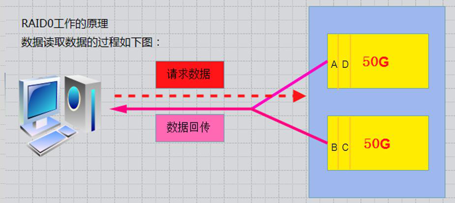
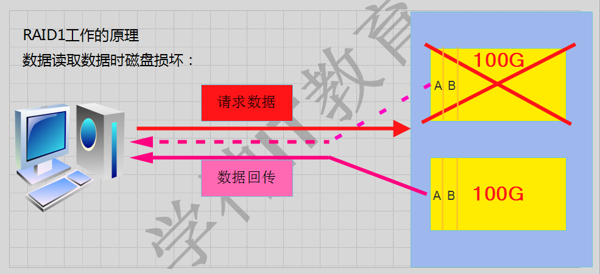
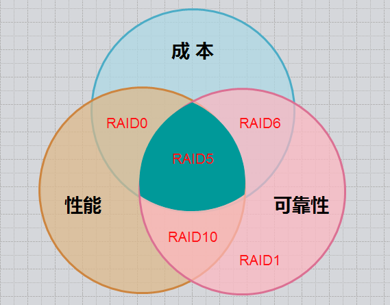

# 第十四章：RAID磁盘阵列的原理与搭建

---

## 目录

* [RAID 概念-企业级 RAID-0-1-5-10 的工作原理](#raid)
* [RAID-0-1-5-10 搭建及使用-删除 RAID 及注意事项](#raid-1-5-10)
* [实战-企业中硬件 raid5 的配置](#actualRaid5)

## 内容

### <a href="#raid" id="raid">RAID 概念-企业级 RAID-0-1-5-10 的工作原理</a>

磁盘阵列（Redundant Arrays of Independent Disks，RAID），有“独立磁盘构成的具有冗余能力的阵列”之意。磁盘阵列式有很多价格较便宜的磁盘，以硬件（RAID卡）或软件（MDADM）形式组合成一个容量巨大的磁盘组，利用多个磁盘组合在一起，提升整个磁盘系统效能。利用这项技术，将数据切割成许多区段，分别存放在各个硬盘上。磁盘阵列还能利用同位检查（Parity Check）的观念，在数组中任意一个硬盘做故障时，仍可读取数据，在数据重构时，将数据经计算后重新置入心硬盘中。

<font color="#f00">注：RAID可以预防数据丢失，但是它并不能完全保证你的数据不会丢失，所以大家使用RAID的同时还是注意备份重要的数据</font>

RAID的创建有两种方式：软RAID（通过操作系统软件来实现）和硬RAID（使用硬件阵列卡）；在企业中用的最多的是：raid1、raid5和raid10。不过随着云的告诉发展，供应商一般可以把硬件问题解决掉。

**1.1 RAID几种常见的类型：**

<table>
	<thead>
		<tr>
			<th colspan="2">RAID类型</th>
			<td rowspan="2">最低磁盘个数</td>
			<td rowspan="2">空间利用率</td>
			<td rowspan="2">各自的优缺点</td>
		</tr>
		<tr>
			<th>级别</th>
			<th>说明</th>
		</tr>
	</tead>
	<tbody>
		<tr>
			<th>RAID<font color="#f00">0</font></th>
			<td>条带卷</td>
			<td>2+</td>
			<td>100%</td>
			<td>读写速度快，不容错</td>
		</tr>
		<tr>
			<th>RAID<font color="#f00">1</font></th>
			<td>镜像卷</td>
			<td>2</td>
			<td>50%</td>
			<td>读写速度一般，容错</td>
		</tr>
		<tr>
			<th>RAID<font color="#f00">5</font></th>
			<td>带奇偶校验的条带卷</td>
			<td>3+</td>
			<td>(n-1)/n</td>
			<td>读写速度快，容错，允许坏一块盘</td>
		</tr>
		<tr>
			<th>RAID<font color="#f00">6</font></th>
			<td>带奇偶校验的条带卷，双校验</td>
			<td>4+</td>
			<td>(n-2)/n</td>
			<td>读写快，容错，允许坏凉快盘</td>
		</tr>
		<tr>
			<th>RAID<font color="#f00">10</font></th>
			<td>RAID1的安全+RAID0的高速</td>
			<td>4</td>
			<td>50%</td>
			<td>读写速度快，容错</td>
		</tr>
		<tr>
			<th>RAID<font color="#f00">50</font></th>
			<td>RAID5的安全+RAID0的高速</td>
			<td>6</td>
			<td>(n-2)/n</td>
			<td>读写速度快，容错</td>
		</tr>
	</tbody>
</table>

<font color="#f00">RAID基本思想</font>：把好几块硬盘通过一定组合方法把它组合起来，称为一个新的硬盘阵列组，从而使它能够达到高性能硬盘的要求。

RAID有三个关键技术：

* 镜像：提供了数据的安全性
* chunk条带（块大小也可以说是条带的粒度），它的存在的就是为了提高I/O，提供了数据并发性数
* 数据的校验：提供了数据的安全

RAID相对于丹哥磁盘优点：


**1.2 RAID-0的工作原理**

条带（strping）也是我们最早出现的RAID模式

<font color="#f00">需磁盘数量2块以上（大小最好相同）</font>，是组建磁盘阵列中国呢最简单的一种形式，只需要2块以上的硬盘即可。

<font color="#f00">特点</font>：成本低，可以提高整个磁盘的性能和吞吐量。RAID0没有提供冗余或错误修复能力，速度快。

<font color="#f00">任何一个磁盘的损坏将损坏全部数据，磁盘利用率100%</font>。




**1.3 RAID-1**

mirroring（镜像），需要磁盘2块以上

<font color="#f00">原理</font>：是把一个磁盘的数据镜像到另一个磁盘上，也就是说数据在写入一块磁盘的同时，会在另一块闲置的磁盘上生成镜像文件，（<font color="#f00">同步</font>）

RAID1 mirroring（镜像卷），至少需要两块硬盘，raid大小等于两个raid分区中最小的容量（最好将分区大小分为一样），数据有冗余，在存储时同时写入两块硬盘，实现了数据备份。

磁盘利用率为50%，即2块100G的磁盘构成RAID1只能提供100G的可用空间。如下图：




**1.4 RAID-5**

需要3块以上硬盘，可以提供热备盘实现故障的恢复；只损坏1块，没有问题。单如果同时损坏2块磁盘，则数据将会损坏。空间利用率：(n-1)/n 2/3 如下图：


奇偶校验信息的作用：

当RAID5的一个磁盘数据发生损坏后，利用剩下的数据和相应的奇偶校验信息去恢复被损坏的数据。

扩展：异或运算

是相对简单的异或逻辑运算（相同为0，相异为1）

| A值 | B值 | Xor结果 |
|:---:|:---:|:------:|
| 0    | 0    | 0          |
| 1    | 0    | 1          |
| 0    | 1    | 1          |
| 1    | 1    | 0          |

**1.5 嵌套RAID级别**

RAID-10 镜像+条带

RAID-10 时将镜像和条带进行两级组合的RAID级别，第一级时RAID1镜像对，第二级为RAID0。比如我们有8块盘，它是先两两做镜像，形成了新的4块盘，然后对这4块盘做RAID0；当RAID10有一个硬盘受损其余硬盘会继续工作，这个时候受影响的硬盘只有2块。


几个方案对比，RAID5是最合适的：



**1.6 RAID硬盘失效处理**

一般2中处理方法：热备和热插拔

热备：HotSpare

定义：当冗余的RAID组中某个硬盘失效时，在不干扰当前RAID系统的正常使用的情况下，用RAID系统中另外一个正常的备用硬盘自动顶替失效硬盘，及时保证RAID系统的冗余性。

全局式：备用硬盘为系统中所有的冗余RAID组共享

专用式：备用硬盘为系统中某一组冗余RAID组专用

如下图：所示：是一个全局热备的示例，该热备盘由系统中两个RAID组共享，可自动顶替任何一个RAID中的一个失效硬盘


热插拔：HotSwap

定义：在不影响系统正常运转的情况下，用正常的物理硬盘替换RAID系统中失效硬盘。

### <a href="#raid-1-5-10" id="raid-1-5-10">RAID-0-1-5-10 搭建及使用-删除 RAID 及注意事项</a>

**2.1 RAID的实现方式**

> 问：我们做硬件RAID，是在装系统前还是后？  
> 答：先做阵列才装系统，一般服务器启动时，有显示进入配置RAID的提示，比如：按下CTRL+L/H/M进入配置raid界面

硬RAID：需要RAID卡，我们的磁盘是接在RAID卡的，由它统一管理和控制。数据也由它来进行分配和维护；它有自己的cpu，处理速度快。

软RAID：通过操作系统实现。Linux内核中有一个md（multiple devices）模块在底层管理RAID设备，它会在应用层给我们提供一个应用程序的工具mdadm，mdadm是Linux下用于创建和管理软件RAID的命令。

mdadm命令参数：

| 参数 | 解释 | 参数 | 解释 |
|:----|:----|:----|:----|
| -C或--create | 建立一个新阵列 | -r | 移除设备 |
| -A | 激活磁盘阵列 | -l 或 --level= | 设定磁盘阵列的级别 |
| -D 或 --detail | 打印阵列设备的详细信息 | -n 或 --raid-devices= | 指定阵列成员（分区/磁盘）的数量 |
| -s 或 --scan | 扫描配置文件或/proc/mdstat得到阵列缺失信息 | -x 或 --spare-devicds= | 指定阵列中备用盘的数量 |
| -f | 将设备状态定位故障 | -c 或 --chunk= | 设定阵列的块chunk块大小，单位为KB |
| -a 或 --add | 添加设备到阵列 | -G或--grow | 改变阵列大小或形态 |
| -v | --verbose显示详细信息 | -S | 停止阵列 |

```
[root@spring ~]# ls /dev/sd*
/dev/sda   /dev/sda3  /dev/sdd  /dev/sdg  /dev/sdj  /dev/sdm  /dev/sdp
/dev/sda1  /dev/sdb   /dev/sde  /dev/sdh  /dev/sdk  /dev/sdn
/dev/sda2  /dev/sdc   /dev/sdf  /dev/sdi  /dev/sdl  /dev/sdo
```

磁盘达到sdz以后，名字排方式sdaa、sdab ...

实验环境：

| raid 种类 | 磁盘 | 热备盘 |
|:-------|:----|:------|
| raid0 | sdb、sdc |  |
| raid1 | sdd、sde | sdf |
| raid5 | sdg、sdh、sdi | sdj |
| raid10 | 分区：sdk1、sdk2、sdk3、sdk4 |  |

> 注：工作中正常做raid全部是使用独立的磁盘来做的。为了节约资源，raid10以一块磁盘上的多个分区来代替多个独立的磁盘做raid，但是这样做出来的raid没有备份数据的作用，因为一块磁盘坏了，这个磁盘上所做的raid也就都坏了。

**2.2 创建RAID0**

1、创建 raid0

```
[root@spring ~]# mdadm -C -v /dev/md0 -l 0 -n 2 /dev/sdb /dev/sdc
-bash: mdadm: command not found

[root@spring ~]# yum -y install mdadm

[root@spring ~]# mdadm -C -v /dev/md0 -l 0 -n 2 /dev/sdb /dev/sdc
mdadm: chunk size defaults to 512K
mdadm: Defaulting to version 1.2 metadata
mdadm: array /dev/md0 started.
```

2、查看阵列信息

```
[root@spring ~]# mdadm -Ds # 查看阵列信息
ARRAY /dev/md0 metadata=1.2 name=spring:0 UUID=158a6da6:460cb1f6:700bd93f:752f03af

[root@spring ~]# mdadm -D /dev/md0
/dev/md0:
           Version : 1.2
     Creation Time : Wed Feb  5 16:36:58 2020
        Raid Level : raid0
        Array Size : 16758784 (15.98 GiB 17.16 GB)
      Raid Devices : 2
     Total Devices : 2
       Persistence : Superblock is persistent

       Update Time : Wed Feb  5 16:36:58 2020
             State : clean
    Active Devices : 2
   Working Devices : 2
    Failed Devices : 0
     Spare Devices : 0

        Chunk Size : 512K # chunk 是 raid 中最小的存储单位

Consistency Policy : none

              Name : spring:0  (local to host spring)
              UUID : 158a6da6:460cb1f6:700bd93f:752f03af
            Events : 0

    Number   Major   Minor   RaidDevice State
       0       8       16        0      active sync   /dev/sdb
       1       8       32        1      active sync   /dev/sdc

[root@spring ~]# mdadm -Ds > /etc/mdadm.conf # 生成配置文件
```

3、对创建的RAID0进行文件系统创建并挂载

```
[root@spring ~]# mkfs.xfs /dev/md0
meta-data=/dev/md0               isize=512    agcount=16, agsize=261760 blks
         =                       sectsz=512   attr=2, projid32bit=1
         =                       crc=1        finobt=0, sparse=0
data     =                       bsize=4096   blocks=4188160, imaxpct=25
         =                       sunit=128    swidth=256 blks
naming   =version 2              bsize=4096   ascii-ci=0 ftype=1
log      =internal log           bsize=4096   blocks=2560, version=2
         =                       sectsz=512   sunit=8 blks, lazy-count=1
realtime =none                   extsz=4096   blocks=0, rtextents=0
[root@spring ~]# mkdir /raid0
[root@spring ~]# mount /dev/md0 /raid0/
[root@spring ~]# df -Th /raid0/
Filesystem     Type  Size  Used Avail Use% Mounted on
/dev/md0       xfs    16G   33M   16G   1% /raid0

# 测试使用挂载的raid0
[root@spring ~]# echo 123 > /raid0/a.txt
[root@spring ~]# ls /raid0/
a.txt
[root@spring ~]# cat /raid0/a.txt
123
```

4、开机自动挂载

```
# 查看md0 UUID
[root@spring ~]# blkid /dev/md0
/dev/md0: UUID="bfa89ca3-5c55-4ef6-8051-6b584501c71e" TYPE="xfs"
[root@spring ~]# echo "UUID=bfa89ca3-5c55-4ef6-8051-6b584501c71e /raid0 xfs defaults 0 0" >> /etc/fstab
```

**2.3 创建 RAID1**

1. 创建RAID1
2. 添加1个热备盘
3. 模拟磁盘故障，自动顶替故障盘
4. 从raid1中移除故障盘

```
[root@spring ~]# mdadm -C -v /dev/md1 -l 1 -n 2 -x 1 /dev/sd[d,e,f]
mdadm: Note: this array has metadata at the start and
    may not be suitable as a boot device.  If you plan to
    store '/boot' on this device please ensure that
    your boot-loader understands md/v1.x metadata, or use
    --metadata=0.90
mdadm: size set to 8379392K
Continue creating array? yes
mdadm: Defaulting to version 1.2 metadata
mdadm: array /dev/md1 started.

# 将 RADI 信息保存到配置文件
[root@spring ~]# mdadm -Dsv >> /etc/mdadm.conf

[root@spring ~]# mdadm -D /dev/md1
/dev/md1:
           Version : 1.2
     Creation Time : Wed Feb  5 16:56:52 2020
        Raid Level : raid1
        Array Size : 8379392 (7.99 GiB 8.58 GB)
     Used Dev Size : 8379392 (7.99 GiB 8.58 GB)
      Raid Devices : 2
     Total Devices : 3
       Persistence : Superblock is persistent

       Update Time : Wed Feb  5 16:57:36 2020
             State : clean
    Active Devices : 2
   Working Devices : 3
    Failed Devices : 0
     Spare Devices : 1

Consistency Policy : resync

              Name : spring:1  (local to host spring)
              UUID : 49c17d5b:c80aa5cf:556fc066:4f2b5c9b
            Events : 17

    Number   Major   Minor   RaidDevice State
       0       8       48        0      active sync   /dev/sdd
       1       8       64        1      active sync   /dev/sde

       2       8       80        -      spare   /dev/sdf
```

在RAID设备上创建文件系统

```
[root@spring ~]# mkfs.xfs /dev/md1
meta-data=/dev/md1               isize=512    agcount=4, agsize=523712 blks
         =                       sectsz=512   attr=2, projid32bit=1
         =                       crc=1        finobt=0, sparse=0
data     =                       bsize=4096   blocks=2094848, imaxpct=25
         =                       sunit=0      swidth=0 blks
naming   =version 2              bsize=4096   ascii-ci=0 ftype=1
log      =internal log           bsize=4096   blocks=2560, version=2
         =                       sectsz=512   sunit=0 blks, lazy-count=1
realtime =none                   extsz=4096   blocks=0, rtextents=0
[root@spring ~]# mkdir /raid1
[root@spring ~]# mount /dev/md1 /raid1/
```

准备测试文件

```
[root@spring ~]# cp /etc/passwd /raid1/
[root@spring ~]#
[root@spring ~]# ll /raid1/
total 4
-rw-r--r-- 1 root root 856 Feb  5 17:05 passwd
```

模拟损坏

下面模拟RAID1中数据盘`/dev/sde`出现故障，观察`/dev/sdf`备用盘能否自动顶替故障盘

```
[root@spring ~]# mdadm /dev/md1 -f /dev/sde
mdadm: set /dev/sde faulty in /dev/md1

[root@spring ~]# mdadm -D /dev/md1
/dev/md1:
           Version : 1.2
     Creation Time : Wed Feb  5 16:56:52 2020
        Raid Level : raid1
        Array Size : 8379392 (7.99 GiB 8.58 GB)
     Used Dev Size : 8379392 (7.99 GiB 8.58 GB)
      Raid Devices : 2
     Total Devices : 3
       Persistence : Superblock is persistent

       Update Time : Wed Feb  5 17:08:35 2020
             State : clean, degraded, recovering
    Active Devices : 1
   Working Devices : 2
    Failed Devices : 1
     Spare Devices : 1

Consistency Policy : resync

    Rebuild Status : 64% complete

              Name : spring:1  (local to host spring)
              UUID : 49c17d5b:c80aa5cf:556fc066:4f2b5c9b
            Events : 31

    Number   Major   Minor   RaidDevice State
       0       8       48        0      active sync   /dev/sdd
       2       8       80        1      spare rebuilding   /dev/sdf # 热备盘已经在同步数据

       1       8       64        -      faulty   /dev/sde
```

更新配置文件

```
[root@spring ~]# mdadm -Dsv >> /etc/mdadm.conf
```

查看数据是否丢失

```
[root@spring ~]# ls /raid1/
passwd # 数据正常，没有丢失
```

重要的数据如：数据库；系统盘（把系统安装到raid1的md1设备上，可以对md1做分区）


移除损坏的设备：

```
[root@spring ~]# mdadm -r /dev/md1 /dev/sde
mdadm: hot removed /dev/sde from /dev/md1
[root@spring ~]# mdadm -D /dev/md1 # 查看信息
/dev/md1:
           Version : 1.2
     Creation Time : Wed Feb  5 16:56:52 2020
        Raid Level : raid1
        Array Size : 8379392 (7.99 GiB 8.58 GB)
     Used Dev Size : 8379392 (7.99 GiB 8.58 GB)
      Raid Devices : 2
     Total Devices : 2
       Persistence : Superblock is persistent

       Update Time : Wed Feb  5 17:12:22 2020
             State : clean
    Active Devices : 2
   Working Devices : 2
    Failed Devices : 0
     Spare Devices : 0

Consistency Policy : resync

              Name : spring:1  (local to host spring)
              UUID : 49c17d5b:c80aa5cf:556fc066:4f2b5c9b
            Events : 39

    Number   Major   Minor   RaidDevice State
       0       8       48        0      active sync   /dev/sdd
       2       8       80        1      active sync   /dev/sdf
# 已经没有热备盘了
```

添加一块新热备盘

```
[root@spring ~]# mdadm -a /dev/md1 /dev/sde
mdadm: added /dev/sde
[root@spring ~]# mdadm -D /dev/md1
/dev/md1:
           Version : 1.2
     Creation Time : Wed Feb  5 16:56:52 2020
        Raid Level : raid1
        Array Size : 8379392 (7.99 GiB 8.58 GB)
     Used Dev Size : 8379392 (7.99 GiB 8.58 GB)
      Raid Devices : 2
     Total Devices : 3
       Persistence : Superblock is persistent

       Update Time : Wed Feb  5 17:16:32 2020
             State : clean
    Active Devices : 2
   Working Devices : 3
    Failed Devices : 0
     Spare Devices : 1

Consistency Policy : resync

              Name : spring:1  (local to host spring)
              UUID : 49c17d5b:c80aa5cf:556fc066:4f2b5c9b
            Events : 40

    Number   Major   Minor   RaidDevice State
       0       8       48        0      active sync   /dev/sdd
       2       8       80        1      active sync   /dev/sdf

       3       8       64        -      spare   /dev/sde
# 热备盘重新添加  
```

**2.4 创建RAID5**

1. 创建RAID5，添加1个热备盘，指定chunk大小为32K
	* -x或-spare-devicds= 指定阵列中备用盘的数量
	* -c或--chunk==设定阵列的块chunk块大小，单位为KB
2. 停止阵列，重新激活阵列
3. 使用热备盘，扩展阵列容量，从3个磁盘扩展到4个

```
[root@spring ~]# mdadm -C -v /dev/md5 -l 5 -n 3 -x 1 -c32 /dev/sd[g,h,i,j]
mdadm: layout defaults to left-symmetric
mdadm: layout defaults to left-symmetric
mdadm: size set to 8379392K
mdadm: Defaulting to version 1.2 metadata
mdadm: array /dev/md5 started.


[root@spring ~]# mdadm -D /dev/md5
/dev/md5:
           Version : 1.2
     Creation Time : Wed Feb  5 17:56:55 2020
        Raid Level : raid5
        Array Size : 16758784 (15.98 GiB 17.16 GB)
     Used Dev Size : 8379392 (7.99 GiB 8.58 GB)
      Raid Devices : 3
     Total Devices : 4
       Persistence : Superblock is persistent

       Update Time : Wed Feb  5 17:57:05 2020
             State : clean, degraded, recovering
    Active Devices : 2
   Working Devices : 4
    Failed Devices : 0
     Spare Devices : 2

            Layout : left-symmetric
        Chunk Size : 32K

Consistency Policy : resync

    Rebuild Status : 24% complete

              Name : spring:5  (local to host spring)
              UUID : 25682c6b:115ea0fc:ebc48e47:47ee35c5
            Events : 4

    Number   Major   Minor   RaidDevice State
       0       8       96        0      active sync   /dev/sdg
       1       8      112        1      active sync   /dev/sdh
       4       8      128        2      spare rebuilding   /dev/sdi

       3       8      144        -      spare   /dev/sdj # 热备盘
```

**2.4.2 停止 MD5 阵列**


```
# 停止前，一定要先保存配置文件
[root@spring ~]# mdadm -Dsv >> /etc/mdadm.conf
# 停止前，请确认数据已经同步完
[root@spring ~]# mdadm -D /dev/md5

[root@spring ~]# cat /proc/mdstat
Personalities : [raid0] [raid1] [raid6] [raid5] [raid4]
md5 : active raid5 sdi[4] sdj[3](S) sdh[1] sdg[0]
      16758784 blocks super 1.2 level 5, 32k chunk, algorithm 2 [3/3] [UUU]

md1 : active raid1 sde[3](S) sdf[2] sdd[0]
      8379392 blocks super 1.2 [2/2] [UU]

md0 : active raid0 sdc[1] sdb[0]
      16758784 blocks super 1.2 512k chunks

unused devices: <none>

[root@spring ~]# mdadm -S /dev/md5
mdadm: stopped /dev/md5

[root@spring ~]# cat /proc/mdstat
Personalities : [raid0] [raid1] [raid6] [raid5] [raid4]
md1 : active raid1 sde[3](S) sdf[2] sdd[0]
      8379392 blocks super 1.2 [2/2] [UU]

md0 : active raid0 sdc[1] sdb[0]
      16758784 blocks super 1.2 512k chunks

unused devices: <none>
```

**2.4.3 激活 MD5 阵列**

```
[root@spring ~]# mdadm -As /dev/md5
mdadm: /dev/md5 has been started with 3 drives and 1 spare.

[root@spring ~]# cat /proc/mdstat
Personalities : [raid0] [raid1] [raid6] [raid5] [raid4]
md5 : active raid5 sdg[0] sdj[3](S) sdi[4] sdh[1]
      16758784 blocks super 1.2 level 5, 32k chunk, algorithm 2 [3/3] [UUU]

md1 : active raid1 sde[3](S) sdf[2] sdd[0]
      8379392 blocks super 1.2 [2/2] [UU]

md0 : active raid0 sdc[1] sdb[0]
      16758784 blocks super 1.2 512k chunks

unused devices: <none>
```

**2.4.4 扩展 RAID5 磁盘阵列**

将热备盘增加到 md5 中，使用 md5 中可以使用的磁盘数量为 4 块

```
#-G 或--grow 改变阵列大小或形态
[root@spring ~]# mdadm -G /dev/md5 -n 4 -c 32
[root@spring ~]# mdadm -D /dev/md5
/dev/md5:
           Version : 1.2
     Creation Time : Wed Feb  5 17:56:55 2020
        Raid Level : raid5
        Array Size : 16758784 (15.98 GiB 17.16 GB)
     Used Dev Size : 8379392 (7.99 GiB 8.58 GB)
      Raid Devices : 4
     Total Devices : 4
       Persistence : Superblock is persistent

       Update Time : Wed Feb  5 18:34:07 2020
             State : clean, reshaping
    Active Devices : 4
   Working Devices : 4
    Failed Devices : 0
     Spare Devices : 0

            Layout : left-symmetric
        Chunk Size : 32K

Consistency Policy : resync

    Reshape Status : 1% complete
     Delta Devices : 1, (3->4)

              Name : spring:5  (local to host spring)
              UUID : 25682c6b:115ea0fc:ebc48e47:47ee35c5
            Events : 39

    Number   Major   Minor   RaidDevice State
       0       8       96        0      active sync   /dev/sdg
       1       8      112        1      active sync   /dev/sdh
       4       8      128        2      active sync   /dev/sdi
       3       8      144        3      active sync   /dev/sdj
```   

```
# 保存配置文件
[root@spring ~]# mdadm -Dsv >> /etc/mdadm.conf
```

> 备注：阵列只有在正常状态下，才能扩容，降级及重构时不允许扩容。对于 raid5 来说，只能增加成员盘，不能减少。而对于 raid1 来说，可以增加成员盘，也可以减少。

```
[root@spring ~]# mdadm -D /dev/md5
/dev/md5:
           Version : 1.2
     Creation Time : Wed Feb  5 17:56:55 2020
        Raid Level : raid5
        Array Size : 16758784 (15.98 GiB 17.16 GB) # 发现新增加硬盘后空间没有变大，为什么？
     Used Dev Size : 8379392 (7.99 GiB 8.58 GB)
      Raid Devices : 4
     Total Devices : 4
       Persistence : Superblock is persistent

       Update Time : Wed Feb  5 18:36:46 2020
             State : clean, reshaping
    Active Devices : 4
   Working Devices : 4
    Failed Devices : 0
     Spare Devices : 0

            Layout : left-symmetric
        Chunk Size : 32K

Consistency Policy : resync 

    Reshape Status : 56% complete # 重塑状态：6%完成 ，等到 100%， 数据才同步完，同步完后会变成
     Delta Devices : 1, (3->4)

              Name : spring:5  (local to host spring)
              UUID : 25682c6b:115ea0fc:ebc48e47:47ee35c5
            Events : 58

    Number   Major   Minor   RaidDevice State
       0       8       96        0      active sync   /dev/sdg
       1       8      112        1      active sync   /dev/sdh
       4       8      128        2      active sync   /dev/sdi
       3       8      144        3      active sync   /dev/sdj
```

```
[root@spring ~]# mdadm -D /dev/md5
/dev/md5:
           Version : 1.2
     Creation Time : Wed Feb  5 17:56:55 2020
        Raid Level : raid5
        Array Size : 25138176 (23.97 GiB 25.74 GB) # 空间已经变大
     Used Dev Size : 8379392 (7.99 GiB 8.58 GB)
      Raid Devices : 4
     Total Devices : 4
       Persistence : Superblock is persistent

       Update Time : Wed Feb  5 18:37:55 2020
             State : clean
    Active Devices : 4
   Working Devices : 4
    Failed Devices : 0
     Spare Devices : 0

            Layout : left-symmetric
        Chunk Size : 32K

Consistency Policy : resync # 一致性策略：再同步，表示已经同步完

              Name : spring:5  (local to host spring)
              UUID : 25682c6b:115ea0fc:ebc48e47:47ee35c5
            Events : 66

    Number   Major   Minor   RaidDevice State
       0       8       96        0      active sync   /dev/sdg
       1       8      112        1      active sync   /dev/sdh
       4       8      128        2      active sync   /dev/sdi
       3       8      144        3      active sync   /dev/sdj
```

**2.5 创建 RAID10**

```

[root@spring ~]# fdisk /dev/sdk
Welcome to fdisk (util-linux 2.23.2).

Changes will remain in memory only, until you decide to write them.
Be careful before using the write command.


Command (m for help): p

Disk /dev/sdk: 8589 MB, 8589934592 bytes, 16777216 sectors
Units = sectors of 1 * 512 = 512 bytes
Sector size (logical/physical): 512 bytes / 512 bytes
I/O size (minimum/optimal): 512 bytes / 512 bytes
Disk label type: dos
Disk identifier: 0xce110bb3

   Device Boot      Start         End      Blocks   Id  System
/dev/sdk1            2048     8390655     4194304   83  Linux

Command (m for help): d
Selected partition 1
Partition 1 is deleted

Command (m for help): n
Partition type:
   p   primary (0 primary, 0 extended, 4 free)
   e   extended
Select (default p): p
Partition number (1-4, default 1):
First sector (2048-16777215, default 2048):
Using default value 2048
Last sector, +sectors or +size{K,M,G} (2048-16777215, default 16777215): +1G
Partition 1 of type Linux and of size 1 GiB is set

Command (m for help): p

Disk /dev/sdk: 8589 MB, 8589934592 bytes, 16777216 sectors
Units = sectors of 1 * 512 = 512 bytes
Sector size (logical/physical): 512 bytes / 512 bytes
I/O size (minimum/optimal): 512 bytes / 512 bytes
Disk label type: dos
Disk identifier: 0xce110bb3

   Device Boot      Start         End      Blocks   Id  System
/dev/sdk1            2048     2099199     1048576   83  Linux

Command (m for help): n
Partition type:
   p   primary (1 primary, 0 extended, 3 free)
   e   extended
Select (default p): p
Partition number (2-4, default 2):
First sector (2099200-16777215, default 2099200):
Using default value 2099200
Last sector, +sectors or +size{K,M,G} (2099200-16777215, default 16777215): +1G
Partition 2 of type Linux and of size 1 GiB is set

Command (m for help): n
Partition type:
   p   primary (2 primary, 0 extended, 2 free)
   e   extended
Select (default p): p
Partition number (3,4, default 3):
First sector (4196352-16777215, default 4196352):
Using default value 4196352
Last sector, +sectors or +size{K,M,G} (4196352-16777215, default 16777215): +1G
Partition 3 of type Linux and of size 1 GiB is set

Command (m for help): n
Partition type:
   p   primary (3 primary, 0 extended, 1 free)
   e   extended
Select (default e): p
Selected partition 4
First sector (6293504-16777215, default 6293504):
Using default value 6293504
Last sector, +sectors or +size{K,M,G} (6293504-16777215, default 16777215): +1G
Partition 4 of type Linux and of size 1 GiB is set

Command (m for help): p

Disk /dev/sdk: 8589 MB, 8589934592 bytes, 16777216 sectors
Units = sectors of 1 * 512 = 512 bytes
Sector size (logical/physical): 512 bytes / 512 bytes
I/O size (minimum/optimal): 512 bytes / 512 bytes
Disk label type: dos
Disk identifier: 0xce110bb3

   Device Boot      Start         End      Blocks   Id  System
/dev/sdk1            2048     2099199     1048576   83  Linux
/dev/sdk2         2099200     4196351     1048576   83  Linux
/dev/sdk3         4196352     6293503     1048576   83  Linux
/dev/sdk4         6293504     8390655     1048576   83  Linux

Command (m for help): w
The partition table has been altered!

Calling ioctl() to re-read partition table.
Syncing disks.

[root@spring ~]# mdadm -C -v /dev/md10 -l 10 -n 4 /dev/sdk[1-4]
mdadm: layout defaults to n2
mdadm: layout defaults to n2
mdadm: chunk size defaults to 512K
mdadm: size set to 1046528K
mdadm: Defaulting to version 1.2 metadata
mdadm: array /dev/md10 started.
```

```
[root@spring ~]# cat /proc/mdstat
Personalities : [raid0] [raid1] [raid6] [raid5] [raid4] [raid10]
md10 : active raid10 sdk4[3] sdk3[2] sdk2[1] sdk1[0]
      2093056 blocks super 1.2 512K chunks 2 near-copies [4/4] [UUUU]

md5 : active raid5 sdg[0] sdj[3] sdi[4] sdh[1]
      25138176 blocks super 1.2 level 5, 32k chunk, algorithm 2 [4/4] [UUUU]

md1 : active raid1 sde[3](S) sdf[2] sdd[0]
      8379392 blocks super 1.2 [2/2] [UU]

md0 : active raid0 sdc[1] sdb[0]
      16758784 blocks super 1.2 512k chunks

unused devices: <none>

[root@spring ~]# mdadm -D /dev/md10
/dev/md10:
           Version : 1.2
     Creation Time : Wed Feb  5 18:55:38 2020
        Raid Level : raid10
        Array Size : 2093056 (2044.00 MiB 2143.29 MB)
     Used Dev Size : 1046528 (1022.00 MiB 1071.64 MB)
      Raid Devices : 4
     Total Devices : 4
       Persistence : Superblock is persistent

       Update Time : Wed Feb  5 18:55:49 2020
             State : clean
    Active Devices : 4
   Working Devices : 4
    Failed Devices : 0
     Spare Devices : 0

            Layout : near=2
        Chunk Size : 512K

Consistency Policy : resync

              Name : spring:10  (local to host spring)
              UUID : dde7d010:7546ad6e:9c176c0a:8bf69589
            Events : 17

    Number   Major   Minor   RaidDevice State
       0       8      161        0      active sync set-A   /dev/sdk1
       1       8      162        1      active sync set-B   /dev/sdk2
       2       8      163        2      active sync set-A   /dev/sdk3
       3       8      164        3      active sync set-B   /dev/sdk4
```

**2.6 删除 RAID 所有信息及注意事项**

```
[root@spring ~]# umount /dev/md0 /raid0 # 如果你已经挂载 raid，就先卸载。
umount: /raid0: not mounted
[root@spring ~]# umount /dev/md1
[root@spring ~]# umount /dev/md5
[root@spring ~]# umount /dev/md10
umount: /dev/md10: not mounted
[root@spring ~]# mdadm -Ss # 停止 raid 设备
[root@spring ~]# rm -rf /etc/mdadm.conf # 删除 raid 配置文件
[root@spring ~]# mdadm --zero-superblock /dev/sdb # 清除物理磁盘中的 raid 标识
[root@spring ~]# mdadm --zero-superblock /dev/sdc # 清除物理磁盘中的 raid 标识
[root@spring ~]# mdadm --zero-superblock /dev/sde # 清除物理磁盘中的 raid 标识
[root@spring ~]# mdadm --zero-superblock /dev/sdf # 清除物理磁盘中的 raid 标识
[root@spring ~]# mdadm --zero-superblock /dev/sdg # 清除物理磁盘中的 raid 标识
[root@spring ~]# mdadm --zero-superblock /dev/sdh # 清除物理磁盘中的 raid 标识
[root@spring ~]# mdadm --zero-superblock /dev/sdi # 清除物理磁盘中的 raid 标识
[root@spring ~]# mdadm --zero-superblock /dev/sdj # 清除物理磁盘中的 raid 标识
[root@spring ~]# mdadm --zero-superblock /dev/sdk # 清除物理磁盘中的 raid 标识
```

参数：--zero-superblock : erase the MD superblock from a device. #擦除设备中的 MD 超级块


### <a href="#actualRaid5" id="actualRaid5">实战-企业中硬件 raid5 的配置</a>

