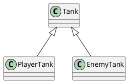
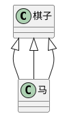

# 类的继承

---

## 继承的作用

继承可以描述类与类之间的关系

> 如果A和B都是类，并且可以描述为A是B，则A和B形成继承关系：

* B是父类，A是子类
* B派生A，A继承B
* B是A的基类，A是B的派生类

如果A继承自B，则A中自动拥有B的所有成员



## 成员的重写

重写（override）：子类中覆盖父类的成员

子类成员不可覆盖父类成员的属性类型

无论是属性还是方法，子类都可以对父类的相应成员进行重写，但是重写时，需要保证类型的匹配。

注意this关键字：在继承关系中，this的指向时动态调用方法时，根据具体的调用者确定this指向。

super关键字：在子类的方法中，可以使用super关键字读取父类成员

## 类型匹配

鸭子辨型法

子类的对象，始终可以赋值给父类

面向对象中，这种现象，叫做里氏替换原则

如果需要判断一个数据的具体子类类型 可以使用instanceof

## protected修饰符

readonly：只读修饰符

访问权限修饰符：private public protected

protected：受保护的成员，只能在自身和子类中访问

## 传递性和单根性

单根性：每个类最多只能拥有一个父类

传递性：如果A是B的父类，并且B是C的父类，则可以认为A也是C的父类


## 抽象类

有时，某个类值表示一个抽象概念，主要用于提取子类共有的成员，而不能直接创建对象。该类可以作为抽象类。

给类加上`abstract`，表示该类是一个抽象类，不可以创建一个抽象类的对象。

### 抽象成员

父类中，可能知道有些成员是必须存在的，但是不知道成员的具体值或实现是什么，因此，需要一种强约束，让继承该类的子类必须要实现该成员。

**抽象类中** 可以有抽象成员，这些抽象成员必须在子类中实现

```
abstract class Chess {
  x: number = 0
  y: number = 0

  abstract readonly name: string

  move(targetX: number, targetY: number): boolean {

  }
}
```



## 设计模式 - 模版模式

设计模式：面对一些常见的功能场景，有一些固定的，经过多年实践的成熟方法，这些方法称之为设计模式。

模版模式：有些方法，所有的子类实现的流程完全一致，只是流程中的某个步骤的具体实现不一致，可以将该方法提取到父类，在父类中完成整个的流程实现，遇到实现不一致的方法时，将该方法做成抽象方法。

## 静态成员

静态成员是指，附属在类上的成员（属于某个构造函数的成员）

使用`static`修饰的成员，是静态成员

实例成员：对象成员，属于某个类的对象

静态成员：非实例成员，属于某个类

### 静态方法中的this

实例方法中的this指向的是**当前对象**

静态方法中的this指向的是**当前类**

### 设计模式 -- 单例模式

单例模式：某些类的对象，在系统中最多只能有一个，为了避免开发者造成随意创建多个类对象的错误，可以使用单例模式进行强约束。

