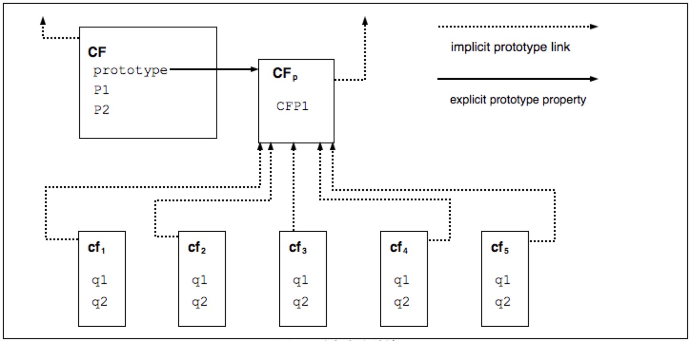

# ECMAScript 2015语言规范

### 范围

本标准定义了ECMAScript 2015 通用编程语言。

### 一致性

ECMAScript的一致性实现必须提供和支持本规范中描述的所有类型，值，对象，属性，函数和程序语法和语义。

符合ECMAScript的实现必须根据Unicode标准版5.1.0或更高版本和ISO／IEC 10646解释原文本输入。如果采用的ISO／IEC 10646-1子集没有另外规定，则推定为Unicode集，集10646。

ECMAScript的一致性实现提供了一个应用程序编程接口，支持需要适应不同人类语言和国家使用的语言和文化约定的程序，必须实现与最新版本的ECMA-402定义的界面，该界面与此兼容规范。

符合ECMAScript的实现可能会提供超出本规范描述的其他类型，值，对象，属性和功能。特别地，符合ECMAScript的实现可以提供本说明中未描述的属性以及用于这些属性的值，用于本说明书中描述的对象。

符合ECMAScript的实现可能支持本规范中未描述的程序和正则表达式语法。特别地，符合ECMAScript的实现可以支持使用本规范第11.6.2.2条列出的“未来保留字”的程序语法。

ECMAScript的一致性实现不得实施在第16.1节中被列为禁止扩展的任何扩展。

### 规范性引用

以下引用的文档对于本文档的应用是必不可少的。对于注日期的引用文件，仅引用的版本适用。对于未注明日期的参考文献，使用最新版本的参考文献（包括任何修订）。

ISO/IEC 10646: 2003: 信息技术-通用多字节编码字符集（UCS）加修正案1:2005 修正2:2006，修订3:2008和修订4:2008，以及其他修订和更正或后继

ECMA-402，ECMAScript2015国际化API规范。

http://www.ecma-international.org/publications/standards/Ecma-402.htm

ECMA-402， JSON数据交换格式

http://www.ecma-international.org/publications/standards/Ecma-404.htm

### 概述

本节包含ECMAScript语言的非规范性概述。

ECMAScript是一种面相对象的编程语言，用于在主机环境中执行计算和操纵计算对象。这里定义的ECMAScript不是计算自给自足的；实际上，在本说明书中没有规定外部数据的输入或计算结果的输出。相反，预期ECMAScript程序的计算环境不仅将提供本说明书中描述的对象和其他设施，还将提供特定环境特定对象，其描述和行为超出了本规范的范围，除了指出它们可以提供可以访问的某些属性和可以从ECMAScript程序调用的某些功能。

ECMAScript最初被设计为用作脚本语言，但已被广泛用作通用编程语言。一个脚本语言是用来操作，自定义和自动化现有系统设施的编程语言。在这样的系统中，通过用户界面已经可以获得有用的功能，并且脚本语言是将该功能暴露给程序控制的机制。以这种方式，现有的系统被称为提供对象和设施的主机环境，从而完成了脚本语言的功能。脚本语言由专业和非专业程序员使用。

ECMAScript最初设计为Web脚本语言，提供了一种在浏览器中激活Web页面的机制，并将其作为基于Web的客户端-服务器架构的一部分执行服务器计算。ECMAScript现在用于为各种主机环境提供核心脚本功能。因此，除了任何特定的主机环境外，本文档还规定了核心语言。

ECMAScript使用已经超出了简单的脚本，现在已经用于许多不同环境和规模的全方位的编程任务。随着ECMAScript的使用不断扩大，其功能和设施也得到了扩展。ECMAScript现在是一个功能齐全的一般提出的编程语言。

ECMAScript的一些设施类似于其他编程语言中使用的设备‘特别是C，Java（TM），Self和Scheme，如下所述：

ISO/IEC 9899: 1996，编程语言-C。

戈斯林，詹姆斯，比尔·乔伊和Guy Steele。Java ™语言规范。Addison Wesley Publishing Co.，1996。

Ungar，David和Smith，Randall B. Self：简单的力量。OOPSLA '87 Conference Proceedings，pp.227-241，Orlando，FL，1987年10月。

IEEE标准的方案编程语言。IEEE Std 1178-1990。

### Web脚本

Web浏览器为客户端计算提供ECMAScript主机环境，包括例如表示窗口，菜单，弹出窗口，对话框，文本区域，锚点，框架，历史记录，Cookie和输入／输出的对象。此外主机环境提供了将脚本代码附加到诸如焦点改变，页面和图像加载，卸载，错误和中止，选择，表单提交和鼠标动作等时间的手段。脚本代码出现在HTML中国年，显示的页面是用户界面元素和固定计算的文本和图像的组合。脚本代码对用户交互无反应，不需要主程序。

Web服务器为服务器端计算提供不同的主机环境，包括表示请求，客户端和文件的对象；以及锁定和共享数据的机制。通过一起使用浏览器端和服务器端脚本，可以在为基于Web的应用程序提供定制用户界面的同时在客户端和服务器之间分配计算。

支持ECMAScript的每个Web浏览器和服务器都提供自己的主机环境，完成ECMAScript执行环境。

### ECMAScript概述

以下是ECMAScript的非正式概述-不是描述该语言的所有部分。这个概述不是标准的一部分。

ECMAScript是基于对象的：基本语言和主机设施由对象提供，ECMAScript程序是一组通信对象。ECMAScript中，一个对象是零个或多个的集合的属性每个属性决定每个属性如何可以用于，例如，当用于属性的可写属性被设置为假，由执行的ECMAScript代码任何试图分配一个不同的该属性的值失败。属性是容纳其他对象，原始值或函数的容器。原始值是以下内置类型之一的成员：未定义，空，布尔，数字，字符串和符号；一个对象是内置类型Object的成员；一个函数是一个可调用的对象。通过属性与对象关联的函数称为方法。

ECMAScript定义了一个内置对象的集合，将ECMAScript实体的定义整合起来。这些内置对象包括全局对象；对于包括对象，函数，布尔，符号和各种错误对象在内的语言运行时语义的基础的对象；表示和操作数值的对象，包括数学，数字和日期；文本处理对象String和RegExp；被索引的值集合的对象包括数组和九种不同类型的类型数组，其元素都具有特定的数字数据表示；键集合，包括Map和Set对象；支持结构化数据的对象包括JSON对象，ArrayBuffer和DataView；支持控制抽象的对象，包括生成器函数和Promise对象；并且，反射对象，包括代理和反映。

ECMAScript还定义了一组内置运算符。ECMAScript运算符包括各种一元运算符，乘法运算符，加法运算符，位移运算符，关系运算符，等式运算符，二进制运算符，二进制逻辑运算符，赋值运算符和逗号运算符。

模块支持大型ECMAScript程序，这些模块允许将程序分为多个语句和声明序列。每个模块明确地标识它所使用的声明，这些声明需要由其他模块提供，哪些声明可供其他模块使用。

ECMAScript语法有意地类似于Java语法。ECMAScript语法宽松，使其成为易于使用的脚本语言。例如，变量不需要声明其类型，也不需要与属性相关联的类型，并且定义的函数在调用它们之前不需要以文本方式显示它们的声明。

### 对象

即使ECMAScript包含类定义的语法，ECMAScript对象也不是基于类的，如C++，SmallTalk或Java中的。相反，对象可以以各种方式创建，包括通过文字符号或通过构造器创建对象，然后执行通过将初始值分配给其属性来初始化其全部或部分的代码。每个构造函数都有一个名为“prototype”的属性用于实现基于原型的继承和共享属性的函数。通过使用新表达式中的构造函数创建对象；例如，new Date（2009，11）创建一个新的Date对象。调用构造函数而不使用new具有取决于构造函数的后果。例如，Date（）生成当前日期和时间的字符串表示，而不是一个对象。

由构造函数创建的每个对象都有一个隐式引用（称为对象的原型）到其构造函数的“prototype”属性值。此外，原型可能具有对其原型的非空隐含引用，等等；这被称为原型链。当引用对象中的属性时，该引用是指原型链中包含该名称的属性的第一个对象中该名称的属性。换句话说，首先对直接提到的对象进行这样的属性检查；如果该对象包含named属性，则该引用引用所引用的属性；如果该对象不包含named属性，那么将检查该对象的原型；等等。

在基于类的面相对象语言中，一般来说，状态由实例承载，方法由类承载，继承只是结构和行为。在ECMAScript中，状态和方法由对象承载，而结构，行为和状态都是继承的。

所有不直接包含其原型包含共享该属性及其值的特定属性的对象。图说明了这一点：

CF是一个构造函数（也是一个对象）。通过使用new表达式创建了五个对象：cf1，cf2，cf3，cf4，cf5每个对象包含一个名为q1和q2的属性。虚线表示隐式原型关系；所以，例如，cf3的原型是cfp。构造函数，CF，有本身有两个属性，命名P1和P2，这是不可见的CFp，CF1，cf2，cf3，cf4或cf5。命名属性CFP1在CFp是由共享CF1，CF2，CF3，CF4和CF5（而不是由CF），因为是在发现的任何属性CFp未命名的隐式原型链q1，q2，或CFP1.注意CF和CF之间没有隐含的原型链接CFp。

与大多数基于类的对象语言不同，可以通过向对象动态分配属性来将属性添加到对象中。也就是说，构造函数不需要为所有或任何构造的对象的属性命名或赋值。在上图中，可以通过为CFp中的属性分配一个新值，为cf1，cf2，cf3，cf4和cf5添加一个新的共享属性。

虽然ECMAScript对象本身并不是基于类的，但是通常可以根据构造函数，原型对象和方法的常见模式来定义类类抽象。ECMAScript内置对象本身就像这样一个类样的模式的。ECMAScript2015开始，ECMAScript语言包括语法类定义，允许程序猿简洁地定义符合内置对象使用的类似类的抽象模式的对象。

### ECMAScript的严格变体

ECMAScript语言识别该语言的某些用户可能希望限制其使用该语言中可用的某些功能的可能性。为了安全起见，他们可能会这样做，以避免他们认为是容易出错的功能，增强错误检查或其他选择的原因。为了支持这种可能性，ECMAScript定义了一种严格的语言变体。该语言的严格变体排除了常规ECMAScript语言的一些特定语法和语义特征，并修改了一些功能的详细语义。严格变体还指定了额外的错误条件，这些错误条件必须通过在不严格的语言形式指定为错误的情况下跑出错误异常来报告错误。

ECMAScript的严格变体通常被称为严格模式的语言。ECMAScript的严格模式选择和使用严格模式语法和语义明确地在单个ECMAScript源文本单元的级别。由于在句法源文本单元的级别选择了严格模式，严格模式仅强制在这样的源文本单元中具有局部效果的限制。严格模式不限制或修改必须在多个源文本单元上一致运行的ECMAScript语义的任何方面。完整的ECMAScript程序可能有严格模式和非严格模式ECMAScript源文本单元组成。在这种情况下，严格模式仅在实际执行在严格模式源文本单元中定义的代码的适用。

为了符合本规范，ECMAScript实现必须实现完全无限制的ECMAScript语言和本规范定义的ECMAScript语言的严格变体。另外，一个实现必须支持将非限制和严格模式源文本单元组合成一个单一的复合程序。

### 术语和定义

为了本文档的目的，适用以下术语和定义。

### 类型

本规范第6条定义的一组数据值

### 原始值

类型之一的成员Undefined，Null，Boolean，Number，Symbol或String，如，第6节所定义

> 注意：原始值是直接在语言实现的最低级别表示的基准。

### 对象

Object类型的成员

> 注意：对象是属性的集合，并且具有单个原型对象。原型可能是空值。

### 构造函数

创建和初始化对象的函数对象

> 注意：构造函数的prototype属性的值是用于实现继承和共享属性的原型对象。

### 原型

为其他对象提供共享属性的对象

> 注意：当构造函数创建一个对象时，该对象隐式引用构造函数的prototype属性以便解析属性引用。构造函数的prototype属性可以有程序表达式引用，并且添加到对象的原型中的属性通过继承由共享原型的所有对象进行共享。或者，可以使用内置函数通过明确指定的原型创建一个新对象。constructor.prototypeObject.create

###普通对象

对象具有所有对象必须支持的基本内部方法的默认行为。

### 特殊对象

对象不具有所有对象必须支持的一个或多个必须内部方法的默认行为。

> 注意：任何不适普通对象的对象都是特殊对象。

### 标准对象

其语义由本规范定义的对象

### 内置对象

由ECMAScript实现指定和提供的对象

> 注意：标准内置对象在本规范中定义。ECMAScript实现可以指定和提供其他种类的内置对象。一个内置的构造函数是一个内置的对象，也是一个构造函数。

### 未定义的值

当变量未被赋值时使用的原始值

### 未定义类型

类型，其唯一值时未定义的值

### 空值

表示有意不存在的任何对象值的原始值

### 空类型

其唯一值为空的类型

### 布尔值

布尔类型的成员

> 注意：只有两个布尔值true和false

### 布尔类型

类型由原始值true和false组成

### 布尔对象

作为标准内置Boolean构造函数实例的Object类型的成员。

> 注意：通过使用表达式中的Boolean构造函数创建布尔对象new，提供布尔值作为参数。生成的对象具有一个内部插槽，其值为布尔值，一个布尔对象可以强制喂一个布尔值。

### 字符串

原始值时零个或多个16位无符号整数的有限序列。

> 注意：String值是String类型的成员。序列中的每个整数值通常表示UTF-16文本的单个16位单位。但是，ECMAScript不对值进行任何限制或要求，除非它们必须是16位无符号整数。

### 字符串类型

所有可能的字符串值的集合

### 字符串对象

作为标准内置String构造函数实例的Object类型的成员。

> 注意：通过使用表达式中的String构造函数创建String对象new，并将String值作为参数。生成的对象具有一个内部插槽，其值为String值。通过调用String构造函数作为函数，可以将String对象强制转换为String值（21.1.1.1）

### 数值

原始值对应于双精度64位二进制格式IEEE 754-2008值

> 注意：数字值是Number类型的成员，是数字的直接表示形式。

### 数字类型

包括所有可能的数字值，包括特殊的“Not a number” （NaN）值，正无穷大和负无穷大

### 数字对象

作为标准内置Number构造函数实例的Object类型的成员

> 注意： 通过使用表达式中的Number构造函数创建Number对象new，并将数值作为参数提供。生成的对象具有一个内部插槽（internal slot ），其值是数字值。通过调用Number构造函数作为函数（20.1.1.1），可以将Number对象强制转换为数值。

