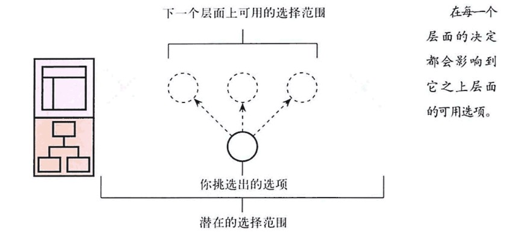
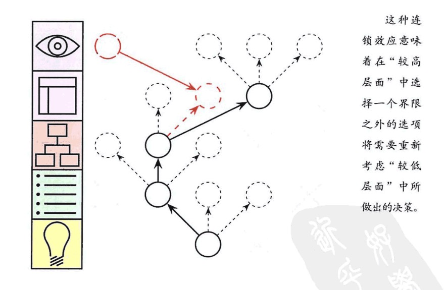
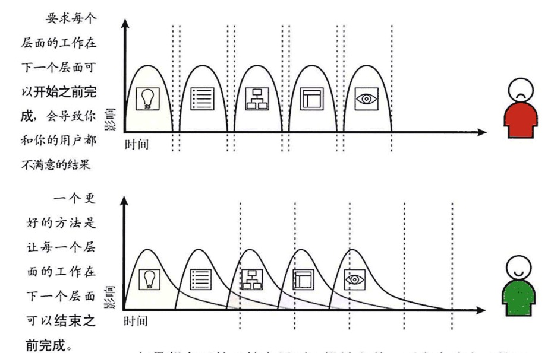
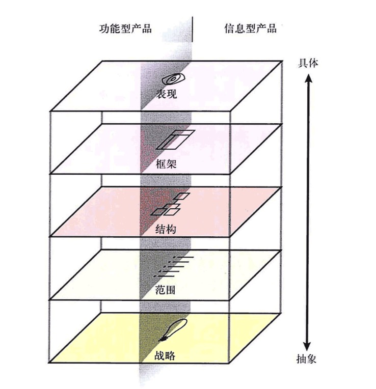
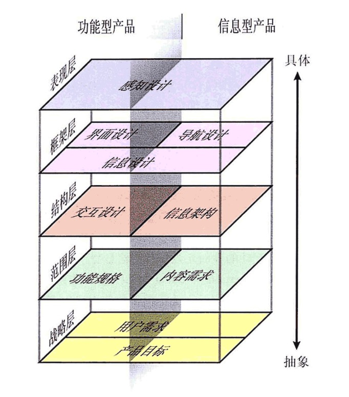
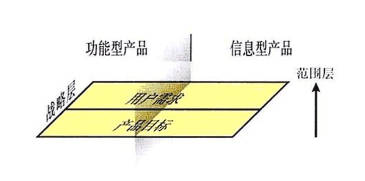

# 用户体验要素

---

把设计用户体验的工作分解成各个组成要素，以帮助我们更好地了解整个问题。

## 五个层面

* **表现层（Surface）**：你看到的是一系列的网页，由图片和文字组成。一些图片是可以点击的，从而执行某种功能。
* **框架层（skeleton）**：在表现层之下是网站的框架层：按钮、控件、照片和文本区域的位置。框架层用于优化设计布局，以达到这些元素的最大的效果和效率。
* **结构层（structure）**：与框架层相比更抽象的是结构层，框架是结构的具体表达方式。框架层确定了在结账页面上交互元素的位置；而结构层则利用设计用户如何达到某个页面，并且在他们做完事情之后能去什么地方。框架层定义了导航条上各要素的排列方式，允许用户可以浏览不同的商品分类；结构层则确定哪些类别应该出现在哪里。
* **范围层（scope）**：结构层确定网站各种特性和功能最适合的组合方式，而这些特性和功能就构成了网站的范围层。
* **战略层（strategy）**：网站的范围基本上是由网站战略层所决定的。这些战略不仅仅包括了经营者想从网站得到什么，还包括了用户想从网站得到什么。

表现层由框架层来决定，框架层则建立在结构层的基础上，结构层的设计基于范围层，范围层是根据战略层来制定的。

潜在的选择范围

连锁效应

### 战略层

无论是在功能型产品还是信息型产品，战略层所关注的内容都是一样的。来自外部的用户需求（User need）是网站的目标。

与用户需求相对应的，是我们自己对网站的期望目标。这些**产品目标**（product objective）可以是商业目的活着是其他类型的目标。

### 范围层

从战略层进入范围层以后，在功能型产品一侧它就转变成创建**功能规格**（functional specification）：对产品的“功能组合”的详细描述。而在信息型产品一侧，范围则是以**内容需求**（content requirement）的形式出现：对各种内容元素的要求的详细描述。

### 结构层

在功能型产品一侧，结构层将从范围转变成**交互设计**（interaction design），在这里我们可以定义系统如何响应用户的请求。在信息型产品一侧，结构层是**信息架构**（information architecture）：合理安排内容元素以促进人类理解信息。

### 框架层

框架层被分成了三个部分。不管是功能型产品还是信息型产品，我们必须要完成**信息设计**（information design）：一种促进理解的信息表达方式。对于功能型产品，框架层还包括了**界面设计**（interface design），或者也可以说安排好能让用户与系统的功能产生互动的界面元素。对于信息型产品，这种界面就是**导航设计**（navigation design）：屏幕上的一些元素的组合，允许用户在信息架构中穿行。

### 表现层

不管是功能型产品还是信息型产品，在这里我们关注的点都是一样的：为最终产品创建**感知体验**（sensory experience）。

两个额外的因素，他们将会对最终的用户体验产生影响：**内容**（content）、**技术**（technology）

导致网站失败最长见的原因不是技术，也不是用户体验。网站失败最长见的原因，是在开始写第一行程序、描第一个像素或者配置第一个服务器之前，没有人试图回答下面两个非常基本的问题：

* 我们要通过这个产品得到什么？
	+ **产品目标**（product objectives）
* 我们的用户要通过这个产品得到什么？
	+ **用户需求**（user needs）

**产品目标**（product objectives）+ **用户需求**（user needs） =  战略层

**明确**（explicit）

**商业目标**（business goals）、**商业驱动因素**（business drivers）。

企业网站的存在是为了满足两种意图当中的一个：**替公司赚钱**、**替公司省钱**。

每一个做出的决定，都应该建立在我们确切地了解了它的影响力的基础之上。明确地定义“成功的条件”——而不是定义“通向成功的路径”——才能保证我们不会在这个阶段跑得太快。

**品牌识别**（brand identity）：商标、色调、字体设计

**成功标准**（success metrics）：一些可追踪的指标。

**印象数**（impressions）

**用户细分**（user segmentation）：用户细分将全部的用户划分成较小的、有共同需求的小组，以此来帮助我们更好地了解用户的需求。

**人口统计学**（demographic）

**消费心态档案**（psychographic profile）

用户对技术和网页本身的想法。

**用户研究**（User Research）

**市场调研方法**（market research methods）

**功能和规格**（functional specifications）：在项目初期，这个词表示需求，描述系统应该做什么；在项目末期，这个词表示功能规格说明，描述系统真正完成了什么。

无论是从企业内部管理者，还是直接冲用户处获得的帮助，来定义这些需求，这个过程中得到的需求将分成三个主要类别：

* 首先，最显而易见的是人们讲述的、他们想要的东西。
* 有时候人们口中说出来的、所期望的特性其实并不是他们想要的，当人们在某个过程或某个产品中遭遇到一些困难时，想象有某种解决办法可以缓解这一困难，者对任何人来讲都是很正常的反应。有时候这种解决办法行不通，或者仅仅是治标不治本的办法。通过与用户讨论这些建议，你有时候可以得出能真正解决问题的、完全不同的需求。
* 第三，需求是人们不知道他们是否需要的特性。

那些很少去想象产品新方向的人，恰恰是参与创建和设计产品最深的人。

功能规格说明：

* **乐观**（be positive）：描述这个系统将要做什么事情去“防止”不好的情况发生，而不是描述这个系统“不应该”做什么不好的事情。
* **具体**（be specific）：尽可能详细地解释清楚状况，这是我们决定一个功能是否被实现的最佳途径。
* 避免主观语气（avoid subjective language）：这是另外一种使需求“保持明确”和“避免歧义”的途径——因而也避免了误解的可能性。

**内容清单**（content inventory）

**交互设计**（interaction design）：为用户设计结构化体验。曾经被归类在“界面设计”的范畴之内，近些年来交互设计已经成为了一个独立的学科。

在内容建设方面，主要是通过**信息架构**（information architecture）来构建用户体验。这个领域涉及的组织管理、分类、顺序排列，以及与内容呈现有关的：图书管理、新闻学，可技术通信等其他科学。

交互设计和信息架构都强调一个重点：确定各个将要呈现给用户的元素的“模式（patterns）”和“顺序（sequences）”。交互设计关注与将影响用户执行和完成任务的元素。信息架构则关注如何将信息表达给用户的元素。

交互设计和信息架构要求去理解用户——理解用户的工作方式、行为和思考方式。