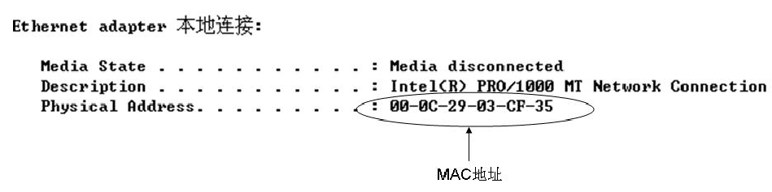
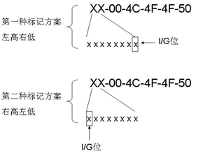
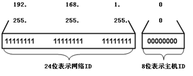

# 计算机网络基础

---

## 简介

计算机网络基础知识

## 目录

* [认识计算机网络](#UnderstandingComputerNetworks)
* [计算机网络拓扑与服务结构](#ComputerNetworkTopologyAndServiceStructure)
* [常见的IEEE标准](#CommonIeeeStandards)
* [CSMA/CD](#CsmaCd)
* [MAC地址](#MacAddress)
* [IP地址](#IpAddress)
* [OSI七层模式](#OsiSevenLayerMode)

### <a id="UnderstandingComputerNetworks" href="#UnderstandingComputerNetworks">认识计算机网络</a>

#### 计算机网络定义

通过各类不同的通讯设备和线材介质将处于不同地理位置且功能独立的多个计算机系统连接起来，然后通过成熟和完善的网络软件体系。比如：网络协议（TCP/IP、IPX/SPX）、各类网络操作系统（Windows、Linux）等，实现网络中资源共享和信息传递的系统。计算机网络的典型应用如下：

* **家庭网络**：涉及的产品包含个人计算机，支持网络功能的电视机、PDA（智能手机），宽带路由器、无线AP，以及未来支持互联网技术的家电设备等。对于这些产品的应用，如现今PDA智能手机的应用基本上接近PC（比如：可以安装类似于计算机上的软件，如QQ软件、浏览器等），并且PDA已经可以通过计算机无线网络设备AP，直接访问计算机网络资源。
* **公司企业领域**：涉及的产品包括个人计算机、打印机、IP电话、路由器、交换机、防火墙、服务器、存储设备，以及各类安全设备等。对于企业中设备的应用实例很多，这里以不常见的IP电话的应用为例，所谓的IP电话就是将语音信息封装在IP数据包中，然后通过已经存在的网络传递到目的地。换而言之，IP电话已经被作为类似于计算机终端设备接入计算机网络。

#### 计算机网络分类

计算机网络结构从地理位置层面上讲，可以分为“局域网”、“城域网”和“广域网”三种结构。

* **局域网**：局域网可以由两台或两台以上的计算机组成，传输距离可以在一个特定的区域内。通常将一个校园的教学楼和宿舍楼的计算机使用传输介质及网络设备连接在一起并实现资源共享，称之为局域网。局域网环境结构[如图]。组建局域网的目的是为了实现计算机与计算机之间的通信，以及实现文件管理、应用软件共享、打印机共享、电子邮件和传真通信服务等功能。
	+ **局域网的特点**：
		1. 覆盖范围有限
		2. 实现资源共享、服务共享
		3. 维护简单
		4. 组网开销低
		5. 主要传输介质为双绞线，并使用少量的纤维

* **城域网**：一种介于局域网与广域网之间，覆盖一个城市的地理范围，用来将同一个区域内的多个局域网互联在一起，因此称之为城域网。城域网环境结构[如图]。以教育网为例，县中学A、县中学B、县中学C都各自有自行维护的局域网，并且都上行连接到市教育局的核心网络上，在市教育局的核心网络有教育局办公网，以及应用服务器及视频服务器等，这样将地理位置分散的各所学校的计算机连接起来实现资源共享，这就是城域网。
	+ **城域网的特点**：
		1. 组网方式相对复杂
		2. 组网开销大
		3. 可实现资源互联
		4. 主要传输介质：光缆
		5. 可提高速率、高质量的数据传输

* **广域网**：广域网就是人们通常所说的Internet，它是一个遍及全世界的网络。广域网通常跨接很大的物理范围，它能连接多个城市和国家，并能提供超远的距离通信。广域网内的交换机一般采用点到点之间的专用线路连接起来。广域网的组网方式有虚电路方式和数据报方式两种，分别对应面向连接和无连接两种网络服务模式。广域网是一种用来实现不同地区的局域网或城域网的互联，可提供不同地区、城市和国家之间的计算机通信的网络。广域网环境结构[如图]
	+ **广域网的结构特点**：
		1. 适应大容量与突发性通用性的要求
		2. 适应综合业务服务要求
		3. 具有完善的通信服务与网络管理
		4. 可提供高速率、高质量的数据传输
		5. 主要传输介质是光缆、光纤
		6. 拥有重量级的冗余措施

#### 计算机网络服务结构

计算机网络结构从提供伺服功能层面上讲，可以分为“对等网”与“服务器-客户机”两种结构。下面分别描述这两种网络结构的差异与特点：

* **对等网**：对等网也称为“工作组网”，使用双绞线作为传输介质将两台或者多台计算机通过集线器或交换机连接在一起的实现资源互访。对等网络通常由10台以下的计算机组建而成，也是当今最简单的一种网络结构。在对等网网络中的计算机相互之间共享与访问资源，没有明确的服务器与客户机的区别。对等网的资源访问[如图]。它们相互之间都可以共享硬件介质如光驱、硬盘，还包括文件夹等。对等网无须专业级服务器支持，无须专业的网络工程师对网络进行维护，组建网络的成本低。
	+ **适用范围**：家庭和小型办公区域非常适合
	+ **优点**：组建对等网络成本低，配置简单，网络维护开销小，实现快速。
	+ **缺点**：无法完成统一的资源管理、集中的安全验证。

* **服务器-客户机**：服务器能为客户机提供伺服功能。为了更能明确的说明服务器的伺服功能，这里以资源访问服务器为例说明“服务器-客户机”的特点。服务器-客户机模式[如图]，原本被分散在对等网模式中的各种资源，包括文件、文件夹、打印机等，现在被集中地部署到一台计算机上，并且这台计算机给网络中的其他计算机提供伺服功能，那么这台计算机就叫做服务器。这样做的好处在于：可以变分散的资源共享与访问为集中资源管理，变分散的安全验证为统一的安全验证。客户机通过访问服务器来获取想要的数据和文件，以及相关的硬件资源。服务器-客户机模式又将称为C/S模式，（Client/Server）
	+ **适用范围**：现代化企业及园区网络的标准
	+ **优点**：便于集中管理、统一验证
	+ **缺点**：投入成本提高，管理的专业程度更深入
	+ 从服务器所提供的相关伺服功能大致分为：
		- 文件服务器
		- 邮件服务器
		- 集中安全验证服务器
		- 病毒防御服务器
		- 补丁升级服务器
		- OA服务器
		

### <a id="ComputerNetworkTopologyAndServiceStructure" href="#ComputerNetworkTopologyAndServiceStructure">计算机网络拓扑与服务结构</a>

#### 计算机网络拓扑图

计算机网络拓扑图是指计算机网络的传输介质（如：光纤、双绞线等）把各种网络设备（如：计算机、路由器、交换机）连接起来的物理布局，最终使所有计算机能够互相通信。在这里主要讨论的计算机网络拓扑包括：总线型拓扑、星型拓扑、环型拓扑

##### 总线型拓扑：

总线型拓扑是一种老式传统的计算机网络连接方式，它将所有的入网计算机连接到一条同轴线缆上。总线型网络拓扑[如图]，其组网元件包括：同轴电缆、T型头、50Ω终端电阻、BNC接口网卡。

* **同轴线缆**：是连接总线型网络的线缆介质，该线缆分为“粗缆”和“细缆”。“粗缆”可获得500m的传递距离，“细缆”可获得175m传递距离。通过同轴线缆可以获得基带10MB的带宽。通常标准10Base-2表示；使用“细缆”获得基带10MB的贷款；标准10Base-5表示；使用“粗缆”获得基带10MB的带宽。
* **T型头**：用于连接计算机上的BNC接口网卡。T型头的作用[如图]
* **50Ω终端电阻**：Ω（欧姆）是电阻阻抗的单位，在总线型网络拓扑中终端电阻的作用是吸收总线型网络上的干扰（噪声）。50口终端电阻[如图]
* **BNC接口网卡**：用于将计算机连接如总线型网络拓扑中，[如图]

**总线型拓扑图的优点：**

* 造价低、实现简单、无源工作

**总线型拓扑的缺点**：

* 传输距离有限，网络延伸距离有限
* 稳定性差，只要其中一个通信点发生故障，整个网络将全部瘫痪

> 注意：总线型网络标准（10Base-2、10Base-5）已被国际标准组织所废除，它被下面所描述的星型拓扑所代替，所以只做了解，不做深入研究。

##### 星型拓扑

星型拓扑是代替总线型网络连接方式的新方式，由中心节点（集线器、网桥、交换机）通过双绞线介质的方式连接到其他分支节点（计算机、工作站、服务器、IP电话）。星型拓扑图[如图]。分支节点间的通信必须通过中心节点，分支节点与中心节点的距离为100m。现大多数企业网络首选星型拓扑。

星型拓扑优点：

* 结构简单，组网容易
* 故障诊断和隔离故障容易
* 某一个分支节点出现故障，不会影响网络中的其他节点，这与总线型网络完全不同。

星型拓扑缺点：

* 中心节点的负担较重，所以提高中心节点设备的传输吞吐率是关键
* 中心节点瘫痪全网将不能通信

##### **环形拓扑**：

环形拓扑是各节点的首位互相连接形成一个闭合的环路，然后通过一种叫“令牌”的访问控制方式完成通信。在任意一时刻，“令牌”智能产生在环路中的某一台具体的主机上，也只有获得“令牌”的主机才能发送数据，当完成数据发送后，该主机释放“令牌”。“令牌“环形[如图]。由于“令牌”这样的一种访问机制存在，使得这种网络结构不存在以太网“竞争机制”，稳定性较强，但利用率相对较低，最早该网络类型始于20世纪70年代的IBM公司，但是现在这种网络比较少见。在传统的令牌环网中，数据传输速度为4Mbps或者16Mbps，新型的快速令牌环网速度可达100Mbps。

> 注意：令牌环网所使用的这个环形拓扑是逻辑上的环形，从物理视角去看，它更像是一个星型拓扑，令牌环网的逻辑拓扑与物理拓扑。

**环形拓扑的优点：**

* 造价低，实现容易
* 由于没有“竞争机制”存在，所以该网络较为稳定。

**环形拓扑的缺点：**

* 一个节点出现故障导致全网瘫痪
* 因为令牌访问机制的约束，当环中的节点数量过多时，信息传递的延时增大。

### <a id="CommonIeeeStandards" href="#CommonIeeeStandards">常见的IEEE标准</a>

前面描述了IEEE的定义，以及常见的IEEE 802相关标准，要认识并理解这些标准的最终目标与实用意义，而不能单纯的对各个标准进行记忆。最终目标与实际意义是帮助用户在网络工程项目中阅读产品参数与技术指标，比如：购买一台网络设备，通常在设备的说明书或者技术文档中指示某一设备接口支持802.3标准，另一设备接口支持802.5标准，那么用户就可以很明确的知道，支持802.3标准的接口是一个以太网接口，而支持802.5标准的接口是一个令牌环网（Token-Ring）的接口，如果还指示了设备支持IEEE 802.11标准，那么就说明该设备还支持无线局域网的功能。

### <a id="CsmaCd" href="#CsmaCd">CSMA/CD</a>

#### 理解以太网

以太网是由Xerox、DEC、Intel三家公司联合开发的一种基于以太制式数学算法的网络通信标准。以太网是现今应用最为广泛的局域网，由于互联网技术的不断更新，现在的以太网包括：传统速率的以太网（10Mbps）、快速以太网（100Mbps）和吉比特以太网（1Gbps）。无论它是何种速率标准，请记住以太网都是采用CSMA/CD介质访问控制协议进行工作的，他们都符合IEEE 802.3的标准，所以通常将IEEE 802.3等同于以太网。

#### 理解CSMA/CD

CSMA/CD（Carrier Sense Multiple Access/Collision Detect）即载波监听多路访问/冲突检测方法，它在以太网中为所有的节点共享传输介质，并保证传输介质有序、高效地为许多节点提供传输服务。基于以太制式数学算法的网络都会产生一个问题：不管是10Mbps、100Mbps、1000Mbps，甚至万兆以太网都会存在冲突。这是因为只要是以太网，就都必须遵守CSMA/CD（载波监听）协议，它是以太网的访问介质协议。载波监听协议的工作原理[如图]。A、B、C、D四台主机都处于一个冲突域内，且都连接在一个集线器上，如果B主机要发送数据给C主机，那么B主机会在正式发送数据之前想网络中发送一个载波起监听信号，查看网络总线是否繁忙。如果繁忙，如A主机正在给D主机发送数据，那么B主机就不能发送数据给C主机；否则就会产生一个冲突。同一时刻只能在一台主机向另一台主机发送数据，如果违反了该原则就会有冲突产生。而CSMA/CD正是用于冲突检测的协议。

### <a id="MacAddress" href="#MacAddress">MAC地址</a>

#### MAC（Medium/Media Access Control）地址

MAC（Medium/Media Access Control）地址，是计算机网络中的硬件地址，用来定义网络设备的位置。属于OSI模型的数据链路层，该地址被烧录到网卡的ROM中，换而言之，在默认情况下这个地址是不可改写的，因此一个网卡会有一个全球唯一的MAC地址。[如图]，MAC地址使用十六进制来表示，一个十六进制等于4个位的二进制，所以完整的MAC地址将是48位。在不久的将来MAC地址可能会被扩展为64位，但是现在市场上的网卡多数还是以48位的MAC地址为主。

#### 理解Mac地址构成

事实上，48位的MAC地址由两部分组成，分别是机构唯一性标识（OUT）和扩展标识（EUI），[如图]其中的MAC地址从左至右数的前24位00-0C-29为OUI，通常指示某个生产商，所以也叫做公司标志符，而后24位是由取得OUI标志符的厂商在生产网卡时自行编码的，也就是扩展标识（EUI），厂商只要保证在执行编码时不要重复就可以了。

> 注意：OUI标识符由网卡生产商向IEEE相关组织购买，这是需要花费的。

#### 理解MAC地址的I/G位

MAC地址有一个关键的位叫“Individual/Group（I/G）”，在常规的应用中可能不太重视该位的作用，但是当应用关系到组播时，那么就必须关心I/G位，它表示拥有MAC地址的这台计算机是单站主机还是组播应用的MAC。换而言之，可以这样理解：MAC在单播通信时一台主机将对应一个MAC地址，但是使用组播通信时可能存在多台主机对应一个MAC地址。

[如图]，一个MAC地址从左向右数（左高右低），将地址的前8位转换成二进制数，然后二进制数的最后一位为I/G位，如果该位为0，则表示这个MAC地址是单播通信过程中的唯一工作站，具备独一无二的特性；如果该位为1，则表示是一个组播MAC，那么就可能存在有多台计算机对应一个MAC地址。在多数情况下遵守这个左高右低的原则，然后最高字节的最低位成为I/G位，但是这不是绝对的，因为还存在第二种标记I/G位的做法，即右高左低，然后取最高字节的最低位作为I/G位。但是最常用的标记方法是左高右低。产生这两种不同标记的原因是：在制订802标准时，每家公司都想以自己的原始标准兼容，所以谁都不愿让步，最终就产生了两种标记方案，而使用这两种不同标记方案时，I/G位是完全不同的。

> 注意：在这里笔者强调MAC地址的I/G位的目的是为用户在思科CCNP的组播学习中打下基础，因为CCNA的定位除了完成基本的网络学习外，就是为深入CCNP做基础描述。

### <a id="IpAddress" href="#IpAddress">IP地址</a>

#### IP地址的定义与分类

IP地址相当于人类世界中某人住宅位置的具体地址，属于哪一个城市里的那一条街道，具体的门牌号。人类的住宅地址是为了方便寻找具体某一个人，而网络通信领域里的IP地址是为了确定一个具体网络设备或网络计算机所处的具体位置。通过理解什么是IP地址、IP地址的组成部分、谁负责分发和管理IP地址、IP地址的分类等方面来成功的学习IP地址。Internet依靠TCP/IP协议，在全球范围内实现不同硬件结构、不同操作系统、不同网络系统的互联。

在Internet上，每一个节点都依靠唯一的IP地址互相区分和联系。IP地址是一个32位二进制数的地址，由4个8位字段组成，每个字段之间用点号隔开，比如202.202.1.1就是一个IP地址。简单的说，一个IP地址就代表网络上一个通信节点，并且这个通信节点在全世界范围内是独一无二的。

#### IP地址的分类

* A类IP地址：1.0.0.1～126.255.255。254； 子网掩码： 255.0.0.0
* B类IP地址：128.1.0.1～191.254.255.254 子网掩码：255.255.0.0
* C类IP地址：192.0.1.1～223.255.254.254 子网掩码：255.255.255.0
* D类IP地址：224.0.0.1～239.255.255.254
* E类IP地址：保留实验使用

#### 特殊IP地址说明

127.0.0.1:回送地址。指本地机，一般用来测试，被保留。主机ID部分被转换成二进制，全是1与0的作保留。比如：把192.168.1.255/24这个地址的主机ID转换成二进制后就是“11111111”，这表示192.168.1.255子网内的广播地址，把192.168.1.0/24的主机ID转换成二进制就是“00000000”，这表示192.168.1.0的整个子网。自动专用IP寻址（Automatic Private IP Addressing， APIPA）是一个故障转移机制，当DHCP服务器出故障时，APIPA在169.254.0.1到169.254.255.254的私有空间内分配地址，所有设备使用默认的网络掩码255.255.0.0。APIPA可以为没有DHCP服务器的单网段网络提供自动配置 TCP/IP协议的功能。

#### 谁负责发放和管理IP地址

所有的IP地址都由国际组织NIC（Network Information Center）负责统一分配，目前全世界共有三个这样的网络信息中心。InterNIC负责美狗及其他地区;ENIC负责欧洲地区；APINIC负责亚太地区。我国申请IP地址要通过APNIC，APNIC的总部设在日本东京大学。申请时要考虑申请哪一类的IP地址，然后向国内的代理机构提出。

#### 理解子网掩码与IP子网的划分

详细地理解IP地址的分类与子网划分，首先必须理解IP地址的组成部分。每个IP地址都包含两部分：网络ID和主机ID。网络ID**标识在同一个物理网络上的所有主机**，主机ID**标识该物理网络上的某一台具体的主机**。整个Internet上的每台计算机都依靠各自唯一的IP地址来标识。比如192.168.1.1这个地址，那部分属于网络ID，首先要成功的理解子网掩码。实际上**子网掩码就是用于识别一个IP地址的网络ID与主机ID的关键**。[如图]192.168.1.1的子网掩码为255.255.255.0，那么该地址的网络ID就是192.168.1.0，共计24位（子网掩码是三个255，转换成二进制就是24个1，所以也称为24位）表示网络ID，剩下的8位表示主机ID

* 将子网掩码与IP地址作为一个配对，子网掩码十进制数“255”（二进制是11111111）对应的IP地址部分就是IP地址的网络ID，子网掩码十进制数“0”（二进制是00000000）对应的就是主机ID
* IP地址为192.168.1.0，子网掩码为255.255.255.0，可以表示为192.168.1.0/24.这里的24就等同与255.255.255.0

#### 计算一个IP子网内的主机数

192.168.1.0/24该IP所处的子网最多可以有多少台主机？能够成功地计算某个IP子网中能容纳多少台计算机，这对有效、合理的理解IP地址的设计非常有帮助。192.168.1.1的子网掩码为255.255.255.0，那么该地址的网络ID就是192.168.1.0，共计24位表示网络ID，剩下的8位表示主机ID。计算一个子网内可容纳多少台主机的公示为：**2n-2**其中，n表示主机ID“0”的个数。以IP地址192.168.1.1为例：192.168.1.0/24的子网可容纳28-2=254台主机。为什么要在公式中减2，减掉的2是指网络ID和广播地址。如192.168.1.0/24的主机ID全为“0”表示为网络ID，192.168.1.255/24的主机ID全为“1”表示为广播地址。

#### 默认网关

默认网关通常指一个IP网络需要向另一个IP网络通信的最后通道（数据转发点）。通过文字定义可能很抽象，现在通过实例应用来理解默认网关。[如图]该环境中有两个IP网络，其中一个为192.168.1.0；另一个为192.168.2.0。不同IP网络要进行通信必须经过路由器来转发数据包，此时的默认网关实际上就是路由器上对应不同IP网络的一个转发接口，相当于一个IP网络到另一个IP网络的最后路径。计算机A和计算机B处于IP 192.168.1.0中，它们要和处于192.168.2.0的主机C和主机D通信，主机A和主机B就必须通过路由器上的192.168.1.1这个IP节点转发数据包到192.168.2.0的IP网络，此时路由器上的IP地址192.168.1.1就是192.168.1.0网络的默认网关，于此同理，192.168.2.1就是IP网络192.168.2.0的默认网关。

#### VLSM（可变长的子网掩码）与CIDR（无类域间的路由）

**VLSM（Variable Length Subnet Mask 可变长的子网掩码）**：很直观地表达IP地址的VLSM形式：172.16.1.1，在传统的IP地址归类中应该把它归为B类IP地址，掩码应该是255.255.0.0或者写成172.16.1.1/16但由于某种原因把172.16.1.1这个B类IP地址套用了255.255.255.0掩码，即172.16.1.1/24这就是一个典型的VLSM地址形式

标准的主类地址：  
172.16.1.1  
255.255.0.0  

VLSM规划的地址：  
172.16.1.1  
255.255.255.0  

**为什么提出VLSM，VLSM的作用是什么**：提出VLSM的原因是减小IP地址的浪费，让IP地址的计算更加合理。比如在一条点对点的专线上，本身就只需要两个IP，如果你从运营商处购买了一段C类IP地址，如202.202.1.0/24，那么202.202.1.0/24的网络可用的IP地址就是254个（可根据上一小节计算一个子网内的主机数的公式进行计算），而主线上又只需要两个IP地址，那么如果不对202.202.1.0/24进行VLSM规划，就会在一条主线上浪费252个IP地址。如果利用VLSM打破传统类别IP的规划，则会得到一个很惊奇的结果。将原本C类地址202.202.1.0/24的24位子网掩码规划成30位子网掩码，如202.202.1.0/30（30位子网掩码的十进制表示255.255.255.252）原来的C类掩码就是“255.255.255.0”转换成二进制形式就是24个1，再加上VLSM后向主机ID借的6个1（252），所以主机ID就有两位，利用计算子网主机个数的公式22-2=2，那么202.202.1.0/30子网刚好只有两台主机，正好用于一条点对点的专线上，保证了一个地址都没有浪费

**CIDR（Classless Inter-Domain Routing，无类域间的路由）**：CIDR将数个IP网络结合在一起，使用一种无类别的路由选择算法，可以减少Internet核心路由器的路由选择算法，可以减少Internet核心路由器的路由记录数目。事实上，CIDR构建了一个“超级网络”，也是VLSM的一个逆向过程。VLSM是把一个较大的主类网络划小，而CIDR是把多个较小的网络汇聚。

### <a id="OsiSevenLayerMode" href="#OsiSevenLayerMode">OSI七层模式</a>

国际标准化组织（International Standard Organization，ISO）委员会在1979年建立了专门研究一种用于开放系统互连的体系结构（Open Systems Interconnections， OSI）OSI模型是一个框架式的模型，通过7个层次化的结构模型使不同系统之间的不同网络实现可靠的通信，帮助不同类型的主机实现数据传递：应用层、表现层、会话层、传输层、网络层、数据链路层、物理层。

* **物理层（Physical Layer）**：OSI模型的最低层叫第一层。物理层产生并检测电压以便发送和接收携带数据的信号。物理层不提供纠错服务，但它能够依据数据传输的速率监测数据的出错率。主要定义了网络线缆的一些电器特性。比如：基与RJ45的连接器、双绞线、V35特性的线缆、集线器都属于物理层。
* **数据链路层（Data Link Layer）**：处于OSI模型中的第二层，提供可靠的信息传输服务及差错控制，处于该层的数据以“帧”的形式体现。帧的构造，上层数据被封装在帧体中，目的在于可靠地传输数据，在帧的结尾部分有一个CRC（循环冗余校验码），它是数据帧差错控制的一个关键值，其作用是，在数据链路层封装了上层数据后，会对整个数据帧进行CRC校验计算，并将计算机的值附加到数据帧中，然后传递该数据帧，当数据帧到达通信目标时，接收端主机会再此计算CRC的校验值，如果此次计算的值与帧体中附加的值是一样的，就表示数据在传输过程中没有损失，保持了完整性，也是差错控制的重要手段。从技术层面讲，CSMA/CD、二层交换技术都在该层工作；从硬件层面讲网桥、二层交换机、MAC地址在该层工作。
* **网络层（Network Layer）**：处于OSI模型中的第三层，提供信源和新宿之间的信息传输服务、网络寻址服务、路由服务、地址翻译服务等。可以形象的理解该层的功能为生活中信件投递与接收过程中在信封上写寄件人与收件人的地址，目的在于心间可以成功的从寄件人的手里发到收件人的地方。而网络中的数据传输也是这样的，需要为传输的数据标识信源和新宿的地址。IP地址、NAT技术就工作在该层，另外还有路由器、三层交换机等设备也都工作在网络层。
* **传输层（Transport Layer）**：处于OSI模型中的第四层，是OSI模型中最关键的一层。传输层提供端到端的数据交换机制，传输层为OSI模型的高层数据提供可靠的传输服务，并且他会将较大的恶数据封装分割成小块的数据段，目的在于较大的数据封装在传输过程中容易造成很大的传输延时，如果发生传输失败，数据重传将占用很多的时间，而被分割成较小的数据段后，可以在很大程度上降低传输延时，即便是重传数据段，所需要的传输延时也很小，这样可以提高传输的效率。被分割成的较小的数据段会在新宿处进行有序的重组，以还原成原始的数据。关于这一点，可参看联动分析：OSI七层模型传输数据的过程。TCP、UDP等传输协议都工作在该层。
* **会话层（Session Layer）**：处于OSI模型中第五层，为用户间建立或拆除会话，该层次的服务可使应用建立和维持会话，并能使会话获得同步。从技术应用层面讲，这个过程一般由通信系统透明完成，用户的可操作性很少
* **表示层（Presentation Layer）**：处于OSI模型中第六层，面向应用系统提供信息表示方式，这使得不同表达方式的系统之间可以成功的通信。简而言之，就是为不同的通信系统制定一种相互都能理解的通信语言标准，这是因为不同的计算机体系结构使用的数据表示方法不同，比如：IBM公司的计算机使用EBCDIC编码，而大部分PC使用的是ASCII码。在这种情况下，便需要表示层来完成这种转换。除了制定表示方法以外，表达层还可以规定传输的数据是否需要被加密或者压缩。从技术应用层面讲，这个过程一般由通信系统透明完成时，用户的操作性很少。
* **应用层（Application Layer）**：处于OSI模型中的第七层，也是最高层，该层为应用程序提供服务以保证通信，但并不是进行通信的应用程序本身。应用层直接和网络应用服务关联，这是与用户进行交互的一个过程。所谓的网络应用服务就是值HTTP、FTP、DNS等应用层协议。

**联动分析：OSI七层模型传输数据的过程**：

