# 第三章：并取网络协议的工作原理

---

## 简介

深入理解网络协议是完成思科CCNA(200-120)认证学习必不可少的部分，网络协议是为计算机网络中数据交换建立的某种规则、标准以及相关的约定。比如全球通用语言为英语，它是各个国家不同语言、文化的人群用于沟通交流的一种规范化标准。在本章中将描述数据链路层协议ARP、网络层协议IP、传输层协议TCP和UDP、应用层协议HTTP、FTP、POP3等常用的协议。除了描述这些常用协议的工作原理之外，还使用协议分析器取证了每个协议的工作过程及其相关的数据帧，将传统的记忆性学习方式转化为可视性、理解性学习方式，为本书后面章节的学习打下坚实的基础，这也是学习网络的公共基础知识。

> ⚠️注意：关于本章所有的知识，属于任何网络技术学习者必须掌握的范围，网络协议是基础，网络协议是根本。不论你是CCNA还是MCSE学员，甚至是CCNP或者CCIE学员，因为笔者常遇到都在准备CCIE实验室考试的人员突然提出“要求使用NBAR识别HTTP请求消息中的某个关键字或者某些文件类型，识别MIME里面的某些文件类型，MIME是什么东西？”这样的问题，这是因为没有成功地掌握网络协议。既然CCNA(200-120)是最基础的入门，那么在这个过程中应该补充网络协议的相关知识，这样一定没有错。

## 目录

* [理解数据链路层协议](#理解数据链路层协议)
* [详解并取证网络协议的工作原理](#详解并取证网络协议的工作原理)

## 内容

### <a href="#理解数据链路层协议" id="理解数据链路层协议">理解数据链路层协议</a>

在本节将首先分析数据链路层协议ARP的工作原理、免费ARP的工作原理，然后通过实验取证ARP的数据帧来更形象地理解ARP协议的工作过程，最后为大家分析在CCNA认证考试中曾出现过的与ARP相关的试题。事实上，还有很多种数据链路层协议，比如PPP、HDLC、frame-relay、X.25等，但是由于本章的篇幅有限，所以在这里我们将重点以描述ARP为核心，关于其他的数据链路层协议，将在后续的章节中有更多的描述。

**理解ARP的工作原理：**

在以太网通信中，如果源主机要和目标主机进行通信，那么必须知道目标主机的IP地址与MAC地址。通常目标主机的IP地址很容易获得，比如ping 192.168.1.3，在ping指令后面的地址就是通信目标主机的IP地址，那么目标MAC地址是如何获得的呢？它就是通过ARP（Address Resolution Protocol，地址解析协议）获得的。

ARP协议的基本功能就是通过目标主机的IP地址去查询目标主机的MAC地址，使源主机上同时获得目标主机的IP地址与MAC地址的对应关系，然后完成正常的通信。ARP工作原理示意图如图4.1所示。在以太网上有A、B、C三台主机，假设主机A要与主机C完成ICMP通信（基于ping的通信），详细关注ARP协议的工作原理。

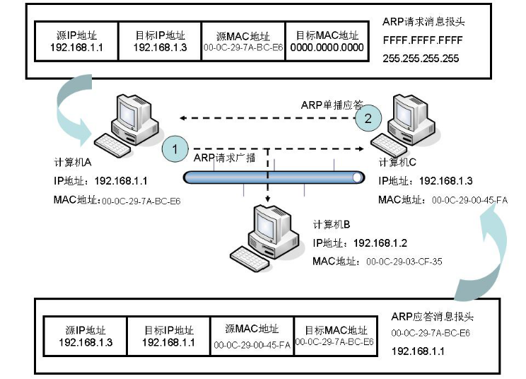

主机A在网络上发起ARP请求广播，请求主机C的MAC地址，数据帧形式如图4.1所示，有一个ARP请求消息的报头目标地址是FFFF.FFFF.FFFF，这表示该请求将以广播的形式给网络中除了源主机A以外的所有主机，而完成的ARP请求消息的报文会被放到ARP请求报头的里面，由4个核心部分组成，其中包括源IP地址、目标IP地址、源MAC地址、目标MAC地址。在这一步中，源IP地址是计算机A的IP地址192.168.1.1，目标IP地址是计算机C的IP地址192.168.1.3，源MAC地址是计算机A的MAC地址00-0C-29-7A-BC-E6，而目标MAC地址暂时为000000000000，因为暂时还不知道主机C的具体MAC地址，所以使用0代替。

当主机A发送出ARP地址解析请求消息后，由于该消息是以广播的形式发出的，所以主机C和B都会收到这个请求。主机B接收到这个请求后，它会拆开ARP请求消息报文，然后查看目标IP地址部分，此时它会发现，在ARP请求消息中的目标IP是192.168.1.3（主机C），这与主机B网卡上的IP地址不相匹配，因为自己是192.168.1.2，所以主机B不会对该ARP请求消息作应答。当主机C收到主机A发出的ARP请求广播后，同样会像主机B一样去拆分并查看请求消息中的目标IP，而请求消息中的IP地址192.168.1.3正是自己的IP地址，所以主机C会对该ARP请求消息作应答，主机C的ARP应答消息不会再使用广播的形式，而是使用单播的形式直接回应给主机A。它具体的MAC是什么？其ARP应答帧的结构仍然是ARP应答消息的报头，指示该ARP应答消息是回送给主机A（192.168.1.1）的，在ARP应答消息报文中的源IP地址是主机C的IP地址192.168.1.3，目标IP地址是主机A的IP地址192.168.1.1（事实上就是ARP请求消息的发起者），源MAC地址是主机C的MAC地址00-0C-29-00-45-FA（事实上正是返回给主机A请求的结果），目标MAC是主机A的MAC地址00-0C-29-7A-BC-E6，正式完成ARP应答。

当完成整个ARP请求与应答过程后，主机A会把主机C的IP地址与MAC地址的对应关系缓存下来，目的在于当主机A再次与主机C通信时，可以通过直接查询自己的缓存表来确定主机C的MAC地址，这样就省去了ARP的请求与应答过程，降低了整体开销。当然这个缓存表会周期性地更新，以保证最准确的实时性。最后是开始正式的数据通信。

> ⚠️注意：上面描述的是ARP协议的完整工作过程，关于取证ARP协议的过程，请参看4.1.4节“演示：取证ARP协议的工作过程”。

**关于不同子网主机间的ARP地址解析过程**

上面描述的是在同一个子网内的ARP请求与应答过程，但是在很多情况下，应用环境不会那么单纯，难道所有的通信都被限制在本地子网内吗？不可能，如图4.2所示，主机Ａ与主机Ｂ的通信就被两台路由器R1和R2所连接。当主机Ａ要与主机Ｂ通信时，主机Ａ的ARP请求如何被发送到主机Ｂ？在这里请注意ARP请求广播只能工作在本地网络，因为它是以广播形式进行工作的，所以会被路由器阻隔。它的具体工作过程如下：

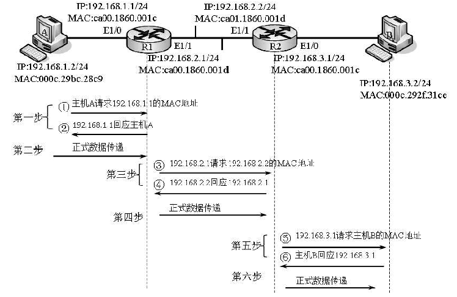

主机Ａ通过判断得知主机Ｂ与自己不在同一个子网内，此时主机Ａ首先会使用ARP请求广播解析自己的默认网关192.168.1.1对应的MAC地址，此时默认网关192.168.1.1会正常应答，因为默认网关192.168.1.1与主机A处于同一个子网内，然后主机Ａ会把默认网关192.168.1.1的ARP应答消息，事实上就是192.168.1.1对应ca00.1860.001c这条记录缓存在自己的ARP缓存表中。缓存ARP结果的目的在于：不至于每发送一个到同一目标的数据包，都进行一次ARP的请求与应答过程。

当完成第一步后，主机Ａ将真正的数据转发给路由器R1的E1/0接口（192.168.1.1），主机Ａ的数据传输任务就完成了。此时，主机Ａ无须再关心后继的ARP请求与应答，以及后继的数据传输过程，因为那是下一站的工作。

当路由器R1从E1/0接口（192.168.1.1）接收到主机Ａ发来的数据后，它会查询自己的路由器表，确定要通过路由器R2的E/1接口（192.168.2.2）转发数据，所以在此之前，192.168.2.1会使用ARP请求广播，请求192.168.2.2对应的MAC地址，当192.168.2.2收到这个请求广播后，会做出ARP的应答，路由器R1的E1/1接口（192.168.2.1）就会缓存这个192.168.2.2对应MAC地址为ca01.1860.001d的ARP记录。缓存ARP结果的目的在于：不至于每发送一个到同一目标的数据包，都进行一次ARP的请求与应答过程。

路由器R1将真正的数据转发给路由器R2的E1/1接口（192.168.2.2），路由器R1数据传输的任务就完成了。此时，路由器R1无须再关心后继的ARP请求与应答，以及后继的数据传输过程，因为那是下一站的工作。

路由器R2从E1/1接口（192.168.2.2）接口收到路由器R1转发来的数据后，R2会查询自己的路由表，发现通过E1/0接口（192.168.3.1）直接连接主机Ｂ，此时路由器R2的E1/0接口（192.168.3.1）会向主机Ｂ（192.168.3.2）发送ARP请求，请求主机Ｂ的MAC地址，当主机Ｂ收到这个请求后，会向路由器R2做出ARP的应答，路由器R2的E1/0接口（192.168.3.1）就会缓存这个192.168.3.2对应MAC地址为000c.292f.31ce的ARP记录。缓存ARP结果的目的在于：不至于每发送一个到同一目标的数据包，都进行一次ARP的请求与应答过程。

路由器R2将真正的数据转发给主机B（192.168.3.2），完成整个从主机Ａ到主机Ｂ的数据传递。

> ⚠️注意：在上述过程中，ARP请求广播不能跨越本地子网，如果要与远程子网进行通信，ARP这个过程会像“接力赛”一样完成，这个“接力赛”的交接点，就是自己与相邻的下一站设备，自己只会缓存相邻下一站的IP地址与MAC地址的对应关系。比如：上述环境中主机Ａ要与主机Ｂ通信，主机Ａ只会完成并缓存它的默认网关192.168.1.1对应ca00.1860.001c的ARP记录。另外，上层通信必须在完成ARP请求之后。这是CCNA（200-120）的考点，在后面的试题中会出现这样的技术提问。

**关于RARP（Reverse Address Resolution Protocol）**

RARP（Reverse Address Resolution Protocol）叫作逆向地址解析协议，ARP是已知目标主机的IP地址，解析对应的MAC地址；而RARP是已知MAC地址去解析对应的IP地址。RARP通常被用在一种传统的网络，即无盘工作站网络中，因为无盘工作站无法在初始化的过程中知道自己的IP地址，但是它们永远都知道自己的MAC地址，此时，它们使用RARP协议将已知的MAC地址解析成自己的IP地址，这个请求就是RARP，网络中的RARP服务器会应答这个请求。

> ⚠️注意：关于RARP这个协议现今已经很少使用，因为无盘工作站这种网络在当今的信息应用环境中，几乎是属于“博物馆”里的陈列品，即便是某些特殊的应用环境需要将MAC地址解析成IP地址，也不会使用RARP协议，而是使用BOOTP或者DHCP去代替它。

**理解免费ARP**

免费ARP（Gratuitous ARP）是ARP协议的另一种表现形式，它的目标在于检测网络上的IP地址冲突，无论是计算机还是路由器都用免费ARP来检测本地网络上的地址冲突。那么，关于它为什么叫作免费ARP，这需要首先来理解免费ARP的工作原理，如图4.3所示。在正常情况下，一个IP地址将对应一个独立的MAC地址，如果有一个IP地址对应了两个不同的MAC地址，则说明这个IP地址被分配到了两个不同的NIC接口上，这将会产生地址冲突。如图4.3所示，注意主机Ａ发出了一个源IP地址和目标IP地址都是自己的IP地址192.168.1.1；源MAC地址是自己的MAC地址00C.297A.BCE6、目标MAC地址是FFFF.FFFF.FFFF的ARP广播，事实上，这并不是一个常规的ARP请求消息，因为常规的ARP请求消息不可能源主机IP地址和目标主机IP地址相同。在免费ARP的情况下，发送这个ARP消息的主机并不希望得到其他主机的回应，如果同一个IP地址得到了不同MAC地址的ARP回应，那么就说明一个IP地址被两个NIC接口所占用，此时的情况就是地址冲突。这正是免费ARP永远不希望有回应的原因，所以叫作免费ARP。

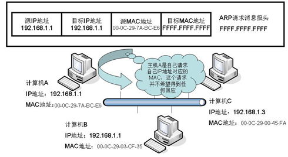

> ⚠️注意：这个免费ARP是CCNA（200-120）的可选学习内容，但是在更高的CCNP或者CCIE考试中要求必须掌握，通常它又和一些安全考点有关，而CCNA是为更高层次的认证打基础的，所以在这里还是尽量去掌握它。记住：一件事情开始的时候复杂一点，用心一点，结果可能会更好一点！

###<a href="#详解并取证网络协议的工作原理" id="详解并取证网络协议的工作原理">详解并取证网络协议的工作原理</a>

三台计算机都处于同一个子网中，计算机A发起和计算机C的通信，在通信前，计算机A、B、C上都开启了协议分析器，捕获ARP协议的工作过程。取证任务的重点在于：取证ARP协议的请求与应答报文，对照理论分析报文的结构；取证在计算机A发出ARP请求消息后，是以广播形式发出的，计算机B和C都可以收到，但是计算机B不对计算机A的ARP请求消息作应答，计算机C会以单播的形式作应答；取证计算机A收到计算机C的ARP应答消息，并在本地缓存结果。

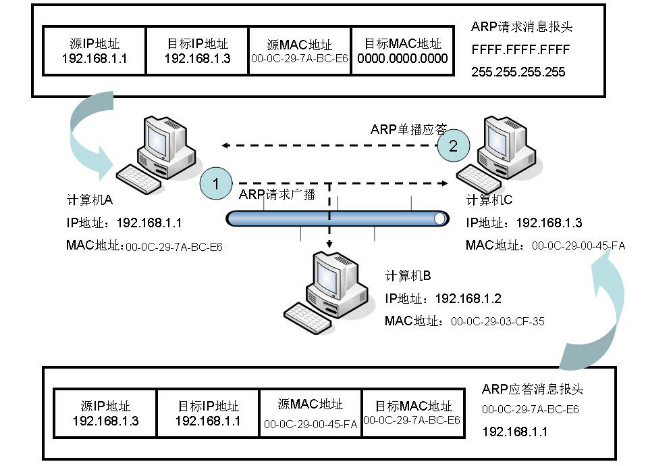

1. 记住如图4.4所示的网络环境，为计算机A、B、C配置IP地址，为计算机A、B、C安装协议分析器软件，然后启动协议分析器软件，开始捕获数据帧。

> ⚠️注意：协议分析器软件必须在计算机A与C通信前启动；否则，可能无法捕获ARP协议的完整过程。在计算机A的命令提示符（CMD）下执行 arp-d指令，如图4.5所示，该指令的作用是清空计算机A上的ARP缓存表，如果不清空该表，在计算机A与计算机C通信时，就不会执行ARP地址解析的过程，而是直接使用缓存记录应答，那么取证过程就将失败。当清空计算机A上的ARP缓存表，可以通过arp-a指令来确定ARP缓存表已被清空，如图4.6所示。



2. 在计算机A上ping计算机C（192.168.1.3），如图4.7所示。然后同时捕获所有计算机的数据帧。

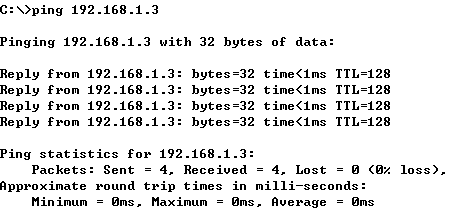

3. 到计算机A上查看捕获的数据帧，如图4.8所示，可以看出ARP地址解析的过程在正常的ICMP通信过程之前。然后拆分ARP的请求消息数据帧，如图4.9所示，可证实ARP请求消息是以FFFFFFFFFFF广播的形式发出的，请求的目标计算机C（192.168.1.3）的MAC地址，现在暂时不知道，所以使用000000000000填充目标MAC地址字段。拆分ARP的应答数据帧，如图4.10所示，可以证实ARP应答消息以单播的形式回送给计算机A，然后在应答消息中给出了计算机C的MAC地址。

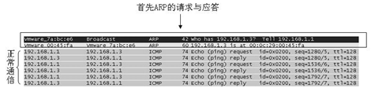

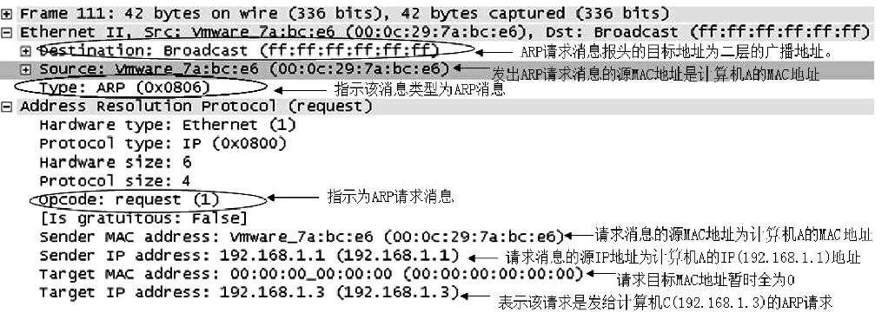

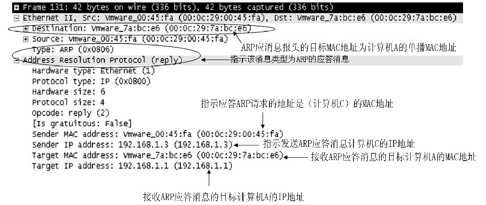

> ⚠️注意：见图4.9所示的ARP请求消息数据帧，事实上通过查看计算机B捕获的数据帧可以发现它也收到了ARP请求消息，只是不作应答而已。

在计算机A上通过arp-a指令查看ARP缓存表的情况，如图4.11所示，可以得知计算机A已经成功地缓存了计算机C的IP地址与MAC地址映射记录。

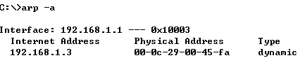

**取证计算机和思科路由器上的免费ARP工作过程**

在如图4.12所示的环境中，人工去制造IP地址冲突的效果，然后捕获并分析在IP地址冲突的情况下免费ARP的请求与应答消息。

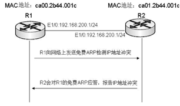

1. 为路由器R1配置IP地址192.168.200.1/24，然后激活接口。在本章并不要求学员立即掌握路由器的配置，关于这个取证过程的配置可暂时参看随书的教学录像。在这一步中暂时不急着配置路由器R2，当激活路由器R1的E1/0接口后，启动协议分析器捕获路由器R1的E1/0接口的数据流量，可以得到如图4.13所示的路由器R1发送免费ARP广播，它向网络声明自己已经在使用192.168.200.1这个IP地址，如果网络上没有相同的IP地址，该免费ARP不会得到任何回应，这当然是希望的结果，目前路由器R1不会得到ARP的回应。

> ⚠️注意：此时让协议分析器继续保持捕获数据帧的状态。

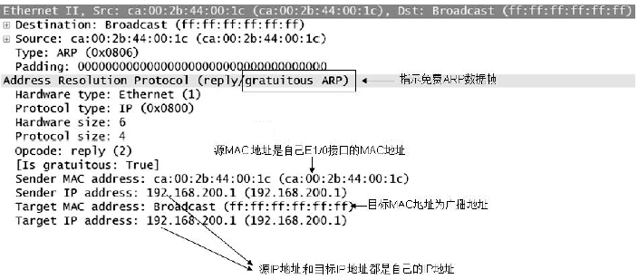

2. 此时，为路由器R2配置IP地址192.168.200.1/24，然后激活接口。实际上已经制造了IP地址冲突，那么路由器R1的免费ARP就会得到回应，如图4.14所示为免费ARP的广播与免费ARP的应答。然后详细分解免费ARP的应答数据帧，如图4.15所示，可以看出现在路由器R2使用了它的E1/0接口的MAC地址(ca01.2b44.001c)对免费ARP进行了应答，也正是地址冲突所在的接口，因为现在有两个MAC地址使用了一个IP地址，此时路由器R1给出如图14.16所示的地址冲突检测报告，并提示管理员谁正在使用192.168.200.1这个IP地址。

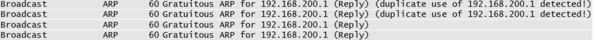

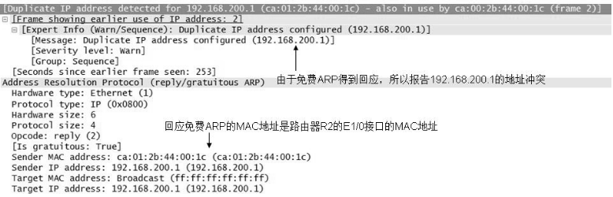

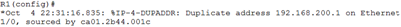

> ⚠️注意：关于计算机使用免费ARP来检测IP地址冲突的过程与上述路由器的过程类似，由于篇幅有限，在这里就不重复描述了，关于具体的演示过程可参看随书的教学录像。

本节主要以描述典型的网络层协议IP、ICMP为核心，分别建立对IP和ICMP报文的分析过程，理解IP报文各个字段的具体含义，每个字段在数据传输时的作用，以及ICMP的不同消息类型等，最后将通过协议分析器对这两个协议的报文结构进行取证。在知识点对应的部分包含了CCNA认证过程中的相关试题。

**4.2.1  理解IP报文的结构**

如图4.17所示为IP报文的结构，表示IP报文的组成部分，包含20字节IP报头、选项（根据实际应用而定）字段、传递数据（用户数据）。其中理解20字节IP报头部分各个字段的具体意义是理解IP报文的关键。20字节IP报头包括版本、报头长度、服务类型、总长度、标识符、标志、片偏移（传输时是否发生数据分段）、生存时间、协议、首部校验和、源IP地址、目标IP地址，通过上述字段可以保证数据能够正确地从信源传递到信宿。下面将开始对IP报文的每个字段进行描述。

版本（Version）：该字段的长度为4比特，表示正在使用的IP协议的版本。该字段的值一般为4或者6，如果该值为4表示正在使用IP的4号版本，如果该值为6表示正在使用下一代的IP地址（IP的6号版本，简称IPv6）。

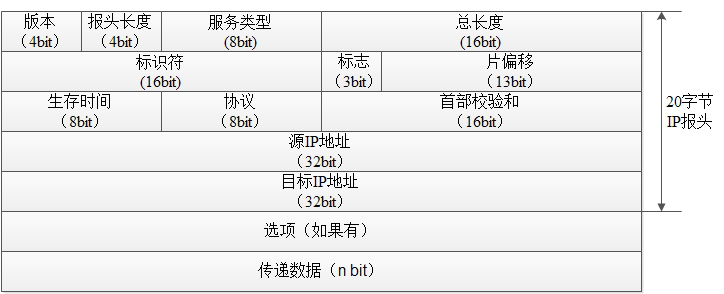

* 报头长度（Header Length）：该字段的长度为4比特，描述IP报头的长度。如果不携带“选项”字段，那么值为20字节；如果包含了“选项”字段，那么报头长度最大可为60字节（“选项”字段最大值为40字节）。换而言之，IP报头长度值的变化范围为20～60字节。

> ⚠️注意：IP报头长度（Header Length）并不包括任何数据负载的大小。

* 服务类型（Type of Service）：该字段的长度为8比特，用于对特殊报文的处理。该字段可以配置IP报文的优先级（Precedence），其意义在于当网络发生拥塞时，可以让具备高优先级的IP报文优先被转发，类似于在拥塞的道路上，保证如救护车一类车辆优先通行的实例。TOS字段用于配置传输服务类型，如吞吐量、时延、可靠性、费用等类型。

> ⚠️注意：一般面向IP流量工程、服务质量保证（QoS）项目的工程师将大量配置和使用该字段，这将在思科CCNP认证的ONT网络优化课程中进行重点学习。

* 总长度（Total Length）：该字段的长度为16比特，指示整个IP报文所能携带的最大字节数，包括“IP报头”和“传递数据（负载）”长度的总和。“总长度（Total Length）”字段占16比特位，它所对应的二进制最大数为16个“1”，对应的十进制数就为65536，而计算机计数都是从0开始的，所以一个IP报文的最大长度为65535字节。

> ⚠️注意：IP报文通常也叫IP数据包，工作在“网络层”，由IP报头和传递数据组成，而一个IP数据包最大不能超过65535字节。

* 标识符（Identifier）：该字段的长度为16比特，表示为某一种IP数据包分配一个唯一的数字标识，该标识符的作用就是保证数据被分段后，区别于网络中其他的IP数据分段，然后可以被正确地重新组合，因为在某一个IP数据被分段的同时，可能存在多个不同IP数据的分段。

> ⚠️注意：标识符（Identifier）类似于将标记为红色的物品混入其他不同颜色的物品中，而此时将红色的物品分离出来就是一件很容易的事情。标识符就有这样的作用。

* 标志（Flags）：该字段的长度为3比特，该字段的作用主要是配合IP报文中的“标识符（Identifier）”字段和“片偏移（Fragment Offset）”字段来管理IP报文的分段。它由三个控制标志组成，在三个标志中，第一位（也是第一个标志）一般不使用，作为预留；第二位（也是第二个标志）为DF位，如果DF值为1，则表示不能对该IP数据包执行分段处理。第三位（也是第三个标志）为MF位，表示对于被分段的IP数据包，除了最后一个数据分段的MF值为0之外，其他的所有数据分段的MF值都为1，换而言之，MF=1表示该IP数据分段的后面还有紧跟的数据分段，直到MF值为0为止。

* 片偏移（Fragment Offset）：该字段的长度为13比特，表示分段数据起始点相对于报头起始点的偏移位置，其目的在于让目标接收方可按照分段顺序重新组织报文，因为被分段的数据可能由于网络环境等客观因素不能按分段时的顺序到达目标接收方。

> ⚠️注意：片偏移（Fragment Offset）字段类似于两个物体之间规定相隔距离为30米，那么不管把这两个物体移动到什么位置，两个物体之间的距离始终为30米。同理，偏移位置就是两个分段之间的相对位置。

* 生存时间（Time to Live）：该字段的长度为8比特，表明当前报文在网络上的最大存活时间。意思就是指数据包每经过一个路由器（网关），TTL值自动减1，当为0时，丢弃该报文。如图4.18所示，主机A发送数据的TTL值为64，当数据经过路由器达到主机B后，TTL值减1，其值为63。

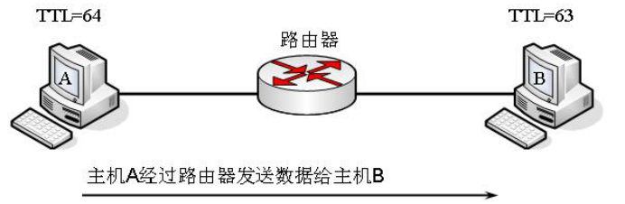

* 协议（Protocol）：该字段的长度为8比特，用于标识OSI上层所携带的具体协议，通常是一个传输层协议或者网络层协议，如UDP、TCP、ICMP等。通常该协议值使用十六进制表示，UDP、TCP、ICMP分别对应的十六进制值为11、06、01。
* 首部校验和（Header Checksum）：该字段的长度为16比特，该字段只在IP报文的首部进行计算，提供一种基于传输的基本差错控制。具体做法是，把IP报文的首部字节分为两个字，一个字为两个字节，然后进行相加而得到，转发IP报文的所有中间设备都要进行该值的计算，如果计算出来的两个校验和不同，就认为数据在传输过程中被损坏了。
* 源IP地址（Source Addresses）：该字段的长度为32比特，用于记录发送数据源主机的IP地址。
* 目标IP地址（Destination Addresses）：该字段的长度为32比特，用于记录目标主机的IP地址。

演示目标：在实时通信的过程中使用协议分析器捕获并分析IP报文的各个字段。注意以分析标识符、标志以及片偏移字段的功能作为重点。

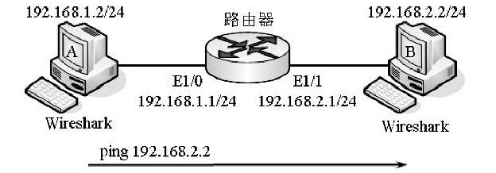

演示背景：将通过捕获主机A和B的实时通信数据，来取证分析IP报文的各个字段的作用和意义。 
演示步骤：

1. 如图4.20和图4.21所示，分别在主机A和主机B上完成IP地址的配置，包括默认网关。然后按照如下所示的路由器的配置，完成Cisco路由器接口IP地址的配置。

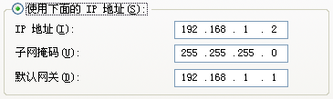
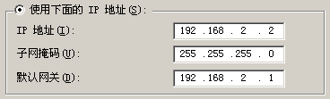

```
# 路由器的配置：
R1>enable                                            
R1#configure terminal                                     
R1(config)#interface ethernet 1/0                            
R1(config-if)#ip address 192.168.1.1 255.255.255.0           
R1(config)#interface ethernet 1/1
R1(config-if)#ip address 192.168.2.1 255.255.255.0
```

2. 在主机A和主机B的命令提示符（CMD）下，通过命令ping完成与默认网关的连通性测试，并确保通信正常，如图4.22和图4.23所示。然后测试整个网络中主机A与主机B的连通性，如图4.24所示，以确保通信正常。

> ⚠️注意：在做主机连通性测试时，为什么不直接从主机A测试（ping）主机B的连通性，而是首先测试到各自默认网关的连通性？原因：当完成阶段性网络配置后，建议测试阶段性配置的连通性。当建设庞大且复合程度较高的整体网络通信体系时，如果出现了故障，则可以快速地定位到某一阶段性故障上，而不是在庞大的网络体系中如大海捞针般地寻找故障源，这样可以提高工程中故障排除的效率。

3. 现在开始捕获实时通信的数据帧。分别在主机A和主机B上打开Wireshark协议分析器软件，并监控网络中实时通信的数据。在主机A的命令提示符（CMD）下，输入命令ping `192.168.2.2`，待完成数据交互后，停止并查看主机A和主机B上的Wireshark协议分析器，得到如图4.25所示的结果，表示主机A的Wireshark捕获的数据帧。

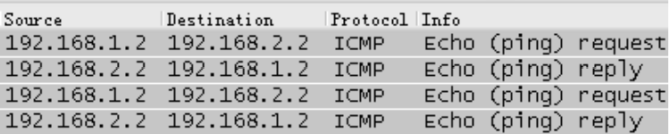

> ⚠️注意：由于ping命令是基于ICMP协议工作的，所以捕获的数据帧显示的协议就为ICMP，而通信是一个完整的会话具备双向性，所以存在ping的请求消息（Echo request）和ping的回应消息（Echo reply）。

4. 详细分解如图4.25所示的主机A上捕获的数据帧的第一个数据帧，得到如图4.26所示的结果，这是一个完整的IP报文，其中包括IP报头部分和所携带ping（ICMP）的数据部分。

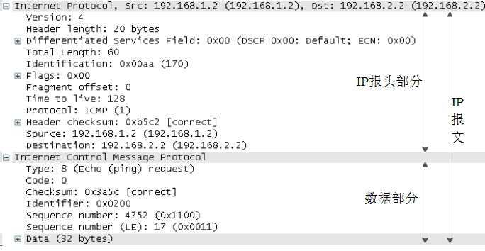

5. 现在开始在图4.26所示的IP报文数据帧中，去取证IP报文的每一个字段，其中version:4表示IP报文的版本为4；Header length:20 byts表明该IP报文的报头  长度为20字节（默认长度）。如图4.27所示为服务类型（TOS）字段，关于TOS服务类型字段中的相关内容，属流量工程技术，超出了思科CCNA认证讨论的范围，该知识点应在思科CCNP认证的ONT网络优化课程中作专项讨论，所以在这里不多做说明。 Total Length:60表示IP报文总长度的大小为60字节，且由三部分组成， Total Length:60=Hrader length:20+Data(32bytes)+ICMP报头(8bytes)，第一部分是20字节的IP报头长度，第二部分是32字节的数据，第三部分是8字节的ICMP报头； Idntification:0x008b(139)表示标识符字段，指示唯一的数字标识值为139；如图4.28所示为标志（Flags）字段，表示IP报文中包含的DF（Don't fragment）位和MF（More fragments）位； Fragment offset:0表示片偏移字段，由于本测试环境使用的ping操作在默认情况下传递的数据没有达到分段的标准，所以片偏移的值为0；如图4.29所示为生存时间字段，表示主机A发送数据经过一台路由器到达主机B后的TTL值从128变成了127。回忆上一小节中TTL值的变化过程的原理，注意：在完成该演示时主机A与主机B上TTL值的比较，必须保证两边分析比较的数据帧是同一个数据帧（包括源地址、目标地址、使用协议等）。Protocol:ICMP(1)表示协议字段，而值为1表示传递数据使用的协议为ICMP协议； 表示首部校验和字段，通过“Good：Ture”和“Bad：False”信息返回IP报文是否正确；Source:192.168.1.2
(192.168.1.2)表示源IP地址字段，发送数据主机A的IP地址， Destination:
192.168.2.2(192.168.2.2)表示目标IP地址字段，接收数据主机B的IP地址。

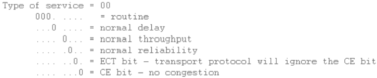
 


6. 在该步骤中将以取证IP报文中分段数据为重点，通过详细的取证实验来理解IP报文的数据分段过程。首先在主机A上打开Wireshark协议分析软件，并启动数据捕获。然后在主机A的命令提示符（CMD）下，执行命令ping 192.168.2.2-l 3500,如图4.30所示，待完成数据通信后，停止并查看主机A上捕获的数据帧，如图4.31所示。

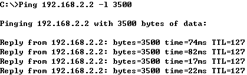

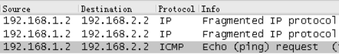

建立分段的分析过程

* ① ping 192.168.2.2-l 3500 指示ping所携带的字节数为3500字节。注意：在默认情况下，的ping是不会出现IP报文分段的现象的，因为默认的ping只携带32字节的数据传输，而以太网能承受的最大传输单元（MTU）为1500字节，所以默认的ping携带的数据根本无法造成IP报文分段，在该演示环境中为了制造出IP报文分段的现象，就必须使ping携带超过MTU 1500字节的数据，在演示环境中为3500字节。
* ② 信息Fragmented IP protocol 表示IP数据存在分段，分段的原因是ping所携带的3500字节大于本以太网测试环境的MTU最大值1500字节。
* ③ 为什么不先显示Echo request信息，也就是ping所使用的ICMP消息，而是先显示了Fragmented IP protocol信息，也就是分段信息？原因在于，在执行ICMP数据传递之前，首先需要在传输层对3500字节数据执行分段。

7. 现在分析IP报文分段过程中较抽象的部分，首先展开如图4.31所示的所有数据帧，得到如图4.32、图4.33和图4.34所示的数据帧，即分段的数据帧。

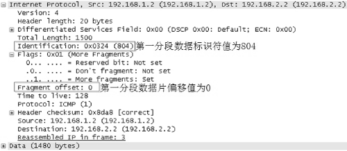

<center>图4.32  第一分段数据帧</center>

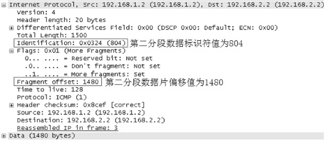

<center>图4.33  第二分段数据帧</center>

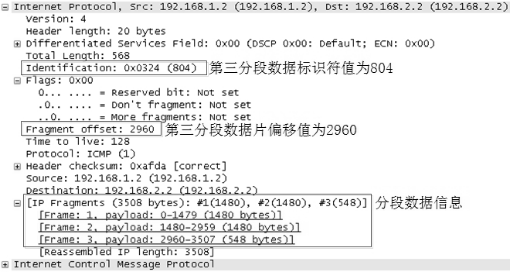

<center>图4.32  第三分段数据帧</center>

* 3500字节分段过程的分析根据图4.30所示，可知ping所携带的3500字节被分成了三段，第一、第二分段数据大小为1480字节，第三分段数据大小为548字节。为什么第一、第二分段数据不按以太网MTU最大值1500字节划分呢？其原因在于划分分段数据时，必须考虑IP报头20字节的大小。第三分段548字节包含了8字节的ICMP协议声明报头，计算方式为3500-1480-1480+8=548。
* 标识符字段分析根据图4.32、图4.33和图4.34所示数据帧的“Identification:0x0324(804)” 标识符字段，可知同一个IP报文被执行分段后，标识符的值是一致的，表示一个较大的IP报文被分割成三个较小的IP报文，标识值0x0324(804)表示三个较小的IP报文属于同一个较大报文，这样才能保证被分段数据可重新组合在一起。
* 标志字段分析如图4.35所示，表示第一、第二分段数据的标志字段。由于这两个分段不是最后一个分段数据，所以MF=1（More fragments）表示其后还有更多的分段数据。如图4.36所示，第三分段数据的MF=0，则表示该分段数据为最后一段。

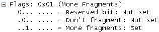

<center>图4.35  第一、第二分段数据标志</center>

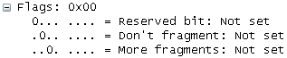

<center>图4.36  第三分段数据标志</center>

* 片偏移字段分析根据图4.32、图4.33和图4.34所示，可知第一分段数据的Fragment offset=0，第二分段数据的Fragment offset=1480，第三分段数据的Fragment offset=2960。那么这些片偏移值是如何计算的？对于第一分段数据，因为起点相同，分段开始处也相同，所以第一分段的片偏移值为0。对于第二分段数据，首先要知道第一分段数据的片偏移值（该演示环境其值为0）；要知道第二分段的分段起始值，那么根据该演示环境的分段大小可知，第一分段数据的大小为1480，由于计算机计数是从0开始的，所以第一分段数据的结尾处为1479，那么第二分段数据的分段起始值就为1480，此时根据片偏移值的计算方法，即分段数据大小减第一分段的片偏移值，可得第二分段数据的Fragment offset=1480-0。同理，第三分段数据的Fragment offset=2960-0。

ICMP（Internet Control Message Protocol,Internet控制报文协议）是TCP/IP簇的子协议，位于OSI七层模型的第三层，用于IP主机、路由器之间传递可达性控制消息，确定信源与信宿是否可达，路由器是否可用。这个消息并不是用户数据，而是确定用户与目标是否可达，如果不可达，则可以根据ICMP协议返回的消息确定故障原因，如ping这个测试网络连通性的应用程序使用的就是ICMP协议。

ICMP协议帧结构的各字段含义如下：

* 类型：标识ICMP报文的类型，如常见的类型3表示目标不可达，类型11表示超时，0为回显应答，8为回显请求，30代表路由跟踪。CCNA学员主要掌握这几种消息。
* 编码：在每种ICMP报文类型中又分派出256种子类型，而编码值就表示各子类型的意义。本书在此不做重点讨论。
* 校验和：为整个ICMP报文提供差错保护机制。
* 报文体：被封装进ICMP报文中的初始数据报。

* 演示：取证ICMP报文的结构
* 演示目标：取证ICMP报文的结构、ICMP的“目标不可达”、ICMP的“超时”消息。
* 演示环境：如图4.38所示。

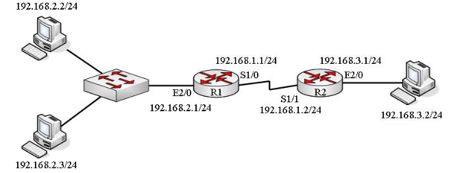

<center>图4.38  分析与取证ICMP报文</center>

