# 第二章：理解网络设备工作原理

---

## 简介

本章以描述网络中常见的设备为重点，其中包括中继器、集线器、网桥、二层交换机、路由器、三层交换机的工作原理，并分析了再CCNA（200-120）考试中对应的试题。

## 目录

* [中继器的工作原理](#repeaters)
* [集线器的工作原理](#hubs)
* [网桥的工作原理](#bridges)
* [二层交换机的工作原理](#layer2switches)
* [路由器的工作原理](#routers)
* [三层交换机的工作原理](layer3switches)

## 内容

### <a href="#repeaters" id="repeaters" >中继器的工作原理</a>[已淘汰]

中继器（Repeater）又叫做“放大器”，是一种传统的网络设备，作用是放大信号，解决物理线路不够长，而引起的信号弱减问题。中继器本身有着不可避免的缺点：中继器在放大正常通信信号的同时，也放大了噪声信号；它是一个处于OSI七层模型中的物理设备，无法读懂和修改ISO的上层数据帧，无法完成更多的选路及优化转发的特性，只起到放大信号与延长路线的作用，而且端口少，不是一种密集型端口的网络设备。中继器工作原理示意图【如图】。中继器现已被淘汰。但是为了让大家了解网络设备的一个发展史，在本书中还是对该设备做简单的介绍

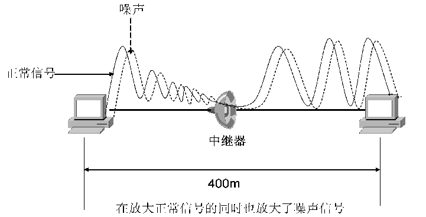

### <a href="#hubs" id="hubs">集线器的工作原理</a>

集线器又称Hub，是一种用于“星型”网络组织的中心设备【如图】，它具备中继器的信号放大功能，所以它有延长物理线路距离的特性。但是集线器在放大正常信号的同时也放大了噪声信号，噪声信号是网络上的干扰信号，它将对正常的网络通信造成影响。集线器的接口数量比中继器的接口数量密集，而它们的特性又相似，所以在某种情况下把集线器叫做“有更多接口的中继器”。

集线器工作原理示意图【如图】当计算机A要给计算机D发送数据时，计算机A会把数据广播到除源接口以外的所有接口上。此时计算机B解开广播包，看到目标的IP地址不是自己网卡上的IP地址，所以将数据帧丢弃。计算机C解开广播包，看到目标的IP地址不是自己网卡上的IP地址，所以也将数据帧丢弃。计算机D解开广播包，看到目标的IP地址是自己网卡上的IP地址，它会将数据帧从网卡复制到内存中，然后内存再将其交给CPU进行处理。

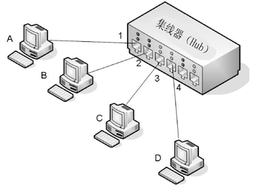

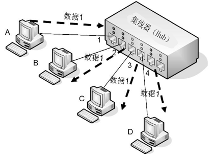

**集线器特性**

集线器是一个半双工、冲突型的网络设备。怎么去理解半双工与冲突型呢？【如图】，集线器所有接口连接的计算机全部处于一个冲突域内，在这个冲突域内不能有多台计算机同时发送数据。比如当计算机A给计算机D发送数据时，计算机A发送的数据会被广播到集线器的2、3、4号接口上，如果此时计算机B再发送数据，就会发生冲突，因为计算机B现在正在“无辜”地接收数据。这也是单工特性的一个体现，在接收数据的同时不能发送数据，那么该网络设备的使用率就很低，属于共享带宽式网络设备，意思是如果集线器的总体带宽是10M，共有4个接口，那么每个接口的理论带宽是2.5M。集线器不能隔离广播，所以集线器不能连接成封闭的环路，否则广播会在环路上一直循环，形成广播风暴，严重影响正常数据通信。另外，集线器的安全性极差，因为集线器的数据发送是使用广播数据包到所有接口的方式，这个广播是带上真实负荷（用户数据）的广播，容易被居心叵测的用户监听，所以安全性得不到保障。

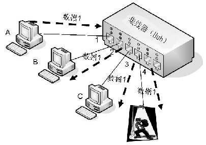

> ⚠️注意：集线器安全威胁的重要提示：只要在集线器的任意接口接入协议分析器，安全了协议分析软件的计算机就都可以成功地监听集线器上其他接口的所有流进和流出的数据，当然这些数据中也包括比较重要和敏感的机密信息，如密码、账号等。

### <a href="#bridges" id="bridges">网桥的工作原理</a>

网桥（Bridge）处于OSI模型的第二层（数据链路层），作用是减少集线器因为共享和半双工特性引发的网络冲突问题。网桥的性能比集线器更好，因为网桥能够基于MAC地址进行数据链路层选路，能够基于自学习构造MAC地址表，对MAC地址进行控制与过滤，但是它不能隔离广播，所以不能让网桥形成闭合的环路。

**网桥为什么可以基于MAC地址进行选路，为什么比集线器的性能更优？**

网桥的工作原理示意图【如图】，如果主机A发送数据给主机D，当数据从网桥的1号接口进入时，网桥不会想集线器那样将数据广播到所有接口。因为在网桥内部有一张MAC表，该表记录者网桥的物理接口所连接的主机MAC地址。当数据进入网桥时，网桥通过查询MAC地址表得知主机D对应的物理接口是4号接口，所以网桥就将数据直接转发到4号接口，而不再需要将数据广播到所有接口。此时网桥的2号、3号接口就没有收到冲突的影响，而主机A在发送数据给主机D时，主机B可以同时发送数据给主机C这样的出一个结论：网桥将冲突域划分的更小，转发性能比集线器更好。可以形象地理解网桥的每个接口就是一个冲突域，而集线器是4个接口在一个冲突域。集线器与网桥的性能对照【如图】

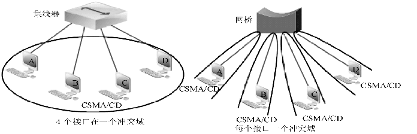

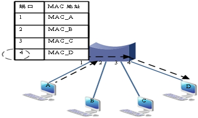

**网桥能够基于自学习构造MAC地址表**

网桥的转发性能比集线器更好，是因为网桥内部的MAC地址表可以进行MAC地址的第二层选路。但是在网桥刚刚被部署到网络中使用时，一定不知道网桥的某个接口记录的是网络中某台主机的MAC地址，【如图】，此时它就需要通过一种叫“MAC地址自学习”的方式来完成MAC地址表的构造。网桥“MAC地址自学习”技术的原则是在网桥的接口上记录“数据报文的源MAC地址，来完成MAC地址表的构造”，如图。

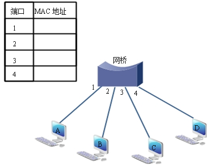

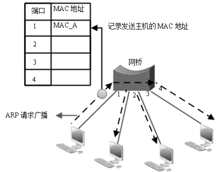

当网桥的MAC地址表不完整时，网桥不能利用MAC地址表进行选路转发，所以网桥只能效仿集线器将数据帧广播到所有的接口（除源接口外）

> ⚠️注意：网桥的广播与集线器的广播有很大的区别，网桥的广播只是一个单纯的ARP广播，它没带真实的数据，所以很小，而且在某种情况下，这种广播报文的大小可以忽略不计。它只广播一次，这次广播的目的是为了构造MAC地址表，利用网桥的MAC地址表自学习功能记录计算机的源MAC地址对应的网桥接口。【如图】，当MAC地址表被成功构造后，网桥将不再进行广播，而是利用MAC地址表进行快速选路并转发。而集线器每次传输数据都需要依靠广播，而且该广播带有真实数据负载。

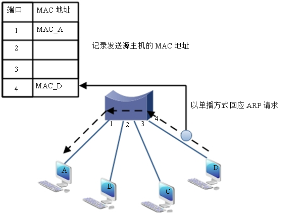

网桥不能成环主要有两个原因：第一，由于网桥不隔离广播，所以广播不能再桥接环路中发散，从而形成广播风暴，将整个网络的正常通信资源占据，【如图】所示；第二，由于网桥不能隔离广播，所以会导致MAC地址表自学习错误，【如图】。如果主机B要发送数据给主机A，此时网桥A与网桥B的MAC地址表都没有构造完整，那么网桥就必须使用“MAC地址自学习”技术来完善MAC地址表的构造。假设主机B的ARP请求先到达网桥B，此时网桥B会记录数据进入接口的源MAC地址，所以网桥B记录MAC_B对应的是网桥B2号接口。现在看上去完全正常，但是请不要忘了一个很重要的理论，网桥是不隔离广播的设备，其桥接环路【如图】。如果网桥B对与广播来说是透明发送，现在可设想根本没有网桥B的存在，那么ARP请求广播会穿过网桥B到达网桥A，由于网桥“MAC地址自学习”技术的原则，记录网桥A的1号接口是主机B的MAC地址MAC_B。此时，地址自学习的错误就产生了，因为网桥A的1号接口事实上接的是主机A，而网桥成环后将网桥A的1号接口记录为连接的是主机B。

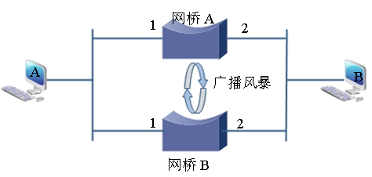

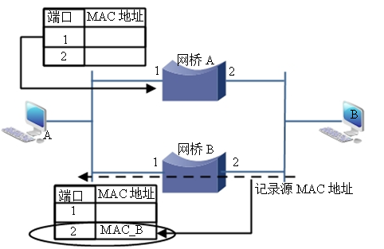

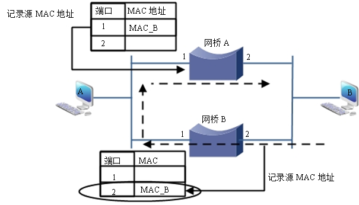

> ⚠️注意：在实际工作中，网桥通常需要将物理链路成环，以提供冗余的路径，但是这又违背网桥不能成环的原则。所以需要一种特殊的技术来解决网桥成环引发的问题，这种特殊的技术叫做STP（生成树）。

### <a href="#layer2switches" id="layer2switches">二层交换机的工作原理</a>

二层交换机工作原理：二层交换机是一种代替网桥的新型产物，也是现在流行的网络组建设备。其实，二层交换机的工作原理与网桥是一样的，都能基于MAC地址表进行转发、划分冲突域，都能基于MAC地址自学习构造MAC表，对MAC地址实现过滤等功能。但是网桥的整个工作过程是利用网桥内自身的软件来完成的，所以会出现瓶颈现象；而二层交换机是基于专用的集成电路（ASIC）来决定交换逻辑算法的，如MAC地址表的构造及背板流量交换，所以没有瓶颈现象，转发速度比网桥更优良，而且二层交换机的端口比网桥更密集，所以二层交换机代替了网桥。

> ⚠️注意：在很多情况下，可以把二层交换机理解成一个有更多端口和利用专业硬件来进行转发数据的网桥。

**理解二层交换机的转发技术**

二层交换机的工作原理虽然与网桥基本上一样，但是其转发技术确实有其特色，二层交换机的转发技术大概分为三种方式：存储转发式、直通转发式和碎片切头式。下面分别描述这三种转发式的特点，在描述其转发式前先来介绍一下交换机要转发的数据帧结构

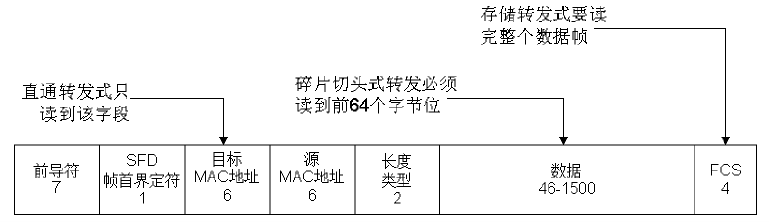

**存储式转发（Store-and-Forward）**：交换机首先将收到【如图】所示的数据帧（注意是整个数据帧）进行缓存，然后检查数据帧的正确性，最后从数据帧的读取目的MAC地址，通过查找MAC地址表找到要发送的交换机接口，再将数据帧发送出去。所以，存储转发方式在转发数据时处理延时大，但是错误率低。传统的网桥和一些早期的二层交换机都使用这种数据转发方式。

**直通转发式（Cut-through）**：直通转发的最大特点是转发速度快，因为使用这种转发方式的交换机只需要读取【如图】所示的数据帧中的目标MAC地址字段，就可以将数据帧进行转发，而不再需要缓存整个数据帧，但由于数据帧内容并没有被交换机缓存，所以无法很好地检查所传输的数据帧是否有误，不能更好地提供错误检测能力。

**碎片切头式（Fragment Free）**：碎片切头式可以说是集成了存储转发方式和直通转发方式的优点，比存储转发的速度更快，比直通转发的容错率更高。它为什么具备这样的特性？因为它不需要读完并缓存整个数据帧，但也不是只读到目标MAC地址就转发数据帧，而是在转发前先检查数据帧的长度是否够64个字节，如果小于64个字节，则说明“残帧”。所谓“残帧”实际上就是因为以太网访问介质争用性所产生的冲突分段或者是出错的数据帧，一般都小于64个字节。碎片切头式转发将丢弃小于64个字节的数据帧，提高了容错率，但又不像存储转发式那样将整个数据帧进行缓存后再检查，所以碎片切头式的数据处理速度比存储转发方式快，但比直通转发方式慢，由于它在转发速度与容错两者之间的适中性，所以被广泛应用到许多厂商的交换设备上。

**通过区别集线器、二层交换机理解冲突域**

前面介绍了关于集线器、网桥、二层交换机的工作原理，本小节主要讨论这些设备与网络性能的关系。要理解这些设备与网络性能的关系，核心在于理解网络设备对以太网“冲突域”的划分，以太网“冲突域”遵循以太网介质访问协议的基础。关于以太网介质访问的协议基础，请参看本书“理解以太网的介质访问协议（CSMA/CD）”。下面通过一个网络组织结构的实例来理解冲突域。【如图】，在这个环境中有计算机直接连接到二层交换机，也有计算机连接到集线器，然后集线器再连接到二层交换机的情况，那么现在的问题是识别出再这个网络环境中“冲突域”的数量。在识别网络环境中“冲突域”的数量时，只需要记住两个原则：第一，集线器上的所有物理接口属于一个“冲突域”；第二，二层交换机上的单个物理接口对应一个独立的“冲突域”。根据这个原则不难看出。在【如图】的环境中，一共有5个

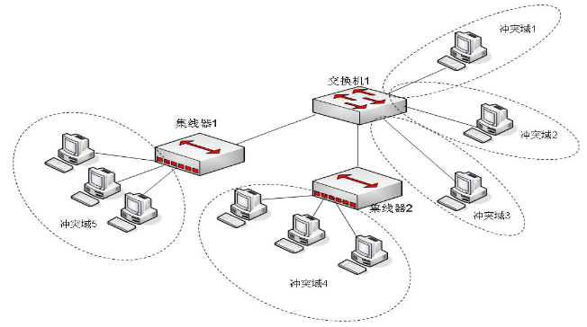

> ⚠️注意：在环境中没有出现网桥设备，是因为网桥的特性已经被二层交换机所继承，而且二层交换机的转发性能及接口密集程度远大于网桥。更直接地讲，网桥在现代网络的组建中已被二层交换机所代替，所以属于淘汰型设备。为了与时俱进，所以没有把网桥列到【如图】所示的网络环境中。当然，网桥的每一个物理接口也是对应一个独立的“冲突域”。

### <a href="#routers" id="routers">路由器的工作原理</a>

路由器是属于ISO模型中的网络层（第三层）设备，作用于网络层IP寻址、路由、隔离广播等功能。在正式学习路由器的工作原理前，首先要明白什么是路由。以一个生活中的小事例来理解什么是路由。一封信从重庆发往上海的过程，【如图】

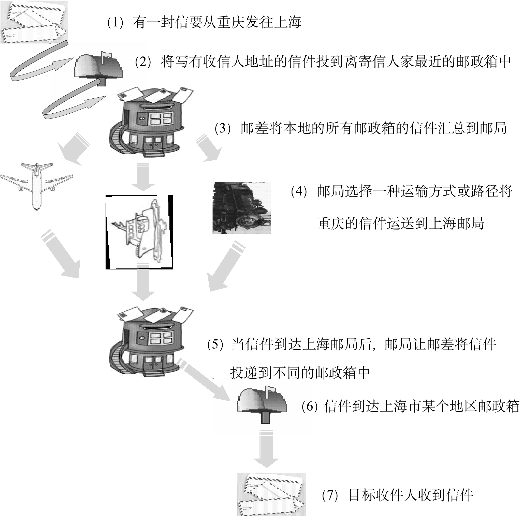

**生活中的信件发送与网络世界的数据路由的联动思考**

1. 将写好的信放入信封，并在信封上写明收件人的地址、寄件人的地址。**联动思考：**在网络世界中，在OSI第三层封装IP报文，并在报头写入源IP地址与目标IP地址。
2. 将写好收件人和寄件人地址的信件投递到最近的邮政箱。**联动思考：**在网络的世界中，目标IP地址与源IP地址不在同一个子网中，就需要将源IP地址产生的数据报文投递到默认网关，默认网关就相当于路基寄信人最近的邮政箱。在此以后信件要怎么发是邮局的事，寄信人无需再做任何处理。路由也是一样，数据报文只要被送到饿了默认网关距离发送者最近的路由器，计算机就再也干涉不了数据报文怎样发送了，至于数据报文怎样发送，这是路由器的工作，也是我们的学习重点。
3. 当信件被投递到邮政箱后，邮局将本地区域内的所有邮政箱的信件进行汇总、归类，为运送信件做准备。**联动思考：**在网络世界中，运营商的路由器将所有企业网络的路由进行汇总或策略化后再发送出本地的自治区域。
4. 当信件被本地邮局发送出去以后，信件是被空运还是利用火车或轮船运载，这要看寄信人采用一种什么样的方式寄这封信，是挂号还是快递或者平信。**联动思考：**在网络世界中，当数据报文从运营商的路由器转发后，数据报文可能有多种途径或方式到达目标，具体通过哪一条路径到达上海的运营商，这要看具体的路由策略，以及不同成本的路径开销。
5. 信件到达上海的邮局，上海邮局需要将这些进入上海邮局的信件全部分发到上海不同区域的邮政箱中。**联动思考：**在网络世界里，数据报文从重庆的运营商发出经过不同的路径到达上海运营商的路由器，上海运营商的路由器收到数据报文后，会将该报文分发给上海各大企业及路由设备。
6. 信件到达目标收信人附近的邮政箱后，会被转发到收信人手中。**联动思考：**在网络世界中，数据报文会通过企业及路由器转发给目标用户。

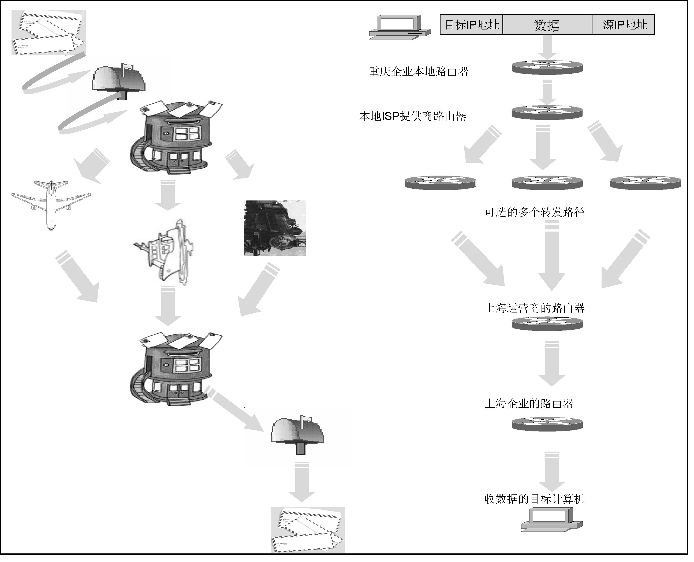

上述是对路由的宏观理解，那么怎样来对路由进行深入的理解呢？通过上述的宏观理解提出几个问题：对于计算机而言，它是如何知道什么样的IP报文需要发给路由器处理并转发呢？它怎么知道网络上的设备哪个是路由器？路由器在收到计算机发来的IP报文后，如何转发数据报文？如图3.18所示，如果在192.168.1.2主机上发出ping 192.168.3.2的指令，实际上在ping指令后面紧跟的这个IP地址192.168.3.2是一个目标地址。计算机将目标IP地址192.168.3.2与本地主机的子网掩码进行“与”运算，得到网络ID是192.168.3.0。再将本地网卡上的IP地址与本地主机的子网掩码求“与”，得到网络ID是192.168.1.0，所以这两台主机不在一个子网中。在这种情况下，主机确定它们之间的通信是需要路由器进行路由的。主机是利用计算机上的“默认网关”来确定路由器的位置的，如图3.19所示。“默认网关”是路由器上连接本地子网的一个接口，该接口与本地计算机同在一个IP子网中，所以本地计算机可以与“默认网关”通信。确定了路由器的位置后，发送给192.168.3.2的ping报文被投递到路由器R1。R1收到计算机发来的报文后，利用路由表（路由表类似于人类世界的地图）选择到目标子网的最佳路径，然后将数据报文进行转发，如图3.20所示。当路由器R1收到源IP地址为192.168.1.2、目标地址为192.168.3.2的IP报文时，路由器提取报文中的目标IP地址192.168.3.2提取与路由表中的记录表项中的“目标子网”作对比，查看是否有与其相匹配的路由记录。如果有，比如在R1的路由表中就有一条目标子网为192.168.3.0、目标子网掩码为255.255.255.0、下一跳为192.168.2.2的路由记录，那么匹配成功，该数据报文就被路由器转发到下一跳地址为192.168.2.2的路由器R2上，然后路由器R2再次执行路由器R1所做的路由查询工作，得到目标网络192.168.3.0是自己E0接口直接连接的子网，所以路由器R2会将数据报文通过E0接口转发给目标主机192.168.3.2完成整个路由工作。

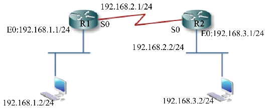

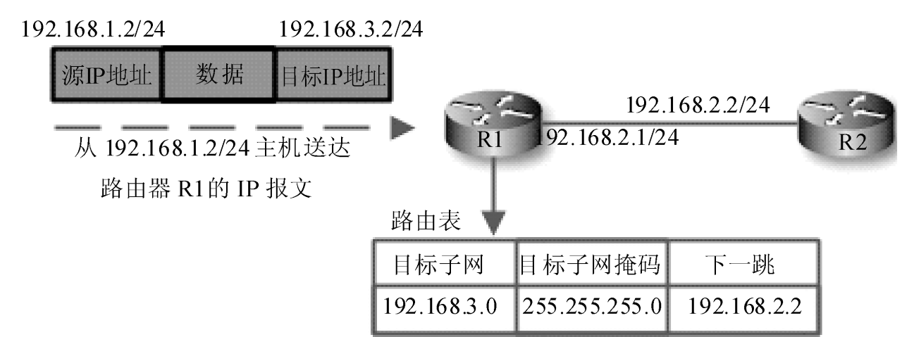

**理解路由器工作原理必须扩展到数据链路层的问题**

上面描述路由器工作原理的范围仅限于在第三层（网络层）中进行讨论，但一次完整的通信是不能脱离数据链路层工作环境的，当然路由器也包括在内，所以在这会对路由器转发数据包时，数据链路层的MAC地址变化过程作出补充说明。在路由器执行路由的过程中，数据包的目标IP地址和源IP地址始终保持不变，但其对应的MAC地址在路由环境中是随时变化的。【如图】，变化过程如下

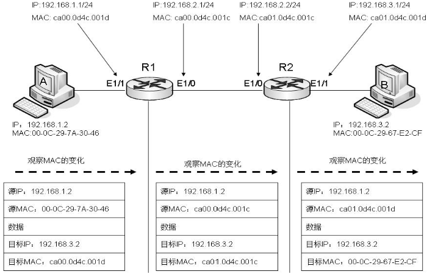

1. 标IP地址192.168.3.2在整个通信过程中将始终保持不变，当主机A发送的数据包还未曾被路由器R1转发时，该数据包的源MAC地址为主机A的地址000C.297A.3046，目标MAC地址是路由器R1的E1/1接口的MAC地址ca00.0d4c.001d。
2. 当数据包被路由器R1确定路由转发后（根据路由表确定通过E1/0接口转发到路由器R2的E1/0），源IP地址192.168.1.2、目标IP地址192.168.3.2还是保持不变，此时的源MAC地址被路由器R1修改为自己E1/0的MAC地址ca00.0d4c.001c，目标MAC地址是ca01.0d4c.001c。
3. 路由器R2收到这个数据包，当数据包被路由器R2确定路由转发后（根据路由表确定是自己的直连接口E1/1），源IP地址192.168.1.2、目标IP地址192.168.3.2仍然保持不变，此时的源MAC地址被路由器R2修改为自己E1/1的MAC地址ca01.0d4c.001d，目标MAC地址是计算机B的MAC地址000C.2967.E2CF。

> ⚠️注意：上面描述路由过程时，强调数据链路层MAC地址在路由过程中的变化，也是为了给下一节打基础。

### <a href="#layer3switches" id="layer3switches">三层交换机的工作原理</a>

三层交换机是现代化网络组建必不可少的设备，是现今最流行的组网设备之一。三层交换机就是具有部分路由器功能的交换机。从宏观角度讲，三层交换技术就是二层交换技术与三层路由技术相集成的，如图3.22所示。传统交换技术是在OSI网络模型的第二层（数据链路层）进行基于MAC地址表的选路操作的，而三层交换技术是在OSI网络模型的第三层实现路由数据包的高速转发的。三层交换机使企业的网络模型更加精简与清晰，三层交换机相比于传统路由器具有更高的接口密集程度，因为对于数据包路由与转发过程是由专业硬件以高速方式实现的，而传统路由器的路由信息更新、维护、路由计算、路由确定等功能，都是由软件实现的，所以三层交换机比传统路由器具备更快速的转发能力。从这一特性来讲，三层交换机不是单纯地将传统的路由器与二层交换机进行简单的集成，那么三层交换机比传统路由器的转发速度更快的原因在哪里呢？ 

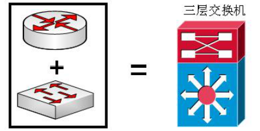

**理解三层交换机的工作原理“一次路由，多次交换”**

三层交换机比传统路由器的转发速度更快的原因是，它可以执行“一次路由，多次交换”。什么是“一次路由，多次交换”？下面通过描述三层交换机的工作原理来说明“一次路由，多次交换”的意义，如图3.23所示，主机A（192.168.1.2）要转发数据到主机B(192.168.3.2)。

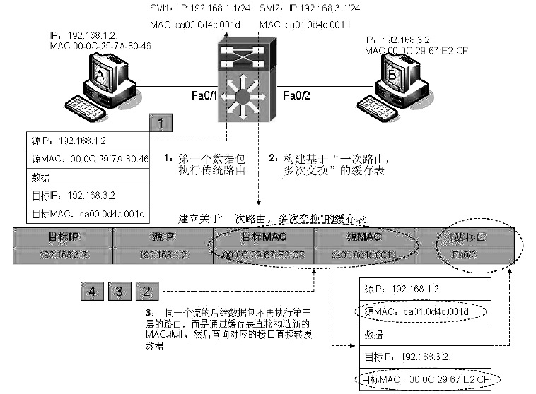

* 1、主机A（192.168.1.2）通过识别主机B（192.168.3.2）的IP地址发现它们不属于同一个IP子网，此时主机A将同一组数据流的第一个数据分组，目标IP地址为192.168.3.2，源IP地址为192.168.1.2，目标MAC地址为三层交换机的SVI1接口（事实上就是192.168.1.0子网的网关）MAC地址ca00.0d4c.001d，源MAC地址为主机A的MAC地址00-0C-29-7A-30-46，数据包通过三层交换机的Fa0/1接口交换给三层交换机的路由进程进行路由查询并确定转发路径。  
所谓同一组数据流就是指相同的一个通信会话的数据集合，相同的通信会话的数据集合指示这些数据具备相同的目标IP地址、源IP地址、目标接口等标识性信息。此时送达三层交换机路由进程进行处理的数据，就是这种数据分组集合中的第一个数据包，它通过路由查询确定转发路径。  
三层交换机上的SVI接口，事实上就是不同的三层IP子网所对应的网关接口，在图3.23所示的环境中，三层交换机有两个SVI接口：SVI1（192.168.1.1）是IP子网192.168.1.0的网关；SVI2(192.168.3.1)是IP子网192.168.3.0的网关，由于该接口是被内置到三层交换机里面的，通常不可见，但是可以配置，所以有交换虚拟接口（Switch Virtual Interfaces）的称呼。

> 注意：什么是同一组数据流的第一个数据分组？什么是三层交换机的SVI接口？

* 2、根据3.5.1节“理解路由器工作原理必须扩展到数据链路层的问题”中的过程，三层交换机执行路由选择后，将保持源IP地址与目标IP地址不变，目标MAC地址被三层交换机改写为主机B（192.168.3.2）的MAC地址00-0C-29-67-E2-CF，源MAC地址被三层交换机改为SVI2接口MAC地址ca01.0d4c.001d，然后将数据包转发到主机B。同时三层交换机会记录这个经过路由查询后的MAC地址改变过程，并将这个改变过程建立成能完成“一次路由，多次交换”的缓存表。具体如图3.23所示。
* 3、继第一个被执行路由过程的数据包的后继数据包，将不再执行前两步的路由查询，重写数据包的过程，而是通过查找第二步中所建立的 “一次路由，多次交换”的缓存表，直接修改数据包中的目标MAC地址与源MAC地址，并确定目标MAC地址对应的出站接口，将数据包转发到主机B，这样在很大程度上提高了数据交换的速度，这也正是三层交换机的优势所在。可以这样理解；与传统路由器相比较，传统的路由转发每个数据包都必须要经过第三层路由后再进行处理，如图3.24所示；而三层交换机做到了“一次路由，多次交换”，即相同的数据流只有第一个数据包经过第三层处理，后继数据包是通过缓存表直接重构帧体，只需要在第二层处理，如图3.25所示。

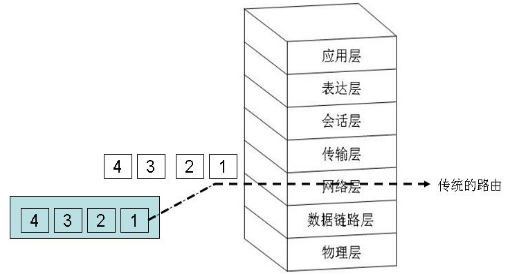

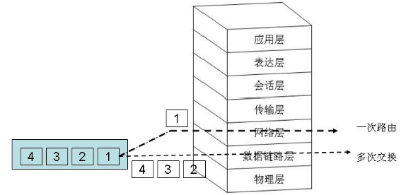
