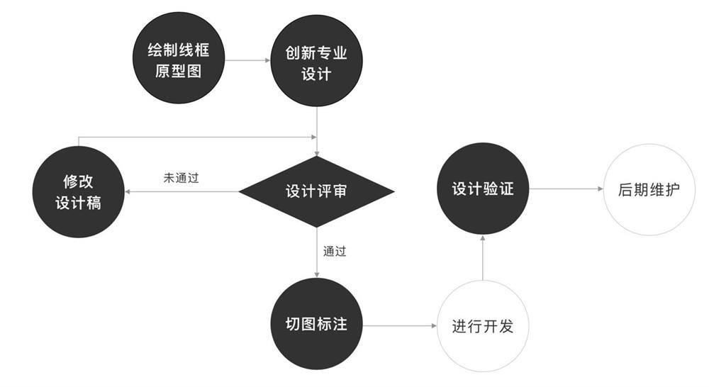
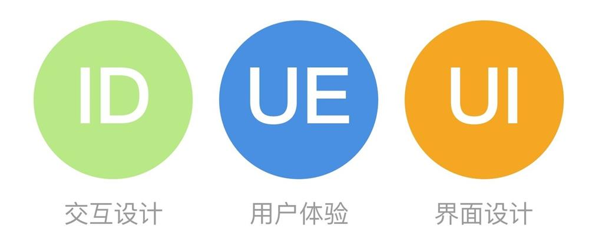
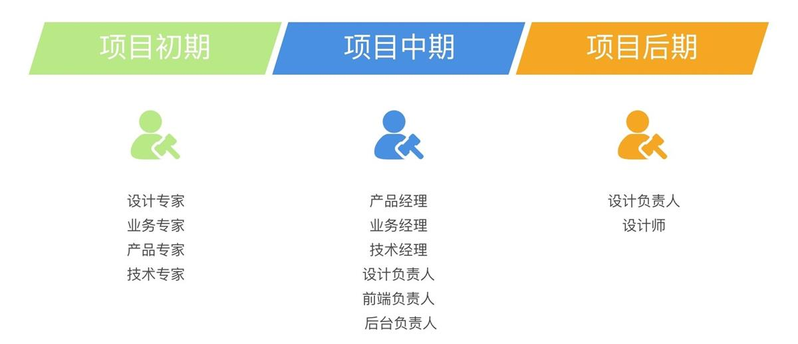
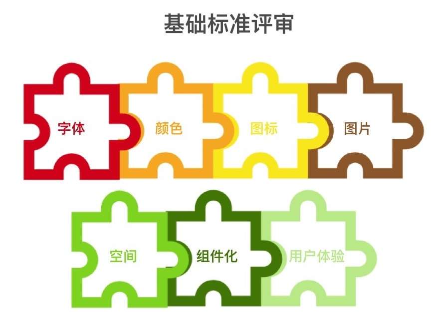

# 完整的设计评审流程

---

## 设计评审的定义

【设计评审】“设计”代表一切经过设计的事项，设计过的原型、效果图、交互原型效果图，代表经过设计过程后的产物。“评审”名词：代表一种以书面形式形成的总结性文稿，在动词的时候代表了一种修正动作状态。

设计评审，是一个工作流程中的一环工作状态，也可以是一个总结报告。它评审的内容包含了交互设计，界面设计，用户体验设计。

## 设计评审的时间&人员

**项目初期**一般是完成了战略层、范围层阶段的工作后，所达到的框架层、结构层、表现层。可以是信息架构图、任务流程图、原型图、页面流程图、效果图为评审内容。多种设计方向思路去实现产品的战略层方针，通过更多的了解业务方向人员的参与，理解清晰产品目标。并为后期产达到产品目标，做基础。通过更多的设计思路、对比、碰撞、摩擦找到更适合自己的产品设计方案。

### 参与设计评审人员：

* 方案一（推荐方案）：设计专家（UE/UI/ID）+ 业务专家 + 产品专家 + 技术专家
* 方案二：设计负责人（UE/UI/ID） + 产品经理 + 业务经理 + 技术经理 + 前端负责人 + 后端负责人
* 方案三：设计负责人（UE/UI/ID）+ 设计师

**项目中期**一般指到项目到了开发阶段，在前端和后台完成了主要功能页面的阶段。在这个阶段已经又了确认的设计方案，并按照这个设计方案实施了。所以，这一阶段的“设计审核”目标更多的重心是关于现有方案中的优点和欠缺。最好，在优点的方向是否还有更多延伸性亮点，在欠缺方面虽然在定稿前就已经知晓，但是否在项目的建设汇总了解更多现实开发情况下，能够有足够的时间把欠缺解决。总之，在这个阶段的审核，已经从多个设计方案思路筛选，孤注到现有确定的设计方案中去开展设计思路的延伸，优胜略汰，使方案变得更有潜力。

### 参与设计评审人员：

* 方案一（推荐方案）：设计负责人（UE/UI/ID） + 产品经理 + 业务经理 + 技术经理 + 前端负责人 + 后端负责人。
* 方案二：设计专家（UE/UI/ID） + 业务专家 + 产品专家 + 技术专家
* 方案三：设计负责人（UE/UI/ID） + 设计师（UE/UI/ID）

**项目后期**一般是指项目进入上线或者测试阶段，已经完成了一个完整的项目排期工作。此刻的“设计审核”更多面向的是精益求精，打磨产品细节，利用可用性原则去判断设计方案落地过程中是否存在可用性问题，并对各个设计方向（交互&视觉&体验）提出可迭代性建设性的迭代设计方案。

### 参与设计评审人员：

* 方案一（推荐方案）：设计负责人（UE/UI/ID） + 设计师（UE/UI/ID）
* 方案二：设计负责人（UE/UI/ID） + 产品经理 + 业务经理 + 技术经理 + 前端负责人 + 后端负责人
* 方案三：设计专家（UE/UI/ID）+ 业务专家 + 产品专家 + 技术专家

## 设计评审的方法

1. 专家评审

行业领域、专业知识、工作经验、行业前瞻性思维去带动项目在设计方案的多样性、项目开发中的优先级、与产品目标是否达成一致、是否违反了常见的可用性原则&认知心理学等。

在评审过程中，专家可能需要用到设计原则（例尼尔森十大可用性原则）、行业领域竞品产品案例、前瞻性设计方向等建设性评估。

2. 基础标注评审

规范性、交互性、复用性、完整性。

* 字体：注意字号、间距，还需注意字重、排版阅读的舒适感。

* 颜色：三原色的构成、冷暖色调的分别、中间色的高级感等。

* 图标：拟实图标，正形图标、负形图标、扁平图标、轻拟物图标、2D图标

《腾讯设计师总结的图标设计五维自检法》

《顶尖设计师分享的6个图标设计优化指南（上）》

《顶尖设计师分享的6个图标设计优化指南（下）》

* 图片：图片风格、大小比例、排版出发，围绕着产品业务属性，不断的提示用户产品具象信息。

* 空间：弹框、模态框、选项卡 交互设计

* 组件化：提升设计效能，通过对业务功能的需求的分析与设计元素的结合，形成可复用规范化的组件。组件化的目的是为了让设计保持一致性，并通过同样规范的组件拆分合并，从而形成新的组件、新的页面。组件化的设计应从统一性、扩展性、逻辑性出发打造产品专属组件，以结合自身产品业务功能需求，达到好的用户体验。
* 用户体验：易用性、易懂性

