# 金字塔原理

---

### 《金字塔原理》 是什么？

《金字塔原理》是麦肯锡的经典教材，作者是毕业于哈佛大学的美国作家芭芭拉。副标题为：思考、表达、解决问题的逻辑，非常准确地描述了这本书的主要内容。

《金字塔原理》是一本实用的工具书，这本书的目的是让读者通过结构化思考，有效地提高逻辑思维和表达能力，然后达到沟通的理想境界：**想清楚**，**说明白**，**知道说什么**，**怎么说**。

把金字塔原理简化成实际的方法论，总共在于三点。

1、**提炼中心思想**：把要说的结论写在前面，让对方最快理解我们想要表达的主要思想；

2、**分类组织材料**：描述支撑结论的论据。组织你的材料，找到内在关系，建立联系，建立树状层次以降低理解难度；

3、**疑问回答沟通**：先让读者认可设问，然后快速提供回答，节约读者思考时间。

* 金字塔原理是一种重点突出、逻辑清晰、层次分明、简单易懂的思考方式、沟通方式、规范动作。
* 金字塔原理的基本结构是：结论先行，以上统下，归类分组，逻辑递进。先重要后次要，先总结后具体，先框架后细节，先结论后原因，先结果后过程，先论点后论据。
* 金字塔原理训练表达者：关注、挖掘受众的意图、需求点、利益点、关注点和兴趣点，想清楚说什么（内容），怎么说（思路、结构），掌握沟通的标准结构、规范动作。
* 金字塔能够达到的沟通效果：观点鲜明、重点突出、思路清晰、层次分明、简单易懂，让受众有兴趣，能理解，记得住。
* 搭建金字塔结构的具体做法是：自上而下表达，自下而上思考，纵向总结概括，横向归类分组，序言讲故事，标题提炼思想精华。

### 金字塔原理能够帮助你解决那些问题

* **思考**：学会用右脑、左脑思维，提高结构化思维能力，思考全、准、快。
* **书面表达、公文写作**：会挖掘读者的关注点、兴趣点、需求点、利益点，能使用金字塔的4个原则，搭建逻辑清晰的常用公文框架结构（通知、请示、工作计划、工作总结、会议纪要、报道），掌握写序言的四要素、归类分组的MECE原则，能够重点突出、逻辑清晰、简明扼要，让人看得懂、愿意看、记得住。快速写文章，缩短写作时间，减少修改次数。
* **口头表达**：说话、演讲、讲课，能够使用金字塔的基本原则，回答听众最长有的4类疑问：“是什么？为什么？如何做？好不好？”表达时重点突出、条理清晰、让人愿意听、听得懂、记得住，成为思路清晰、言简意赅的人。
* **管理下属**：能够运用金字塔原理，考虑全面、周到、严谨，分配任务、设计流程不重叠无遗漏。
* **培训师开发课程和讲课**：会使用金字塔搭建框架结构、组织素材、重点突出、逻辑清晰、通俗易懂。

**共性**：指的是具有某种相似的共同点或所处的位置相近。

### 为什么要学《金字塔原理》

在生活中，我们都喜欢有条理的人。金字塔原理就可以帮助我们梳理清晰表达的逻辑。

在工作中，我们需要清晰的规划，高效的沟通和解决问题的能力。

### 金字塔原理的重点

金字塔原理是一种重点突出、逻辑清晰、主次分明的逻辑思路、表达方式和规范动作。

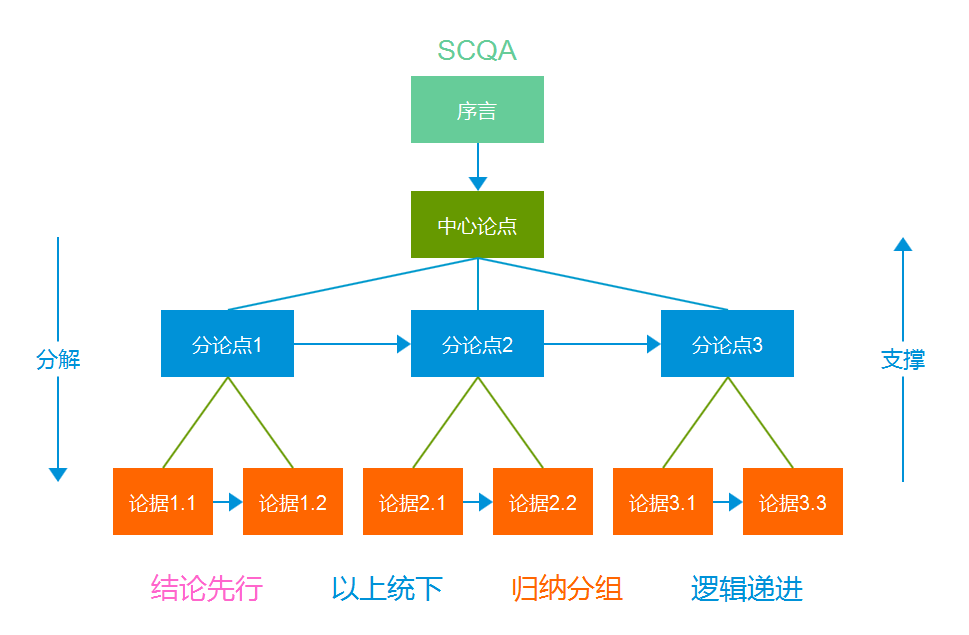

金字塔原理

四句话解释金字塔原理的主要内容：

一个模型：背景、冲突、疑问、答案（S-C-Q-A）

二个推理：演绎推理、归纳推理（推理的方法）

三个逻辑：时间顺序、结构顺序、程度顺序（思考事物相互关联需要满足的逻辑）

四个特征：结论先行，以上统下，归类分组，逻辑递进（表达的逻辑）

在金字塔原理支撑下，一篇好的表达应该具备的特点应该是：先重要后次要，先全局后细节，先结论后原因，先结果后过程。

接下来我以金字塔逻辑形式描述下要怎么构建一篇符合金字塔原理的表达，构建方法有两种方式：

自上而下：提出主题，层层分解，检查逻辑。（表达的逻辑）

自下而上：列出观点，归纳总结，检查逻辑。（思考的逻辑）

### 构建方式：自上而下

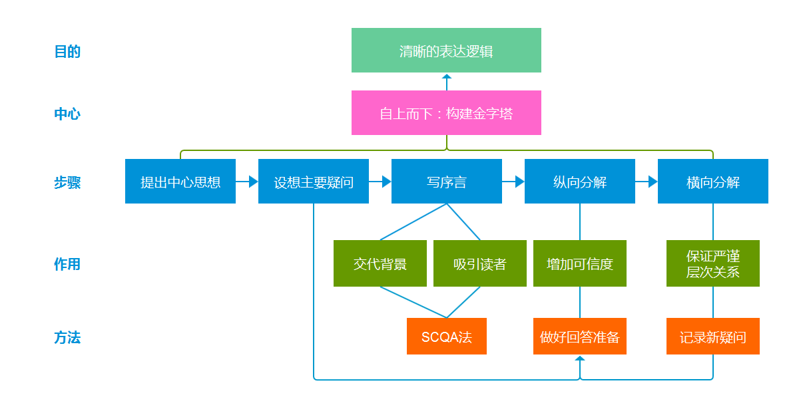

清楚表达逻辑

自上而下是比较常用且相对容易的构建方法。这个场景往往是，构建者对于该主题的了解程度较高，对问题已经有思路，中心已经确定了。

应用这个方法，我们可以很方便地构建金字塔，对思路（事件）进行整理：先抛出结论，然后列出几点支持自己的结论，然后层层详细展开。作者指出这个方法能够迫使我们更加全面的考虑疑问，让整个文章更加严谨周密。

列举论点的时候，保证MECE的组织原则。

1、相互独立不重叠：在同一维度上并有明确区分、不可重迭的

2、完全穷尽不遗漏：为了保证做到全面、周密

举个实际应用的例子，总结年度总结，就是采用自上而下方法。

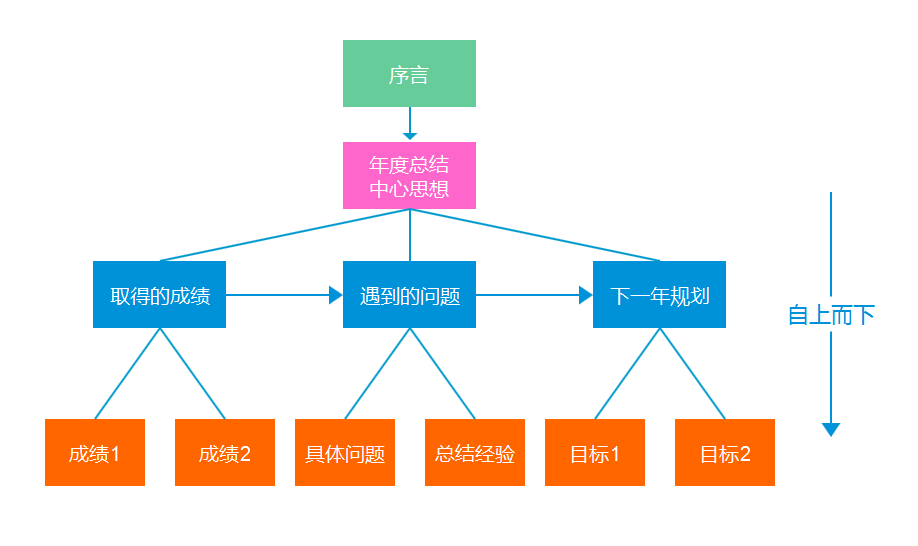

构建方式：自上而下

### 构建方式：自下而上

对于想要表达的内容有些模糊，还没想清楚一些事情，思绪还比较混乱时，适合用自下而上的方法来构建金字塔。

采用先归类分组，概括每组思想，整理出内部逻辑，最后提炼主题，完善整个思考过程。而输出的表达则还是宜采用自上而下的方法写出来，直截了当，易于理解。

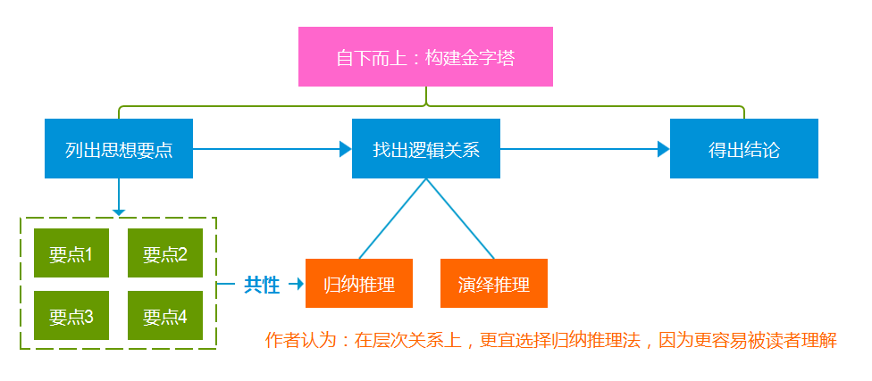

自下而上：构建金字塔

### 写序言的SCQA法

我们在写一篇文章的开头，需要写一段内容来引导读者进入本文的阅读状态。作者认为一个成功的序言应该遵循SCQA法则。

一个成功序言要素

* `S：situation`（情景），用一个大家都熟悉的的情景，事实引入。
* `C：complication`（冲突），实际情况往往和我们的要求有冲突，指出这个不利的变化。
* `Q：question`（疑问），针对这个冲突，我们应该怎么办？
* `A：answer`（回答），我们的解决方案是 ...

SCQA是个被广泛应用的逻辑顺序。论文，PPT，商业计划书等等都会遵循到这个套路。

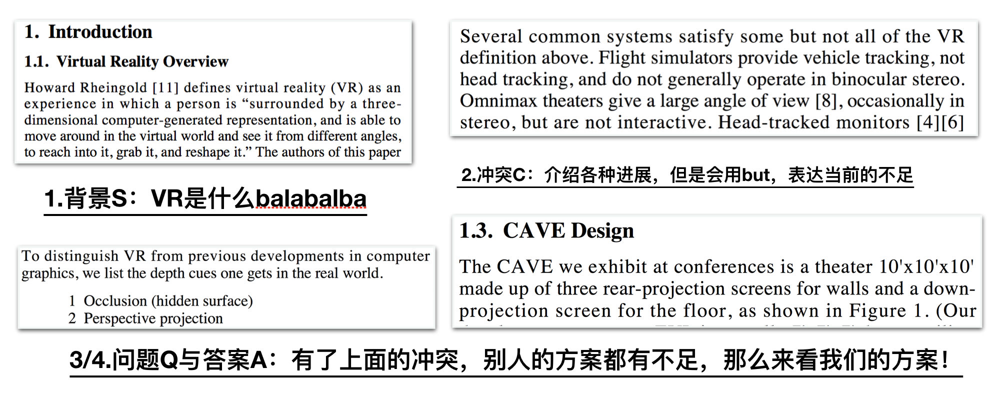

书中列举的论文使用SCQA的案例

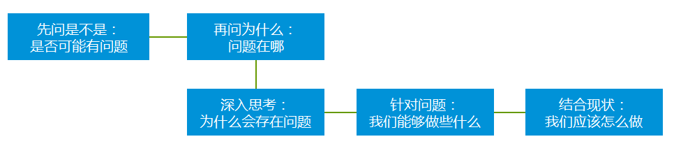

知乎上的很多回答都带有SCQA格式

解决方案行不通了，我们应该怎么办？

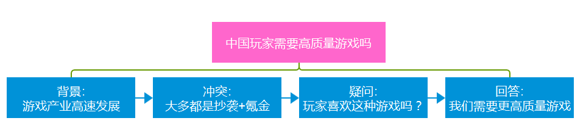

“中国玩家需要高质量游戏吗”

### 思考逻辑：演绎推理

演绎推理就是从一般性的前提出发，通过推导，得出具体陈述或个别结论的过程。演绎推理对于理性的重要意义在于，它对人的思维保持严密性、一贯性有着不可替代的校正作用。

通常我们用到的是三段论。它包含：一个一般性的原则（大前提），一个附属于前面大前提的特殊化陈述（小前提），以及由此引申出的符合一般性原则的结论。小前提肯定大前提的前件，结论就肯定大前提的后件；小前提否定大前提的后件，结论就否定大前提的前件。

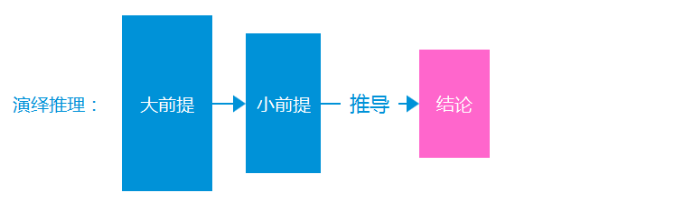

三段论推理 ，满足大前提与小前提，然后得出结论和决策。首先请保证这个前提可靠。

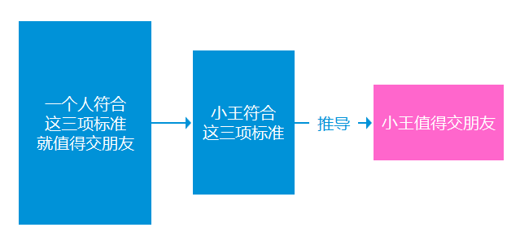

如何判断一个人是否值得交朋友

### 思考逻辑：归纳推理

归纳推理，是在认识事物过程中所使用的思维方法。

MBA智库中是这么解释归纳推理的：人们以一系列经验事物或知识素材为依据，寻找出其服从的**基本规律或共同规律**，并假设同类事物中的其他事物也服从这些规律，从而将这些规律作为预测同类事物的其他事物的基本原理的一种认知方法。

把以上那段话分解一下，我们可以得出归纳推理的方法是三个步骤。

1、**搜集和积累**一系列事物经验或知识素材；

2、**分析**所得材料的基本性质和特点，寻找出其服从的基本规律或共同规律；

3、**描述和概括**（作出系统化判断）所得材料的规律和特点，从而将这些规律作为预测同类事物的其他事物的基本原理。

然后我们再对照一下金字塔原理的结构，就能够发现，我们把论据和论点上下串联起来就是应用了归纳推理法。

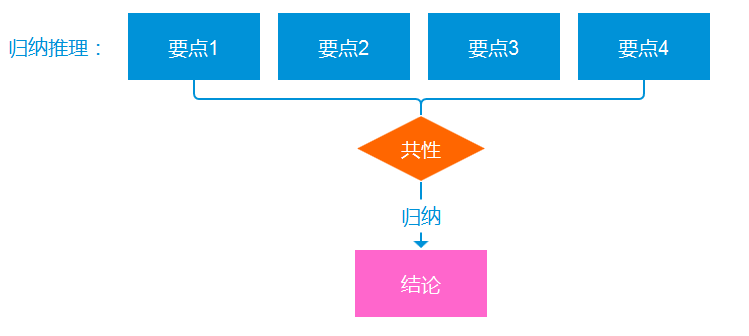

总结归纳

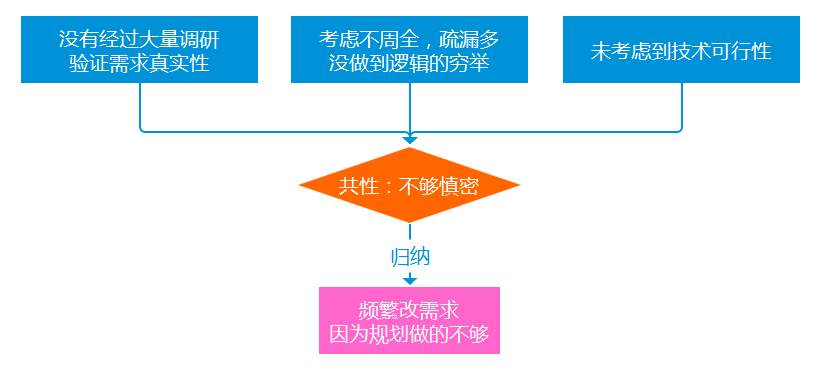

开发过程容易几个遇到的事，来总结下为什么会发生

作者建议在表达中尽量用归纳法，相比演绎推理更便于读者理解。因为在时间不多的场合下，读者更关心的是“怎么做”。

我们可以看到经常有些在朋友圈中热传的文章的标题是“给年轻人的10个建议”、“男人必须有的8大特征”、“富人思维的10个层次”、“2018年设计的8个流行趋势”等等。

信息碎片化的时代，让读者能最快时间看到干货就是读的爽的。